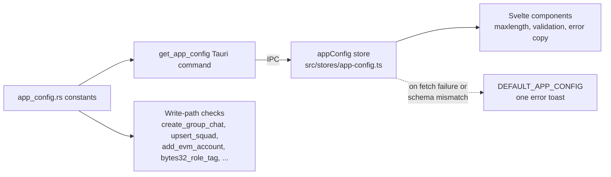

# Runtime application config (`AppConfig`)

Backend-owned limits and feature flags, fetched by the frontend over Tauri IPC instead of hardcoded per-component.

## Source of truth

`src-tauri/src/app_config.rs` is the **only** place these values are defined. Everything else — the Zod schema, the compiled TS fallback, and every UI `maxlength` — derives from or mirrors it.

| Rust constant | AppConfig field (camelCase) | Default | Enforced in |
|---|---|---|---|
| `SQUAD_NAME_MAX_LENGTH` | `squadNameMaxLength` | 50 | `squad_catalog::upsert_squad` |
| `CHANNEL_NAME_MAX_LENGTH` | `channelNameMaxLength` | 35 | `create_group_chat` (channel creation; squad root always uses the fixed `announcements` name) |
| `COMMONS_MAX_TAGS` | `commonsMaxTags` | 3 | `commons::normalize_commons_tags`, `squad_catalog::normalize_commons_tags` |
| `DEPLOY_SAFE_MAX_SIGNERS` | `deploySafeMaxSigners` | 10 | UI only (Safe contract itself allows more) |
| `ROLE_LABEL_MAX_LENGTH` | `roleLabelMaxLength` | 32 | `evm::squad_admin_write::bytes32_role_tag` (bytes32 packing) |
| `WALLET_ACCOUNT_LABEL_MAX_LENGTH` | `walletAccountLabelMaxLength` | 64 | `evm::evm_accounts::add_evm_account` / `update_evm_account` |
| `CUSTOM_TOKEN_SYMBOL_MAX_LENGTH` | `customTokenSymbolMaxLength` | 16 | UI only (watched tokens are local-only, no backend write path) |
| `PIN_DIGIT_COUNT` | `pinDigitCount` | 6 | Compile-time `assert!(>= 4)`; not currently re-validated per-write |
| `ANALYTICS_ENABLED` | `analyticsEnabled` | `false` | Not yet consumed; reserved feature flag |

Fields marked **UI only** have no corresponding backend write-path check (there's nothing to enforce server-side, or the constraint is inherent elsewhere) — the frontend cap is the only guard for those. Everything else is enforced twice: once for UX (frontend `maxlength` / disabled state) and once for real, at the Rust command that persists or signs the data. **The Rust check is the actual boundary** — a modified or bypassed frontend client cannot get past it.

## Data flow

## Frontend pieces

- `src/lib/api/app-config.ts` — `getAppConfig()`, a thin `invoke('get_app_config')` wrapper.
- `src/stores/app-config.ts` — `AppConfigSchema` (Zod, validates shape/type only — it does not hardcode the backend's numbers), `DEFAULT_APP_CONFIG` (compiled fallback, numerically pinned to today's Rust defaults), the `appConfig` writable store, and `loadAppConfig()`.
- `src/routes/+layout.svelte` calls `loadAppConfig()` once in `onMount`.
- Components read `$appConfig.<field>` reactively (`$: maxSquadNameLength = $appConfig.squadNameMaxLength;`) rather than caching a snapshot, so a later `refresh` (if ever added) would propagate.

**Fallback behavior:** if `get_app_config` is unreachable or its response fails `AppConfigSchema.parse`, `loadAppConfig()` sets the store to `DEFAULT_APP_CONFIG` and shows exactly one error toast. It does not retry.

`DEFAULT_APP_CONFIG` is **not** authoritative — it exists only so the UI still behaves sanely if IPC fails. `src/stores/app-config.test.ts` has a parity test asserting it matches the Rust defaults, but nothing enforces this across languages at compile time; if you change a constant in `app_config.rs`, update `DEFAULT_APP_CONFIG` by hand or that test will fail.

## Adding a new limit

1. Add the constant + struct field to `src-tauri/src/app_config.rs` (`snake_case` constant, `snake_case` struct field — `serde(rename_all = "camelCase")` handles the wire format).
2. Add the matching `camelCase` field to `AppConfigSchema` and `DEFAULT_APP_CONFIG` in `src/stores/app-config.ts`, and to `AppConfigDto` in `src/lib/api/app-config.ts`.
3. Add the field to the `get_app_config` fixture in `src/lib/api/mock-fixtures.ts` (`settingFixtures`).
4. If the limit gates a backend write, add the check at the command boundary (not inside a shared/internal helper that might also process remote/synced data — see `squad_catalog::upsert_squad` vs. `prepare_row` for the pattern: validate at the command entrypoint, keep internal helpers permissive).
5. Wire the UI: import `appConfig` from `../stores/app-config` (adjust relative depth), read it reactively, bind it to the relevant `maxlength`/validation.
6. Update the parity test in `src/stores/app-config.test.ts` and the table above.

## Non-goals

- Not a remote feature-flag service — values are compiled into the binary, fetched once at boot. No hot reload, no per-account overrides.
- `analyticsEnabled` is scaffolding for a future flag; nothing reads it yet.
