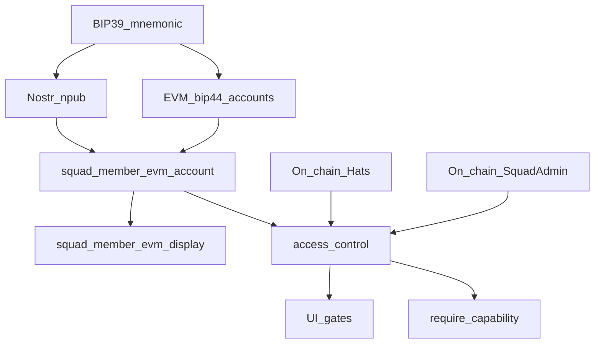

# Squad access control (Nostr ↔ EVM ↔ Hats / Squad Admin)

Normative rules for *who may perform action X on squad Y* in the desktop app. On-chain contracts remain final authority; this layer fail-closes before signing and drives UI disable reasons.

## Identity binding

1. One Nostr identity (npub) per unlocked account.
2. Many EVM keys may derive from the same BIP-39 phrase (`bip44_v1`, squad purpose).
3. Per-squad **binding** `(parent_id, member_npub) → evm_account_id` (`squad_member_evm_account`) is consent via **#personal-alerts**. After bind, the roster key signs an off-chain EIP-712 bind cert and the client publishes `squad_member_evm_share` v2 → local share row `squad_member_evm` for Crew display. Peers may gossip those certs in `squad_evm_roster_snapshot` on Request sync. The cert is **display + gossip only**; it is not a capability grant.
4. **ACL** (access control) resolves identity from the **binding only** (v1): load the bound account’s address. A share row, bind cert, or WalletBar Default without a binding is **not** squad identity. Multi-key “any of my bip44 keys wears the hat” is out of scope. Hats still confirm roles on the bound address (`isWearer`).

**Fail closed:** if the current npub has no `squad_member_evm_account` for `parent_id`, every capability is denied (`ACL_UNBOUND`), including permissionless execute — even if a legacy share row exists. Signing paths must not fall back to an unbound personal signer or invent roster identity from the active Default.

**ACL** = access control (classically *access control list*). In Pacto it names this layer: squad EVM binding + Hats / Squad Admin capability checks before signing (`require_capability`, UI snapshot). Error codes `ACL_DENIED` / `ACL_UNBOUND` use the same shorthand. It is not a separate on-chain contract. Member-facing UI says “squad EVM” / “squad key,” not “roster.”

## Enforcement

| Layer | Role |
|-------|------|
| Rust `require_capability` | Source of truth before gov / Squad Admin / tracked-token mutations |
| UI gates | Advisory; same predicates via `get_squad_capabilities` snapshot (viewer self-check). MLS `squad_gov_replica` / `governance_process_updated` snapshots are display only — never a capability grant. Revalidate the local viewer on process nonce and when displayed squad EVM changes; retry once if wearer lists disagree with the snapshot so post-bootstrap hat mints do not leave stale CTAs. Snapshot fetch `error` is fail-closed for CTAs (same one-shot retry). |
| Contracts | Final reject / accept |

Tauri IPC is not a security boundary if only the UI gates.

### Code map

| Piece | Path |
|-------|------|
| Module | `src-tauri/src/evm/access_control/` |
| Shared gov send | `gov_module_write::send_gov_module_call` (capability + write lock + `chain_id`) |
| Squad Admin writes | `squad_admin_write.rs` (parent from infra / payload; no personal-signer fallback) |
| Tracked tokens | `db::upsert_squad_tracked_token` / `remove_squad_tracked_token` |
| UI snapshot | `get_squad_capabilities` → `governance-privilege.ts` / `PactoGovGovernanceShell` |

Member-facing disable/fail copy is i18n’d (`governance.gate.*`, `govWriteErrorMessage` for `ACL_*` / sponsor codes). This doc stays the operator source for hat/ACL mechanics — not a UI copy catalog.

Hat IDs and Safe / Squad Admin addresses come from the registry deployment for the parent’s infra row (`chain` + `canonical_ref` top hat): live `#dashboard` uses `pacto_gov` + NavePirataRegistry; the Wargame hub uses `pacto_gov_wargame` + WarGameRegistry.

Write routing to `GovStack::WarGame` does **not** trust MLS `war_game_updated` JSON. A local `pacto_gov_wargame` payload may hint that `to` is a war-game module; `require_capability` and sponsored UserOps only follow that hint after a fresh `WarGameRegistry.active(keccak256(parentId))` read lists `to`. A mismatch (including a poisoned production address in the payload) stays on the live stack. RPC failure while the payload claims a war-game target fails the write closed.

## Capabilities

| Capability | Required check |
|------------|----------------|
| `proposeTreasury` | Captain **or** Crew hat |
| `crewVote` | Crew hat |
| `captainVote` | Captain hat (blocked when Safe holds captain and signer does not) |
| `executeTreasury` | Roster EVM linked (permissionless once thresholds met) |
| `startMutiny` / `castMutinyVote` | Crew hat |
| `executeMutiny` | Roster EVM linked |
| `captainResign` | Captain hat |
| `quartermasterMutateCrew` | Captain hat (on-chain also blocks while mutiny mode) |
| `quartermasterExecute` | Roster EVM linked |
| `mutateTrackedTokens` | Captain **or** Crew hat |
| `squadAdminCreateRole` / `squadAdminEnableExecutor` / `squadAdminEnableFull` | Captain hat |

Squad Admin executor flags (`FULL`, `PAUSE`, custom tags) appear on the capability snapshot for UI; granting those roles is captain-gated today.

## Funding deploy / deposit vs roster ownership

| Concern | Rule |
|---------|------|
| Who may deploy sponsor / deposit | Nostr **parent member** (MLS group or roster binding) |
| Who pays deploy gas / deposit | **Default** (DM) wallet or any phrase-derived key for that identity |
| Ext `addressOwner` / hat wearers | Squad **roster** EVM only |

Do not require deployer EVM == roster owner. Default may fund; hats and Ext ownership stay on the roster address.

## Sponsored gov writes (ERC-4337)

Plain rule: **roster can pay gas → EOA tx; roster cannot → sponsored UserOp** (if squad sponsor + bundler are configured). Implemented in `send_gov_module_call` / `gov_module_write`.

Signer is always the embedded **roster EOA** — not an external smart-contract wallet. EIP-7702 only applies on the sponsored path when that EOA has empty code (temporary set-code to the shared account impl). Details: [PACTO_SQUAD_SPONSOR.md](../wallet/PACTO_SQUAD_SPONSOR.md).

Operator env: `ALCHEMY_RPC_KEY` for chain RPC. Sponsored writes use an in-app Pimlico key (Status → Sponsored gas), then **`PIMLICO_API_KEY`**, then optional `BUNDLER_RPC_URL` (EntryPoint v0.7 — Pimlico-first; do not use Alchemy as bundler). Debug builds load repo-root `.env` into Rust at startup. EIP-7702 impl defaults from `networks.sepolia.erc4337.accountImplementation` (`PactoSimple7702Account`); optional `PACTO_ERC4337_ACCOUNT_IMPL` override. Structured failures include `SPONSOR_INELIGIBLE`, `SPONSOR_POOL_LOW`, `SPONSOR_PAYMASTER_MISMATCH`, `PAYMASTER_DEPOSIT_LOW`, `PAYMASTER_STAKE_LOW`, `PAYMASTER_VERIFICATION_GAS`, `PAYMASTER_GAS_EFFICIENCY`, `BUNDLER_ESTIMATE`, `PAYMASTER_VALIDATION`, `BUNDLER_FEE`, `ACCOUNT_SIGNATURE`, `ACCOUNT_VALIDATION`, `USEROP_CALL_GAS`, `USEROP_CALL_REVERTED`, `GOV_CALL_REVERTED`, `MUTINY_NOT_ACTIVE`, `MUTINY_NOT_EXPIRED`, `MUTINY_EXPIRED`, `PAYMASTER_REJECTED`, `SPONSOR_PATH_UNAVAILABLE`. EOA `eth_estimateGas` reverts classify to those codes (never raw RPC). Shared paymaster EntryPoint deposit and factory stake (protocol ops) are separate from per-squad sponsor pool deposits.

Deploy/deposit themselves are **not** sponsored in v1 — only post-deploy gov module writes (bootstrap crew, treasury authority, quartermaster, mutiny, etc.).

## Write reliability (adjacent)

- Concurrent gov / Squad Admin / war-game deploy sends that share a signer EOA share a write lock (nonce safety under rapid clicks / cross-squad).
- Transaction requests set an explicit `chain_id`.
- `RECEIPT_TIMEOUT` surfaces the submitted hash and warns against blind resubmit of the same calldata.

## Greenfield

Single path only — no dual-read of legacy privilege maps. Unknown capability strings from clients are rejected.

## Related

- Contract metaphor and deploy UX: [`docs/wallet/PACTO_GOV.md`](../wallet/PACTO_GOV.md)
- Roster binding: [`docs/communities/DESIGN.md`](../communities/DESIGN.md)
- Shell / dashboard keep-alive: [`docs/shell/LAYOUT.md`](../shell/LAYOUT.md)
- Operator smoke: [`docs/wallet/OPERATOR_SMOKE.md`](../wallet/OPERATOR_SMOKE.md)

## Schema note (`squad_tracked_tokens`)

The tracked-token table is additive. Do not drop `squad_tracked_tokens` on rollback while upgraded clients run; older builds simply ignore the rows.
