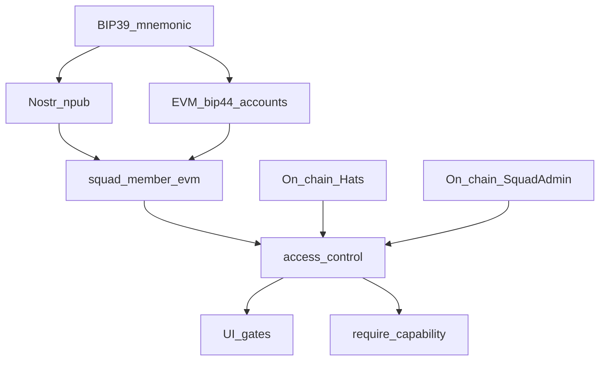

# Squad access control (Nostr ↔ EVM ↔ Hats / Squad Admin)

Normative rules for *who may perform action X on squad Y* in the desktop app. On-chain contracts remain final authority; this layer fail-closes before signing and drives UI disable reasons.

## Identity binding

1. One Nostr identity (npub) per unlocked account.
2. Many EVM keys may derive from the same BIP-39 phrase (`bip44_v1`, squad purpose).
3. Per-squad roster binds `(parent_id, member_npub) → EVM address` (`squad_member_evm` / `squad_member_evm_account`, MLS share).
4. ACL checks use **that roster address only** (v1). Multi-key “any of my bip44 keys wears the hat” is out of scope.

**Fail closed:** if the current npub has no roster EVM for `parent_id`, every capability is denied (including permissionless execute). Signing paths must not fall back to an unbound personal signer for squad-scoped writes.

## Enforcement

| Layer | Role |
|-------|------|
| Rust `require_capability` | Source of truth before gov / Squad Admin / tracked-token mutations |
| UI gates | Advisory; same predicates via `get_squad_capabilities` snapshot |
| Contracts | Final reject / accept |

Tauri IPC is not a security boundary if only the UI gates.

### Code map

| Piece | Path |
|-------|------|
| Module | `src-tauri/src/evm/access_control/` |
| Shared gov send | `gov_module_write::send_gov_module_call` (capability + write lock + `chain_id`) |
| Squad Admin writes | `squad_admin_write.rs` (parent from infra / payload; no personal-signer fallback) |
| Tracked tokens | `db::upsert_squad_tracked_token` / `remove_squad_tracked_token` |
| UI snapshot | `get_squad_capabilities` → `governance-privilege.ts` / `PactoGovGovernanceShell` |

Hat IDs and Safe / Squad Admin addresses come from the Nave Pirata registry deployment for the parent’s `pacto_gov` infra row (`chain` + `canonical_ref` top hat).

## Capabilities

| Capability | Required check |
|------------|----------------|
| `proposeTreasury` | Captain **or** Crew hat |
| `crewVote` | Crew hat |
| `captainVote` | Captain hat (blocked when Safe holds captain and signer does not) |
| `executeTreasury` | Roster EVM linked (permissionless once thresholds met) |
| `startMutiny` / `castMutinyVote` | Crew hat |
| `executeMutiny` | Roster EVM linked |
| `captainResign` | Captain hat |
| `quartermasterMutateCrew` | Captain hat (on-chain also blocks while mutiny mode) |
| `quartermasterExecute` | Roster EVM linked |
| `mutateTrackedTokens` | Captain **or** Crew hat |
| `squadAdminCreateRole` / `squadAdminEnableExecutor` / `squadAdminEnableFull` | Captain hat |

Squad Admin executor flags (`FULL`, `PAUSE`, custom tags) appear on the capability snapshot for UI; granting those roles is captain-gated today.

## Write reliability (adjacent)

- Concurrent gov / Squad Admin sends for a parent share a write lock (nonce safety under rapid clicks).
- Transaction requests set an explicit `chain_id`.
- `RECEIPT_TIMEOUT` surfaces the submitted hash and warns against blind resubmit of the same calldata.

## Greenfield

Single path only — no dual-read of legacy privilege maps. Unknown capability strings from clients are rejected.

## Related

- Contract metaphor and deploy UX: [`docs/wallet/PACTO_GOV.md`](../wallet/PACTO_GOV.md)
- Roster binding: [`docs/communities/DESIGN.md`](../communities/DESIGN.md)
- Shell / dashboard keep-alive: [`docs/shell/LAYOUT.md`](../shell/LAYOUT.md)
- Operator smoke: [`docs/wallet/OPERATOR_SMOKE.md`](../wallet/OPERATOR_SMOKE.md)

## Schema note (`squad_tracked_tokens`)

The tracked-token table is additive. Do not drop `squad_tracked_tokens` on rollback while upgraded clients run; older builds simply ignore the rows.
