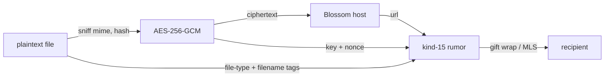

# Attachments — encrypted blobs on Blossom

How file attachments in DMs and MLS groups reach a media host, why they need a
**blob-accepting** Blossom server, and what the host learns.

**Related:** [`OVERVIEW.md`](./OVERVIEW.md), [`docs/security/CRYPTOGRAPHY.md`](../security/CRYPTOGRAPHY.md), [`docs/nostr/ARCHITECTURE.md`](../nostr/ARCHITECTURE.md), [`STICKER_PACKS.md`](./STICKER_PACKS.md) (squad sticker packs reuse this pipeline for image storage), [`GIF_PROVIDER.md`](./GIF_PROVIDER.md) (Klipy GIFs deliberately do **not** use this pipeline — provider-URL delivery instead, per Klipy's no-re-hosting terms).

---

## 1. Pipeline

Sending an attachment (`send_file_bytes` → `message.rs`):

1. **Sniff** the real media type from the plaintext bytes (`util::sniff_extension_and_mime`). A wrong or missing file extension is corrected here.
2. **Hash** the plaintext (`calculate_file_hash`). Used for dedupe against previously sent attachments and published as the `ox` tag.
3. **Encrypt** with a freshly generated random 32-byte AES-256-GCM key and 16-byte nonce (`crypto::generate_encryption_params`, `crypto::encrypt_data`). One key per file.
4. **Upload the ciphertext** to a Blossom server (`blossom::upload_blob_with_progress_and_failover`).
5. **Publish a kind-15 rumor** whose content is the blob URL, carrying `file-type`, `size`, `encryption-algorithm`, `decryption-key`, `decryption-nonce`, `ox`, and — when the sender supplied one — `filename` tags. The rumor is sealed in a NIP-59 gift wrap (DM) or an MLS group message.

The receiver reads `file-type` from the rumor to pick a local extension (`rumor.rs`), fetches the blob, and decrypts with the tagged key and nonce.

**The key, nonce, and file name never leave the encrypted rumor.** The Blossom host only ever sees ciphertext.

### The `filename` tag

The original file name is metadata, not content, so it rides inside the encrypted
rumor rather than the upload. It is **optional** — an absent tag yields
`Attachment.file_name: None`, never an error — and it is **untrusted**: it comes
from a remote peer, so `message::sanitize_incoming_file_name` strips path
separators and `..` segments and caps the length before the value is ever stored
or used as a save-dialog default. The local extension is still derived from the
`file-type` tag, never from the name.



---

## 2. Why most Blossom servers reject encrypted attachments

Public Blossom servers are overwhelmingly image CDNs. They **sniff the uploaded
bytes and whitelist media types**, ignoring the `Content-Type` header entirely.
AES-GCM ciphertext is indistinguishable from random, so it sniffs as
`application/octet-stream` and gets rejected:

```
[Blossom Error] Upload failed with status 415 Unsupported Media Type:
upload rejected: unsupported media type application/octet-stream
```

The header is not the lever. Probing `blossom.primal.net/upload` with valid
BUD-01 auth, varying only the body and the declared type:

| body | declared `Content-Type` | result |
|---|---|---|
| real PNG | `image/png` | 200 |
| random bytes | `image/png` | **415** `unsupported media type application/octet-stream` |
| random bytes | `application/octet-stream` | 415 |
| random bytes | *(omitted)* | 415 |

Identical header, different body, different outcome — the server sniffs content.

This is also why **avatar and banner uploads worked while message attachments
did not**: `profile.rs` uploads plaintext image bytes, so sniffing passes.

Survey of public servers, 1 KiB of random bytes with valid auth:

| server | result |
|---|---|
| `blossom.primal.net` | 415 unsupported media type |
| `blossom.band` | 415 file type not allowed |
| `24242.io` | 400 unsupported content type |
| `cdn.satellite.earth` | 401 permission denied |
| `nostrmedia.com` | 403 paid subscription required |
| `blossom.f7z.io` | 401 unauthorized |
| **`nostr.download`** | **201** accepted |

---

## 3. Two server lists

`lib.rs` keeps the two upload targets separate because they have opposite requirements:

| List | Used by | Payload | Declared `Content-Type` | Default |
|---|---|---|---|---|
| `get_blossom_blob_servers()` | message attachments | AES-GCM ciphertext | `application/octet-stream` | `nostr.download` |
| `get_blossom_media_servers()` | avatars, banners | plaintext image | real media type | `blossom.primal.net`, then `nostr.download` |

Profile media is published to a public nostr profile and rendered by other
clients, so it prefers a widely mirrored CDN that serves a real media
extension. Attachment blobs are opaque and only ever fetched by chat
participants, so the extension is irrelevant.

**Adding a blob server:** verify it accepts a random-bytes PUT with
`Content-Type: application/octet-stream` before adding it. A server that
returns 415 there will fail every attachment.

### Success status codes

BUD-02 does not pin a single success code. `blossom.primal.net` returns **200**,
`nostr.download` returns **201**. `blossom.rs` accepts any 2xx. Matching only
`StatusCode::OK` turns a successful upload into a misleading
`Upload failed with status 201`.

---

## 4. What the host learns

Encryption protects content, not the fact of an upload. For every attachment,
the Blossom operator observes:

| Exposed | Not exposed |
|---|---|
| Ciphertext bytes and exact size | File contents |
| SHA-256 of the ciphertext (it is the blob address) | File name — carried in the encrypted `filename` tag, never in the upload |
| Upload timestamp | Media type — the upload declares `application/octet-stream`, and the real type travels only in the encrypted `file-type` tag |
| Client IP | Recipient identity, chat, or group |
| **Uploader npub** — the BUD-01 auth event is signed by the account identity key | Decryption key or nonce |

Anyone holding the URL can fetch the ciphertext, but the URL itself only exists
inside the encrypted rumor.

**The uploader npub is the sharpest edge.** It links a nostr identity to an
upload pattern — count, sizes, and timing — at a third party. This is inherent
to BUD-01 auth, not to the choice of server; it was equally true of the previous
configuration.

---

## 5. Displaying an attachment

Uploading correctly is only half the path. Two separate rules govern whether the
image actually appears in a message bubble.

### The blob URL is never an image source

`MessageAttachment.svelte` must never put `attachment.url` in an ``.
The bytes at that URL are ciphertext; the browser renders a broken image. An
image is displayable only after `download_attachment` has fetched the blob,
decrypted it with the rumor's key and nonce, and written it to disk. Success
arrives as a `message_update` event carrying `downloaded: true` and the local
`path`, which is what the component renders.

Until then the component shows the `img_meta.blurhash` decoded locally — it
travels inside the encrypted rumor, so it costs no network round trip and leaks
nothing.

The sender skips all of this: `message.rs` writes the plaintext to disk before
uploading and marks the attachment `downloaded: true`, so it renders immediately.

### Local files need the asset protocol

Attachments live at `<Download>/vector/<hash>.<ext>` (`<Documents>` on iOS), so
the webview cannot read them from an ordinary path. `convertFileSrc` maps a path
to an `asset://` URL, which requires **both**:

| Requirement | Where | Consequence if missing |
|---|---|---|
| `protocol-asset` Cargo feature | `src-tauri/Cargo.toml` `tauri` features | The `asset` URI scheme is never registered (`tauri/src/manager/webview.rs` gates it on `#[cfg(feature = "protocol-asset")]`). Every `convertFileSrc` URL is dead — silently, with no error. |
| Path inside `assetProtocol.scope` | `src-tauri/tauri.conf.json` | The request is denied and the image renders broken. |

`assetProtocol.enable` defaults to **false** and gates the feature, so setting
only `scope` achieves nothing. The scope must cover both the image cache and the
attachment directory:

```json
"assetProtocol": {
  "enable": true,
  "scope": ["$APPDATA/cache/**", "$DOWNLOAD/pacto/**", "$DOCUMENT/pacto/**"]
}
```

**Any new on-disk path the webview must display has to be added to this scope.**
A path outside it fails as a broken image with nothing in the logs.

### Never label an attachment with its hash

`Attachment.id` is the SHA-256 of the plaintext. It is an identifier, not a name,
and it must never reach the UI as one — a 64-hex-character label is what the file
card showed before the `filename` tag existed.

`src/lib/messaging/attachment-display.ts` owns the naming rule:

1. Use the sender's `file_name` when present.
2. Otherwise synthesise `<Kind>.<ext>` from `attachmentKind()` — `Audio.mp3`,
   `Document.pdf`, `Archive.zip`.

Both paths are translated; the kind labels live under `messaging.attachment.*`.
`attachment-display.test.ts` asserts the hash is never returned or embedded.

### Kinds that render inline

`attachmentKind()` maps the extension to `image`, `video`, `audio`, `document`,
`spreadsheet`, `archive`, or `file`. **The extension decides, not `img_meta`** —
a video carries image metadata for its poster blurhash, so reading that as proof
of an image files every thumbnailed video as a picture and strips its player.
`img_meta` is only the tiebreak for an extension we do not recognise.

Images and video share one **media tile**: a poster surface (local file once
downloaded, blurhash before that) sized from `img_meta`'s aspect ratio, growing
with the message column and capped at 420px. Video overlays a play glyph.
Audio renders a compact row, everything else a file card.

### Card treatment and the corner action

All three layouts — media tile, audio row, file card — are self-contained
cards: border, radius, and a subtle shadow instead of a raw edge-to-edge
element, capped at a max width so they stay readable in a wide message
column.

Each layout's primary surface is a single button: decoration inside it is
`aria-hidden`, so there is exactly one accessible name per state —
`Download …` before the file is local, then `Play …` for video, `Open …`
for an image, or nothing extra for a row/card whose only action is fetch.

A **corner action** (`.corner-action`, reused verbatim across all three
layouts) covers the case the primary surface cannot: once the file is
local, downloading a video/audio/image no longer downloads it a second
time, so saving a copy elsewhere needs its own control. Tiles overlay the
badge on the poster (`position: absolute`, top-left); rows and cards lay
it out inline at the trailing edge (`.corner-action.inline`) since they
have no poster to sit on top of.

| Layout | State | Corner action |
|---|---|---|
| Tile (image/video) | Not on disk | decorative cloud icon, `pointer-events: none` — the tile handles the click |
| Tile (image/video) | On disk | real **Save as…** button, overlaid top-left |
| Audio row | Always on disk (undownloaded audio renders as a file card) | real **Save as…** button, inline next to the file name |
| File card | Not on disk | none — the card's own cloud lead-badge is the only affordance |
| File card | On disk | real **Save as…** button, inline after the file name/size |

Before this the corner carried a wide pill (icon + size text) and a second
**Save as…** text button sat outside the card as its own row — visually
disconnected from the card it acted on, and inconsistent between tiles
(which had already been fixed) and audio rows/file cards (which had not).
Consolidating to one small icon, reused across every layout, matches the
affordance density of Telegram/Discord-style attachments instead of a
bespoke wide control per kind.

Playback is always local: an undownloaded video downloads first and mounts the
player when the decrypted path arrives as a prop. Nothing streams from the blob
URL, because the blob is ciphertext.

### Saving to a chosen destination

The decrypted file always lands at the cache path `<Download>/vector/<hash>.<ext>`,
which is deliberately hash-named to avoid collisions. **Save as…** is the user-facing
escape hatch: it opens the native dialog with the friendly display name pre-filled,
then calls `save_attachment_as`, which decrypts first if needed and copies to the
chosen path. The copy happens in Rust on purpose — routing it through the `fs`
plugin would require widening `fs:default`'s scope to arbitrary user paths.

---

## 6. Attaching a file

`MessageInput.svelte` accepts an attachment four ways. All of them converge on a
single `PendingFileAttachment` in the `pendingFilePreview` store, then on
`send_file_bytes`.

| Input | Platform | Path into the composer |
|---|---|---|
| Paperclip menu | all | Native dialog on desktop (`plugin-dialog` `open`), hidden `<input type="file">` elsewhere |
| **Take Photo** | mobile only | Same hidden input with `accept="image/*"` and `capture="environment"` |
| **Drag and drop** | desktop | Tauri webview drag-drop event → file paths |
| **Paste** | desktop, web | `clipboardData.files` → `buildPendingFile` |

### Drag-and-drop must use the Tauri event, not HTML5

`tauri.conf.json` does not set `dragDropEnabled`, and Tauri v2 defaults it to
`true` — the native layer swallows OS drag-and-drop, so **`dragover` / `drop`
never fire in the webview on desktop**. HTML5 drop handlers are dead code there.

`src/lib/messaging/attachment-drop.ts` subscribes to
`getCurrentWebview().onDragDropEvent()` instead. Its payload is a discriminated
union — `enter` and `drop` carry `paths`, `over` and `leave` do not — so only
`drop` yields files. `MessageInput` mounts in both the DM thread and the squad
channel, so the module reference-counts subscribers and keeps exactly one native
listener alive; outside Tauri it degrades to a no-op.

The `capture` attribute is set only for the camera path and removed otherwise —
a stray `capture` hijacks the gallery picker on Android.

---

## 7. Caveats

- **Third-party dependency.** `nostr.download` is operated by someone else and can rate-limit, expire blobs, or disappear. There is currently one blob server, so failover has nowhere to go.
- **No size policy.** The client does not cap attachment size or check a server's limit before uploading. A 331 KiB blob round-trips byte-identical; larger files are untested against host limits.
- **Dedupe leaks reuse.** Re-sending the same file reuses the stored URL when it is still live (`check_url_live`), so a repeat send produces no new upload — observable to anyone correlating.
- **Retention is not guaranteed.** A blob deleted or expired by the host makes the attachment permanently unfetchable; the plaintext exists only on the sender's disk. The rumor stays in history pointing at a dead URL.

---

## 8. Future upgrades

| Upgrade | Why |
|---|---|
| **Self-hosted Blossom server** | Removes the media-type whitelist problem entirely, removes the third-party metadata observer, and puts retention under project control. The correct answer before public beta. |
| **Mirror to a second blob server** | Real failover and redundancy against single-host expiry. Requires a second verified blob-accepting host. |
| **Upload over Tor or a proxy** | Breaks the IP↔npub link the auth event otherwise establishes. |
| **Ephemeral upload key** | Sign the BUD-01 auth event with a per-upload throwaway key instead of the account identity key, so the host cannot attribute uploads to an npub. Requires the host to not gate on a known pubkey. |
| **Size padding** | Bucket ciphertext to fixed sizes so blob length stops leaking a fingerprint of the file. |
| **Client-side size cap and preflight** | Use BUD-06 `HEAD /upload` to check a host's limits before spending an upload, and fail fast with a clear message instead of a 4xx at the end. |

---

*Verified against `src-tauri/src/{message.rs,profile.rs,blossom.rs,crypto.rs,rumor.rs,lib.rs}`, `src/components/dm/{MessageAttachment,MessageInput}.svelte`, `src/lib/messaging/{attachment-display,attachment-drop,attachment-composer}.ts`, `src-tauri/{Cargo.toml,tauri.conf.json}`, and live probes of the servers listed above.*
