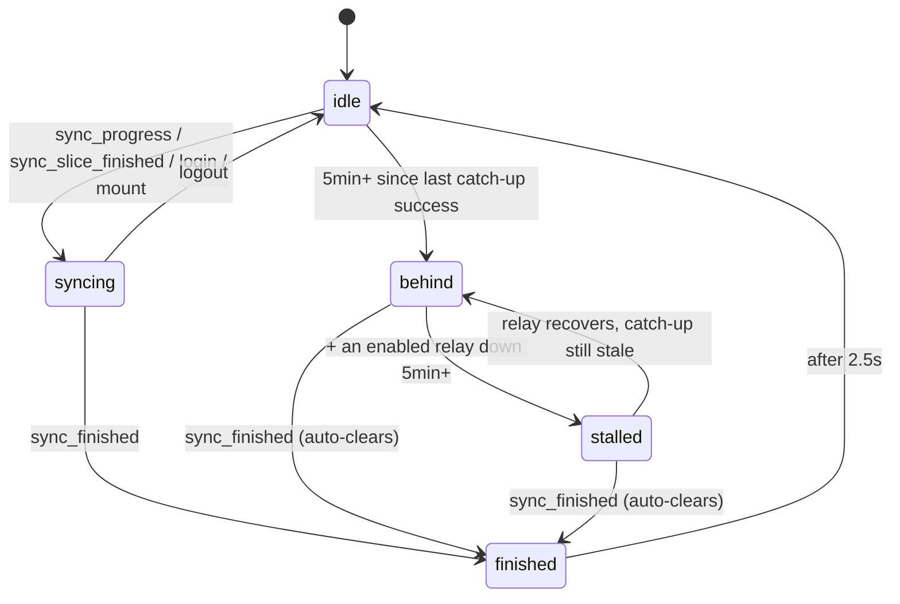

# Sync status — the header dot

What the colored dot in a channel / DM header means, and the relay backfill loop it reports on.

**Related:** [`OVERVIEW.md`](./OVERVIEW.md), [`docs/nostr/ARCHITECTURE.md`](../nostr/ARCHITECTURE.md), [`docs/shell/LAYOUT.md`](../shell/LAYOUT.md).

---

## 1. Purpose

Pacto has no server holding your history. DMs arrive as **NIP-59 gift wraps** (kind 1059) that must be pulled from relays and decrypted one time window at a time. On a cold start that walk can run for **minutes**, and a long-lived session can drift out of sync after sleep, a dropped connection, or a flaky relay.

Without a signal, an empty or short conversation is ambiguous:

> *"There are no messages here"* vs. *"Messages haven't arrived yet."*

The dot answers that question, plus — now that `behind`/`stalled` are real — a second one: *"is this session actually still catching up on new messages?"* It is **not** a delivery receipt and **not** scoped to the conversation you are looking at; it is scoped to the account-wide gift-wrap walk.

---

## 2. The backfill loop

`fetch_messages(init, relay_url)` — `src-tauri/src/lib.rs`.

Each invocation processes **exactly one time window, then returns**; this holds for every mode, including `CatchUp`. The frontend drives the loop: the backend emits `sync_slice_finished`, and `subscribeAppEvents` calls `fetch_messages(false)` again. There is no backend-side `while` over windows.

### Windows and modes

`SyncMode` (`lib.rs:226`) holds the walk position in `STATE`:

| Mode | Window movement | Advances to |
|------|-----------------|-------------|
| **`ForwardSync`** | starts at `now - 2 days → now`, then steps **backward in 2-day slices** | `BackwardSync` after **5** consecutive empty slices, or **3** empty slices once messages were found |
| **`BackwardSync`** | resumes from the **oldest known message time**, 2-day slices backward | `Finished` after **5** consecutive empty slices |
| **`DeepRescan`** | 2-day slices backward from `now` | `Finished` after **15** consecutive empty slices (**30 days** of silence) |
| **`CatchUp`** | **forward** in ≤2-day slices (`catch_up_window`, `lib.rs:506`) from `last_catch_up_until` (minus a 30s overlap on the first slice) to `now` | `Finished` once a slice reaches `now` — not on empty iterations; a quiet inbox is a valid CatchUp outcome |
| **`Finished`** | — | terminal; `is_syncing = false` |

`DeepRescan` counts **every** event in the window; the other modes count only **newly accepted** events.

**Reaching `Finished` records the watermark.** Any full account-wide walk completing (`BackwardSync` exhausting empty iterations, `DeepRescan` exhausting empty iterations, or `CatchUp` reaching `now`) sets `ChatState.last_catch_up_until = now` (`lib.rs:1263`) before emitting `sync_finished`. This watermark is what makes `CatchUp` and the single-relay reconnect window (below) bounded instead of re-walking a fixed range every time.

**`fetch_messages(false)` no longer dead-ends at `Finished`.** Once a full walk finishes, calling `fetch_messages(false)` again used to be a no-op (`sync_mode == Finished` fell through to "nothing to do"). Now, if `now - last_catch_up_until` exceeds the 60s grace period (`CATCH_UP_GRACE_SECS`, `should_enter_catch_up`, `lib.rs:497`), the call promotes into a bounded forward `CatchUp` walk (`should_promote_to_catch_up`, `lib.rs:521`) instead, reusing the same `sync_progress` / `sync_slice_finished` / `sync_finished` pipeline. This is what makes the wake/resume/reconnect triggers below actually fetch new messages instead of silently no-oping.

**Manual deep rescan is now reachable from the UI.** `deep_rescan` (`lib.rs:5402`) forces `DeepRescan` mode from `now` and is invoked via `deepRescan()` (`src/lib/api/nostr.ts:684`), which the `SyncStatusIndicator` calls from its confirmation popover — see §4.

### Single-relay reconnect fetch

`monitor_relay_connections`'s `Connected` branch (`lib.rs:4197`) triggers a single-relay resync whenever a relay reconnects. It bypasses `STATE`/`SyncMode` entirely and stays silent (no `sync_progress`/`sync_finished` — the dot does not move for it). Two things changed:

- **Bounded window, not a fixed 2 days.** `single_relay_fetch_since` (`lib.rs:531`) narrows the fetch to `max(now - 2 days, last_catch_up_until - 30s overlap)`: a relay reconnecting shortly after a full account-wide catch-up only re-fetches the small gap, while a relay with no prior catch-up or a long outage still gets the full 2-day cap.
- **Per-relay in-flight guard.** `RELAY_FETCH_IN_FLIGHT` (`lib.rs:4129`) tracks relay URLs with a fetch already running; `relay_fetch_may_start` (`lib.rs:4134`) skips starting a second one. This stops rapid Connected/Disconnected/Connected flapping from spawning overlapping fetches for the same relay.

### Events

Emitted **only when `relay_url` is `None`** (i.e. never for the single-relay reconnect fetch above).

| Event | Emitted when |
|-------|--------------|
| `sync_progress` | a slice is about to be fetched; payload `{ since, until, mode }` |
| `sync_slice_finished` | slice done, more work remains → frontend requests the next slice |
| `sync_finished` | mode reached `Finished` |
| `relay_status_change` | a relay's `RelayStatus` transitions (`monitor_relay_connections`, `lib.rs:4183`); payload `{ url, status }`. Not new to this work, but now consumed by the frontend for `behind`/`stalled` — see §3. |

### On completion

`sync_finished` is not just a UI signal. Reaching `Finished` also drops `WRAPPER_ID_CACHE` (the NIP-59 dedup cache is only useful mid-sync), then spawns MLS group sync after 500 ms, then a weekly-VACUUM check.

One related suppression: MLS welcomes decrypted **during** sync are processed but their `mls_invite_received` emit is withheld until `sync_mode == Finished || !is_syncing`, so invites don't surface before chats are loaded.

### The 15s relay health-check loop is now conservative

`monitor_relay_connections`'s health-check task (`lib.rs:4235`) polls every 15s. It no longer force-disconnects `Connected` relays on an empty/slow Metadata probe — it only records `ping_ms`/`last_check` (`update_relay_metrics`) and logs a warning. Forced disconnect+reconnect (`relay_needs_forced_reconnect`, `lib.rs:4121`) now only fires for relays whose status is already `Terminated` or `Disconnected` — i.e. the loop reacts to relays the library has already given up on, instead of also second-guessing ones it still considers healthy.

---

## 3. Frontend state

`SyncStatus` — `src/stores/dm.ts:401`. Five values, and — unlike before — `behind`/`stalled` are real, reachable states, not dead ones.

```ts
type SyncStatus = 'idle' | 'syncing' | 'finished' | 'behind' | 'stalled';
```

`dmSyncStatus` (`dm.ts:402`) is the raw event-driven store described below. Components read `dmSyncStatusEffective` (`dm.ts:493`) instead — a derived store that layers time-relative `behind`/`stalled` on top:



`behind`/`stalled` are not driven by their own events — they're a derived overlay recomputed on a timer, so the diagram above is a simplification; see the predicate below.

### Raw `dmSyncStatus` transitions

| Transition | Where |
|---|---|
| → `syncing` on app mount | `src/routes/+page.svelte` |
| → `syncing` after login/unlock/account creation | `src/lib/app/post-login-sync.ts` (`runPostLoginNetworkSync`, called from unlock, import, and `createAccount` in `src/stores/auth.ts`) |
| → `syncing` on `sync_progress` (**only from `idle`**) / `sync_slice_finished` | `src/lib/app/tauri-subscriptions.ts` |
| → `finished`, then `idle` after 2500 ms; also sets `lastCatchUpSuccess = Date.now()` | `src/lib/app/tauri-subscriptions.ts` (`sync_finished`) |
| → `finished` → `idle` fallback on `init_finished`; also sets `lastCatchUpSuccess = Date.now()` | `src/stores/profiles.ts` — the backend may never emit `sync_finished` for an init-only run, so this fallback carries the same watermark update as the real handler. |
| → `idle` on logout | `src/lib/utils/clear-account-state.ts` (also resets `lastCatchUpSuccess` and `relayStatusByUrl`) |

### What drives `behind`/`stalled`

Two supporting stores, both in `dm.ts`:

- **`lastCatchUpSuccess`** (`dm.ts:405`) — wall-clock time of the most recent `sync_finished`. `null` until one succeeds this session. Set only by the real `sync_finished` handler above.
- **`relayStatusByUrl`** (`dm.ts:416`) — per-relay `{ status, enabled, lastHealthyAt }`, keyed by URL. Seeded once at startup from `listRelays()` via `seedRelayHealth` (`subscribeAppEvents`, `tauri-subscriptions.ts:106`), then kept live by the `relay_status_change` event via `applyRelayStatusChange` (`tauri-subscriptions.ts:232`) — `relay_status_change` only fires on a transition, not for relays already connected, which is why the startup seed is needed.

`dmSyncStatusEffective` (`dm.ts:493`) derives from `[dmSyncStatus, lastCatchUpSuccess, relayStatusByUrl, syncHealthTick]`:

1. If raw status is `syncing`, pass it through unchanged.
2. **`behind`**: `lastCatchUpSuccess` is `null`, or more than 5 minutes old (`SYNC_BEHIND_THRESHOLD_MS`, `dm.ts:461`). If not behind, pass the raw status through (typically `idle`/`finished`).
3. **`stalled`**: `behind`, **and** at least one `enabled` tracked relay has been `disconnected`/`terminated` for more than 5 minutes (`SYNC_STALL_RELAY_THRESHOLD_MS`, `dm.ts:462`). Disabled relays never contribute.

`syncHealthTick` (`dm.ts:466`) is a store ticking every 30s (`installSyncHealthTicker`, started once from `subscribeAppEvents`) purely so the derivation re-evaluates the 5-minute thresholds even with no new events — without it, `behind`/`stalled` would only ever be recomputed when one of the other three stores changed.

Both thresholds auto-clear the instant a real `sync_finished` lands and resets `lastCatchUpSuccess`, dropping straight back to `finished` → `idle`.

### Trigger sources

Three independent places can kick off a `fetch_messages(false)` call that (via §2's grace-period promotion) turns into a real catch-up:

- App mount / post-login (`+page.svelte`, `post-login-sync.ts`).
- The `sync_slice_finished` continuation loop (mid-walk).
- `src/lib/app/wake-sync.ts` — debounced (50ms) `focus` / `visibilitychange` / `resume` listeners, installed once from `subscribeAppEvents`. On any of those firing, it calls `fetchMessages(false)` (`requestCatchUp`) unless `dmSyncStatus` is already `syncing`. This recovers GiftWrap/DM traffic across sleep or a background tab without waiting for the next unrelated app event.

The same wake path also runs `syncMlsGroupsNow(null)` after the same 50ms debounce, with an in-flight promise coalesce so rapid focus flickers do not stack MLS syncs. MLS wake is **independent** of GiftWrap `dmSyncStatus`: when GiftWrap is already `syncing` (or CatchUp is a grace-period no-op with no `sync_finished`), MLS still runs so squad channel traffic is not stuck until tab/channel entry or restart.

---

## 4. The dot

`src/components/dm/SyncStatusIndicator.svelte`, rendered in the channel header (`ChatView.svelte`) and DM header (`DmThread.svelte`), both now passing `$dmSyncStatusEffective` (previously `DmThread.svelte` hardcoded `stalled={false}`).

| State | Rendering | Interactive? |
|-------|-----------|---------------|
| `idle` | **nothing** — the wrapper is pulled out of flex flow so no gap remains after the title | no |
| `syncing` | 8px dot, `--warning`, pulsing 1.2s | no |
| `finished` | 8px dot, `--success` | no |
| `behind` | 8px dot, `--warning` (same token as `syncing`, not pulsing) | **yes** |
| `stalled` | 8px dot, `--danger` | **yes** |

### `behind`/`stalled` are now clickable

For `behind`/`stalled` only, the dot renders inside a `<button>` (`aria-haspopup="dialog"`, `aria-expanded`) instead of a bare `<span>`. Clicking it opens a confirmation popover (`role="dialog"`) explaining the cost ("re-walks up to ~30 days of history in 2-day slices... uses relay bandwidth") with Cancel/Confirm actions. Confirm calls `deepRescan()` (`src/lib/api/nostr.ts:684`, invoking the `deep_rescan` command), shows a scanning state on the confirm button while in flight, and surfaces failures via `showToast`. The popover closes on an outside click, `Escape`, or a successful rescan; it also force-closes if the state stops being clickable out from under it (e.g. a `sync_finished` lands while the popover is open).

Rules this component follows:

- **No visible text outside the popover.** The state name lives in the `title` tooltip and in a visually hidden `.sync-label` inside the `role="status"` live region, so screen readers still get it. For `behind`/`stalled`, the trigger `<button>` also carries `aria-label={label}` (e.g. "Behind" / "Stalled") as its accessible name, since a button needs one independent of the hidden label span. Strings stay in `messaging.syncStatus.*` / `messaging.deepRescan.*`.
- **Theme tokens only** (`--warning` / `--success` / `--danger`), defined by all five themes in `src/styles/themes/`.
- **Idle renders no dot.** Idle is the steady state; a permanent grey dot beside every title is noise.
- Pulse is disabled under `prefers-reduced-motion: reduce`; `behind`'s dot is `--warning` but does not pulse (it isn't active work in progress, just staleness).

---

## 5. Known limits

- **It is global, not per-conversation.** `$dmSyncStatusEffective` reflects the account-wide gift-wrap walk and is rendered in every header. It says nothing about whether *this* channel is caught up. MLS group history uses per-group cursors (`sync_mls_groups_now`) and is not represented here at all.
- **No hang detection.** A wedged relay stream shows amber (`syncing`) until its per-slice timeout (60s all-relay, 30s single-relay) expires; a walk that never completes a slice does not surface as `stalled` on its own — `stalled` is driven by relay connection state, not by request latency.

---

## 6. Verifying a change

The states are event-driven, so drive them through the real event bus rather than poking props. With the app running and a Tauri MCP driver session open:

```js
// force the finished (green) dot
await window.__TAURI__.event.emit('sync_finished');
// force the syncing (amber) dot
await window.__TAURI__.event.emit('sync_progress', {});
```

These two still work unchanged for `idle`/`syncing`/`finished` — they only touch the raw `dmSyncStatus` store, which `dmSyncStatusEffective` passes through as-is while `syncing`, or (for `finished`) while `lastCatchUpSuccess` is recent.

`behind`/`stalled` are **not** props and are **not** driven by a single event — they're a timer-recomputed derivation over `lastCatchUpSuccess`/`relayStatusByUrl` (§3), so forcing them means moving those inputs, not emitting one event:

```js
// force `behind`: simulate "no catch-up in the last 5+ minutes"
// (there is no lastCatchUpSuccess setter exposed on window; easiest is to
// just wait — or, in a unit test against src/stores/dm.ts, call
// lastCatchUpSuccess.set(Date.now() - 6 * 60 * 1000) directly)

// force `stalled`: also mark a tracked relay down for 5+ minutes
await window.__TAURI__.event.emit('relay_status_change', { url: 'wss://example.relay', status: 'disconnected' });
// then wait for lastHealthyAt to be 5+ minutes stale, or backdate it in a unit test
```

In practice, `behind`/`stalled` are exercised as unit tests against the derived store directly (`src/stores/dm-sync-status.test.ts`, using `vi.advanceTimersByTimeAsync` against the 5-minute thresholds) rather than through the live event bus, since both require real time passage that a manual driver session can't fast-forward.

Then assert `.sync-status[data-state]`, the dot's computed `background-color`, and — for `idle` — that `.channel-info`'s right edge equals `.channel-name`'s right edge, proving the indicator contributes no layout.

Component-level tests: `src/components/dm/SyncStatusIndicator.test.ts`. Store-level tests: `src/stores/dm-sync-status.test.ts`. Wake-trigger tests: `src/lib/app/wake-sync.test.ts`.
