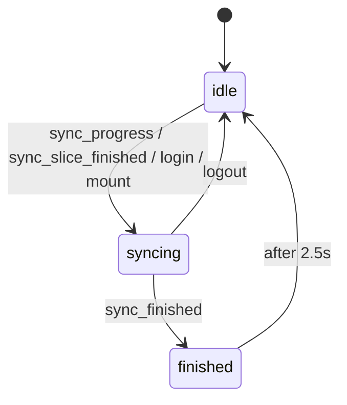

# Sync status — the header dot

What the colored dot in a channel / DM header means, and the relay backfill loop it reports on.

**Related:** [`OVERVIEW.md`](./OVERVIEW.md), [`docs/nostr/ARCHITECTURE.md`](../nostr/ARCHITECTURE.md), [`docs/shell/LAYOUT.md`](../shell/LAYOUT.md).

---

## 1. Purpose

Pacto has no server holding your history. DMs arrive as **NIP-59 gift wraps** (kind 1059) that must be pulled from relays and decrypted one time window at a time. On a cold start that walk can run for **minutes**.

Without a signal, an empty or short conversation is ambiguous:

> *"There are no messages here"* vs. *"Messages haven't arrived yet."*

The dot answers exactly that one question and nothing else. It is **not** a delivery receipt, **not** a connection indicator, and **not** scoped to the conversation you are looking at.

---

## 2. The backfill loop

`fetch_messages(init, relay_url)` — `src-tauri/src/lib.rs`.

Each invocation processes **exactly one time window, then returns**. The frontend drives the loop: the backend emits `sync_slice_finished`, and `subscribeAppEvents` calls `fetch_messages(false)` again. There is no backend-side `while` over windows.

### Windows and modes

`SyncMode` (`lib.rs`) holds the walk position in `STATE`:

| Mode | Window movement | Advances to |
|------|-----------------|-------------|
| **`ForwardSync`** | starts at `now - 2 days → now`, then steps **backward in 2-day slices** | `BackwardSync` after **5** consecutive empty slices, or **3** empty slices once messages were found |
| **`BackwardSync`** | resumes from the **oldest known message time**, 2-day slices backward | `Finished` after **5** consecutive empty slices |
| **`DeepRescan`** | 2-day slices backward from `now` | `Finished` after **15** consecutive empty slices (**30 days** of silence) |
| **`Finished`** | — | terminal; `is_syncing = false` |

`DeepRescan` counts **every** event in the window; the other modes count only **newly accepted** events. It is started by the `deep_rescan` command — registered in the handler list but **not currently invoked from the frontend**.

### Events

Emitted **only when `relay_url` is `None`**. A single-relay resync (post-reconnect) uses a fixed last-2-days window, bypasses `STATE`, and stays silent — the dot will not move for it.

| Event | Emitted when |
|-------|--------------|
| `sync_progress` | a slice is about to be fetched; payload `{ since, until, mode }` |
| `sync_slice_finished` | slice done, more work remains → frontend requests the next slice |
| `sync_finished` | mode reached `Finished` |

### On completion

`sync_finished` is not just a UI signal. Reaching `Finished` also drops `WRAPPER_ID_CACHE` (the NIP-59 dedup cache is only useful mid-sync), then spawns MLS group sync after 500 ms, then a weekly-VACUUM check.

One related suppression: MLS welcomes decrypted **during** sync are processed but their `mls_invite_received` emit is withheld until `sync_mode == Finished || !is_syncing`, so invites don't surface before chats are loaded.

---

## 3. Frontend state

`SyncStatus` / `dmSyncStatus` — `src/stores/dm.ts`. One **global** store, three values.



| Transition | Where |
|---|---|
| → `syncing` on app mount | `src/routes/+page.svelte` |
| → `syncing` after login | `src/lib/app/post-login-sync.ts` |
| → `syncing` on `sync_progress` (**only from `idle`**) / `sync_slice_finished` | `src/lib/app/tauri-subscriptions.ts` |
| → `finished`, then `idle` after 2500 ms | `src/lib/app/tauri-subscriptions.ts` (`sync_finished`) |
| → `finished` → `idle` fallback on `init_finished` | `src/stores/profiles.ts` — the backend may never emit `sync_finished` for an init-only run |
| → `idle` on logout | `src/lib/utils/clear-account-state.ts` |

---

## 4. The dot

`src/components/dm/SyncStatusIndicator.svelte`, rendered in the channel header (`ChatView.svelte`) and DM header (`DmThread.svelte`).

| State | Rendering |
|-------|-----------|
| `idle` | **nothing** — the wrapper is pulled out of flex flow so no gap remains after the title |
| `syncing` | 8px dot, `--warning`, pulsing 1.2s |
| `finished` | 8px dot, `--success` |
| `stalled` | 8px dot, `--danger` |

Rules this component follows:

- **No visible text.** The state name lives in the `title` tooltip and in a visually hidden `.sync-label` inside the `role="status"` live region, so screen readers still get it. Strings stay in `messaging.syncStatus.*`.
- **Theme tokens only** (`--warning` / `--success` / `--danger`), defined by all five themes in `src/styles/themes/`.
- **Idle renders no dot.** Idle is the steady state; a permanent grey dot beside every title is noise.
- Pulse is disabled under `prefers-reduced-motion: reduce`.

---

## 5. Known limits

- **It is global, not per-conversation.** `$dmSyncStatus` reflects the account-wide gift-wrap walk and is rendered in every header. It says nothing about whether *this* channel is caught up. MLS group history uses per-group cursors (`sync_mls_groups_now`) and is not represented here at all.
- **`stalled` is unreachable.** Both callsites hardcode `stalled={false}`. Nothing computes stall detection; the red state is defined but dead.
- **No hang detection.** A wedged relay stream shows amber until its per-slice timeout (60s all-relay, 30s single-relay) expires.

---

## 6. Verifying a change

The states are event-driven, so drive them through the real event bus rather than poking props. With the app running and a Tauri MCP driver session open:

```js
// force the finished (green) dot
await window.__TAURI__.event.emit('sync_finished');
// force the syncing (amber) dot
await window.__TAURI__.event.emit('sync_progress', {});
```

Then assert `.sync-status[data-state]`, the dot's computed `background-color`, and — for `idle` — that `.channel-info`'s right edge equals `.channel-name`'s right edge, proving the indicator contributes no layout.

Component-level tests: `src/components/dm/SyncStatusIndicator.test.ts`.
