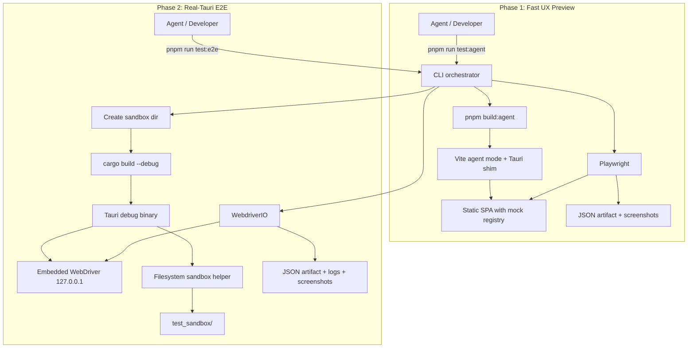
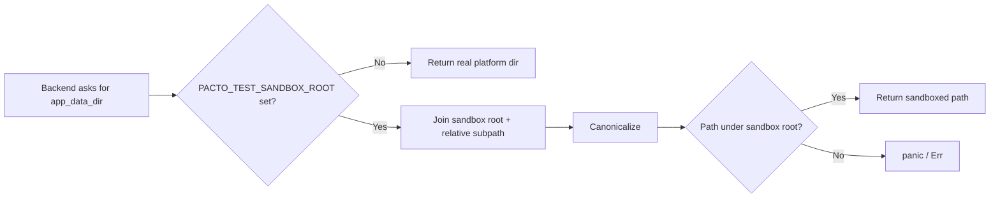

## Summary

Add a deterministic test feedback loop so coding agents can verify their own presentation-layer and filesystem-touching changes. Phase 1 is a browser-runnable Svelte build with a mocked backend, driven by Playwright, for fast layout and click-through feedback. Phase 2 runs the real Tauri debug binary through WebdriverIO + embedded WebDriver, with a Rust-enforced filesystem sandbox, for assertions on real OS side effects. A single CLI orchestrator emits a merged JSON artifact with test results, logs, and screenshots so the agent can self-correct without human help most of the time.

---

## Problem Frame

Pacto is a Tauri 2 desktop app (SvelteKit 2 + Svelte 5 frontend, Rust backend). Coding agents today cannot verify work that touches the presentation layer or OS filesystem because:

- The app requires a PIN to unlock a private key stored on disk; even basic UI flows depend on real filesystem state.
- Browser-only test tools against a static build cannot exercise the real Rust backend or assert on real OS mutations.
- `pnpm test` runs only Vitest unit tests in a Node environment; there is no end-to-end harness.

The result is a human-in-the-loop bottleneck: an agent changes code, a developer manually runs the app, and regressions are caught late.

---

## Requirements

### Phase 1: Fast UX preview harness

- R1. `pnpm build:agent` produces a browser-runnable static SPA from the same Svelte source used by the Tauri build.
- R2. Direct `invoke()` and `listen()` calls route through a runtime shim that dispatches to typed mock handlers when `window.__TAURI__` is absent.
- R3. Mock handlers cover auth, shell, dashboard, and wallet commands with fixtures that render representative UI states.
- R4. Non-Tauri fallbacks are complete for clipboard, file picker, notifications, external URLs, and image file URLs.
- R5. `pnpm exec playwright test` runs at least one spec against the agent build locally and in CI.
- R6. The Playwright suite captures at least one screenshot automatically on every run.
- R7. Adding a new mocked command requires editing one registry file and one fixture.
- R8. Production Tauri build is unaffected by agent-build code paths.

### Phase 2: Real-Tauri E2E harness

- R9. A single CLI command builds the debug binary and runs one WDIO spec.
- R10. The first real-Tauri spec creates an account (or uses the auth shortcut), opens a chat, sends a text message, and asserts the message appears in the UI and is persisted in the sandboxed SQLite database.
- R11. Each run uses an isolated sandbox directory and cleans it up afterward.
- R12. The merged log artifact is machine-parseable and includes Rust + webview entries.
- R13. The harness runs on macOS (primary dev platform) and is portable to Linux/Windows.
- R14. The test-execution portion of a single real-Tauri spec completes in under 3 minutes on a typical development machine; the initial uncached debug build time is reported separately.

### Cross-cutting

- R15. Test failures include enough structured context (DOM snapshot, screenshot, command log, Rust log) that the agent can localize the bug without human help most of the time.
- R16. Adding a new test does not require modifying production code paths.
- R17. CI can run the fast harness on every PR and the real-Tauri harness on request or nightly.
- R18. The test-only auth shortcut is gated by `#[cfg(debug_assertions)]` plus a runtime env var, and the embedded WebDriver plugin is gated by the `test-harness` Cargo feature so it is not present in release binaries.
- R19. The release binary can be verified to contain no WebDriver or test-auth symbols.

---

## Key Technical Decisions

- **Local Tauri API indirection instead of package aliasing.** Create `src/lib/tauri-api.ts` that re-exports `invoke`/`listen` from `@tauri-apps/api/core` and `@tauri-apps/api/event`. Create `src/lib/tauri-api.agent.ts` that dispatches to the mock registry. Vite agent mode aliases `$lib/tauri-api` to the agent module; production and Vitest builds keep the real re-export. This avoids circular resolution, preserves existing Vitest mocks, and keeps plugin packages untouched.

- **Rust path sandbox helper with root validation.** Introduce `src-tauri/src/paths.rs` with helpers for `app_data_dir`, `app_local_data_dir`, and download resolution. When `PACTO_TEST_SANDBOX_ROOT` is set, the helper returns a path under that root, canonicalizes it, and rejects any path that falls outside. The sandbox root itself must be an absolute path under the project `test_sandbox/` tree or carry a `.pacto-test-sandbox` sentinel created by the launcher; roots that equal the real `app_data_dir`/`app_local_data_dir` or contain `..` are rejected.

- **Auth shortcut tied to an active sandbox.** The `debug_test_auth` command requires three conditions: a debug build (`#[cfg(debug_assertions)]`), the runtime env var `PACTO_ALLOW_TEST_AUTH=1`, and a valid `PACTO_TEST_SANDBOX_ROOT`. Without the sandbox it returns an error, preventing a debug binary from touching real profile data. It fully replicates the normal authenticated runtime state, including `ENCRYPTION_KEY`, Nostr client, active account, and profile database.

- **WebDriver plugin gated by a Cargo feature.** Use `tauri-plugin-webdriver` (crates.io, `^0.2`) as an optional dependency in `src-tauri/Cargo.toml` and initialize it only when the `test-harness` Cargo feature is enabled. The orchestrator builds the debug binary with `--features test-harness`; release builds omit the feature. The plugin binds to `127.0.0.1` on a port selected by the orchestrator (`TAURI_WEBDRIVER_PORT`) and is reachable only from the local test process during the run.

- **Release verification with object-file tools.** The release binary is checked with `nm`/`objdump`/`readelf`/`dwarfdump` (per platform) for absence of WebDriver plugin symbols, `debug_test_auth`, and test-auth env-var strings. `strings`/`grep` is used only as a secondary defense-in-depth check, not the primary gate.

- **One CLI orchestrator for both phases.** A TypeScript CLI under `agent-tools/run-tests.ts` accepts `--phase=1|2`, `--human`, and `--retain-sandbox`, runs the appropriate build + test runner, and emits a single JSON document with `passed`, `tests`, `logs`, and `screenshots`. This is the single entry point for agents and developers.

- **Merged log format with secret redaction.** Rust stdout/stderr, webview console logs, and WDIO JSON output are merged into `{ source, ts, level, message }` entries with per-test `error`, `screenshot`, and `dom_snapshot`. Screenshots and DOM snapshots are masked during secret-entry screens, and CI artifact retention is short and access-restricted.

---

## High-Level Technical Design

### Component topology

### Sandbox path enforcement

---

## System-Wide Impact

This work touches five boundaries that are otherwise independent: authentication/encryption state, filesystem lifecycle, frontend/backend RPC contract, CI/release trust model, and external test-tool integration.

### Auth shortcut and encryption-key lifecycle
The normal login/create flow derives an encryption key from the user's PIN in `encrypt()` and caches it in the global `ENCRYPTION_KEY`. The `debug_test_auth` shortcut must produce an equivalent runtime state—Nostr client, per-npub profile database, in-memory seed, and cached encryption key—or downstream commands (`message`, `export_recovery_phrase`, `sign_evm_hash`) will behave differently in tests than in release. If the shortcut unlocks the account but leaves `ENCRYPTION_KEY` unset, `crypto::internal_encrypt` can panic and message-sending specs fail in a way that does not reproduce the user-facing PIN path.

`ENCRYPTION_KEY` is currently a `OnceCell` that can be set only once per process. `debug_test_auth` therefore sets it once; the first real-Tauri spec runs in its own process, and multi-spec suites must either restart the binary between specs or refactor `ENCRYPTION_KEY` to a debug-build resettable container in a follow-up.

### Filesystem sandbox completeness

`paths.rs` redirects `app_data_dir`, `app_local_data_dir`, and download resolution when `PACTO_TEST_SANDBOX_ROOT` is set. Direct `handle.path().app_data_dir()` and `handle.path().app_local_data_dir()` calls in `lib.rs` (startup account detection, login completion), plus `BaseDirectory::Download` usage in `message.rs` and `rumor.rs`, must route through the helper. Any call site that bypasses it escapes the sandbox and can pollute the developer's real `Download/vector/` or real `app_data_dir/<npub>/` directories, causing flaky or false-positive results in later runs.

The Tauri `fs` and `dialog` plugins can also write outside the sandbox if their allowlists are not scoped to the sandbox root. In real-Tauri tests, the `fs` plugin scope must be restricted to the sandbox and file pickers must be mocked or disabled.

### Frontend/backend RPC contract

Phase 1 replaces direct `invoke`/`listen` imports with a local `$lib/tauri-api` module. If any module still imports from `@tauri-apps/api/core` or `@tauri-apps/api/event`, or if a Tauri plugin internally imports the real core module, the agent build will call non-existent Tauri runtime code. The mock registry also becomes a parallel specification of command return shapes; drift between fixtures and Rust return types can make Phase 1 pass while Phase 2 fails on the same flow.

### CI/release trust model

The test-only `debug_test_auth` command is gated by `#[cfg(debug_assertions)]` and runtime env vars; the embedded WebDriver plugin is gated by the `test-harness` Cargo feature. The release binary is verified with object-file tools. The primary gate is compile-time exclusion; the symbol check is defense-in-depth. A false-negative symbol check could let release retain debug capability, while a false-positive could block a clean release.

### External tool integration and artifact hygiene

Phase 1 depends on Playwright and a static server; Phase 2 depends on WebdriverIO, the embedded WebDriver server, cargo build caching, and platform-specific Tauri dependencies. A port-discovery race or protocol mismatch between WebdriverIO and the embedded WebDriver server causes timeouts that look like app hangs. Retained screenshots, DOM snapshots, and sandbox databases can accumulate test-account seeds and message content; they must be stored with restricted permissions and deleted on teardown unless explicitly retained.

### Phase 1 vs Phase 2 coverage boundary

Phase 1 validates rendering, navigation, and frontend state transitions against mocks. Phase 2 validates real filesystem persistence, encryption, and OS integration. Neither phase alone catches the full class of regressions. Phase 1 is a fast smoke screen, not a substitute for the real-Tauri spec.

---

## Implementation Units

### U1a. Tauri API shim and call-site migration

**Goal:** Provide a single, typed interception point for `invoke` and `listen` that every frontend call site uses, without aliasing the `@tauri-apps/api` packages directly.

**Requirements:** R2, R7, R8

**Dependencies:** None

**Files:**
- Create `src/lib/tauri-api.ts`
- Create `src/lib/tauri-api.agent.ts`
- Create `src/lib/agent-mocks/types.ts`
- Modify `vite.config.ts` (add mode-conditional alias)
- Modify all files that import `invoke` from `@tauri-apps/api/core`:
  - `src/lib/api/auth.ts`
  - `src/lib/api/commons.ts`
  - `src/lib/api/nostr.ts`
  - `src/lib/api/relays.ts`
  - `src/lib/api/encryption.ts`
  - `src/lib/api/wallet-peers.ts`
  - `src/lib/dashboard/parent-dashboard-loaders.ts`
  - `src/lib/evm/advanced-write.ts`
  - `src/lib/governance/api.ts`
  - `src/lib/governance/squad-allowlist.ts`
  - `src/lib/squad/evm-account-squad-bindings.ts`
  - `src/lib/squad/squad-catalog.ts`
  - `src/lib/squad/squad-member-evm-share.ts`
  - `src/lib/squad/squad-roster-binding.ts`
  - `src/lib/squad/squad-roster-key-choice.ts`
  - `src/lib/utils/profile.ts`
  - `src/lib/wallet/backend-wallet.ts`
  - `src/lib/wallet/evm-accounts.ts`
  - `src/lib/wallet/pricing.ts`
  - `src/stores/auth.ts`
  - `src/components/parent/DeploySafeModal.svelte`
  - `src/components/wallet/WalletBar.svelte`
- Modify all files that import `listen` from `@tauri-apps/api/event`:
  - `src/lib/app/tauri-subscriptions.ts`
  - `src/stores/profiles.ts`
- Create `src/lib/tauri-api.test.ts`

**Approach:**
- `src/lib/tauri-api.ts` re-exports `invoke` and `listen` from `@tauri-apps/api/core` and `@tauri-apps/api/event`.
- `src/lib/tauri-api.agent.ts` exports `invoke` and `listen` implementations that dispatch to `src/lib/agent-mocks/registry.ts`.
- `vite.config.ts` adds a mode-conditional alias so that imports of `$lib/tauri-api` resolve to `$lib/tauri-api.agent.ts` only when `import.meta.env.MODE === 'agent'`.
- All call sites are migrated to import from `$lib/tauri-api` instead of the Tauri packages.
- A call-site coverage check (lint rule or CI script) prevents new direct imports of `@tauri-apps/api/core` or `@tauri-apps/api/event` from being introduced.

**Patterns to follow:**
- Existing Vitest tests in `src/lib/squad/squad-catalog.test.ts` and `src/lib/squad/squad-roster-binding.test.ts` mock `@tauri-apps/api/core`; because `$lib/tauri-api.ts` still imports from that package, those mocks continue to work unchanged.

**Test scenarios:**
- Happy path: in a normal build, `$lib/tauri-api.ts` delegates to the real Tauri APIs.
- Happy path: in agent mode, `$lib/tauri-api.agent.ts` dispatches to the mock registry.
- Error path: a lint/CI check fails if a source file imports `invoke`/`listen` directly from `@tauri-apps/api/core` or `@tauri-apps/api/event`.
- Regression path: existing Vitest tests still pass after the migration.

**Verification:**
- `pnpm test` passes with all call sites migrated.
- A production build (`pnpm build`) does not contain agent-mock code.
- A CI script confirms no direct `@tauri-apps/api/core` or `@tauri-apps/api/event` imports remain outside `$lib/tauri-api.ts` / `$lib/tauri-api.agent.ts`.

---

### U1b. Phase 1 mock fixtures

**Goal:** Give the agent build typed mock handlers for the first Playwright spec (login → authenticated shell → representative view render).

**Requirements:** R3, R7

**Dependencies:** U1a

**Files:**
- Create `src/lib/agent-mocks/registry.ts`
- Create `src/lib/agent-mocks/fixtures/auth.ts`
- Create `src/lib/agent-mocks/fixtures/encryption.ts`
- Create `src/lib/agent-mocks/fixtures/shell.ts`
- Create `src/lib/agent-mocks/fixtures/dashboard.ts`
- Create `src/lib/agent-mocks/fixtures/wallet.ts`
- Create `src/lib/agent-mocks/registry.test.ts`

**Approach:**
- `registry.ts` maps command names to typed handlers that return fixtures. Unmocked commands throw a clear error naming the command and pointing to `src/lib/agent-mocks/registry.ts`.
- Event mocking uses a tiny in-memory event bus; the registry exposes an emitter so fixtures can simulate `init_finished`, `message_new`, `sync_finished`, etc.
- Fixtures are scoped to what the first spec needs, with wallet commands represented by minimal stubs so R3 is satisfied:
  - **auth:** `create_account`, `login`, `login_with_recovery_phrase`, `get_current_account`, `check_any_account_exists`, `connect`, `list_all_accounts`, `logout`
  - **encryption:** `has_stored_key`, `set_pkey`, `set_evm_pkey`, `load_and_decrypt_key`
  - **profile:** `get_profile`, `load_profile`, `update_profile`, `refresh_profile_now`, `queue_profile_sync`
  - **messaging / commons:** `notifs`, `fetch_messages`, `get_message_views`, `get_chat_message_count`, `list_mls_groups`, `get_mls_group_metadata`, `list_dashboard_polls` (minimal stubs)
  - **wallet:** `get_wallet_summary`, `get_evm_native_balance`, `wallet_build_and_send_transaction` (minimal stubs that return representative empty/zero values)
- Add a fixture-audit step: before declaring Phase 1 done, run the agent build, load the login and default authenticated views, and add mocks for any newly invoked commands.

**Patterns to follow:**
- Type contracts in `src/lib/agent-mocks/types.ts` so adding a new command requires one registry entry and one fixture export.

**Test scenarios:**
- Happy path: calling `invoke('get_current_account')` in agent mode returns the fixture npub.
- Edge case: calling an unmocked command in agent mode throws with the command name and registry path.
- Edge case: `listen('init_finished', handler)` in agent mode registers the handler and can be triggered by the registry emitter.
- Error path: production build (agent alias inactive) never loads the mock registry.

**Verification:**
- `src/lib/agent-mocks/registry.test.ts` passes.
- `pnpm build:agent` succeeds.

---

### U2. Agent build mode and Phase 1 Playwright harness

**Goal:** Provide the fast, browser-runnable build and the first automated spec that proves the loop works.

**Requirements:** R1, R4 (verification only), R5, R6, R8

**Dependencies:** U1b

**Files:**
- Modify `package.json` (add `build:agent`, `test:agent` scripts; add `playwright`, `@playwright/test`, and `tsx` devDependencies)
- Modify `vite.config.ts` (agent mode alias for `$lib/tauri-api`, `VITE_AGENT_BUILD` define, relative base)
- Modify `svelte.config.js` if base path handling is needed
- Create `playwright.config.ts`
- Create `e2e/agent/auth-login.spec.ts`
- Create `e2e/agent/fixtures/agent-page.ts`
- Create `e2e/agent/support/selectors.ts`
- Create `.github/workflows/ci.yaml`
- Modify `.gitignore` (add `test_sandbox/` and `test_artifacts/`)

**Approach:**
- Add `build:agent` script that runs `vite build --mode agent`.
- Add `test:agent` script that runs the CLI orchestrator in Phase 1 mode (build + Playwright + report).
- Vite agent mode sets `VITE_AGENT_BUILD=true` and aliases `$lib/tauri-api` → `$lib/tauri-api.agent.ts`.
- Playwright config points at the `build/` output and starts a static file server on a deterministic port.
- First spec navigates to the SPA, completes the mocked login/create flow, waits for the authenticated shell (which renders the `commons` view by default), and captures a screenshot of a representative authenticated screen. Navigation to the squads/dashboard view is added only once the default-view fixtures are stable.
- Selectors use stable `data-testid` attributes where the existing markup lacks them; avoid brittle text/structure selectors. Add `data-testid` to the PIN input, create/login buttons, and the top navigation bar.
- On failure, Playwright captures screenshot, DOM snapshot, and command trace; the orchestrator converts these into the merged JSON artifact. CI uploads are restricted to the same retention and access rules as Phase 2 (short retention, no repository secrets).

**Execution note:** Start with the failing-build case: verify `pnpm build:agent` emits the SPA and Playwright can load it before writing assertions.

**Patterns to follow:**
- Existing Vitest config in `vite.config.ts` for TypeScript path resolution.
- Static adapter fallback already configured in `svelte.config.js`.

**Test scenarios:**
- Happy path: `pnpm build:agent` produces `build/index.html` and the SPA renders the login screen.
- Happy path: Playwright spec logs in with mocked credentials and captures a screenshot of the authenticated shell.
- Edge case: static build uses relative asset paths so it can be served from any directory.
- Error path: a missing mock command causes the spec to fail with the unmocked command name in the report.
- Integration scenario: CI runs `pnpm build:agent` and `pnpm exec playwright test` on every PR.

**Verification:**
- `pnpm run test:agent` exits 0 locally and emits a JSON report with `passed: true` and one screenshot entry.
- The same command succeeds in CI.

---

### U3. Filesystem sandbox helper

**Goal:** Ensure every backend filesystem path can be redirected to an isolated sandbox and reject any path that escapes it.

**Requirements:** R11, R16, R18

**Dependencies:** None

**Files:**
- Create `src-tauri/src/paths.rs`
- Modify `src-tauri/src/account_manager.rs`
- Modify `src-tauri/src/image_cache.rs`
- Modify `src-tauri/src/audio.rs`
- Modify `src-tauri/src/whisper.rs`
- Modify `src-tauri/src/lib.rs`
- Modify `src-tauri/src/message.rs` (attachment paths)
- Modify `src-tauri/src/rumor.rs` (attachment paths)
- Create `src-tauri/src/paths.test.rs` or `tests/paths_tests.rs`

**Approach:**
- `paths.rs` exposes:
  - `pub fn app_data_dir<R: Runtime>(handle: &AppHandle<R>) -> Result<PathBuf, String>`
  - `pub fn app_local_data_dir<R: Runtime>(handle: &AppHandle<R>) -> Result<PathBuf, String>`
  - `pub fn resolve_download_path<R: Runtime>(handle: &AppHandle<R>, subpath: impl AsRef<Path>) -> Result<PathBuf, String>`
- When `PACTO_TEST_SANDBOX_ROOT` is set, each helper mirrors its normal platform-relative location under the sandbox (`<root>/data/...`, `<root>/local/...`, `<root>/download/...`), canonicalizes the result, and errors/panics if it does not start with the sandbox root. This preserves the distinction between `app_data_dir` and `app_local_data_dir` while keeping all writes isolated.
- The sandbox root must be an absolute path under the project `test_sandbox/` tree or contain a `.pacto-test-sandbox` sentinel file created by the launcher. Roots that equal the real `app_data_dir`/`app_local_data_dir`, contain `..`, or are not absolute are rejected.
- Refactor every backend call site that uses `handle.path().app_data_dir()`, `handle.path().app_local_data_dir()`, or `handle.path().resolve(..., BaseDirectory::Download)` to use these helpers. Leave Tauri plugin-managed paths (window state, updater, single-instance) untouched for this unit; see U5 for plugin scoping in tests.
- Add unit tests for sandbox active/inactive, `..` escape, symlink escape, Windows drive-letter edge case, and root validation.

**Patterns to follow:**
- `account_manager.rs` already centralizes `get_profile_directory`, `get_database_path`, and `get_mls_directory`; refactor those to call the helper.
- `image_cache.rs` and `audio.rs` already call `handle.path().app_data_dir()` directly.

**Test scenarios:**
- Happy path: with `PACTO_TEST_SANDBOX_ROOT` set, `app_data_dir()` returns a path under the sandbox.
- Edge case: without the env var, `app_data_dir()` returns the real platform dir unchanged.
- Edge case: a `..` segment in the relative path resolves outside the sandbox and the helper returns an error.
- Edge case: a symlink inside the sandbox pointing outside is rejected after canonicalization.
- Edge case: `PACTO_TEST_SANDBOX_ROOT` pointing at the real `app_data_dir` is rejected.
- Error path: `PACTO_TEST_SANDBOX_ROOT` is set to a non-absolute path; helper returns an error.
- Integration scenario: creating an account in a real-Tauri test writes `npub1.../vector.db` only under the sandbox root.

**Verification:**
- Rust unit tests for `paths.rs` pass.
- A grep for `handle.path()` and `BaseDirectory::Download` outside `paths.rs` returns no matches in backend source, with the documented exception of Tauri plugin-managed paths (window state, updater, single-instance).
- A real-Tauri spec inspects the sandbox after account creation and finds no files outside it.

---

### U4. Debug-only embedded WebDriver plugin and auth shortcut

**Goal:** Enable remote control of the real debug binary while keeping those capabilities out of release builds.

**Requirements:** R9, R18, R19

**Dependencies:** U3

**Files:**
- Modify `src-tauri/Cargo.toml` (add `test-harness` feature and optional dependency)
- Modify `src-tauri/src/lib.rs`
- Create `src-tauri/src/test_auth.rs`
- Create `e2e/tauri/support/debug-auth.ts` (test-only wrapper, not in `src/lib/`)
- Create `agent-tools/scripts/symbol-check.ts`

**Approach:**
- Add `tauri-plugin-webdriver = { version = "0.2", optional = true }` to `Cargo.toml` and expose it through a `test-harness` feature. Initialize the plugin only under `#[cfg(all(feature = "test-harness", desktop))]`, so release builds (which omit the feature) do not link or run it.
- The orchestrator picks a free port, sets `TAURI_WEBDRIVER_PORT`, and polls `/status` before connecting WDIO. The server is reachable only from the local test process and exits with the app.
- Add `debug_test_auth` command gated by `#[cfg(debug_assertions)]`. At runtime it requires `PACTO_ALLOW_TEST_AUTH=1` and a valid `PACTO_TEST_SANDBOX_ROOT`; without either it returns an error. It accepts `pin: String`, `mnemonic: Option<String>`, and `seed_fixture_chat: bool`. It creates or unlocks an account, persists the encrypted seed, sets `ENCRYPTION_KEY`, initializes the Nostr client, optionally creates a deterministic DM chat entry when `seed_fixture_chat` is true, and returns a minimal hydrated state payload that contains no private keys or seeds.
- `agent-tools/scripts/symbol-check.ts` uses `nm`/`objdump`/`readelf`/`dwarfdump` (per platform) to assert absence of WebDriver plugin symbols, `debug_test_auth`, and test-auth env-var strings in the release binary. Demangled Rust symbols are checked via `rustfilt`/`c++filt` where available, and `strings`/`grep` is used only as a secondary defense-in-depth check. A negative test confirms it fails on a debug binary built with `--features test-harness`.

**Patterns to follow:**
- `tauri_plugin_mcp_bridge` conditional plugin init in `src-tauri/src/lib.rs:6152-6156`.
- `debug_hot_reload_sync` conditional command in `src-tauri/src/lib.rs:3982-4015`.

**Test scenarios:**
- Happy path: debug binary built with `--features test-harness`, with `PACTO_ALLOW_TEST_AUTH=1` and a valid sandbox, accepts `debug_test_auth` and returns a logged-in account.
- Happy path: `debug_test_auth` with `seed_fixture_chat: true` creates a DM chat entry the first spec can open.
- Error path: debug binary without `PACTO_ALLOW_TEST_AUTH` rejects `debug_test_auth`.
- Error path: debug binary with `PACTO_ALLOW_TEST_AUTH=1` but no sandbox rejects `debug_test_auth`.
- Error path: release build (feature not enabled) does not expose `debug_test_auth` and does not link the WebDriver plugin.
- Integration scenario: WebdriverIO connects to the embedded WebDriver on the ephemeral local port and can query the window title.
- Security scenario: symbol-check script passes on the release binary and fails on a debug binary built with `--features test-harness`.

**Verification:**
- `cargo build --release` succeeds and symbol-check script passes.
- `cargo build --features test-harness` succeeds and a debug build launches and accepts the auth shortcut in a real-Tauri spec.

---

### U5. Real-Tauri WDIO harness and orchestrator CLI

**Goal:** Orchestrate a single CLI that builds the debug binary, runs the first real-Tauri spec, and emits a merged artifact.

**Requirements:** R9, R10, R11, R13, R14, R17

**Dependencies:** U3, U4, U6a, U6b

**Files:**
- Create `agent-tools/run-tests.ts`
- Create `agent-tools/lib/phase1.ts`
- Create `agent-tools/lib/phase2.ts`
- Create `agent-tools/lib/sandbox.ts`
- Create `e2e/wdio.conf.ts`
- Create `e2e/tauri/send-message.spec.ts`
- Create `e2e/tauri/support/db-assert.ts`
- Modify `package.json` (add `test:e2e` script; add `@wdio/cli`, `@wdio/tauri-service`, and `webdriverio` devDependencies; ensure `test:agent` from U2 is present; regenerate `pnpm-lock.yaml`)

**Approach:**
- `run-tests.ts` is the single CLI entry point. Flags: `--phase=1|2`, `--human`, `--retain-sandbox`, `--spec=<glob>`. It validates `--spec` and sandbox paths, rejects `..` and shell metacharacters, and spawns child processes with argument arrays rather than string interpolation.
- Phase 1 path: build agent SPA, start static server, run Playwright, collect screenshots/report, emit JSON.
- Phase 2 path:
  - Generate a unique run-id (`timestamp + pid + random`) and create `./test_sandbox/<run-id>/` plus a `.pacto-test-sandbox` sentinel.
  - Build the debug binary with `--features test-harness` if no cached build exists; report `buildDurationMs` separately from test execution.
  - Launch the binary with `PACTO_TEST_SANDBOX_ROOT`, `PACTO_ALLOW_TEST_AUTH=1`, and `TAURI_WEBDRIVER_PORT=<port>`.
  - Poll the embedded WebDriver `/status` endpoint until it returns 200 (with timeout); point WDIO at the same port.
  - Run WDIO, then kill the Tauri process tree (process-group kill on Unix, job object on Windows), wait for helper processes to exit, and delete the sandbox unless `--retain-sandbox`. On Windows, retry deletion with backoff; if still locked, rename the directory and schedule deferred cleanup.
- WDIO config uses `@wdio/tauri-service` or the equivalent provider, connects to `127.0.0.1:<port>`, and captures webview console logs.
- First spec uses `debug_test_auth` with `seed_fixture_chat: true` to create a deterministic DM peer/chat, then:
  1. Wait for the authenticated shell and confirm the default view is rendered.
  2. Open the DMs tab, select the seeded chat thread, and type a short message.
  3. Send the message and wait for it to appear in the local message list.
  4. Assert the row exists in `test_sandbox/<run-id>/data/<npub>/vector.db` via a helper that resolves the sandbox database path from the known `data/` subfolder layout.
- The platform-specific debug binary path is discovered from `src-tauri/target/(debug|release)/[bundle/]pacto*` using the cargo target triple on the runner; the orchestrator logs the resolved path so local failures are reproducible.

**Execution note:** U6a (log audit and redaction) must be completed before any U5 verification that enables merged Rust/webview log capture.

**Patterns to follow:**
- Tauri WebdriverIO examples in the official docs for service/capabilities.
- Existing `debug_hot_reload_sync` state shape for what an authenticated shell expects.

**Test scenarios:**
- Happy path: `pnpm run test:e2e` creates a sandbox, runs the send-message spec, and reports `passed: true`.
- Happy path: the SQLite assertion confirms the message content is persisted under the sandbox.
- Edge case: each invocation uses a fresh run-id; two simultaneous runs use different sandbox directories and do not share database state.
- Edge case: the 3-minute budget applies to test execution after a cached debug build; `buildDurationMs` is reported separately.
- Error path: sandbox path validation triggers an error before any write when the helper is bypassed.
- Error path: process kill on teardown leaves no orphan Tauri helper processes or WebDriver listeners (verified by process list and port check).
- Integration scenario: CI runs the real-Tauri harness on `workflow_dispatch` and uploads artifacts.

**Verification:**
- `pnpm run test:e2e` completes locally in under 3 minutes for test execution after the first debug build is cached.
- Each run leaves no files under the real `app_data_dir`.

---

### U6a. Log audit and redaction

**Goal:** Audit existing logging and establish redaction rules before the first merged-log run captures secrets.

**Requirements:** R15, R18

**Dependencies:** None

**Files:**
- Modify `package.json` (add `tsx` devDependency; see also U2 and U5)
- Create `agent-tools/scripts/audit-logs.ts`
- Create `docs/ai-docs/agent-test-log-schema.md`
- Modify `src-tauri/src/*.rs` only where existing `println!`/`eprintln!` emit sensitive data
- Modify `src/lib/utils/dm-debug.ts` and any `console.log` sites that emit secrets

**Approach:**
- `audit-logs.ts` scans `src-tauri/src/**/*.rs` and `src/**/*.ts` for `println!`, `eprintln!`, `console.log`, `console.error` and flags statements that may contain mnemonics, PINs, private keys, seeds, message content, or npub-derived secrets. It also flags variables named `seed`, `mnemonic`, `pin`, `pkey`, `evm_pkey`, `nsec`, or obfuscated variants.
- The audit explicitly flags the `debug_test_auth` command and any log site that could echo its `pin`, `mnemonic`, or generated seed; these arguments are masked in the merged artifact before any Rust/webview log is written.
- Before enabling merged logging, fix or redact any offending sites.
- Define the merged JSON artifact schema in `docs/ai-docs/agent-test-log-schema.md`: `{ passed, tests[{ name, status, duration, error? }], logs[{ source: 'rust'|'webview'|'wdio', ts, level, message }], screenshots[{ path, test, step }], domSnapshots[{ path, test, step }], buildDurationMs }`.
- Document which screens must not be screenshotted (PIN entry, seed display, private-key export) and how DOM snapshots are redacted.

**Patterns to follow:**
- Existing `[Account Manager]`, `[Migration]`, `[MLS]` log prefixes in Rust.
- `dmLog` / `dmError` helpers in `src/lib/utils/dm-debug.ts`.

**Test scenarios:**
- Error path: the audit flags a `console.log` that prints message content.
- Security scenario: the schema doc explicitly excludes screenshots during PIN entry and seed display.

**Verification:**
- `pnpm exec tsx agent-tools/scripts/audit-logs.ts` exits 0 before any merged-log spec runs.

### U6b. Merged log aggregation and artifact schema

**Goal:** Produce a single machine-parseable artifact the agent can use to diagnose failures without leaking secrets.

**Requirements:** R12, R15, R18

**Dependencies:** U2, U6a

**Files:**
- Create `agent-tools/lib/merge-logs.ts`
- Create `agent-tools/lib/redaction.ts`
- Create `agent-tools/lib/artifacts.ts`

**Approach:**
- Implement the schema defined in U6a. Rust logs are captured by spawning the Tauri binary with stdout/stderr piped and parsing lines. Timestamps are added by the orchestrator at capture time. Clamp `RUST_LOG` to `info` or `warn` to avoid leaking secrets from third-party crates at `debug`/`trace` levels.
- Webview logs are retrieved from the WebDriver session after each test and merged with the same schema.
- WDIO JSON reporter output is parsed for test statuses and errors.
- Runtime redaction filters any log line matching secret regexes/entropy heuristics before it reaches the artifact.
- Screenshots and DOM snapshots are masked during secret-entry screens; artifact directories are created with restrictive permissions (`0o700` on Unix, current-user-only ACL on Windows) and deleted during teardown unless `--retain-sandbox`. CI artifact retention is short (1–3 days) and access-restricted.

**Patterns to follow:**
- The schema defined in `docs/ai-docs/agent-test-log-schema.md` from U6a.

**Test scenarios:**
- Happy path: a failing Phase 1 spec emits a JSON report with a screenshot path, DOM snapshot reference, and the unmocked command error.
- Happy path: a failing Phase 2 spec emits a JSON report with Rust logs, webview logs, and WDIO error merged in chronological order.
- Edge case: a screenshot taken during PIN entry is masked or absent from the artifact.
- Security scenario: artifact directory permissions are `0o700` on Unix and current-user-only on Windows.

**Verification:**
- A deliberately failing spec produces a JSON artifact that validates against the schema and contains all required fields.
- A test that intentionally logs a 12-word BIP-39 phrase and a 64-character hex private key has both redacted in the merged artifact.

---

### U7. CI workflows and release symbol verification

**Goal:** Run the fast harness on every PR, keep the slow harness on request/nightly, and verify release binaries do not carry test capabilities.

**Requirements:** R17, R19

**Dependencies:** U2, U4, U5, U6b

**Files:**
- Modify `.github/workflows/ci.yaml`
- Modify `.github/workflows/main.yaml` (add symbol-check step)
- Modify `.env.example`

**Approach:**
- New `ci.yaml` triggers on `pull_request` and `push` to `main`. It installs Node, pnpm, Rust, and Playwright browsers, then runs `pnpm install --frozen-lockfile`, `pnpm test` (unit), and `pnpm run test:agent`.
- Real-Tauri harness gets a separate workflow triggered by `workflow_dispatch` and a nightly `schedule`. It installs platform Tauri deps, then caches `src-tauri/target` and `~/.cargo` using keys derived from `Cargo.lock` hash, runner OS, and target triple. The debug binary is built once per cache miss; only logs, screenshots, and JSON reports are uploaded—never the debug binary—with a 3-day retention. The job runs in an ephemeral, non-privileged runner with no repository secrets. No external WebDriver driver is required because the plugin embeds the server.
- Add `PACTO_TEST_SANDBOX_ROOT` and `PACTO_ALLOW_TEST_AUTH` to `.env.example` as commented-out, test-only variables with a warning that they must never be enabled in production or release CI.

**Patterns to follow:**
- Existing `.github/workflows/main.yaml` for Tauri dependency installation on macOS/Ubuntu/Windows.
- Existing `pnpm test` script in `package.json`.

**Test scenarios:**
- Happy path: PR CI passes with unit tests and the agent build/Playwright run.
- Happy path: nightly real-Tauri workflow completes and uploads JSON + screenshots.
- Error path: symbol-check fails if a release binary contains WebDriver or test-auth symbols.
- Error path: symbol-check fails on a debug binary (negative test).
- Security scenario: real-Tauri CI job runs without repository secrets and does not upload the debug binary.

**Verification:**
- A test PR triggers the new CI workflow and passes.
- `pnpm exec tsx agent-tools/scripts/symbol-check.ts` passes on a release build and fails on a debug binary built with `--features test-harness`.

---

## Scope Boundaries

### In scope

- Phase 1 fast UX preview harness: agent SPA build, Tauri API shim, mock registry, one Playwright spec.
- Phase 2 real-Tauri E2E harness: sandbox helper, embedded WebDriver plugin, auth shortcut, one WDIO spec.
- Single CLI orchestrator for both phases with structured JSON output.
- Merged Rust + webview + WDIO log artifact.
- CI workflows for fast harness on PRs and real-Tauri harness on request/nightly.
- Release binary symbol verification for WebDriver/test-auth symbols.

### Deferred to follow-up work

- Expanding the mock registry beyond the representative auth, shell, dashboard, and wallet fixtures needed for the first Phase 1 spec.
- Additional real-Tauri specs beyond the first send-message flow (the manual E2E checklist in `docs/wallet/MANUAL_E2E_CHECKLIST.md` is the seed corpus).
- Fixture seeding for pre-populated profiles/MLS state in the sandbox.
- Relay/network stubbing to make real-Tauri specs fully offline.
- Mobile harness support.
- Automated agent retry/replan loop (this plan only builds the feedback artifact).

**Suggested sequencing:** After U7, expand Phase 1 fixtures and specs first (no binary build cost), then add network stubbing, then add more real-Tauri specs. The agent retry/replan loop is the last step and depends on the merged artifact proving reliable in practice.

### Success metric

- Within four weeks of U7, ≥80% of presentation-layer regressions introduced on feature branches are caught by `pnpm run test:agent` before human review, and the first real-Tauri spec runs successfully on macOS CI on request.

### Outside this product's identity

- Public web deployment of Pacto.
- Replacing unit tests or backend-specific Rust tests.
- Running real Nostr relays, MLS crypto, or on-chain transactions in the browser build.
- Production notarization, code signing, or distribution changes.

---

## Risks & Dependencies

| Risk | Mitigation |
|------|------------|
| Embedded WebDriver plugin has platform-specific gaps or requires forked patches. | Gate the plugin behind the `test-harness` Cargo feature; keep real-Tauri harness off the PR critical path until it proves stable on macOS, then port to Linux/Windows. |
| Sandbox leakage if any Rust module bypasses the path helper. | Refactor every known `app_data_dir`/`app_local_data_dir`/`resolve(..., Download)` call site; add helper unit tests for `..`, symlinks, and canonicalization; grep for stray `handle.path()` calls; verify in a real-Tauri spec. |
| Sandbox root points at real profile data. | Require the root to be under `test_sandbox/` or to contain a `.pacto-test-sandbox` sentinel; reject roots that equal the real `app_data_dir`/`app_local_data_dir` or contain `..`. |
| Tauri `fs`/`dialog` plugins write outside the sandbox. | Scope the `fs` plugin allowlist to the sandbox root in test mode; mock or disable file pickers in real-Tauri tests. |
| Auth shortcut operates on real data. | Require a valid `PACTO_TEST_SANDBOX_ROOT` in addition to `PACTO_ALLOW_TEST_AUTH=1`; store test accounts only under the sandbox. |
| Flakiness from real async behavior (relays, profile sync, MLS crypto). | First spec uses `debug_test_auth` with `seed_fixture_chat: true` and avoids network-dependent flows; defer relay stubbing to follow-up. |
| Maintenance burden of mocks drifting from the real backend. | Central registry + typed fixtures; validate fixture shapes against Rust return types; document that mocks are test artifacts. |
| Secrets in logs, screenshots, or DOM snapshots. | Run log audit before merged capture; redact known secret patterns at runtime; clamp `RUST_LOG`; mask secret-entry screens; set artifact permissions and short CI retention. |
| WebDriver port exposed to other local processes. | Bind the plugin to `127.0.0.1` on an ephemeral port selected by the orchestrator; the port is reachable only while the test Tauri process is running and is torn down with it.
| Release binary retains debug-only code. | Make WebDriver plugin an optional dependency controlled by the `test-harness` Cargo feature; verify with object-file tools; add negative test on a debug build built with `--features test-harness`.
| Orphan helper processes after teardown. | Use process-group kill on Unix and job objects on Windows; verify no listener remains on the WebDriver port after teardown. |
| Real-Tauri debug build exceeding the 3-minute budget. | Cache `src-tauri/target` and `~/.cargo`; report `buildDurationMs` separately; the 3-minute target applies to test execution after a cached build. |
| Untrusted test code on CI. | Run real-Tauri harness only on `workflow_dispatch`/nightly in ephemeral, non-privileged runners with no repository secrets; never upload the debug binary. |

---

## Sources & Research

- Origin requirements: `docs/brainstorms/2026-06-27-self-correcting-ai-testing-requirements.md`
- Storage layout and sandbox targets: `docs/storage-layout/SQLITE_AND_FILES.md`, `docs/storage-layout/ACCOUNT_LOGOUT_AND_ISOLATION.md`
- Manual test seed corpus: `docs/wallet/MANUAL_E2E_CHECKLIST.md`
- Existing debug-only command/plugin patterns: `src-tauri/src/lib.rs:3982-4015` (`debug_hot_reload_sync`), `src-tauri/src/lib.rs:6152-6156` (`tauri_plugin_mcp_bridge`)
- Backend path resolution call sites: `src-tauri/src/account_manager.rs`, `src-tauri/src/image_cache.rs`, `src-tauri/src/audio.rs`, `src-tauri/src/whisper.rs`, `src-tauri/src/lib.rs`, `src-tauri/src/message.rs`, `src-tauri/src/rumor.rs`
- Existing `isTauri()` fallbacks: `src/lib/utils/open-external.ts`, `src/lib/wallet/clipboard-copy.ts`, `src/lib/wallet/backend-wallet.ts`, `src/lib/wallet/evm-accounts.ts`
- Frontend Tauri API wrappers: `src/lib/api/auth.ts`, `src/lib/api/commons.ts`, `src/lib/api/nostr.ts`, `src/lib/api/relays.ts`, `src/lib/api/encryption.ts`, `src/lib/api/wallet-peers.ts`, `src/lib/app/tauri-subscriptions.ts`, `src/stores/profiles.ts`
- External reference: Tauri v2 WebDriver documentation and the `tauri-plugin-webdriver` crate (crates.io version `^0.2`, GitHub `Choochmeque/tauri-plugin-webdriver`).

---

## Open Questions

None remaining for planning. The only open item from the origin document was the standalone CLI orchestrator, which this plan addresses as U5.
