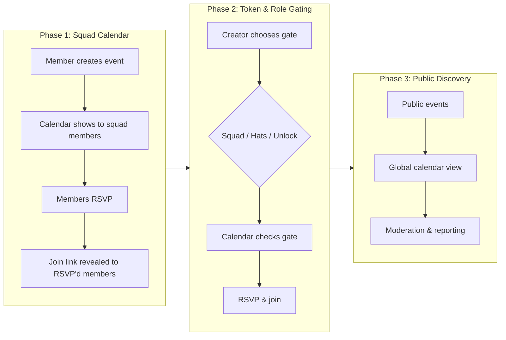
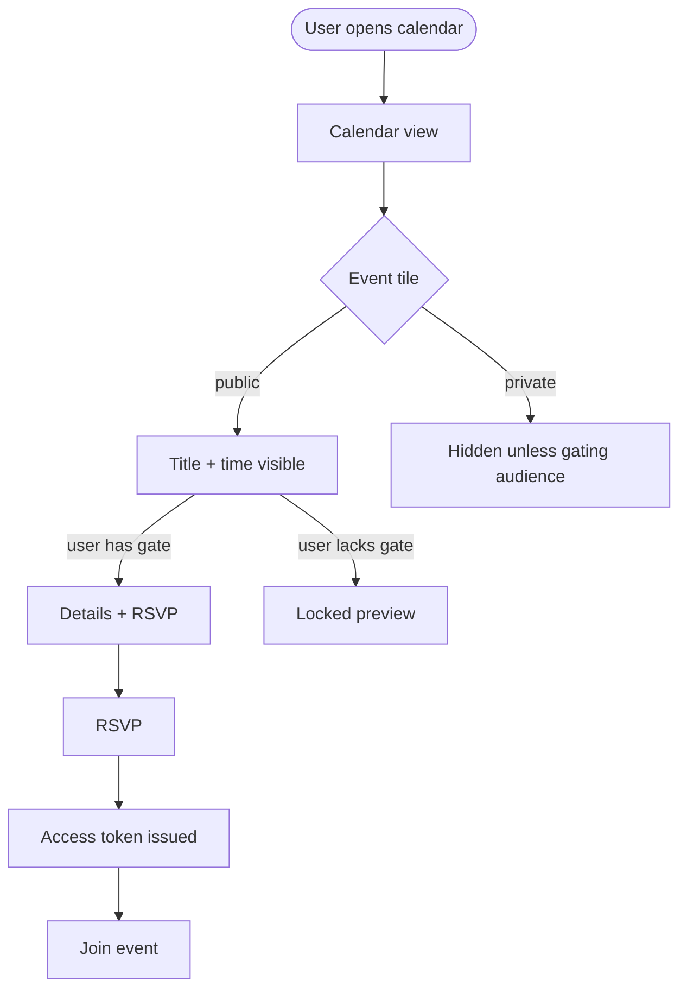
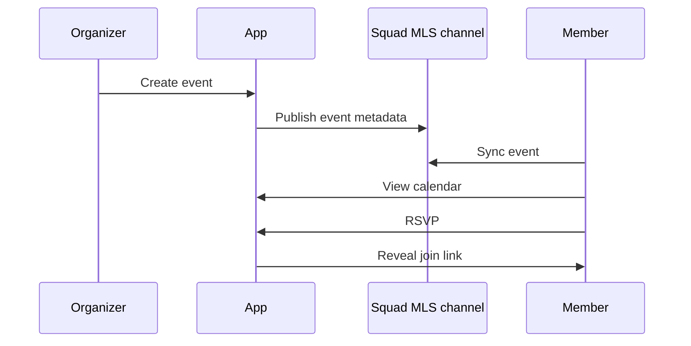
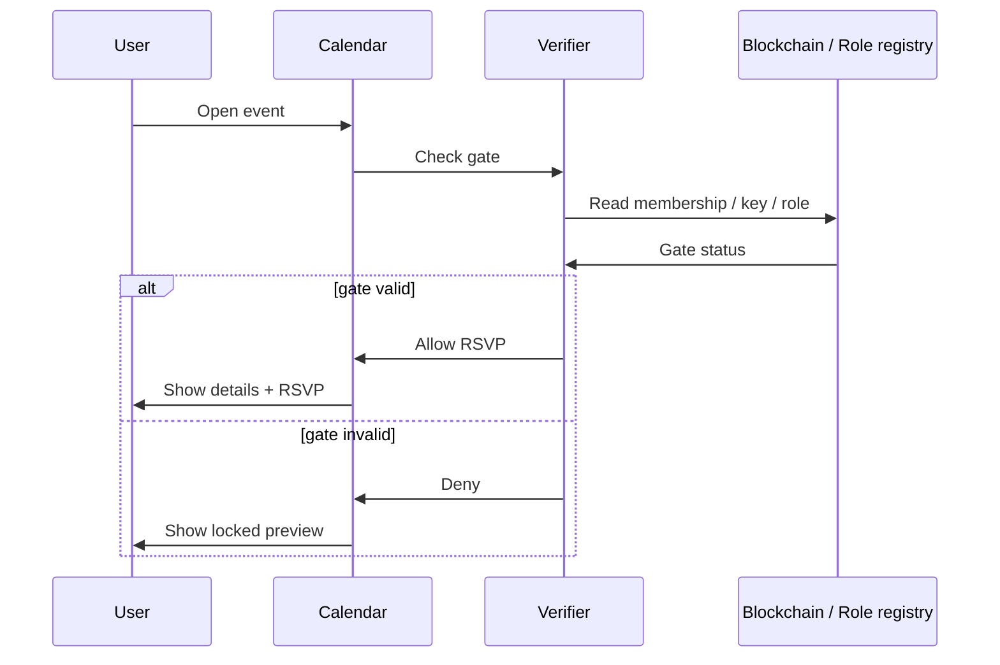

# Unlock Calendar: Phased Design RFC

## Summary

This RFC proposes a calendar feature for Pacto that lets squads and networks coordinate events without leaving the app. The first phase ships a simple, membership-gated calendar that solves the immediate copy-paste coordination problem. Later phases add NFT/role-based gating via Unlock Protocol and Hats, and finally a public discovery layer for cross-community events.

## Problem Frame

Today, Pacto communities coordinate events by hand. Organizers copy event details and links into external messaging platforms, and attendees rely on whoever happens to see the message. This leads to:

- **Fragmented discovery:** events are scattered across Signal, Telegram, Discord, and email.
- **Lost RSVPs:** there is no shared place to see who is attending.
- **Leaked links:** a meeting link posted in a chat can be forwarded to anyone.
- **No gating:** events cannot be limited to members, NFT holders, or specific roles.

A calendar inside Pacto would centralize discovery, make attendance auditable, and respect the access boundaries that already exist across squads.

## Goals

1. Replace the manual copy-paste event loop with a shared calendar.
2. Gate events by the same membership model that already exists in Pacto.
3. Eventually support NFT and role-based gating for paid or exclusive events.
4. Defer public global discovery until moderation and trust tools are in place.

## Proposed Approach

We will build the calendar in three phases. Each phase is usable on its own, so the product can learn before committing to the next.

## Key Concepts

- **Event:** a time-bounded item with a title, description, location/link, and visibility.
- **Gate:** the requirement a user must meet to see details, RSVP, or join.
- **RSVP:** a member's response to an event (e.g., Going, Not Going, Maybe).
- **Access token:** a unique, time-bound, revocable token that grants entry to the event link or channel.

## Phase 1: Squad Calendar

What we can build now, using the membership and sync infrastructure that already exists.

### What is in scope

- Any member of a squad or network can create an event.
- Events are visible to members of that squad or network.
- Private events are hidden from non-members.
- Public events within the squad are visible to members but not globally discoverable yet.
- Members RSVP.
- Join links are revealed only to RSVP'd members.
- Squad admins can remove or hide events.

### What it uses

- **Membership:** the existing squad/network membership in SQLite/MLS.
- **Sync:** event metadata replicates through the parent squad's MLS announcements channel.
- **Wallet:** none yet.

### Outcomes

- Organizers stop copy-pasting event links.
- Members can see all their squad events in one place.
- Attendance is trackable.

### Data flow

## Phase 2: Token & Role Gating

Once the membership-only calendar is working, we add new gate types.

### What is in scope

- Three gate types:
  - **Squad/network membership:** existing Phase 1 gate.
  - **Hats role:** a specific on-chain role within the squad.
  - **Unlock Protocol lock:** a smart contract that sells or grants access NFTs.

- Gate verification happens at RSVP time and again at attendance time.
- Losing the gate after RSVPing invalidates the RSVP or access token.

### What it uses

- **Hats Protocol:** existing on-chain role data.
- **Unlock Protocol:** new integration to read lock and key state.
- **Wallet:** backend signing via Tauri for key purchases or claims.

### Gate verification flow

## Phase 3: Public Discovery

Only after moderation and trust tools are in place.

### What is in scope

- A global calendar view that surfaces public events across Pacto.
- Search and filtering by topic, squad, or network.
- Reporting and rate limiting for member-created public events.
- Platform or network-level moderation.

### What is out of scope for this phase

- General-purpose event marketplace.
- NFT resale or ticket scalping features.
- External calendar subscriptions (ICS, Google, Outlook).

## Risks & Dependencies

| Risk | Mitigation |
|---|---|
| No existing calendar or NFT infrastructure | Phase 1 uses only existing membership and sync; Unlock is deferred. |
| Unlock integration requires wallet signing | Verify backend signing supports on-chain transactions before Phase 2. |
| Public events invite spam/abuse | Defer public discovery until moderation is designed. |
| Gate checks could be client-side and forged | Verify gates server-side or on-chain at RSVP and attendance. |
| Event metadata sync may not fit MLS payloads | Validate payload size and frequency during Phase 1. |

## Open Questions

- What moderation tools are needed for member-created public events?
- Who pays for Unlock lock creation and on-chain key verification?
- Should events support recurring schedules?
- How do we handle link/channel leakage for high-stakes private events?

## Appendix: Origin & Review

This RFC is derived from `docs/brainstorms/2026-07-02-unlock-calendar-requirements.md` and incorporates the findings of a multi-persona document review. The strongest feedback was to start with membership-only gating, defer NFT/role gating until the core calendar is proven, and defer public global discovery until moderation is solved.
