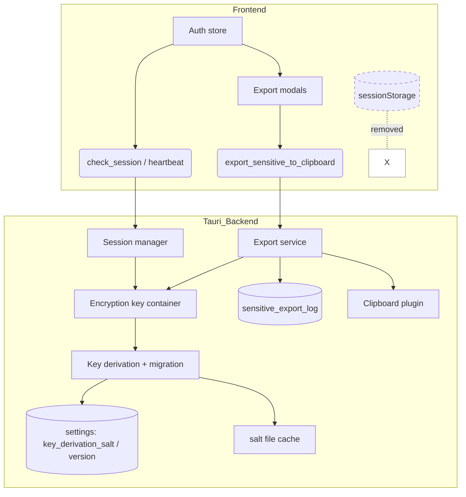
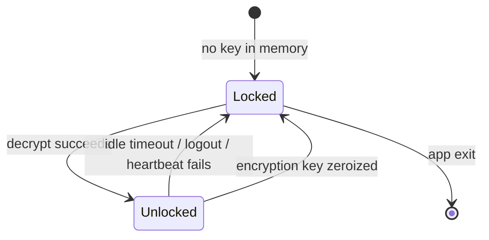

# Security Review Hardening: Per-Device Salt, Backend Session Check, and Clipboard-Mediated Key Export

## Summary

Replace the hard-coded Argon2 salt with a per-device random salt and migrate existing accounts in place. Remove the frontend `sessionStorage` unlock flag and replace it with a backend session check plus idle auto-lock. Move EVM private-key, Nostr nsec, and BIP-39 seed-phrase exports to a backend-mediated clipboard flow that never exposes the secret to the webview, clears the clipboard after 90 seconds, and logs every attempt.

---

## Problem Frame

A security review of the alpha codebase identified four unresolved local-device security issues:

1. **Hard-coded Argon2 salt.** `hash_pass` in `src-tauri/src/crypto.rs` uses the literal `vectovectvecvevpacto` for every device and account, so identical PINs produce identical keys across all installations.
2. **Client-side session unlock flag.** `src/stores/auth.ts` stores `pacto_session_unlocked` in `sessionStorage` and uses it to recover from partial unlocks or HMR, which a script could manipulate.
3. **Plaintext key export.** The backend returns the raw EVM private key, nsec, and seed phrase as strings to the webview, where they live in JavaScript memory and are displayed on screen.
4. **Unresolved random-salt migration.** A TODO in `src-tauri/src/crypto.rs` notes that a random on-disk salt should be created at first init, but no migration path exists.

These are local-device concerns; they do not affect the Nostr/MLS or EVM protocols themselves. The product has not shipped a public alpha, so the plan can break old behavior rather than maintain compatibility shims.

---

## Requirements

### Salt and key-derivation hardening

- R1. The backend uses a cryptographically random, per-device salt for Argon2 key derivation for new accounts.
- R2. The salt is stored in the account's SQLite `settings` table (`key_derivation_salt`) with a `key_derivation_version` marker (`1` for legacy hard-coded salt, `2` for random salt). The salt is also mirrored to a restricted-permission file on disk as a redundant cache.
- R3. Existing accounts created with the hard-coded salt can still be unlocked after the change.
- R4. On the first successful unlock after the change, an existing account is migrated: the backend validates the PIN by decrypting a sentinel value with the legacy key, then decrypts and re-encrypts each encrypted row with the new salt-derived key, one row per transaction.
- R4a. When the migration completes successfully, the backend emits a `migration_complete` event and the frontend shows a brief toast such as "Account security updated."
- R5. If the migration is interrupted, the account remains recoverable with the legacy salt path until the migration completes successfully. On the next unlock, the migration retries from the beginning.
- R6. After migration completes successfully, the backend strictly refuses to use the legacy hard-coded salt for that account. If the salt or version marker is missing or tampered with, the user must restore from their BIP-39 recovery phrase.
- R7. The legacy hard-coded salt path is deprecated and will be removed in v0.5.0.

### Session unlock state

- R8. The frontend no longer relies on a `sessionStorage` flag to determine whether the session is unlocked.
- R9. The frontend asks the backend for the current session state on startup, on app focus/resume, and before every sensitive command.
- R10. The backend reports the session as unlocked only when the encryption key is present in memory.
- R11. When the backend reports the session as not unlocked, the frontend drops its authenticated state and returns to the full-screen unlock screen.
- R11a. Every sensitive backend command verifies session state independently at the start of its handler before acting, closing the check-then-act race with the frontend pre-flight.
- R12. The encryption key is stored in a secret-managed container that supports zeroization and memory locking. The key is cleared from memory on logout and on auto-lock.
- R13. The session auto-locks after a configurable idle timeout (default 15 minutes). The key is cleared from memory when auto-lock fires.

### Sensitive key export

- R14. The backend exposes EVM private-key, nsec, and seed-phrase exports only through a command that returns metadata, not the raw secret.
- R15. The backend requires PIN re-entry before exporting a key.
- R16. The backend applies exponential backoff to repeated export attempts from the same account.
- R17. The backend writes the exported secret directly to the system clipboard from the native layer.
- R18. The backend clears the clipboard 90 seconds after the export, unconditionally.
- R19. The backend clears the clipboard on app shutdown and on startup if a persisted uncleared-export flag indicates a previous run left the clipboard with a secret.
- R20. The frontend shows a confirmation modal before the backend writes the key. The modal warns that clipboard managers, OS clipboard history, and cross-device clipboard sync may still capture the secret.
- R21. The frontend removes any code that currently receives or displays the raw secret string.
- R22. The backend logs each export event with a timestamp, the exported account/secret type, and the account identifier in a per-account SQLite table.
- R23. The export flow supports cancellation and error states: if the user cancels, the backend never touches the clipboard; if an error occurs, the backend logs the failure and ensures the clipboard is not left with the secret.

---

## Key Technical Decisions

- **Salt source of truth is the `settings` table.** The `key_derivation_version` setting is authoritative. A redundant on-disk salt file with restricted permissions (0600 on Unix, protected on Windows) is a cache only; if it disagrees with the database, the database wins and the cache is rewritten.
- **Migration retries from the beginning on each unlock.** A failed or interrupted migration leaves the version marker at `1`. On the next successful unlock, the engine scans every encrypted row again, decrypts with the legacy key if it cannot decrypt with the new key, and re-encrypts with the new key. Only when the entire scan succeeds does the version move to `2` and the legacy path become unavailable.
- **Encryption key moves from `OnceCell<[u8; 32]>` to a `zeroize`/`secrecy` container.** The container calls `Zeroize` on drop and attempts memory locking (`mlock` or platform equivalent) on desktop. `secrecy` prevents accidental `Debug`/`Clone` exposure and gives a single `expose_secret` borrow point. Mobile targets degrade gracefully. The session check is a UX guard, not a defense against memory extraction.
- **Backend session check replaces the `sessionStorage` flag.** `src/stores/auth.ts` removes `SESSION_UNLOCKED_KEY`. The frontend polls `check_session` on startup, on focus/resume, and before sensitive commands, and listens for the `session_locked` event. This removes a client-side trust boundary that a script could manipulate.
- **Idle auto-lock is backend-driven; the frontend heartbeat is a UX convenience only.** A tokio timer in the backend clears the encryption key after the idle timeout. The frontend resets the timer with a lightweight heartbeat during user activity and on every sensitive command. The timer source of truth stays in the Rust layer; heartbeat resets are a UX convenience to keep frontend state in sync, not a security control.
- **Generic backend export command for all secret types.** One Tauri command accepts a type discriminator (`evm`, `nostr`, `seed`) instead of three per-type commands. This keeps the sensitive fetch, audit, and clipboard logic in one place, reduces the surface that can accidentally return a secret, and makes the 90-second clear timer and backoff easier to reason about.
- **Exponential backoff is computed from the per-account audit log.** Counting recent attempts from `sensitive_export_log` gives a per-account, cross-session backoff without inventing new state. The audit log is already required for R22, so reusing it for backoff keeps the design small and avoids a separate in-memory map that would reset on app restart.
- **Secrets never enter the webview.** The export command returns only metadata (exported type, account identifier, cleared-at timestamp). `EvmAccountKeyExportModal.svelte` and `ExportAllSecretsModal.svelte` remove the `privateKey`/`bundle` plaintext state and no longer display secrets on screen.

---

## High-Level Technical Design

### Component architecture

### Session state machine

### Salt migration flow on unlock

1. Backend reads `key_derivation_version`. If `2`, proceed with normal unlock.
2. If not `2`, derive the legacy key from the hard-coded salt.
3. Decrypt the sentinel value with the legacy key; if it fails, reject the PIN. Then set the active encryption key to the new salt-derived key (generating the pending salt if needed), while retaining the legacy key separately for re-encrypting any rows that still require it.
4. If no pending salt has been generated for this account while `key_derivation_version=1`, generate a new random salt, derive the new key, and persist salt + version marker. Otherwise, reuse the existing pending salt and derive the key from it.
5. For each encrypted row (`pkey`, `evm_pkey`, `seed`, `evm_accounts.imported_enc`, `squad_bot_secret.encrypted_nsec`, and encrypted `events`/`messages` content), attempt decryption with the new key; if that fails, decrypt with the legacy key and re-encrypt with the new key. One row per transaction.
6. Validate the sentinel with the new key and update `key_derivation_version` to `2`.
7. Emit `migration_complete`; frontend shows a toast.

### Sensitive export sequence

1. Frontend shows a confirmation modal with the clipboard warning.
2. User confirms and enters PIN.
3. Frontend invokes `export_sensitive_to_clipboard` with the secret type and optional account id.
4. Backend checks session, checks backoff from the audit log, validates the PIN, and logs the attempt.
5. Backend fetches the secret, writes it to the clipboard via the Tauri plugin, and starts a 90-second clear timer.
6. Backend returns metadata. Frontend displays "Copied to clipboard. It will be cleared in 90 seconds."
7. On timeout, the backend clears the clipboard.
8. On cancellation or error before step 5, the backend never writes to the clipboard and logs failures.

---

## Scope Boundaries

- **In scope:** Argon2 salt hardening and migration; backend session check; auto-lock; memory hardening for the encryption key; backend-mediated clipboard export for EVM, nsec, and seed phrase; export audit logging; export confirmation and backoff.
- **Deferred for later:** File-based export of private keys; exclusion from OS clipboard history; configurable clipboard timeout; PIN policy changes (length, complexity); migration telemetry; standalone threat model document.
- **Outside this product's identity:** Independent third-party security audit; multi-device database portability beyond the BIP-39 recovery phrase; changing the encryption algorithm from ChaCha20-Poly1305.

---

## Risks & Dependencies

- **Migration interruption.** If the app crashes during migration, some rows may be encrypted with the new key and others with the old key. The retry-from-the-beginning strategy handles this because each row is tried with the new key first; however, a large account with many encrypted rows could take noticeable time. Keep the scan bounded to known encrypted columns and avoid locking the UI.
- **Clipboard plugin failures.** Tauri v2's clipboard plugin may fail on some platforms or when the app lacks focus. The export command must surface failures clearly and never leave a partially copied secret in the clipboard.
- **Memory locking availability.** `mlock` and equivalents may not be available on all desktop targets and may degrade gracefully on mobile. The plan treats memory locking as best-effort; the primary defense is that the secret is never sent to the webview.
- **Dependency additions.** `zeroize` and possibly `secrecy`/`libc` are added to `src-tauri/Cargo.toml`. These are small, widely used crates in the Rust cryptography ecosystem.
- **Legacy path removal in v0.5.0.** A future plan will remove the hard-coded salt path once all existing accounts have migrated. This plan must keep the legacy path intentionally available and clearly marked.

---

## System-Wide Impact

- **Auth boundary moves entirely to the backend.** `src/stores/auth.ts` no longer stores a session flag in `sessionStorage`, and the unlock screen is the single source of truth for whether the user can use authenticated features. Any frontend code that gates on `isAuthenticated` or `isLoggedIn` will now rely on a backend-checked session that can expire at any time.
- **Sensitive command entry points must check session before acting.** Commands such as `export_sensitive_to_clipboard`, `sign_evm_hash`, `message`, and squad-admin write paths need a lightweight session guard. If a command is added later without the guard, it becomes a stale-session bypass.
- **Encryption key lifecycle touches logout, auto-lock, and migration.** The key is set during `decrypt`, cleared during `logout` and auto-lock, and must remain valid through the migration scan. Any future code that replaces the `ENCRYPTION_KEY` global must also update `session.rs` and the migration engine.
- **Migration creates mixed-key ciphertext temporarily.** During migration, a crash can leave some rows encrypted with the new salt-derived key and others with the legacy key. Until `key_derivation_version=2`, the migration retry path must be able to decrypt with either key, and no new feature should write encrypted data without first completing the migration.
- **Clipboard export is now a global backend service.** The 90-second clear timer and the audit log must survive across multiple frontend invocations and modal instances. A second export cancels the previous timer, so the service must keep a single active timer handle.
- **Local storage loses one auth key.** `sessionStorage` no longer contains `pacto_session_unlocked`, so partial unlocks and HMR must recover by asking the backend for session state rather than checking a local flag.

---

## Implementation Units

### U1. Salt storage and version infrastructure

**Goal:** Add the per-device random salt, the `key_derivation_version` marker, and the redundant on-disk salt cache.

**Requirements:** R1, R2, R7.

**Dependencies:** None.

**Files:**
- `src-tauri/Cargo.toml` — add `zeroize` and optional `secrecy`/`libc`.
- `src-tauri/src/account_manager.rs` — extend `SQL_SCHEMA` with `key_derivation_salt` and `key_derivation_version` settings; add `run_migrations` branch to set version to `1` for existing accounts if absent.
- `src-tauri/src/crypto.rs` — add helpers to generate the salt, derive the key from the stored salt, and read/write the redundant salt file with restricted permissions.
- `src-tauri/src/lib.rs` — register any new command helpers.

**Approach:**
- Generate a 32-byte random salt per account at creation.
- Store `key_derivation_salt` and `key_derivation_version` in the `settings` table.
- Mirror the salt to a file next to the SQLite database with 0600 permissions on Unix and `FILE_ATTRIBUTE_HIDDEN`/restricted ACLs on Windows.
- For new accounts, set version to `2` immediately; for existing accounts, the migration branch in `run_migrations` records version `1` if missing.
- Create a small salt-management module that is the only place the salt file is read or written.

**Patterns to follow:**
- `account_manager.rs` already owns the schema and `run_migrations` pattern; follow the existing `storage_version` migration branches.
- Use `rusqlite` and `std::fs` for file writes; use the same profile-directory helpers as `account_manager.rs`.

**Test scenarios:**
- Happy path: new account has `key_derivation_version=2`, a random salt in `settings`, and a matching salt file with restricted permissions.
- Edge case: existing account without the marker gets version `1` via the migration branch.
- Edge case: salt file missing or with wrong permissions is regenerated/rewritten from the database.
- Error path: failure to write the salt file does not block account creation; it logs and surfaces as a warning.

**Verification:** A fresh account shows `version=2` and the salt file exists; an existing account shows `version=1` until migrated.

---

### U2. Salt migration engine

**Goal:** Migrate existing accounts from the hard-coded salt to the random salt on the first successful unlock.

**Requirements:** R3, R4, R4a, R5, R6.

**Dependencies:** U1.

**Files:**
- `src-tauri/src/crypto.rs` — add `derive_legacy_key` and `derive_key_from_salt`; add a `KeyDerivation` context.
- `src-tauri/src/lib.rs` — add `migrate_key_derivation` and wire it into the unlock flow after PIN validation.
- `src-tauri/src/db.rs` — add a helper that lists all encrypted rows needing migration.
- `src-tauri/src/account_manager.rs` — ensure the schema and migration branches support the new settings keys.

**Approach:**
- Keep a small encrypted sentinel value in `settings` after the first successful encrypt. If no sentinel exists, use the `pkey` value itself as the sentinel. If neither sentinel nor `pkey` exists, the account must be restored from the BIP-39 recovery phrase.
- On unlock, if version is not `2`, derive the legacy key and decrypt the sentinel to validate the PIN.
- Generate a new salt and new key, persist them, then scan the known encrypted columns:
  - `settings.pkey`
  - `settings.evm_pkey`
  - `settings.seed`
  - `evm_accounts.imported_enc`
  - `squad_bot_secret.encrypted_nsec`
  - `events.content` for encrypted kinds and `messages.content_encrypted` legacy rows
- For each row, attempt decryption with the new key; if that fails, try the legacy key and re-encrypt with the new key. Update one row per transaction.
- After the scan completes, validate the sentinel with the new key and set `key_derivation_version=2`.
- Emit `migration_complete` on success. While the migration runs, the frontend displays a non-blocking indeterminate progress indicator on the unlock screen (e.g., "Upgrading account security..."). The indicator is dismissed and the `migration_complete` toast is shown when the event fires.
- If the migration fails or is interrupted, leave the version at `1` so the next unlock retries from the beginning.

**Technical design:** This is directional guidance, not implementation code. The migration engine should be a single function that accepts the legacy and new key contexts and a row iterator; it returns the number of rows re-encrypted and whether the migration finished.

**Patterns to follow:**
- `account_manager.rs` already handles `run_migrations` and profile-directory logic; use the same transaction patterns.
- `internal_encrypt`/`internal_decrypt` currently cache the key in `ENCRYPTION_KEY`; the migration must be able to use both keys explicitly without mutating the cache.

**Test scenarios:**
- Covers AE2. Existing account with hard-coded salt unlocks, migrates every encrypted row, and ends at `version=2`.
- Covers AE5. Export is blocked before migration completes and allowed after.
- Edge case: partially migrated account (app crash mid-scan) unlocks and retries from the beginning.
- Edge case: row already encrypted with the new key is skipped.
- Error path: wrong PIN fails the sentinel check and aborts migration before any row changes.
- Error path: migration fails mid-scan; `version` stays `1` and the account remains unlockable with the legacy key.

**Verification:** After migration, the old hard-coded salt path is rejected for that account; the sentinel decrypts only with the new key.

---

### U3. Memory-hardened encryption key container

**Goal:** Replace the plain `OnceCell<[u8; 32]>` with a zeroize-backed secret container and best-effort memory locking.

**Requirements:** R12.

**Dependencies:** U1 (for salt key derivation changes).

**Files:**
- `src-tauri/src/lib.rs` — change `ENCRYPTION_KEY` from `OnceCell<[u8; 32]>` to a secret container; add `clear_encryption_key` helper.
- `src-tauri/src/crypto.rs` — update `internal_encrypt`/`internal_decrypt` to borrow from the container; ensure the key is zeroized on logout and auto-lock.
- `src-tauri/Cargo.toml` — add `zeroize` and optional `secrecy`/`libc`.

**Approach:**
- Define a `SecretKey` wrapper that holds a `[u8; 32]` and implements `Zeroize` on drop.
- Use `secrecy::SecretBox` or equivalent to limit accidental exposure and provide `expose_secret` borrow access.
- On desktop, attempt `libc::mlock` when the key is set; on failure, log once and continue.
- On mobile, skip memory locking gracefully.
- Replace direct reads of `crate::ENCRYPTION_KEY.get()` with a helper that returns the key only when present and returns an error otherwise.
- Update logout and auto-lock to call `zeroize()` on the key.

**Patterns to follow:**
- The existing `ENCRYPTION_KEY` global is replaced with a resettable secret container (e.g., `Mutex<Option<SecretBox<[u8; 32]>>>`) that can be set, zeroized, and set again across login/logout cycles.
- The `logout` command in `src-tauri/src/lib.rs` already clears `MNEMONIC_SEED` and `NOSTR_CLIENT`; add explicit key zeroization there.

**Test scenarios:**
- Happy path: key is set on successful decrypt and is present for subsequent `internal_encrypt`/`internal_decrypt` calls.
- Edge case: `Zeroize` runs on drop and clears the memory; a test with a mock allocation can observe the bytes are zeroed.
- Error path: auto-lock zeroizes the key; subsequent `internal_decrypt` returns a session error instead of a decryption error.
- Platform-specific: memory locking is best-effort; the test should not fail if `mlock` is unavailable.

**Verification:** After logout, the key container is empty; after auto-lock, `check_session` reports locked.

---

### U4. Backend session check and idle auto-lock

**Goal:** Provide a backend session state query and auto-lock the session after idle timeout.

**Requirements:** R10, R13.

**Dependencies:** U3.

**Files:**
- `src-tauri/src/session.rs` (new) — session manager, idle timer, heartbeat handling.
- `src-tauri/src/lib.rs` — register `check_session` and `session_heartbeat` commands; clear session on logout.
- `src-tauri/src/crypto.rs` — update decrypt paths to set the key in the session container.
- `src-tauri/tauri.conf.json` — verify no new permissions are needed (commands use existing `core:` IPC only).

**Approach:**
- Create a `SessionManager` struct holding the secret key container and the timestamp of the last activity.
- Expose `check_session` returning `{ unlocked: bool, locked_at?: number }`.
- Expose `session_heartbeat` to reset the idle timer.
- Spawn a tokio task that sleeps for the idle timeout and then zeroizes the key and emits `session_locked`.
- Reset the timer on every heartbeat and on every sensitive command (export, sign, send, etc.).
- Store the timeout as a setting (`session_idle_timeout_ms`, default 15 minutes) and read it at session startup. Add the setting to the schema migration in U1.

**Patterns to follow:**
- Tauri commands are registered in `generate_handler!` in `src-tauri/src/lib.rs`.
- Backend events are emitted via `AppHandle::emit`; frontend listens via `src/lib/app/tauri-subscriptions.ts`.

**Test scenarios:**
- Covers AE4. After the key is zeroized, `check_session` returns `unlocked=false`.
- Happy path: `session_heartbeat` resets the timer and `check_session` remains `unlocked=true`.
- Edge case: multiple heartbeats do not start multiple timers; only one auto-lock timer is active at a time.
- Error path: logout clears the session and the timer immediately.
- Integration scenario: a sensitive command resets the timer so that active use does not trigger auto-lock.

**Verification:** Leaving the app idle for the timeout causes the frontend to receive `session_locked` and show the unlock screen.

---

### U5. Frontend session check

**Goal:** Remove the `sessionStorage` unlock flag and replace it with the backend session check.

**Requirements:** R8, R9, R11.

**Dependencies:** U4.

**Files:**
- `src/stores/auth.ts` — remove `SESSION_UNLOCKED_KEY`, `markSessionUnlocked`, `clearSessionUnlocked`, `hasSessionUnlockedFlag`, and `clearStaleAuthSession`; add `checkSession` and heartbeat wiring.
- `src/lib/api/auth.ts` — add typed wrappers for `check_session` and `session_heartbeat`.
- `src/lib/app/tauri-subscriptions.ts` — handle `session_locked` event.
- `src/routes/+page.svelte` — call `checkSession` on mount and on window focus/resume.

**Approach:**
- On app startup, after `checkAuthStatus` resolves, call `check_session` to decide whether to show the unlock screen or stay authenticated.
- On `window.focus`, `visibilitychange`, and `resume` events, call `check_session`.
- Before every sensitive command (send message, sign transaction, export key), call `check_session` and abort if locked. Every sensitive backend command must independently verify session state at the start of its handler to close the check-then-act race.
- On `session_locked`, set `isAuthenticated=false` and `currentUser=null` and navigate to the unlock screen. Persist in-progress message drafts, form input, and other transient UI state in npub-scoped localStorage so they are restored after the user re-authenticates.
- Remove all `sessionStorage` usage for auth state; localStorage remains for npub-scoped UI state only.

**Patterns to follow:**
- `src/stores/auth.ts` already uses `writable`/`derived` stores and `$:` reactivity; keep the same pattern.
- `getInvokeErrorMessage` from `src/lib/utils/tauri-errors.ts` is used for backend error messages.

**Test scenarios:**
- Happy path: after unlock, `check_session` returns `unlocked=true` and the app stays authenticated.
- Covers AE4. Backend reports locked; frontend drops auth state and returns to the unlock screen.
- Edge case: focus/resume triggers a session check even when the frontend believed it was unlocked.
- Error path: `check_session` network/error failure is treated as locked (fail-secure).
- Integration scenario: attempting to send a message while the backend session is locked prompts the user to unlock.

**Verification:** `sessionStorage` no longer contains `pacto_session_unlocked`; the unlock screen appears after idle timeout without a page reload.

---

### U6. Backend-mediated clipboard export

**Goal:** Implement a backend command that exports EVM, nsec, and seed secrets to the clipboard without exposing them to the webview.

**Requirements:** R14, R15, R16, R17, R18, R19, R22, R23.

**Dependencies:** U3, U4.

**Files:**
- `src-tauri/src/export.rs` (new) — export service, audit logging, backoff, clipboard timer.
- `src-tauri/src/lib.rs` — register `export_sensitive_to_clipboard` and `clear_clipboard` commands; clear clipboard on shutdown.
- `src-tauri/src/db.rs` — add `log_sensitive_export` and `list_recent_export_attempts` helpers.
- `src-tauri/Cargo.toml` — ensure `tauri-plugin-clipboard-manager` is already present (it is at 2.3.0).

**Approach:**
- Define a `SensitiveExportType` enum: `EvmAccount`, `NostrNsec`, `SeedPhrase`.
- Define `SensitiveExportResult` with the type, account id, and cleared-at timestamp (now + 90s).
- `export_sensitive_to_clipboard(export_type, account_id, pin)`:
  1. Check session state; fail if locked.
  2. Compute backoff from recent attempts in `sensitive_export_log` for the current account; fail if within the backoff window.
  3. Validate the PIN by deriving the key and decrypting a sentinel.
  4. Log the attempt.
  5. Fetch the secret: EVM key from `resolve_private_key_hex_for_account_id`, nsec from `pkey`, seed phrase from `get_seed`.
  6. Write the secret to the clipboard via `tauri_plugin_clipboard_manager::writeText`.
  7. Start a tokio task that clears the clipboard after 90 seconds and cancels the timer if another export overwrites the clipboard.
  8. Return metadata only.
- On cancellation before step 6, do not touch the clipboard.
- On error, log the failure and attempt to clear the clipboard if it was written.
- Add `sensitive_export_log` table with columns: `id`, `account_npub`, `export_type`, `attempted_at` (epoch seconds), `success` (boolean), `error_code` (optional). Create an index on `(account_npub, attempted_at)`. Retain entries for 90 days for successes and 30 days for failures, pruning older rows before each backoff query.
- On app shutdown, clear any active clipboard timer and the clipboard if an export is still pending. On startup, check the persisted uncleared-export flag and clear the clipboard if it is set.

**Backoff policy:** base delay 1 second, doubling on each consecutive attempt, capped at 5 minutes. Count attempts in a rolling 10-minute window; after a quiet window of 10 minutes, reset the backoff to base. Prune audit-log entries older than 90 days for successes and 30 days for failures before each query.

**Technical design:** This is directional guidance. The export service should be a small module with no frontend-facing secret strings. The clear timer uses `tokio::time::sleep` and an `Arc<AtomicBool>` cancellation flag.

**Patterns to follow:**
- `wallet_err_json` / `wallet_err_json_with_tx_hash` from `src-tauri/src/evm/rpc/` for structured error returns, or plain `String` errors if no tx hash is involved.
- `tauri_plugin_clipboard_manager` is already initialized in `src-tauri/src/lib.rs`.

**Test scenarios:**
- Covers AE3. Export to clipboard; after 90 seconds the clipboard is cleared.
- Happy path: EVM export returns metadata, not the key; clipboard contains the key.
- Happy path: nsec and seed exports follow the same flow.
- Edge case: a second export cancels the previous 90-second clear timer and starts a new one.
- Edge case: backoff delay increases with repeated attempts and resets after a quiet window.
- Error path: cancellation before writing leaves the clipboard untouched.
- Error path: clipboard write fails; the error is logged, no secret is returned, and the clipboard is cleared if partially written.
- Integration scenario: export attempt when the session is locked fails before validating the PIN.

**Verification:** A successful export logs an entry in `sensitive_export_log` and the clipboard contents are cleared after 90 seconds; the frontend never receives the secret string.

---

### U7. Frontend export modals

**Goal:** Update the export UI to use the backend clipboard flow and remove plaintext secret display.

**Requirements:** R20, R21.

**Dependencies:** U6.

**Files:**
- `src/components/settings/EvmAccountKeyExportModal.svelte` — remove `privateKey` state and copy button; add confirmation step; call backend export command; show success message.
- `src/components/settings/ExportAllSecretsModal.svelte` — remove `bundle` plaintext and reveal toggles; call backend export per secret; show per-secret success messages.
- `src/lib/api/auth.ts` — remove `exportEvmAccountKeyPlaintext` and `exportRecoveryPhrase` plaintext wrappers; add `exportSensitiveToClipboard` wrapper.
- `src/lib/wallet/clipboard-copy.ts` — keep it for non-secret copy (addresses); do not use it for secrets.

**Approach:**
- Replace the two-phase `pin -> key` flow with an explicit modal state machine: (1) confirmation with clipboard-risk warning and Cancel/Continue, (2) PIN entry with back navigation, (3) loading state while the backend validates the PIN and writes to the clipboard, (4) success state showing "Copied to clipboard. It will be cleared in 90 seconds.", (5) error state with a non-secret-revealing message.
- In the confirmation screen, show the warning that clipboard managers, OS history, and cross-device sync may capture the secret.
- After PIN entry, call `exportSensitiveToClipboard` and show "Copied to clipboard. It will be cleared in 90 seconds." if the backend returns metadata.
- Remove any on-screen display of the raw secret, including the reveal toggle and the copy-to-clipboard button that receives the plaintext.
- For "Export all", make separate backend calls for nsec, seed, and each EVM account, but serialize them so the next export only starts after the previous export's 90-second clear timer fires; the backend logs each independently.

**Patterns to follow:**
- Use `portal`, `showToast`, and `getInvokeErrorMessage` as the existing modals do.
- Keep the PIN input and validation UX identical to minimize user-facing change.

**Test scenarios:**
- Covers R20. The confirmation modal displays the clipboard-warning copy before the PIN step.
- Happy path: user confirms, enters PIN, and the backend command is invoked with the correct export type.
- Edge case: cancellation before the backend command closes the modal without touching the clipboard.
- Error path: backend error shows a user-friendly message without revealing the secret.
- UI state: no plaintext secret, no reveal toggle, no `navigator.clipboard.writeText` for secrets.

**Verification:** The modal never holds the raw secret string in JavaScript state; successful export shows a clipboard-cleared-in-90s message.

---

### U8. Migration gate for sensitive operations

**Goal:** Block sensitive operations until the account has migrated to the random salt.

**Requirements:** R6 (partial), AE5.

**Dependencies:** U2, U4.

**Files:**
- `src-tauri/src/lib.rs` — add `check_key_derivation_version` command; add a guard used by sensitive commands.
- `src-tauri/src/export.rs` — apply the guard before export.
- `src/lib/api/auth.ts` — add `checkKeyDerivationVersion` wrapper.
- Frontend call sites for sensitive commands (export, squad creation, etc.) — check the version and prompt for unlock if needed.

**Approach:**
- Add a small guard function that returns an error if `key_derivation_version` is not `2`.
- Apply the guard to `export_sensitive_to_clipboard` and squad-admin write commands, matching the scope of origin AE5.
- On the frontend, if the guard returns an error, show a modal or inline message such as "Account security must be updated. Unlock to continue" with a primary action that opens the unlock screen. After the user unlocks and migration completes, automatically retry the original command.
- Keep the guard lightweight; it only reads the `settings` table.

**Patterns to follow:**
- Existing commands already return `Result<T, String>`; the guard can return a clear string like "Account security must be updated. Unlock to continue."

**Test scenarios:**
- Covers AE5. Export is blocked before migration and allowed after.
- Edge case: an account at version `1` can still unlock and complete the migration; only sensitive operations are blocked.
- Integration scenario: the frontend unlocks the account, migration runs, and the blocked operation can be retried.

**Verification:** Attempting to export a key on an un-migrated account shows a message directing the user to unlock, not a raw decryption error.

---

### U9. Tests and QA

**Goal:** Add test coverage for the new crypto, session, and export behavior.

**Requirements:** All of the above (verification).

**Dependencies:** U1–U8.

**Files:**
- `src-tauri/src/crypto.rs` — tests for salt derivation, legacy/new key derivation, migration edge cases.
- `src-tauri/src/session.rs` (new) — tests for session state, idle timer, heartbeat.
- `src-tauri/src/export.rs` (new) — tests for backoff calculation, audit logging, clipboard clear timer (mocked clipboard).
- `src-tauri/src/account_manager.rs` — migration branch tests using `open_in_memory()`.
- `src/stores/auth.test.ts` — tests for `sessionStorage` removal and `check_session` behavior.
- `src/lib/api/auth.test.ts` — tests for new export wrapper shapes and removed plaintext commands.
- `src/lib/api/encryption.test.ts` — tests for `clearStoredKey` and load/decrypt expectations.

**Approach:**
- Rust tests use the existing `#[cfg(test)]` modules with in-memory SQLite (`rusqlite::Connection::open_in_memory()`) and execute the minimal schema DDL inline.
- TypeScript tests use the existing Vitest + `vi.mock('@tauri-apps/api/core')` pattern and reset stores in `beforeEach`/`afterEach`.
- Mock the Tauri clipboard plugin in Rust tests to avoid writing to the real system clipboard.
- Add a golden test vector for the legacy salt so that future removal of the legacy path can be verified.

**Test scenarios:**
- Salt/key derivation: new account random salt, legacy salt deterministic, same PIN different salts produce different keys.
- Migration: happy path, interrupted retry, wrong PIN aborts, legacy disabled after completion.
- Session: unlocked after login, locked after timeout, heartbeat resets, locked state drops frontend auth.
- Export: success metadata, backoff growth, audit log entries, cancellation, error cleanup, clipboard clear after 90s.
- Frontend: no `sessionStorage` key, no raw secret in modal state, backend command shapes match the plan.

**Verification:** `cargo test` in `src-tauri` and `pnpm test` pass for the touched modules.

---

## Acceptance Examples

- AE1. New account uses a random salt: given a user creates an account after the change, when the PIN is set, then `key_derivation_version=2` and the salt is random and stored in `settings` and in the redundant salt file.
- AE2. Existing account unlocks after the change: given an account created before the salt change, when the user unlocks with the correct PIN, then the account unlocks and the migration runs transparently, one row at a time, ending at `version=2`.
- AE3. Clipboard clears after 90 seconds: given a user has exported a sensitive key, when 90 seconds pass, then the backend clears the system clipboard.
- AE4. Stale frontend session is dropped: given the frontend is open but the backend no longer has the encryption key in memory, when the frontend checks session state, then the backend reports locked and the frontend returns to the full-screen unlock screen.
- AE5. Sensitive features require migration: given an account has not migrated to the new salt, when the user attempts to export a key or create a new squad, then the backend blocks the operation and prompts the user to unlock and complete the migration.

---

## Sources / Research

- Origin requirements: `docs/brainstorms/2026-07-15-security-review-fixes-requirements.md`
- Current crypto: `src-tauri/src/crypto.rs` — hard-coded salt in `hash_pass`, `internal_encrypt`/`internal_decrypt` using `crate::ENCRYPTION_KEY`.
- Current session flag: `src/stores/auth.ts` — `SESSION_UNLOCKED_KEY` and `markSessionUnlocked`/`clearSessionUnlocked`.
- Current EVM export: `src-tauri/src/evm/evm_accounts.rs` (`export_evm_account_key_plaintext`) and `src/components/settings/EvmAccountKeyExportModal.svelte`.
- Current nsec/seed export: `src/components/settings/EvmAccountKeyExportModal.svelte` and `src/components/settings/ExportAllSecretsModal.svelte` using `loadAndDecryptKey`, `exportRecoveryPhrase`, and `exportEvmAccountKeyPlaintext`.
- Backend command registry: `src-tauri/src/lib.rs` (`generate_handler!`).
- SQLite schema: `src-tauri/src/account_manager.rs` (`SQL_SCHEMA`), `src-tauri/src/db.rs` (`settings` table and `set_seed`/`get_seed`).
- Tauri clipboard plugin: already configured in `src-tauri/Cargo.toml` and `src-tauri/src/lib.rs`.
- Legacy migration pattern: `docs/legacy-fixes/TEMPLATE.md` and `docs/legacy-fixes/CATALOG.md`.
- Architecture and trust model: `docs/ARCHITECTURE.md`, `docs/storage-layout/SQLITE_AND_FILES.md`, `docs/storage-layout/MESSAGE_ENCRYPTION.md`, `docs/audits/README.md`.
- External reference: 1Password clears copied items from the clipboard after ~90 seconds (cited in the origin requirements).
- External reference: Tauri v2 `tauri-plugin-clipboard-manager` exposes `writeText`, `readText`, and `clear` (cited in the origin requirements).

---

## Deferred / Open Questions

### From 2026-07-16 review

- **Retry-from-beginning migration is unbounded and may never complete** — Key Technical Decisions / U2 (P1, adversarial, confidence 75)

  If the app crashes repeatedly mid-scan, the migration may never reach version 2 because every unlock restarts the full scan. The risk section notes that large accounts could take noticeable time, but the plan provides no bound, progress checkpoint, or resumption strategy beyond a full restart.

- **Redundant on-disk salt file lacks a clear threat-model justification** — Key Technical Decisions / U1 (P2, adversarial, confidence 75)

  The plan says the salt file is a redundant cache but does not explain what threat or failure mode it mitigates. It adds cross-platform permission handling and cache-invalidation logic that needs a concrete justification.

- **Legacy salt removal in v0.5.0 assumes all accounts will migrate without telemetry** — R7 / Scope Boundaries (P2, adversarial, confidence 75)

  The plan deprecates the legacy hard-coded salt path for removal in v0.5.0 but defers migration telemetry, so the removal date is not data-driven. Premature removal would lock users out of accounts that have not yet migrated.

- **Audit log tampering undermines export backoff and forensics** — R16 / R22 / U6 (P2, security-lens, confidence 75)

  The exponential backoff and audit trail are stored in the same SQLite database as the encrypted secrets. A local filesystem attacker can truncate or delete the `sensitive_export_log` table to reset the backoff and erase evidence of exfiltration.

- **Accessibility implementation for new security-critical flows is missing** — U5 / U7 (P2, design-lens, confidence 75)

  Users relying on screen readers or keyboard navigation will have a degraded experience because the new unlock-as-single-source-of-truth and clipboard-export flows introduce modals and transitions without focus management, screen-reader announcements, or keyboard navigation requirements.

- **Clipboard-clear countdown and post-clear UI state are undefined** — U7. Frontend export modals (P2, design-lens, confidence 75)

  Users will not know when the clipboard is safe to reuse because the plan only specifies a static success message without deciding whether it counts down, updates to "cleared", or whether the modal auto-closes.