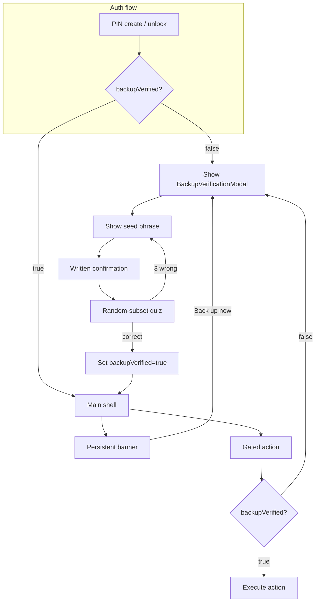

# Verified seed-backup gate

## Summary

Add a progressive, per-account verified seed-backup gate to Pacto. The main shell unlocks after PIN, but seed export, squad creation, squad invite acceptance, treasury operations, and fund sends are blocked until the user writes down their BIP-39 seed and verifies a random subset. DMs and Commons browsing remain available before verification.

---

## Problem frame

Pacto is a self-custody app: one BIP-39 seed powers both the Nostr identity and the embedded EVM wallet. If a user loses the seed, they lose messaging identity and any funds. Today the seed can be exported from Settings before any backup ritual, and risky actions like squad invites, treasury deploys, and fund sends are reachable before any safety check. This is the single catastrophic loss point in the first-run experience.

---

## Requirements

### Backup tracking and prompt

- R1. Persist a `backupVerified` boolean per npub in the per-account store.
- R2. For a fresh account, show the backup prompt after the user completes PIN setup and reaches the main shell.
- R3. For an existing account that is not yet verified, show the backup prompt on the next unlock after this feature ships.
- R4. The backup prompt is dismissible. A dismissed prompt returns on the next unlock or when the user attempts a gated action.
- R5. Display a persistent but dismissible indicator until verification is complete.

### Verification ritual

- R6. The verification flow has three steps: show the full seed phrase, instruct the user to write it down offline, then ask for a random subset of words by their position numbers.
- R7. The random subset uses at least 3 words and covers different positions across the phrase. The exact positions are randomized per attempt.
- R8. If the user enters the subset correctly, mark the account as `backupVerified` and close the flow.
- R9. If the user enters the subset incorrectly, allow up to 3 attempts on the same shown seed, then re-show the full seed and restart the ritual.
- R10. The seed is never displayed again after successful verification except through the existing Settings export flow, which remains gated by the backup check.

### Gated actions

- R11. Before verification, DMs remain fully usable and Commons browsing remains available.
- R12. Before verification, the following actions are blocked and surface the backup gate: viewing or exporting the seed phrase; creating a new squad; accepting a squad invite (including channel-in-squad invites); interacting with squad treasury; sending or moving funds from any wallet.
- R13. The existing seed export modal in Settings must trigger the backup gate before it can reveal the seed; it becomes the post-verification view path, not the first-time backup path.
- R14. Imports with a recovery phrase set `backupVerified` to true and skip the ritual.

### Cross-cutting UX

- R15. The backup prompt and gate use plain, non-technical language that explains why backing up matters, without mentioning `npub`, `nsec`, `MLS`, or `BIP-39` unless the user explicitly navigates to advanced surfaces.
- R16. The flow is keyboard-navigable and accessible: the seed display is readable, word positions are announced clearly, and errors are specific.
- R17. No network calls are required for the backup flow; it operates entirely on local state and the encrypted seed already in memory after PIN unlock.

---

## Key technical decisions

1. **Store `backupVerified` in per-account SQLite via the existing `settings` table.** `src-tauri/src/db.rs` already exposes `get_sql_setting` and `set_sql_setting` commands and the `settings` table is keyed by string. A `backup_verified` key with `"true"`/`"false"` fits the existing pattern and avoids a new schema migration. This satisfies R1 and R17 (no network calls, local SQLite state) and keeps the flag tied to the account directory rather than per-install `localStorage`.
2. **Gate risky actions at the frontend action layer, not inside Rust commands.** The UI will check the `backupVerified` flag before invoking squad, wallet, treasury, or seed-export commands. This preserves DMs and Commons as ungated (R11), avoids touching every Rust command, and matches the self-custody trust model where the app is a client, not an enforceable platform.
3. **Wrap treasury/governance actions in the Svelte components that initiate them, not in `src/lib/governance/api.ts`.** The governance API file is a thin wrapper used by many read-only views. Gating at the button handler keeps read-only queries unaffected and avoids leaking UI concerns into the API layer.
4. **Re-use the existing `get_seed`/`exportRecoveryPhrase` path for the ritual.** The encrypted seed is already in memory after PIN unlock. The backup flow calls the existing export helper to show the phrase, then verifies a random subset locally. No new backend crypto is needed.
5. **Introduce a new `BackupVerificationModal` component for the ritual; keep `EvmAccountKeyExportModal` as the post-verification seed export path.** This satisfies R13: the existing export modal becomes the view users reach after verification, while the first-time ritual lives in its own component with written-confirmation and random-subset steps.
6. **3-word random-subset verification with 3 attempts per shown seed.** This meets the R7 minimum of 3 words, is less tedious than full re-entry, and R9's 3-attempt limit before re-showing the seed gives users room to correct transcription errors without lockouts.
7. **Show the proactive backup prompt on every unlock until verified.** This is the straightforward reading of R3 and R4: existing unverified accounts see the prompt on the next unlock, and a dismissed prompt returns on the next unlock.

---

## High-level technical design

- **State layer:** A frontend Svelte store (`backupVerification`) mirrors the `backup_verified` SQL setting. On login, `loadAccountState` calls `get_sql_setting` to hydrate the store; on logout/clear, the in-memory store resets.
- **Prompt layer:** `Login.svelte` transitions to the main shell only after PIN success. `+page.svelte` checks `backupVerified` after auth becomes true and opens the modal if false. The modal is also opened from gated action handlers.
- **Ritual layer:** `BackupVerificationModal` fetches the seed via `exportRecoveryPhrase`, displays it with a reveal mask, advances to the random-subset quiz, and calls `set_sql_setting` on success.
- **Gate layer:** A reusable helper (`requireBackupVerified`) checks the store and opens the modal. Squad creation, invite acceptance, wallet send, treasury ops, and seed export all call this helper before their real work.

---

## Implementation units

### U1. Backup-verified persistence and state store

- **Goal:** Store `backupVerified` per account in the existing SQLite `settings` table and expose it as a frontend Svelte store.
- **Requirements:** R1, R14, R17.
- **Dependencies:** None.
- **Files:**
  - `src/lib/api/settings.ts` (new) — typed wrappers for `get_sql_setting` / `set_sql_setting`.
  - `src/stores/backup-verification.ts` (new) — `backupVerified`, `loadBackupVerified`, `markBackupVerified`.
  - `src/stores/persistence.ts` — call `loadBackupVerified` from `loadAccountState`.
  - `src/lib/utils/clear-account-state.ts` — reset the `backupVerified` store.
  - `src-tauri/src/db.rs` — no change required; commands already exist.
- **Approach:** Add a frontend wrapper around the existing Rust `get_sql_setting` / `set_sql_setting` commands. The key is `backup_verified`. On `loadAccountState`, after `setCurrentNpubForPersistence`, read the SQL setting and initialize the store. On `clearAccountState`, reset the store to `null`/`false`. The import flow (`loginWithRecoveryPhrase`) will additionally set the flag to `true` (see U4).
- **Patterns to follow:** `src/stores/persistence.ts` for account-state hydration; `src/lib/api/nostr.ts` for typed `invoke` wrappers.
- **Test scenarios:**
  - Happy path: `loadAccountState` with no `backup_verified` setting leaves the store as `false`; with `"true"` leaves it as `true`.
  - Edge case: `clearAccountState` resets the store to `false` / `null`.
  - Error path: missing Tauri context returns a sensible default (`false`) without crashing the auth flow.
- **Verification:** The store reflects the SQL setting immediately after login; clearing account state resets it.

### U2. Random-subset verification utility

- **Goal:** Provide the logic to pick random word positions, check answers, and manage the 3-attempt loop.
- **Requirements:** R6, R7, R8, R9.
- **Dependencies:** U1 (stores the final result).
- **Files:**
  - `src/lib/utils/seed-verification.ts` (new) — pure functions for position selection and validation.
  - `src/lib/utils/seed-verification.test.ts` (new) — unit tests.
- **Approach:** Expose `createChallenge(seedWords: string[], count?: number): { positions: number[]; answers: string[] }` and `checkChallenge(words: string[], positions: number[], inputs: string[]): { correct: boolean; details: { position: number; expected: string; actual: string }[] }`. Keep the function deterministic enough for tests by allowing an optional RNG. The default uses `Math.random` to pick distinct positions. After 3 failed attempts, callers restart the ritual (re-create the challenge from a freshly shown seed).
- **Patterns to follow:** Other pure utility tests under `src/lib/utils/` (e.g., `amount-input.test.ts`).
- **Test scenarios:**
  - Happy path: a 12-word seed produces 3 distinct positions between 1 and 12; matching inputs pass.
  - Edge case: a 24-word seed produces positions within 1–24; all positions are distinct.
  - Error path: one wrong input fails; after 3 wrong attempts the caller re-shows the seed (utility returns the attempt count for the UI to react).
  - Integration scenario: function reports per-word mismatch details so the UI can show "Word #3 does not match".
- **Verification:** Unit tests cover 12-word and 24-word seeds, position distinctness, and mismatch reporting.

### U3. Backup verification modal component

- **Goal:** Build the ritual UI: show seed, ask for written confirmation, quiz random words, and handle 3-attempt re-show logic.
- **Requirements:** R6, R7, R8, R9, R10, R15, R16, R17.
- **Dependencies:** U1, U2.
- **Files:**
  - `src/components/backup/BackupVerificationModal.svelte` (new).
  - `src/components/backup/BackupVerificationModal.test.ts` (new) — optional if component testing exists; otherwise rely on store/util tests.
- **Approach:** Use a three-phase modal: `show` (seed with reveal mask and copy warning), `confirm` (checkbox or button confirming the seed is written down), `quiz` (numbered inputs for the random subset). On success, call `markBackupVerified()` and close. On 3 failures, transition back to `show` with a new seed-derived challenge. Fetch the seed with `exportRecoveryPhrase()` (or `get_seed`) after PIN is already in memory. Use plain language: "Write these 12 words down on paper" rather than BIP-39 terminology.
- **Patterns to follow:** `src/components/settings/EvmAccountKeyExportModal.svelte` for modal shell, reveal mask, and copy behavior; `src/components/ui/Modal.svelte` if available.
- **Test scenarios:**
  - Happy path: user reveals seed, confirms written, enters 3 correct words, modal closes, `backupVerified` becomes `true`.
  - Edge case: user enters 2 wrong words, then correct words on the third attempt; success still sets the flag.
  - Error path: 3 wrong attempts return the user to the seed display with a new challenge.
  - Integration scenario: closing the modal mid-ritual does not change verification state; reopening starts fresh from the prompt.
- **Verification:** Manual and/or unit-test coverage of the phase machine and success/failure transitions.

### U4. Proactive prompt after account creation and unlock

- **Goal:** Trigger the backup modal after fresh account creation and after every unlock for unverified accounts.
- **Requirements:** R2, R3, R4, R14.
- **Dependencies:** U1, U3.
- **Files:**
  - `src/stores/auth.ts` — after `createAccount` and `unlockWithPin`, set a flag/prompt store if `backupVerified` is `false`. Also set `backupVerified` to `true` for recovery-phrase imports.
  - `src/components/auth/Login.svelte` — no change unless a post-login step is needed.
  - `src/routes/+page.svelte` — observe auth + `backupVerified` and open the modal.
- **Approach:** After successful `createAccount` or `unlockWithPin`, once the user is authenticated and `loadAccountState` has run, the main page checks `backupVerified`. If `false`, open `BackupVerificationModal`. For `importAccount`, call `markBackupVerified(true)` immediately after the account is created and skip the modal. For dismiss behavior, closing the modal simply hides it; it will reappear on the next unlock or gated action.
- **Patterns to follow:** Existing `loadAccountState` and auth store flow; post-login toasts (`pendingReadyToast`).
- **Test scenarios:**
  - Happy path: fresh account reaches main shell; modal opens automatically.
  - Happy path: recovery-phrase import reaches main shell; modal does not open and `backupVerified` is `true`.
  - Edge case: existing unverified account unlocks; modal opens.
  - Error path: closing the modal does not mark verified; next unlock reopens it.
- **Verification:** Fresh account shows prompt; import skips; existing unverified account shows prompt on unlock; dismiss returns on next unlock.

### U5. Gated Settings seed export

- **Goal:** Block the existing seed export modal until backup is verified; after verification, the export modal works as before.
- **Requirements:** R12, R13.
- **Dependencies:** U1, U3.
- **Files:**
  - `src/components/settings/ProfileSection.svelte` — wrap the `Export seed phrase` button click.
- **Approach:** Instead of directly setting `exportSeedModalOpen = true`, the button calls `requireBackupVerified()`. If `backupVerified` is `true`, the export modal opens. If `false`, the backup verification modal opens. After successful verification, the export modal can then open (or the user can click the button again). Do not duplicate seed export logic inside the ritual component.
- **Patterns to follow:** Existing `exportSeedModalOpen` toggle and `EvmAccountKeyExportModal` usage.
- **Test scenarios:**
  - Happy path: verified account clicks Export seed phrase; export modal opens.
  - Error path: unverified account clicks Export seed phrase; backup verification modal opens instead.
  - Integration scenario: completing verification from the gate does not automatically open the export modal; user must click again (avoids surprising flow jumps).
- **Verification:** Unverified users cannot see the seed without first completing the ritual.

### U6. Gated squad creation and invite acceptance

- **Goal:** Block new squad creation and all squad invite acceptance paths until backup is verified.
- **Requirements:** R12.
- **Dependencies:** U1, U3.
- **Files:**
  - `src/components/layout/Navbar.svelte` — gate `createSquadWithAnnouncements` / `handleCreateSquad`.
  - `src/lib/invites/accept-invite.ts` — gate `acceptAnnouncementsInvite`, `acceptSquadOrPairInvite`, and `acceptChannelInSquadInvite`.
- **Approach:** At the top of each handler, check `backupVerified`. If `false`, call `requireBackupVerified()` and return early. After successful verification, the user must retry the action (this avoids hanging state and partially-completed squad creation). The same helper is used for consistency with other gates.
- **Patterns to follow:** Existing invite-accept state stores (`acceptingSquadInviteId`, `acceptingChannelInSquadId`) to prevent double-submission.
- **Test scenarios:**
  - Happy path: verified user creates a squad; flow succeeds.
  - Happy path: verified user accepts a squad invite; flow succeeds.
  - Error path: unverified user clicks Create; backup modal opens; cancelling returns to the create form without creating.
  - Error path: unverified user clicks Accept invite; backup modal opens; cancelling leaves the invite pending.
- **Verification:** Verified users can create/accept; unverified users are stopped before any backend call.

### U7. Gated wallet sends and treasury operations

- **Goal:** Block fund sends and treasury interactions until backup is verified.
- **Requirements:** R12.
- **Dependencies:** U1, U3.
- **Files:**
  - `src/components/wallet/WalletHomeSendModal.svelte` — gate `handleConfirm` before `walletBuildAndSendTransaction`.
  - `src/components/wallet/WalletTransferStubModal.svelte` — gate its send confirm handler.
  - `src/components/parent/dashboard/GovernanceDeployCoordinator.svelte` — gate treasury/governance deploy actions.
  - `src/components/parent/governance/GovCrewActions.svelte` — gate mutiny and vote buttons.
  - `src/components/parent/governance/MutinyModulePanel.svelte` — gate mutiny actions.
  - `src/components/parent/dashboard/TreasuryPanel.svelte` or equivalent sponsor deposit/withdraw entry points.
- **Approach:** Wrap the user-facing action handlers with `requireBackupVerified()`. If unverified, show the backup modal and do not proceed. Gate at the button handler, not inside `src/lib/governance/api.ts`, so read-only queries and dashboard rendering remain unaffected. After verification, the user retries the action.
- **Patterns to follow:** Existing wallet send modal error handling and confirmation flow.
- **Test scenarios:**
  - Happy path: verified user sends funds; `walletBuildAndSendTransaction` is invoked.
  - Happy path: verified user creates a treasury proposal; command is invoked.
  - Error path: unverified user clicks Send confirm; backup modal opens and no backend command is called.
  - Error path: unverified user clicks a treasury deploy/vote button; backup modal opens.
- **Verification:** No send, deploy, vote, or execute command is invoked while `backupVerified` is `false`.

### U8. Persistent banner indicator

- **Goal:** Show a dismissible but recurring indicator that the account is not backed up, until verification completes.
- **Requirements:** R5.
- **Dependencies:** U1, U4.
- **Files:**
  - `src/routes/+page.svelte` — mount the banner and wire it to the backup prompt store.
  - `src/components/backup/BackupBanner.svelte` (new) — the banner UI.
- **Approach:** Add a banner at the top of the main shell that renders when `backupVerified === false` and the user is on a non-gated view (DMs/Commons/Squads). The banner can be dismissed per session, but reappears on the next unlock (R4). Include a "Back up now" button that opens `BackupVerificationModal`. Use a non-intrusive color that still signals caution.
- **Patterns to follow:** Existing toast and modal patterns; keep the banner outside the main scroll area so it remains visible.
- **Test scenarios:**
  - Happy path: unverified account sees banner on main shell; clicking "Back up now" opens the modal.
  - Happy path: after successful verification, the banner disappears and does not return.
  - Edge case: dismissing the banner hides it for the current session; it returns on next unlock.
- **Verification:** Banner is visible for unverified accounts, dismissible, and gone after verification.

---

## Scope boundaries

### Deferred for later

- The other six onboarding ideas from issue #85: intent-based first-run router, unified onboarding checklist, invite-accept guided funnel, solo sandbox squad, one-click testnet treasury sandbox, and context-aware empty-state coach cards.
- Advanced backup forms: social recovery, encrypted cloud backup, hardware wallet integration, and multi-share schemes.
- A hard gate that blocks the main shell until backup is verified.
- Cooldowns, lockouts, or rate-limiting on verification attempts.
- Backup verification for accounts imported via nsec-only unlock.

### Outside this product's identity

- Centralized recovery services that hold user keys.
- SMS/email backup reminders that depend on external identity.
- Any form of KYC or identity verification.

---

## System-wide impact

- **Auth and persistence:** `loadAccountState` must hydrate the `backupVerified` flag from SQLite, and `clearAccountState` must reset it. This adds one async call on every login but no network traffic.
- **Shell layout:** A persistent banner is rendered in the main shell when `backupVerified` is `false`. It must be positioned so it does not block the bottom nav, DM composer, or wallet sidebar interactions.
- **Read-only vs. write paths:** The gate only blocks write/initiation actions. Reads such as treasury balances, governance status, and proposal lists continue to render for unverified accounts so users can browse before backing up.
- **Retry UX:** Because gates return early and require the user to retry the action, all affected handlers must reset their loading/acting flags correctly if the backup modal is dismissed.
- **Testing:** Every gated surface needs a test that asserts no backend command is invoked while `backupVerified` is `false`. The most brittle area is treasury governance, where many buttons dispatch to `src/lib/governance/api.ts`.

---

## Risks and dependencies

- **Risk:** Users may confuse the new backup modal with the existing seed export modal. Mitigation: use distinct titles and language in the ritual component ("Back up your account" vs. "Export seed phrase"), and keep the export modal as the post-verification path only.
- **Risk:** Gating at the frontend action layer is bypassable by a determined user or bug. Mitigation: this is acceptable for the first milestone because the threat is self-harm, not external attack; the app is self-custody and the user controls the device. The gate is a safety ritual, not a cryptographic boundary.
- **Risk:** Existing unverified accounts could see the prompt at an inconvenient moment. Mitigation: the prompt is dismissible and DMs/Commons remain usable; it reappears on the next unlock or gated action rather than being modal-only.
- **Dependency:** The existing `get_sql_setting` / `set_sql_setting` commands and `settings` table must remain stable. The commands are already registered and used elsewhere in the app.
- **Dependency:** The seed must be available in memory after PIN unlock via `exportRecoveryPhrase` or `get_seed`. This is already true for the existing Settings export flow.

---

## Acceptance examples

- AE1. Fresh account, user dismisses backup prompt, opens DMs, sends a message. **Covers:** R2, R4, R11.
- AE2. Fresh account, user accepts squad invite, app shows backup gate, user completes verification, invite accept resumes. **Covers:** R12, F3, F4.
- AE3. Existing unverified account, user unlocks, prompt appears, user dismisses, prompt does not reappear until next unlock or gated action. **Covers:** R3, R4.
- AE4. User exports seed from Settings before verification; app shows backup gate instead of revealing seed. **Covers:** R12, R13.
- AE5. User imports with recovery phrase, lands on main shell, no backup prompt appears, gated actions work immediately. **Covers:** R14.
- AE6. User fails random-subset verification twice, succeeds on third attempt. **Covers:** R9.
- AE7. User fails random-subset verification three times, app re-shows seed. **Covers:** R9, F5.

---

## Open questions

### Resolved during planning

- **Persistence backend:** Use the existing `settings` SQL table via `get_sql_setting` / `set_sql_setting`, not frontend `localStorage`. This satisfies per-account persistence while staying local and network-free.
- **UI shape:** Modal for the first-time prompt/ritual, plus a persistent banner indicator. The modal is harder to ignore for the safety ritual; the banner provides a reminder without blocking value.
- **Random-subset size:** 3 words per attempt.
- **Proactive prompt frequency:** On every unlock until verified.

### Deferred to implementation

- Exact visual treatment of the banner (color, wording, position) once implemented in the layout.
- Whether the banner should also appear inside the wallet view or only at the top of the main shell.
- Exact wording for the plain-language seed-backup explanation.

---

## Sources and research

- Origin requirements: `docs/brainstorms/2026-07-18-onboarding-verified-seed-backup-requirements.md`.
- Domain definitions: `CONCEPTS.md` (Verified seed-backup gate, Progressive gate, Backup verified, Random-subset verification).
- Product strategy: `STRATEGY.md` (Trust & safety track; self-custody, no KYC).
- Existing auth flow: `src/stores/auth.ts`, `src/components/auth/Login.svelte`.
- Existing seed export: `src/components/settings/EvmAccountKeyExportModal.svelte`, `src/components/settings/ProfileSection.svelte`.
- Existing settings persistence: `src-tauri/src/db.rs` (`get_sql_setting`, `set_sql_setting`, `settings` table), `src-tauri/src/account_manager.rs`.
- Existing invite flow: `src/lib/invites/accept-invite.ts`, `src/components/layout/Navbar.svelte`.
- Existing wallet send: `src/components/wallet/WalletHomeSendModal.svelte`, `src/lib/wallet/backend-wallet.ts`.
- Existing governance/treasury commands: `src/lib/governance/api.ts`, `src-tauri/src/evm/*`.
- Existing state reset: `src/lib/utils/clear-account-state.ts`.
