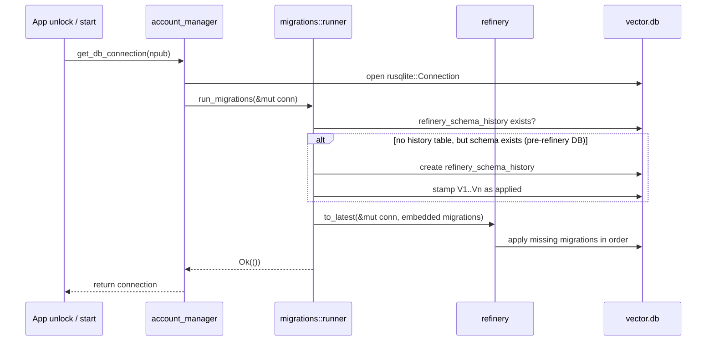

# refactor: adopt refinery for SQLite migrations

## Summary

Adopt [refinery](https://github.com/refinery-rs/refinery) as the single source of truth for per-account SQLite schema migrations in the Rust backend, replacing the hand-rolled `SQL_SCHEMA` + `run_migrations` pair in `src-tauri/src/account_manager.rs` with versioned migration files under `src-tauri/src/migrations/`. New accounts initialize at the latest version, existing accounts are baselined and migrated automatically, and a Rust test verifies an older in-memory schema upgrades cleanly to latest.

---

## Problem Frame

Pacto's per-account SQLite databases (`<app_data_dir>/<npub>/vector.db`) currently use two hand-rolled mechanisms:

- `SQL_SCHEMA` — a monolithic `CREATE TABLE IF NOT EXISTS` block applied when a new account is created.
- `run_migrations` — a procedural function that probes `sqlite_master` and `pragma_table_info` on every connection and applies `ALTER TABLE`, `CREATE TABLE`, and data backfills.

This is already showing strain:

- No ordering guarantee. Idempotent checks make it easy to run a migration before its dependency or to run a data migration twice.
- No versioned ledger. Without a `schema_version` table, conditional data migrations are unsafe and hard to review.
- Hard to test. Migration logic is interleaved with the global connection pool and cannot be exercised as a clean upgrade path in a unit test.
- Blocks feature velocity. Every schema change requires editing both `SQL_SCHEMA` and `run_migrations`, and the reviewer must mentally verify the two paths converge to the same final schema.

Because the app is self-custodial, a missed or duplicated migration can brick an existing account's local database. A migration framework with an embedded ledger and strict ordering removes this class of risk.

---

## Requirements

- R1. **Single source of truth.** The ordered migration set under `src-tauri/src/migrations/` is the only place schema and data migrations for the per-account database are defined.
- R2. **Replace the runner.** `init_profile_database` and `get_db_connection` call the refinery runner instead of executing `SQL_SCHEMA` and `run_migrations`.
- R3. **New accounts start at latest.** A newly created database applies the full migration set and ends at the latest refinery version without using the legacy `IF NOT EXISTS` block.
- R4. **Existing accounts migrate automatically.** An existing account database is migrated to the latest version on the next app unlock or start, with no user action and no data loss.
- R5. **Port and remove legacy logic.** The existing `run_migrations` logic is reconstructed as numbered migration files (V1, V2, …) and then removed from `account_manager.rs`.
- R6. **Migration test.** A Rust test creates an in-memory database at an older schema version and verifies it migrates cleanly to the latest version.

---

## Key Technical Decisions

- **KTD1. Reconstruct the historical migration sequence.** V1 will be the earliest schema state (derived from the current `SQL_SCHEMA` minus the additions made by `run_migrations`), and V2..Vn will be the incremental steps currently in `run_migrations`, preserving dependencies. Existing accounts will be baselined to Vn so refinery only applies future migrations. Rationale: a clean ledger matches the intent of a migration framework; it is also reviewable in git and avoids the current dual-path drift. The alternative — a single V1 that equals the current full schema — would avoid reconstruction but would erase history, making future schema archaeology and review harder.
- **KTD2. Pure schema changes are SQL migrations; data transformations are Rust migrations.** `ALTER TABLE` and `CREATE TABLE` steps become `.sql` files, while messages→events, attachment backfill, squad_safe→parent_treasury_safe copy, and pacto_gov singleton enforcement become Rust migrations. Rationale: SQL migrations are easy to review for schema changes; Rust migrations preserve the existing data transformation logic, error handling, and conditional checks that cannot be expressed safely in plain SQL.
- **KTD3. Baseline pre-refinery databases by stamping the migration history table.** On first refinery run, if `refinery_schema_history` is absent but the database already contains tables (e.g., `settings`), insert history records for V1..Vn without re-running them. Rationale: existing databases already have the schema produced by the historical migration path; re-running those migrations would fail because tables already exist. Checksums should be taken from the embedded migration objects loaded by refinery, not hand-computed, to guarantee that the baseline matches the migration files.
- **KTD4. Keep the `ensure_*` table wrappers in `commons.rs` and `squad_bot.rs` as defensive no-ops during the transition.** Once the migration runner is proven to run before every database access path, remove them in a follow-up. Rationale: minimizes the risk of a code path that bypasses refinery and assumes a table already exists.

---

## High-Level Technical Design

The migration module lives at `src-tauri/src/migrations/`. It exposes a single runner function consumed by `init_profile_database` and `get_db_connection`. SQL migrations are embedded with `refinery::embed_migrations!`; Rust migrations are registered alongside them so refinery sees one ordered set.

---

## System-Wide Impact

- **Connection lifecycle.** The only two entry points that open a per-account database are `init_profile_database` and `get_db_connection`. Both will call the refinery runner, so every Tauri command that uses `get_db_connection` / `return_db_connection` is covered automatically.
- **Connection pool.** WAL mode is still enabled immediately after opening the connection and before migrations run, preserving the current concurrency behavior.
- **Runtime key-derivation migration.** The key-derivation migration in `src-tauri/src/migration.rs` runs after the schema migration. It depends on `settings`, `events`, `messages`, and `evm_accounts` tables, all of which will exist once refinery has run. No changes to that migration's logic are required.
- **Defensive table wrappers.** `crate::commons::ensure_commons_broadcasts_table` and `crate::squad_bot::ensure_squad_bot_tables` are called from several places. During this refactor they remain as no-op wrappers or `CREATE TABLE IF NOT EXISTS` guards. Once the runner is proven to be universal, a follow-up removes them.
- **Tests.** `migration.rs` tests currently build a minimal schema with a private `create_schema` helper or directly reference `SQL_SCHEMA`. These will switch to the refinery migration set, ensuring tests exercise the same code path as production.

---

## Implementation Units

### U1. Add refinery and scaffold the migration module

- **Goal:** Add the `refinery` dependency and create the migration runner module.
- **Requirements:** R1, R2
- **Dependencies:** none
- **Files:**
  - `src-tauri/Cargo.toml` (add `refinery` with `rusqlite` feature)
  - `src-tauri/src/migrations/mod.rs` (new)
  - `src-tauri/src/lib.rs` (register the module)
- **Approach:** Add `refinery` to the crate dependencies. Create `src-tauri/src/migrations/mod.rs` that embeds SQL migrations and exposes a `run_migrations(conn: &mut rusqlite::Connection) -> Result<(), String>` wrapper. WAL mode remains enabled in the connection setup code (`get_db_connection`) before the runner is invoked, matching the current behavior.
- **Patterns to follow:** Use `refinery::embed_migrations!` for SQL files; use `refinery::config::Config` and the runner for the actual migration step. Map refinery errors to `String` errors consistent with the rest of the crate.
- **Test scenarios:**
  - Happy path: an in-memory database runs the migration set and ends with a `refinery_schema_history` table and the expected latest version.
- **Verification:** `cargo check` passes; the new module compiles.

### U2. Port the initial schema and incremental schema changes to SQL migrations

- **Goal:** Convert the current `SQL_SCHEMA` and the schema-only `run_migrations` steps into versioned SQL files.
- **Requirements:** R1, R3, R5
- **Dependencies:** U1
- **Files:**
  - `src-tauri/src/migrations/V1__initial_schema.sql` (new)
  - `src-tauri/src/migrations/V2__messages_wrapper_event_id.sql` (new, example)
  - `src-tauri/src/migrations/V3__profiles_cached_columns.sql` (new, example)
  - ... additional `Vn__*.sql` files for each remaining schema-only step
- **Approach:**
  - V1 is the reconstructed earliest schema: the tables and indexes that predate any `run_migrations` addition. Derive it by removing from `SQL_SCHEMA` every table/column that was added by `run_migrations`.
  - Each subsequent `Vn` is one logical schema-only step from `run_migrations`, in dependency order: table creation, column additions, and index creation. Use plain `CREATE TABLE` and `CREATE INDEX` (no `IF NOT EXISTS`) so refinery owns the ledger.
  - Include tables currently created by `crate::commons::ensure_commons_broadcasts_table` and `crate::squad_bot::ensure_squad_bot_tables` in the migration sequence, not in the initial schema unless they were truly part of V1.
- **Patterns to follow:** Name files `V{version}__{snake_case_description}.sql` with two underscores after the version, matching refinery's convention. Keep each migration focused on one schema change.
- **Test scenarios:**
  - Happy path: a fresh in-memory database applies V1..Vn and has every expected table and column.
  - Edge case: applying the same migration set twice is rejected by refinery rather than silently succeeding (refinery checksums prevent this).
- **Verification:** A new account database opened via `init_profile_database` has the full schema and no errors.

### U3. Port data transformations to Rust migrations

- **Goal:** Convert the data-heavy steps in `run_migrations` into refinery Rust migrations.
- **Requirements:** R1, R4, R5
- **Dependencies:** U1, U2
- **Files:**
  - `src-tauri/src/migrations/VX__messages_to_events.rs` (new, example)
  - `src-tauri/src/migrations/VY__attachments_to_event_tags.rs` (new, example)
  - `src-tauri/src/migrations/VZ__squad_safe_to_treasury.rs` (new, example)
  - `src-tauri/src/migrations/...` additional Rust migrations as needed
- **Approach:**
  - Move each data transformation from `run_migrations` into a Rust migration that implements refinery's `Migration` trait. Keep the existing logic as-is where possible; do not rewrite behavior.
  - Data migrations that depend on a schema state (e.g., the attachment backfill needs the `events` table) are placed after the SQL migration that creates that state.
  - The `pacto_gov` singleton enforcement (dedupe + unique partial index) becomes a Rust migration so it can run the `DELETE` before creating the index.
- **Patterns to follow:** Use `mod_migrations!` or a manual `Migration` implementation per refinery's documentation. Keep error messages prefixed with the migration name for debugging.
- **Test scenarios:**
  - Happy path: a database at the schema version just before a data migration runs the migration and ends in the expected state (e.g., messages copied to events, attachments backfilled).
  - Edge case: an empty database runs the data migration and does nothing because there is no data to transform.
  - Error path: a migration that fails leaves the database unchanged (refinery runs inside a transaction by default).
- **Verification:** Existing account databases open without data loss; newly created databases have the same final state as before.

### U4. Implement baseline detection for existing accounts

- **Goal:** Ensure existing pre-refinery databases do not re-run historical migrations.
- **Requirements:** R4, R5
- **Dependencies:** U1, U2, U3
- **Files:**
  - `src-tauri/src/migrations/mod.rs`
- **Approach:**
  - Before calling `refinery::setup`, check whether `refinery_schema_history` exists. If it does, proceed normally.
  - If it does not exist but `settings` (or another core table) exists, the database predates refinery. Create the history table, compute the checksums for V1..Vn, and insert records marking them as applied with `applied_in` set to the current app version or a sentinel like `baseline`.
  - If neither the history table nor the core tables exist, the database is new; refinery will apply V1..Vn normally.
- **Patterns to follow:** Compute checksums using refinery's SHA-256-of-content algorithm, or load the embedded migrations and read their checksums via refinery's API if available. Wrap the baseline in a transaction so the history table is never written without the rest of the schema being present.
- **Test scenarios:**
  - Happy path: a database created with the current `SQL_SCHEMA` (no refinery history) is opened and ends at the latest refinery version with history stamped.
  - Edge case: a database with only the earliest schema (V1) is opened and migrates through V2..Vn normally.
  - Error path: a corrupted or partial database without history triggers a clear error instead of partial migration.
- **Verification:** The `decrypt_with_password_migrates_legacy_account` test in `migration.rs` still passes after removing `SQL_SCHEMA`.

### U5. Remove `SQL_SCHEMA` and `run_migrations`, wire the refinery runner

- **Goal:** Delete the legacy migration code and route all schema initialization through refinery.
- **Requirements:** R2, R5
- **Dependencies:** U1, U2, U3, U4
- **Files:**
  - `src-tauri/src/account_manager.rs`
  - `src-tauri/src/migrations/mod.rs`
- **Approach:**
  - In `init_profile_database`, replace `conn.execute_batch(SQL_SCHEMA)` and `run_migrations(&conn)` with a single call to the refinery runner.
  - In `get_db_connection`, replace `run_migrations(&conn)` with the refinery runner.
  - Delete the `SQL_SCHEMA` constant, the `run_migrations` function, and any helpers that are only used by it (e.g., `migrate_attachments_to_event_tags`, `migrate_messages_to_events`, `enforce_pacto_gov_singleton_index` once ported to a migration file).
  - Update `src-tauri/src/migration.rs` tests that call `crate::account_manager::SQL_SCHEMA` to use the refinery migration set instead.
- **Patterns to follow:** Use the existing `String` error style. Keep WAL mode enablement in the connection setup code, not in the migration runner.
- **Test scenarios:**
  - Happy path: `init_profile_database` creates a full schema for a new account.
  - Integration: every Tauri command that touches the database still works after the switch.
- **Verification:** `cargo check` passes; the app builds; `cargo test` in `src-tauri` passes.

### U6. Update tests and add migration coverage test

- **Goal:** Adjust existing tests to the new migration system and add a test that verifies an older schema upgrades to latest.
- **Requirements:** R6
- **Dependencies:** U1, U5
- **Files:**
  - `src-tauri/src/migration.rs` (tests)
  - `src-tauri/src/account_manager.rs` (tests)
  - `src-tauri/src/migrations/mod.rs` (tests)
- **Approach:**
  - Replace the `create_schema` helper in `migration.rs` (or the direct `SQL_SCHEMA` reference) with a helper that applies the refinery migration set to an in-memory connection.
  - Update the `migration.rs` test that currently applies `SQL_SCHEMA` directly.
  - Add a new test in `src-tauri/src/migrations/mod.rs` or `account_manager.rs` that:
    1. Opens an in-memory connection.
    2. Applies only V1 (or V1..Vk for some k < n).
    3. Seeds a minimal row of data where relevant.
    4. Runs the refinery runner to latest.
    5. Asserts that `refinery_schema_history` records the latest version and that expected tables/columns exist.
- **Patterns to follow:** Use `rusqlite::Connection::open_in_memory()` and the public migration runner. Match the existing test style for `#[cfg(test)]` modules inside source files.
- **Test scenarios:**
  - Happy path: V1-only in-memory DB migrates to Vn and has all expected tables/columns.
  - Edge case: V2-only in-memory DB migrates to Vn and retains data created at V1..V2.
  - Error path: tampering with a migration file's checksum causes refinery to report a checksum mismatch on the next run.
- **Verification:** `cargo test` in `src-tauri` passes, including the new migration coverage test.

---

## Scope Boundaries

### In scope

- All per-account SQLite schema and data migrations currently in `src-tauri/src/account_manager.rs`.
- The refinery runner and migration file organization under `src-tauri/src/migrations/`.
- Rust and SQL tests that exercise the migration path.

### Out of scope

- The runtime key-derivation migration in `src-tauri/src/migration.rs` (key derivation v1 → v2). It is a data migration, not a schema migration, and stays where it is.
- Frontend persistence or `localStorage` migrations.
- Any non-SQLite state (MLS engine database, on-disk files, etc.).

### Deferred to follow-up work

- Removing the defensive `ensure_commons_broadcasts_table` and `ensure_squad_bot_tables` wrappers once every database access path is proven to run through the refinery runner.
- Auditing and removing any remaining `CREATE TABLE IF NOT EXISTS` calls outside the migration set.
- Adding a CI job that runs the migration test against a fixture database saved at an older schema version.

---

## Risks & Dependencies

- **Baseline checksum mismatch.** If the reconstructed V1..Vn files do not match the exact content refinery expects, the baseline stamp will not match future validation. Mitigation: derive checksums from the embedded migration objects rather than hand-computing them, and verify in the new test.
- **Historical schema reconstruction errors.** V1 is reconstructed from the current `SQL_SCHEMA` rather than from a snapshot of the original first schema. If an old version of the app is opened, the migration path might differ. Mitigation: this is acceptable for the pre-alpha state; once refinery is in place, every future change is a single new numbered file.
- **Defensive wrappers hide missing migrations.** If a code path calls `ensure_commons_broadcasts_table` before `get_db_connection`, the table might be created with the old schema and then conflict with refinery. Mitigation: keep the wrappers as no-ops during this refactor, then remove them in the follow-up.
- **External research unavailable.** The agent-selected external framework research (refinery + rusqlite integration) could not be dispatched because the local environment had no model selected. The plan relies on the refinery crate documentation, the issue's stated assumptions, and local code review. Targeted deepening agents (architecture, data-integrity, repo-research) also failed for the same reason. Mitigation: the implementer should verify the exact refinery API and the baseline checksum strategy against the current crate version and the project's actual connection lifecycle before coding.

---

## Sources & Research

- Issue #113: `refactor: adopt refinery for SQLite migrations so schema changes ship without breaking existing accounts` — primary source for scope, success criteria, and out-of-scope items.
- `src-tauri/src/account_manager.rs` — current `SQL_SCHEMA`, `run_migrations`, and connection lifecycle.
- `src-tauri/src/migration.rs` — runtime key-derivation migration and existing in-memory test patterns.
- `docs/storage-layout/SQLITE_AND_FILES.md` — per-account database layout and migration notes.
- `docs/legacy-fixes/LF-001-evm-address-repair.md` — prior data-repair migration precedent.
- **External research gap.** The agent-selected external framework research (refinery + rusqlite integration) could not be dispatched because the local environment had no model selected. The refinery-specific guidance below is drawn from the crate's documented patterns and should be verified against the version resolved in `Cargo.lock` during implementation.
- refinery crate documentation: `https://docs.rs/refinery/latest/refinery/` — intended source for API details.
- refinery integration patterns: add `refinery` with the `rusqlite` feature; embed SQL files with `refinery::embed_migrations!("src/migrations")`; register Rust migrations via `mod_migrations!` or by implementing the `Migration` trait; run the set with the runner's `to_latest` method on a `rusqlite::Connection`.
