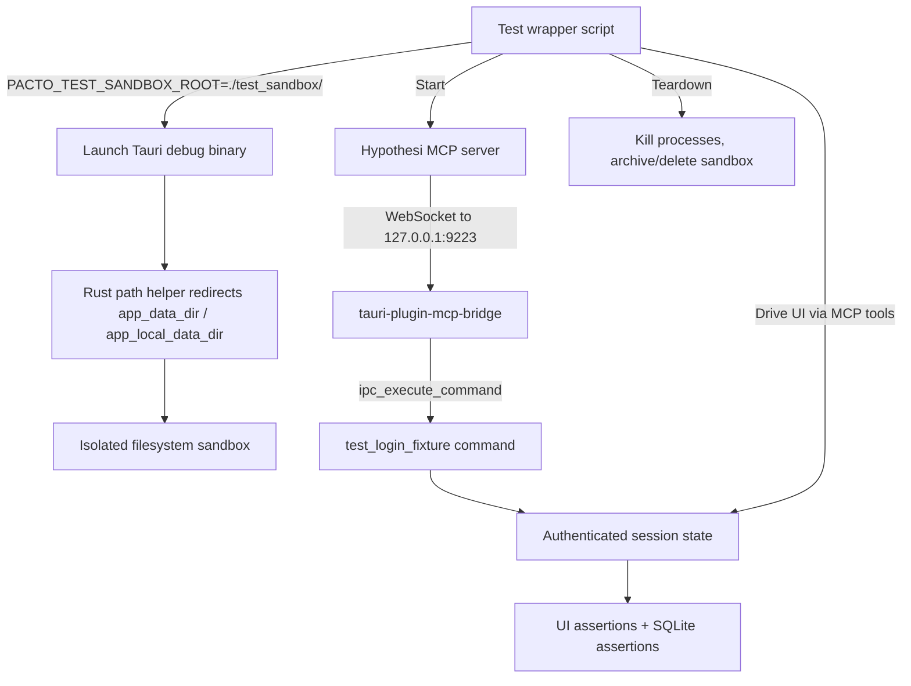

# feat: Add self-correcting AI testing architecture

## Summary

Implement a two-phase testing harness that lets coding agents verify their own changes: a fast browser-only mock build for UI smoke tests, and a real-Tauri harness driven by the Hypothesi MCP server against a sandboxed filesystem.

## Problem Frame

Pacto is a Tauri v2 desktop app whose core behavior depends on local files, a SQLite database, PIN-locked private keys, Nostr relays, and MLS group crypto. Today the only automated tests are Vitest unit tests in a Node environment (`pnpm test`). Coding agents cannot verify presentation-layer or filesystem changes without a human launching the app manually. The result is late regression detection and a human-in-the-loop bottleneck on every agent-assisted change.

This plan adds two complementary harnesses:

- **Phase 1** gives cheap, deterministic feedback on layout, navigation, and component rendering by building a static SPA with a mocked backend and driving it with Playwright.
- **Phase 2** gives real OS-side-effect verification by running the actual Tauri debug binary with its data directory redirected into a throwaway sandbox, driven by the Hypothesi MCP server over the already-installed `tauri-plugin-mcp-bridge`.

## Requirements

### Phase 1: Browser mock harness

- R1. `pnpm build:agent` produces a browser-runnable static SPA.
- R2. The SPA loads without a Tauri backend by intercepting `invoke()` and `listen()` calls and routing them to typed mock handlers.
- R3. Unmocked backend commands return a safe default or throw a clear error, never a runtime panic.
- R4. The browser build completes the existing `isTauri()` fallbacks for clipboard, file picker, notifications, external URLs, and image file URLs.
- R5. One Playwright spec loads the agent build, exercises the login surface, and captures a screenshot.
- R6. The Phase 1 suite runs in CI on every pull request.

### Phase 2: Real-Tauri harness

- R7. A single command builds the debug binary and runs one end-to-end spec.
- R8. Each run uses an isolated `./test_sandbox/<run-id>/` directory and cleans it up afterward.
- R9. A debug-only test-auth command jumps the app into an authenticated state without typing a PIN.
- R10. The first end-to-end spec creates an account, opens a chat, sends a text message, and asserts the message appears in the UI and in the sandboxed SQLite database.
- R11. The harness captures screenshots, Rust logs, and webview console logs into a machine-parseable artifact.
- R12. The harness runs on macOS (primary dev platform) and is portable to Linux/Windows.

### Security and hardening

- R13. The embedded WebDriver/MCP bridge and the test-auth command are gated by `#[cfg(debug_assertions)]`.
- R14. The test-auth command additionally requires `PACTO_ALLOW_TEST_AUTH=1` at runtime.
- R15. `PACTO_TEST_SANDBOX_ROOT` values containing `..` or resolving outside `./test_sandbox/` are rejected.
- R16. CI verifies the release binary does not contain test-auth or MCP-bridge symbols.
- R17. Rust and webview logs are audited for mnemonics, PINs, and private keys before merged logging is enabled.

## Key Technical Decisions

- **Phase 2 driver is Hypothesi MCP server.** The project already installs `tauri-plugin-mcp-bridge` and enables `withGlobalTauri`. Using `@hypothesi/tauri-mcp-server` avoids adding and validating `tauri-plugin-wdio-webdriver`. The tradeoff is less deterministic, script-native test output than WebdriverIO, mitigated by a thin wrapper that calls MCP tools in a fixed sequence and emits JSON/JUnit itself.
- **Phase 1 is a mock, not a real app.** The browser build deliberately replaces the Rust backend with fixtures. It verifies rendering and navigation only; it does not verify crypto, SQLite, or file persistence. This avoids the maintenance trap of reimplementing the backend in JavaScript.
- **Sandbox lives in Rust, not the launcher.** A helper wraps every `app_data_dir()` and `app_local_data_dir()` call and redirects to `PACTO_TEST_SANDBOX_ROOT` when set. This makes isolation hold by construction; a shell script alone cannot guarantee every Rust module respects the override.
- **Test auth is a command, not a UI bypass.** The authenticated state is produced by a debug-gated Tauri command invoked via `ipc_execute_command`, not by typing a PIN into the real login form. Tests that specifically verify PIN entry can still type through the UI.
- **`tauri-app-verify` is deferred.** The standalone generic verification tool is a long-term migration target, not a dependency of this plan. Pacto ships its own lightweight harness first.
- **CI cadence is split.** Phase 1 runs on every PR because it is fast and Linux-friendly. Phase 2 runs on demand or nightly because it needs a Tauri binary, a display, and more setup time.

## Scope Boundaries

### Deferred to Follow-Up Work

- Expanding the Playwright suite beyond one login screenshot spec.
- Expanding the real-Tauri suite beyond the first message-send spec.
- A fully autonomous retry/replan loop in the agent (this plan delivers the feedback artifact, not the retry policy).
- Migrating to the standalone `tauri-app-verify` tool once it is stable.

### Outside This Plan's Identity

- Mobile testing.
- Production notarization, code signing, or distribution as part of the harness.
- Running real Nostr relays, MLS crypto, or on-chain transactions in the browser build.
- Replacing or reducing existing Vitest unit tests or `cargo test` coverage.

## High-Level Technical Design

### Phase 1: Browser mock harness

```mermaid
flowchart TB
  A[Developer or agent] -->|pnpm build:agent| B[Vite build with agent mode]
  B --> C[Static SPA in build-agent/]
  C --> D[Playwright test runner]
  D --> E[Page loads without window.__TAURI__]
  E --> F[invoke() intercepted by mock shim]
  F --> G[Mock registry returns fixtures]
  G --> H[UI renders login screen]
  H --> I[Screenshot artifact]
```

### Phase 2: Real-Tauri harness



## Implementation Units

### U1. Agent build mode (`pnpm build:agent`)

**Goal:** Add a Vite build mode that emits a static SPA suitable for browser-only testing.

**Requirements:** R1, R6

**Dependencies:** none

**Files:**
- `package.json` — add `build:agent` script
- `vite.config.ts` — add agent-mode configuration (or `vite.config.agent.ts`)
- `svelte.config.js` — confirm `adapter-static` fallback works for the agent build
- `src/lib/env/agent.ts` — optional helper to detect agent build at runtime

**Approach:** Create a separate Vite config or use environment variables to toggle the agent build. The output directory should be distinct from the production `build/` directory so `pnpm build` is unaffected. Keep the same SvelteKit adapter-static SPA fallback.

**Patterns to follow:** Existing `vite.config.ts` and `svelte.config.js` static adapter setup.

**Test scenarios:**
- Happy path: `pnpm build:agent` completes and writes files to `build-agent/`.
- Edge case: `pnpm build` still writes to `build/` and is unaffected.
- Integration: serve `build-agent/` and load it in a browser without a Tauri backend.

**Verification:** Running `pnpm build:agent` produces a directory that can be opened with `npx serve build-agent` and displays the login screen.

---

### U2. Mock invoke shim and registry

**Goal:** Intercept `invoke()` and `listen()` calls when `window.__TAURI__` is absent and route them to typed mock handlers.

**Requirements:** R2, R3

**Dependencies:** U1

**Files:**
- `src/lib/api/mock-invoke.ts` — runtime shim for `invoke`
- `src/lib/api/mock-listen.ts` — runtime shim for `listen`
- `src/lib/api/mock-registry.ts` — command-to-fixture mapping
- `src/lib/api/mock-fixtures.ts` — fixture data for auth, profile, chats, wallet
- `src/lib/api/index.ts` — export real `invoke` when in Tauri, mock otherwise

**Approach:** Create a typed registry where each backend command name maps to a function that returns a fixture. When a command is not in the registry, throw a clear error or return a typed default. Use TypeScript generics so the mock signature matches the real `invoke<T>(command, args)` shape. The shim must also handle `listen()` for backend-to-frontend events, likely returning no-ops or replayable fixture events.

**Patterns to follow:** Existing `src/lib/api/auth.ts`, `src/lib/api/nostr.ts` command wrappers and their `vi.mock('@tauri-apps/api/core')` unit test patterns.

**Test scenarios:**
- Happy path: mocked `login` returns a fixture key pair; mocked `get_profile` returns a fixture profile.
- Edge case: unregistered command throws a descriptive error.
- Integration: the login screen renders and the mocked `check_any_account_exists` returns `true`.

**Verification:** The browser build loads, `invoke('login')` returns fixture data, and no Tauri backend is required.

---

### U3. Browser compatibility fallbacks

**Goal:** Complete the existing `isTauri()` fallbacks so the SPA can run in a plain browser without throwing.

**Requirements:** R4

**Dependencies:** U2

**Files:**
- `src/lib/utils/clipboard-copy.ts` — extend browser fallback
- `src/lib/utils/profile.ts` — extend image URL fallback
- `src/lib/wallet/backend-wallet.ts` — confirm balance/summary fallbacks
- `src/lib/evm/advanced-write.ts` — confirm send fallbacks
- `src/lib/app/tauri-subscriptions.ts` — guard `listen` when not in Tauri

**Approach:** Audit every `isTauri()` guard and every direct Tauri API usage. Where the browser can reasonably emulate behavior (clipboard via `navigator.clipboard`, notifications via `Notification`, file URLs via remote URLs), add the fallback. Where it cannot, return a typed "not available in browser" result instead of throwing.

**Patterns to follow:** Existing `isTauri()` guards in `src/lib/wallet/*.ts` and `src/lib/evm/*.ts`.

**Test scenarios:**
- Happy path: copy-to-clipboard works in browser; profile images load from remote URLs.
- Edge case: calling a wallet command in browser returns `{ ok: false, message: '...' }` instead of throwing.
- Integration: no `__TAURI__ is not defined` errors appear in the browser console.

**Verification:** The browser build loads without uncaught exceptions in the console.

---

### U4. Playwright smoke test

**Goal:** Add a Playwright suite with one spec that loads the agent build and captures a screenshot.

**Requirements:** R5

**Dependencies:** U1, U2, U3

**Files:**
- `package.json` — add `@playwright/test` and `playwright test` scripts
- `playwright.config.ts` — configure base URL and artifact output
- `e2e/login.spec.ts` — login surface smoke test
- `e2e/README.md` — brief note on running and debugging the suite

**Approach:** Use Playwright's web server option to serve `build-agent/` before tests. The first spec navigates to the root, asserts the login screen is visible, and saves a screenshot to `test-results/`. Keep the suite minimal; expansion is deferred.

**Patterns to follow:** Existing `package.json` script conventions and Vite static adapter output layout.

**Test scenarios:**
- Happy path: spec loads the page, sees the login heading, and captures `login-screen.png`.
- Edge case: spec fails with a clear message if the build output is missing.
- Integration: running `pnpm exec playwright test` exits 0 and produces the screenshot artifact.

**Verification:** `pnpm exec playwright test` passes locally and in CI.

---

### U5. Phase 1 CI integration

**Goal:** Add a CI job that builds the agent SPA and runs the Playwright smoke test on every pull request.

**Requirements:** R6

**Dependencies:** U4

**Files:**
- `.github/workflows/ci.yaml` — add `e2e-ui` job
- `vite.config.ts` — exclude `e2e/` from coverage thresholds if needed
- `package.json` — ensure test scripts are callable from CI

**Approach:** Add a new job to the existing `ci.yaml` that installs dependencies, runs `pnpm build:agent`, installs Playwright browsers, and runs the suite. Upload screenshots as artifacts on failure. Keep the job separate from the existing `frontend-tests` job so coverage thresholds do not conflict.

**Patterns to follow:** Existing `frontend-tests` job in `.github/workflows/ci.yaml`.

**Test scenarios:**
- Happy path: CI job passes on a PR and uploads no artifacts on success.
- Edge case: CI job fails and uploads the Playwright screenshot trace.
- Integration: the existing `frontend-tests` job still passes with 80% coverage.

**Verification:** A draft PR shows the new `e2e-ui` job passing.

---

### U6. Sandbox path helper in Rust

**Goal:** Introduce a helper that wraps `app_data_dir()` and `app_local_data_dir()` resolution and redirects to `PACTO_TEST_SANDBOX_ROOT` when set.

**Requirements:** R8, R15

**Dependencies:** none

**Files:**
- `src-tauri/src/test_sandbox.rs` — new path helper module
- `src-tauri/src/lib.rs` — register the module and use the helper for path resolution
- `src-tauri/src/account_manager.rs` — migrate to helper
- `src-tauri/src/audio.rs` — migrate to helper
- `src-tauri/src/image_cache.rs` — migrate to helper
- `src-tauri/src/whisper.rs` — migrate to helper

**Approach:** Implement `test_data_dir(handle)` and `test_local_data_dir(handle)` functions. When `PACTO_TEST_SANDBOX_ROOT` is set, canonicalize the env var, join the requested subpath, canonicalize again, and verify the result is still under the sandbox root. Reject absolute paths, `..` segments, and symlink escapes. Return `Err` or panic in debug builds when validation fails. Migrate all existing call sites to the helper.

**Patterns to follow:** Existing path resolution in `src-tauri/src/account_manager.rs` and `src-tauri/src/whisper.rs`.

**Test scenarios:**
- Happy path: setting `PACTO_TEST_SANDBOX_ROOT` redirects `app_data_dir` to the sandbox.
- Edge case: env var containing `..` is rejected.
- Edge case: env var pointing outside the repo is rejected.
- Integration: existing `cargo test` still passes with the helper in place.

**Verification:** A Rust unit test confirms the helper redirects paths and rejects escape attempts.

---

### U7. Test-auth command and MCP capability

**Goal:** Add a debug-only command that jumps the app to an authenticated state, and grant the MCP bridge permission to call it.

**Requirements:** R9, R13, R14

**Dependencies:** U6

**Files:**
- `src-tauri/src/lib.rs` — add `test_login_fixture` command and register it under `#[cfg(debug_assertions)]`
- `src-tauri/capabilities/default.json` — add `mcp-bridge:default` permission
- `src-tauri/src/test_sandbox.rs` — optional helper for fixture seeding

**Approach:** Implement `test_login_fixture()` that requires `PACTO_ALLOW_TEST_AUTH=1` and returns a session state matching the shape of `debug_hot_reload_sync`. The command should create a fixture account, initialize the sandboxed database, and return the current user's npub and minimal profile. Register it only in debug builds. Add the `mcp-bridge:default` capability so the Hypothesi MCP server can call it.

**Patterns to follow:** Existing `debug_hot_reload_sync` in `src-tauri/src/lib.rs:4116-4142`.

**Test scenarios:**
- Happy path: with `PACTO_ALLOW_TEST_AUTH=1`, the command returns an authenticated session state.
- Edge case: without the env var, the command returns an error.
- Integration: the MCP server can invoke the command via `ipc_execute_command`.

**Verification:** A debug build launched with the env var responds to the command; a release build does not contain the symbol.

---

### U8. Test orchestrator wrapper

**Goal:** Provide a single command that builds the debug binary, launches it with the sandbox, starts the MCP server, runs a spec, and tears everything down.

**Requirements:** R7, R8, R11

**Dependencies:** U6, U7

**Files:**
- `scripts/e2e-tauri.mjs` — Node wrapper script
- `package.json` — add `test:e2e-tauri` script
- `test_sandbox/.gitkeep` — keep the sandbox directory in version control

**Approach:** The wrapper creates a unique run ID, sets `PACTO_TEST_SANDBOX_ROOT` and `PACTO_ALLOW_TEST_AUTH`, spawns the Tauri dev process or prebuilt debug binary, spawns the Hypothesi MCP server, waits for the app to be ready, calls `test_login_fixture` via MCP, runs the spec, captures logs and screenshots, and kills both processes. On failure it archives the sandbox and logs; on success it deletes them. Use `execa` or `child_process` for process management.

**Patterns to follow:** Existing `scripts/` directory conventions and `package.json` script style.

**Test scenarios:**
- Happy path: wrapper completes and prints a JSON result with `passed: true`.
- Edge case: app crash causes the wrapper to exit non-zero and archive artifacts.
- Integration: wrapper runs the U9 spec end-to-end.

**Verification:** `pnpm test:e2e-tauri` completes locally in under 10 minutes.

---

### U9. End-to-end message persistence spec

**Goal:** Write the first real-Tauri spec that creates an account, opens a chat, sends a message, and asserts persistence.

**Requirements:** R10, R11

**Dependencies:** U8

**Files:**
- `e2e-tauri/message-send.spec.mjs` — spec logic executed by the wrapper
- `scripts/e2e-tauri.mjs` — integrate spec execution and artifact collection

**Approach:** The spec uses the MCP server to call `test_login_fixture`, then uses `webview_interact` and `webview_keyboard` to open a chat and send a text message. It asserts the message appears in the DOM via `webview_dom_snapshot` or `webview_find_element`. It then reads the sandboxed SQLite database directly to assert the message row exists. Screenshots and console logs are captured at each step and written to the run artifact.

**Patterns to follow:** Hypothesi MCP tool API for `driver_session`, `webview_interact`, `webview_keyboard`, `webview_dom_snapshot`, `read_logs`, and `ipc_execute_command`.

**Test scenarios:**
- Happy path: message appears in UI and in `vector.db`.
- Edge case: teardown removes the sandbox after success.
- Integration: spec runs via `pnpm test:e2e-tauri`.

**Verification:** The spec passes locally and produces a JSON artifact with screenshots and logs.

---

### U10. Phase 2 CI integration

**Goal:** Make the real-Tauri harness runnable in CI on demand or nightly.

**Requirements:** R12

**Dependencies:** U8, U9

**Files:**
- `.github/workflows/e2e-tauri.yaml` — new workflow or matrix job
- `docs/wallet/OPERATOR_SMOKE.md` — document how to run the harness

**Approach:** Add a GitHub Actions workflow that runs on `workflow_dispatch` or a nightly schedule. Use a Linux runner with `xvfb` or a macOS runner with a GUI session. Install Rust, Node, system dependencies, Playwright, and the Hypothesi MCP server. Build the debug binary and run the wrapper. Upload the JSON result, screenshots, and logs as artifacts.

**Patterns to follow:** Existing `.github/workflows/ci.yaml` and `.github/workflows/release.yaml` setup steps.

**Test scenarios:**
- Happy path: CI run completes and uploads artifacts.
- Edge case: Linux runner uses `xvfb-run` for headless display.
- Integration: the workflow can be triggered manually from the GitHub UI.

**Verification:** A manual CI dispatch completes and uploads the test artifact.

---

### U11. Log sanitization audit

**Goal:** Audit existing Rust and webview logging for secrets before merged logging is enabled.

**Requirements:** R17

**Dependencies:** U8

**Files:**
- `src-tauri/src/` — audit `println!` / `eprintln!` usage
- `src/` — audit `console.log` usage
- `docs/audits/` — record findings and remediation steps

**Approach:** Grep for `println!`, `eprintln!`, `console.log`, `dmLog`, and `wallet_security::redact_urls_in_text`. Flag any line that could print a mnemonic, PIN, private key, or message content. Where a line is load-bearing, wrap it with a redaction helper or remove it before enabling merged logs. Document the audit in `docs/audits/`.

**Patterns to follow:** Existing `wallet_security::redact_urls_in_text` usage in `src-tauri/src/evm/rpc/`.

**Test scenarios:**
- Happy path: audit finds no unredacted secrets in merged log output.
- Edge case: a previously unflagged `println!` is caught and redacted.
- Integration: the U9 spec's merged logs do not contain fixture mnemonics or PINs.

**Verification:** A manual review of the U9 artifact shows no secrets.

---

### U12. Release binary symbol check

**Goal:** Ensure release builds do not contain test-auth or MCP-bridge code.

**Requirements:** R13, R16

**Dependencies:** U7

**Files:**
- `.github/workflows/ci.yaml` — add release symbol check job
- `scripts/check-release-symbols.sh` — script to inspect the binary

**Approach:** Add a CI step that builds a release binary and uses `nm` or `strings` to verify that `test_login_fixture` and `mcp_bridge` symbols are absent. Run this check on every PR that touches `src-tauri/src/lib.rs` or `Cargo.toml`. Fail the build if symbols are present.

**Patterns to follow:** Existing `release.yaml` build matrix and `ci.yaml` job structure.

**Test scenarios:**
- Happy path: release binary lacks test symbols and CI passes.
- Edge case: accidentally removing `#[cfg(debug_assertions)]` causes CI to fail.
- Integration: the check runs on the existing release build matrix.

**Verification:** A PR that removes the debug gate fails CI.

## System-Wide Impact

- **CI:** The existing `ci.yaml` gains a new `e2e-ui` job; a new `e2e-tauri.yaml` workflow is added for on-demand real-Tauri runs. The release workflow gains a symbol-check step.
- **Developer workflow:** New `pnpm` scripts (`build:agent`, `test:e2e-tauri`) and a new `test_sandbox/` directory change how developers run tests locally.
- **Security posture:** A debug-only auth shortcut and MCP bridge permission expand the debug-build attack surface. The sandbox path helper and release symbol check are the compensating controls.
- **Build configuration:** A second Vite build output (`build-agent/`) is introduced alongside the production `build/` output.

## Risks & Dependencies

- **Hypothesi MCP server maturity.** The server is a third-party Node package. If it breaks on Tauri v2 or macOS, Phase 2 is blocked. Mitigation: spike it in U8 before building U9.
- **Sandbox refactor blast radius.** Every backend module that resolves paths must migrate to the helper. Missed call sites risk corrupting developer data. Mitigation: grep for all `app_data_dir` and `app_local_data_dir` uses and migrate them in U6.
- **Headless Linux CI.** Tauri apps need a display on Linux; `xvfb` is required and may be flaky. Mitigation: use `xvfb-run` and retry logic in U10.
- **Mock registry drift.** New backend commands may not have mocks, causing the browser build to fail. Mitigation: typed registry with a compile-time check or clear runtime error in U2.
- **Log leakage.** Secrets could end up in CI artifacts. Mitigation: U11 audit before enabling merged logging.
- **Release symbol leakage.** Debug-only commands could ship if `#[cfg(debug_assertions)]` is accidentally removed. Mitigation: U12 CI check.

## Open Questions

- Should the mock registry be generated from `src-tauri/src/lib.rs` or maintained by hand? A generated registry reduces drift but adds build complexity.
- Should the Phase 2 wrapper be a Node script, a Rust binary, or a shell script? Node is easiest for JSON output and process management, but Rust keeps everything in one toolchain.
- How should the Hypothesi MCP server version be pinned? `npx @hypothesi/tauri-mcp-server` always resolves latest; a lockfile or local install may be safer.

## Documentation / Operational Notes

- Add the new `pnpm` scripts and harness workflows to `docs/README.md` and `AGENTS.md` once they are stable.
- Update `docs/wallet/OPERATOR_SMOKE.md` with real-Tauri harness instructions in U10.

## Sources / Research

- Issue #47: Self-Correcting AI Testing Architecture for Pacto (`https://github.com/covenant-gov/pacto-app/issues/47`)
- Hypothesi MCP server docs (`https://hypothesi.github.io/mcp-server-tauri/guides/getting-started`, `https://hypothesi.github.io/mcp-server-tauri/api/ui-automation`, `https://hypothesi.github.io/mcp-server-tauri/api/ipc-plugin`)
- `tauri-app-verify` out-of-band plan (`https://github.com/shipcrewai/tauri-app-verify/blob/main/tauri-app-verify-plan.md`)
- Existing debug-only gating pattern: `src-tauri/src/lib.rs:4116-4142` (`debug_hot_reload_sync`) and `src-tauri/src/lib.rs:6330-6332` (`tauri_plugin_mcp_bridge`)
- Path resolution call sites: `src-tauri/src/account_manager.rs`, `src-tauri/src/audio.rs`, `src-tauri/src/image_cache.rs`, `src-tauri/src/whisper.rs`, `src-tauri/src/lib.rs`
- Frontend `isTauri()` guard pattern: `src/lib/utils/profile.ts`, `src/lib/wallet/backend-wallet.ts`, `src/lib/evm/advanced-write.ts`
- CI baseline: `.github/workflows/ci.yaml` (typecheck, lint, frontend tests with 80% coverage, backend tests)
