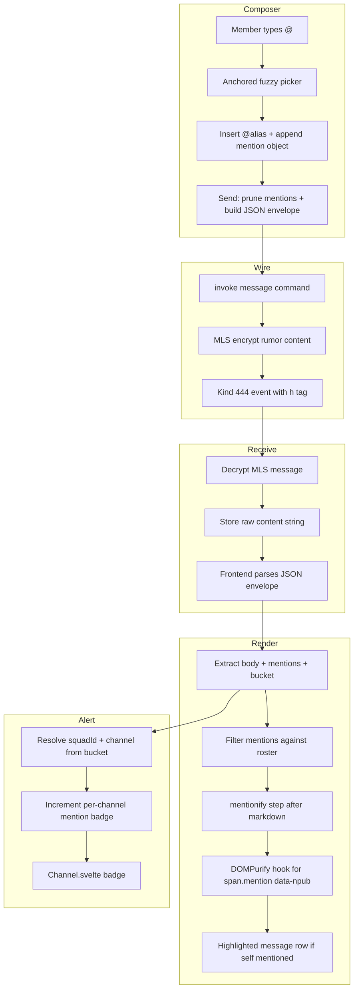

# feat: Add @ mentions to squad channels

## Summary

Add @ mentions to squad channels. A member typing `@` in the composer sees an anchored, fuzzy-search member picker sourced from the squad roster. Selecting a member inserts a visible `@alias` and binds the target npub. The message is sent as a JSON envelope with a `kind: 'pacto.mentions.envelope.v1'` discriminator and a `pacto_virtual_bucket` routing hint, then encrypted inside the MLS group ciphertext. The receiving client filters mentions against the current squad roster, renders each `@alias` as a safe mention span, highlights the message row when the current user is mentioned, and increments a per-channel mention badge. The backend extracts only the envelope `body` for OS notification text and never acts on the `mentions` array.

## Problem Frame

Pacto squad channels have no way to address a specific member inside a group message. In high-volume squads, members resort to quoting messages, pasting npubs, or sending separate DMs to get attention. This fragments conversation and slows coordination. The composer, roster data, and markdown rendering pipeline already exist, but they are not wired for mentions. The goal is to close this gap with a v1 implementation that keeps the mention list inside the MLS ciphertext and does not require backend parsing of membership data.

## Actors

- **A1. Sender** — A squad member composing a message who wants to get another member's attention.
- **A2. Mentioned recipient** — The squad member whose npub appears in the `mentions` array.
- **A3. Other member** — A squad member who sees the message but is not named in `mentions`.

## Key Flows

- **F1. Compose and send a mention.** A1 focuses the squad composer, types `@`, selects a member from the anchored picker, and sends the message. The client produces the JSON envelope and encrypts it inside the MLS group message.
- **F2. Receive and render a mention addressed to me.** A2 receives a decrypted squad message whose `mentions` array contains A2's npub. The client renders the mention span, applies a highlight class to the message row, and increments the channel badge.
- **F3. Receive a mention addressed to someone else.** A3 receives a decrypted message whose `mentions` array does not contain A3's npub. The client renders the mention span normally but does not apply a highlight or badge for A3.

## Requirements

### Composition

- R1. Typing `@` at a word boundary in the squad composer opens a member selection interface.
- R2. The default interface is an inline autocomplete overlay anchored to the textarea cursor.
- R3. The composer also supports a fuzzy command palette (Go-to-Member style) triggered by `@` that lists squad members and inserts a mention token when one is selected.
- R4. The selection interface lists candidates from the current squad's `membersByGroupId` and `$profiles` store, searchable by nickname, name, display name, and shortened npub.
- R5. Selecting a candidate inserts a mention token into the composer. The visible text is `@alias`; the canonical target is the member's npub.
- R6. Multiple mentions are allowed in a single message.
- R7. Before sending, the composer removes any mention whose alias no longer appears in the body text.

### Wire format and encryption

- R8. Squad messages use a JSON envelope with `kind: 'pacto.mentions.envelope.v1'`, `body` (the human-readable text), `mentions` (an array of mention objects), and `pacto_virtual_bucket` (the bucket used by the active channel for virtual-channel routing).
- R9. Each mention object contains at least `npub` (canonical target) and `alias` (display handle used at send time).
- R10. The JSON envelope is encrypted inside the MLS group message. No mention list, alias, or npub appears in plaintext outside the ciphertext.
- R11. The wire format change is gated to squad messages and does not affect existing DMs or historical squad messages.

### Rendering

- R12. The renderer renders a mention as a safe inline element: `@alias`.
- R13. Mention rendering must survive the existing Markdown → Linkify → DOMPurify → Twemoji → DOMPurify pipeline without creating an XSS surface.
- R14. A mention inside a code block, preformatted text, or inline code is rendered as literal text, not as a mention tag.
- R15. The rendered alias is resolved from the current `$profiles` store at render time, so profile changes update the visible name without changing the underlying npub.
- R16. Before rendering or generating alerts, the client filters the `mentions` array against the current squad roster (`membersByGroupId`) for the message's MLS group. Mentions targeting non-members are rendered as plain text and do not generate highlights or badges.
- R17. The rendered mention pill and the picker display a trust signal (shortened npub or verified NIP-05) alongside the display name to mitigate spoofing via forged display names.

### Notification and highlight

- R18. After decrypting a squad message, the client checks whether the current user's npub appears in the roster-filtered `mentions` array.
- R19. If the current user is mentioned, the message receives a visible highlight class in the message list.
- R20. If the current user is mentioned, the corresponding squad channel increments a personal alert in the squad-hub alert store and renders a badge in `Channel.svelte`.
- R21. The backend may parse the envelope only to extract the `body` for display (OS notifications); it never parses, stores, or acts on the `mentions` array.
- R22. Reply previews and OS notifications show the envelope `body` text, not the raw JSON envelope.

## Acceptance Examples

- **AE1. Autocomplete disambiguation.** Two squad members share the nickname "Alex". Typing `@Alex` shows both entries with distinct avatars and shortened npub suffixes. Selecting one inserts the correct mention for that npub.
- **AE2. Stable identity across profile changes.** A message mentions a member with `alias: "Alice"`. After the member changes their display name to "Alicia", the existing message renders as `@Alicia` because the renderer resolves the alias from the profile store by npub.
- **AE3. Mention inside code is literal.** A message containing `` `@npub1...` `` inside backticks renders as literal monospace text, not a styled mention tag, and no alert is generated.
- **AE4. No metadata leakage.** A Kind 444 event carrying a squad message contains only the group `h` tag and ciphertext. The `mentions` array, alias, and target npub are not visible to relays.

## Key Technical Decisions

- **Single, anchored, fuzzy autocomplete UI satisfies both R2 and R3.** The requirements describe an inline autocomplete overlay (R2) and a Go-to-Member-style fuzzy palette (R3). The plan implements both as one control: an anchored overlay that appears at the cursor and supports fuzzy keyboard-driven search. This avoids two competing `@` triggers while still satisfying the discoverability and search goals.
- **Literal `@alias` in body + `mentions` array.** The composer inserts the display handle into the message text and stores the canonical `(npub, alias)` mapping in a parallel array. The renderer uses the array to map aliases to npubs and resolve the current display name from the profile store. This keeps the body human-readable and keeps the npub out of the visible text.
- **Envelope discriminator: `kind: 'pacto.mentions.envelope.v1'`.** The existing `isStructuredProductContent` fallback treats any JSON object with a `schema` or `type` key as a structured product event. The mention envelope uses a `kind` field instead, so it is not misclassified as a squad update notice.
- **Envelope includes `pacto_virtual_bucket` for routing.** The backend uses virtual buckets (`announcements`, `polls`, `inbox`, etc.) to route messages that share one MLS group into multiple logical channels. The envelope carries the active bucket so that incoming mentions can be routed to the correct channel badge.
- **Mention envelope is client-side only.** The backend receives the JSON envelope as the rumor `content` string and encrypts it without structural knowledge. A small backend helper extracts the `body` field for OS notifications (R22), using a deserialization struct that contains only `kind` and `body`. It never inspects or persists the `mentions` array. Existing plain-text squad messages are treated as body-only envelopes.
- **Roster filtering before rendering and alerting.** Any squad member can encrypt a message with arbitrary npubs in the `mentions` array. The client filters `mentions` against `membersByGroupId` for the message's MLS group before rendering, highlighting, or incrementing badges. Non-member entries are treated as plain text.
- **`data-npub` restricted to `span.mention` via DOMPurify hook.** The rendered span uses `data-npub` to bind the target identity. Instead of globally allowing `data-npub` on every tag, an `uponSanitizeAttribute` hook permits it only on ``. The attribute value is validated as a bech32 `npub1...` and escaped before rendering.
- **Composer/send contract with parallel mentions array.** `MessageInput` keeps the existing `onSend: (content: string) => void` for DMs and adds an optional `onSendMentions: (body: string, mentions: Mention[]) => void` callback for squad channels. `ChatView` supplies this callback and builds the envelope from the returned body and mention list.
- **Reply preview extraction on the frontend.** The frontend uses the parser from U1 to extract body text from `replied_to_content` for reply previews. The backend helper from U7 is limited to OS notification text only.
- **Per-channel mention badge store separate from roster-signer alerts.** The existing `personalAlertsNeededBySquadId` store is reserved for roster-key signer prompts. Mentions are tracked in a new `mentionsBySquadChannel` store keyed by `squadId:channelName`, and the channel badge count is fed into the existing `Channel.svelte` alert surface.

## High-Level Technical Design

## System-Wide Impact

- **Composer/send contract.** `MessageInput` currently exposes `onSend: (content: string) => void`. To build the `{body, mentions}` JSON envelope, the composer adds an optional `onSendMentions: (body: string, mentions: Mention[]) => void` callback that squad channels use. DMs continue to use the existing raw-text callback.
- **Rendering pipeline.** `Message.svelte` and `FormattedMessageBody.svelte` need a new formatter entry point that accepts `body` plus `mentions`. DOMPurify policy is changed only through a targeted hook that permits `data-npub` on `` after validation.
- **Backend display paths.** The Rust `message` command stores the raw `content` string, but OS notifications read `message.content` directly. A display-only helper with a `kind`/`body` struct extracts the body without touching the `mentions` array.
- **Virtual-channel routing.** One MLS group can represent multiple logical channels (`announcements`, `polls`, etc.). The envelope carries `pacto_virtual_bucket`, and the frontend uses the same partitioner that drives `backendGroupTimelineMessages` to route badges to the correct `squadId:channelName`.
- **Alert lifecycle.** The new `mentionsBySquadChannel` store must be reset on logout, cleared when the user views a channel, and summed into `hubChannelAlertCount`; otherwise stale counts will produce persistent false badges.
- **Roster trust boundary.** The client uses `membersByGroupId` as the authoritative namespace for mentions. Mentions targeting non-members are downgraded to plain text, preventing spoofed highlights and badge increments.
- **Structured-message collision.** The envelope discriminator uses `kind` rather than `schema`/`type`, and it is added to the ignore set in `structured-content-notice.ts`, so squad messages with mentions do not render as structured notices.

## Implementation Units

### U1. Mention parser and envelope types

- **Goal:** Define the JSON envelope shape, parsing/serialization helpers, and unit tests so the rest of the frontend can reliably extract and build `{body, mentions, pacto_virtual_bucket}` from a raw message content string.
- **Requirements:** R8, R9, R11, F1, F2, F3, AE4
- **Files:**
  - `src/lib/messaging/mentions.ts` (new)
  - `src/lib/messaging/mentions.test.ts` (new)
  - `src/lib/messaging/structured-content-notice.ts`
- **Approach:** Create a pure TypeScript module with `Mention`, `SquadMessageEnvelope`, and `ParsedMessage` types. Expose `parseMessageContent(content: string): ParsedMessage` that returns `{body, mentions, pacto_virtual_bucket}` when the content parses as an envelope with `kind: 'pacto.mentions.envelope.v1'`. If parsing fails or the discriminator is wrong, return the original string as the body with empty `mentions` and no bucket. Expose `buildMentionEnvelope(body: string, mentions: Mention[], virtualBucket: string): string` that returns the JSON envelope. Update `structured-content-notice.ts` so the envelope is not summarized as a structured product notice.
- **Patterns to follow:** Co-located `.test.ts` files using Vitest; pure function tests like `src/lib/utils/message-formatting.test.ts`.
- **Test scenarios:**
  - `parseMessageContent` returns body, mentions, and bucket for a valid envelope.
  - `buildMentionEnvelope` produces JSON with the correct `kind`, `body`, `mentions`, and `pacto_virtual_bucket`.
  - Non-JSON content returns body = original string and empty mentions.
  - JSON with `schema` or `type` keys is treated as plain text.
  - JSON with the wrong `kind` is treated as plain text.
  - Malformed JSON is treated as plain text.
  - The envelope is not summarized as a structured product notice.
- **Verification:** `pnpm test` passes for the new module.

### U2. Composer `@` trigger and fuzzy autocomplete

- **Goal:** Add `@` detection, an anchored candidate list, and selection to the composer, scoped to squad channels.
- **Requirements:** R1, R2, R3, R4, R5, F1, AE1
- **Files:**
  - `src/components/dm/MessageInput.svelte`
  - `src/lib/messaging/mention-autocomplete.ts` (new)
  - `src/lib/messaging/mention-autocomplete.test.ts` (new)
- **Dependencies:** U1
- **Approach:** Add optional props to `MessageInput` that supply squad context (current group id, roster members, and profiles). Add an optional `onSendMentions: (body: string, mentions: Mention[]) => void` callback for squad channels; DMs continue to use the existing `onSend`. When a squad context is provided, typing `@` at a word boundary opens an overlay positioned near the cursor. Extract the fuzzy-filter logic into `mention-autocomplete.ts` and test it there. The overlay filters candidates by nickname, name, display name, and shortened npub, and shows each candidate's shortened npub as a trust signal. Arrow keys move selection; Enter or click selects. Selection inserts `@alias` at the cursor and appends a mention object to a parallel `mentions` array. Escape or clicking outside closes the overlay. Keep the implementation compatible with the existing Svelte 4 reactive patterns (`$:` and stores); do not introduce runes.
- **Patterns to follow:** Emoji picker in the same file for overlay styling and click-outside handling.
- **Test scenarios:**
  - `@` at a word boundary opens the picker; `@` inside a word does not.
  - Typing filters candidates by nickname, name, display name, and shortened npub.
  - Selecting a candidate inserts `@alias` and adds the mention object.
  - Multiple mentions can be added to one message.
  - Escape closes the picker without inserting.
- **Verification:** `pnpm test` passes for the extracted autocomplete module; manual QA in a squad channel for the overlay behavior.

### U3. Build and send the JSON envelope from squad channels

- **Goal:** Convert the squad composer's text and mention list into the JSON envelope and send it through the existing MLS path.
- **Requirements:** R6, R7, R8, R10, F1, AE4
- **Files:**
  - `src/components/channel/ChatView.svelte`
  - `src/lib/messaging/mentions.test.ts` (extend)
- **Dependencies:** U1, U2
- **Approach:** In `handleSendMessage`, when `MessageInput` emits the `onSendMentions` callback, prune the `mentions` array to remove any entry whose alias no longer appears in the body text. Build the envelope using `buildMentionEnvelope` from U1, passing the active channel's virtual bucket, and send the JSON string through `sendDmMessage`. Wire the optional squad-context props and the `onSendMentions` callback into `MessageInput` from `ChatView`. When `MessageInput` is used outside a squad context (DMs), continue using the raw-text `onSend` path unchanged. This preserves the existing DM wire format and keeps the change gated to squads.
- **Patterns to follow:** Existing `handleSendMessage` in `src/components/channel/ChatView.svelte`.
- **Test scenarios:**
  - A message with one mention is sent as a JSON envelope containing the body, one mention object, and the active virtual bucket.
  - A message with two mentions includes both in the envelope.
  - Deleting part of an `@alias` before send removes the corresponding mention from the envelope.
  - DM messages remain plain text.
- **Verification:** Send a mention in a squad channel and inspect the raw content stored in the frontend state; confirm it is the envelope JSON.

### U4. Render mentions safely through the formatting pipeline

- **Goal:** Render `@alias` as a safe `` tag, resolve the current display name, and skip code blocks.
- **Requirements:** R12, R13, R14, R15, R16, R17, F2, F3, AE2, AE3
- **Files:**
  - `src/lib/utils/message-formatting.ts`
  - `src/lib/utils/message-formatting.test.ts`
  - `src/components/dm/FormattedMessageBody.svelte`
- **Dependencies:** U1, U2
- **Approach:** Add a `mentionify` step that runs after `parseMarkdown` and before `linkify`/`sanitize`. It first filters the `mentions` array against the current squad roster (`membersByGroupId`) for the message's MLS group. Non-member entries are ignored. It then walks the parsed HTML string and replaces `@alias` in text segments only, skipping `<code>`, `<pre>`, and `<a>` tags using the same stack-based approach as `linkify` and `replaceEmojiWithTwemoji`. The replacement uses the current profile store mapping for the resolved npub to produce the visible alias, and appends the shortened npub as a trust signal if the resolved name differs from the original alias. Match aliases by occurrence order against the roster-filtered `mentions` array. Use an `uponSanitizeAttribute` DOMPurify hook that permits `data-npub` only on ``, validates the value as a bech32 `npub1...`, and escapes the value before the sanitizer writes it. HTML-escape the rendered alias text. Introduce a new formatter entry point that accepts the body and the parsed `mentions` array, leaving `formatMessageContent` unchanged for legacy/unmentioned content.
- **Patterns to follow:** Existing `linkify` and `replaceEmojiWithTwemoji` stack-walking pattern; existing spoiler extension for custom markdown behavior; `escapeAttr` in `message-formatting.ts`.
- **Test scenarios:**
  - A mention outside code renders as a `` with the current display name and a trust signal when the name differs from the original alias.
  - A mention inside a code block renders as literal text.
  - A mention inside an inline code span renders as literal text.
  - Alias text is HTML-escaped.
  - `data-npub` is allowed only on `` and stripped from other tags.
  - An invalid `data-npub` value is rejected by the validation hook.
  - Multiple mentions with the same alias are resolved by occurrence order against the `mentions` array.
  - A mention whose npub is not in the current squad roster is rendered as plain text.
- **Verification:** `pnpm test` passes for new and existing formatting tests; visual check that mention pills appear in the message list.

### U5. Message list envelope parsing and self-mention highlight

- **Goal:** Parse the JSON envelope in the message list, pass the body and roster-filtered mentions to the renderer, and apply a highlight class when the current user is mentioned.
- **Requirements:** R18, R19, R22, F2, F3
- **Files:**
  - `src/components/dm/Message.svelte`
  - `src/components/channel/ChatView.svelte`
  - `src/lib/messaging/mentions.test.ts` (extend)
- **Dependencies:** U1, U4
- **Approach:** In the message list mapping (`toMessageProps` in `ChatView.svelte`), parse each message's content using the parser from U1. Pass the extracted `body`, `mentions`, and `pacto_virtual_bucket` through to `Message.svelte` and `FormattedMessageBody`. Filter the mentions against the current squad roster for the message's MLS group before highlighting. If the filtered `mentions` contains the current user's npub, add a `mentioned` CSS class to the message row. Also update the reply preview path in `toMessageProps` to extract the body text from `replied_to_content` using the same parser.
- **Patterns to follow:** Existing `toMessageProps` in `ChatView.svelte`; existing `Message.svelte` prop passing.
- **Test scenarios:**
  - A message whose roster-filtered `mentions` array contains the current npub receives the `mentioned` class.
  - A message whose roster-filtered `mentions` array does not contain the current npub does not receive the class.
  - A plain-text message receives no highlight.
  - A mention targeting a non-member npub does not generate a highlight.
  - A reply preview for a mentioned message shows the body text, not the JSON envelope.
- **Verification:** Visual check that a self-mention message is highlighted; inspect DOM for the `mentioned` class.

### U6. Mention alerts and channel badges

- **Goal:** Track per-channel mention alerts and render them as badges in the squad sidebar.
- **Requirements:** R20, F2, A2
- **Files:**
  - `src/stores/squad-hub-alerts.ts`
  - `src/components/layout/ParentSidebar.svelte`
  - `src/stores/squad-hub-alerts.test.ts` (extend)
- **Dependencies:** U5
- **Approach:** Add a `mentionsBySquadChannel` writable store keyed by `squadId:channelName`. When an incoming MLS message mentions the current user (after roster filtering), resolve the channel name from the message's `pacto_virtual_bucket` and the squad's channel list, using the same partitioner that drives `backendGroupTimelineMessages`. Increment the count for that `squadId:channelName`. Update `hubChannelAlertCount` to sum the mention count with existing join-request and roster-signer counts. Pass the total to `Channel.svelte` as `alertCount`. Add the new store to `resetSquadHubAlertStores()` so it clears on logout.
- **Patterns to follow:** Existing `squad-hub-alerts.ts` and `hubChannelAlertCount` pattern; existing virtual-bucket partitioner in `src/lib/mls/virtual-channel-bucket.ts`.
- **Test scenarios:**
  - A mention for the current user increments the alert count for the correct squad and channel.
  - A mention for another user does not increment the count.
  - A mention with a non-member npub does not increment the count.
  - A channel with both a join request and a mention shows the combined count.
  - The store is reset on logout.
- **Verification:** Unit test for `hubChannelAlertCount` with mention counts; visual check that a badge appears on the channel.

### U7. Backend notification body extraction

- **Goal:** OS notifications show the human body text, not the raw JSON envelope.
- **Requirements:** R21, R22, AE4
- **Files:**
  - `src-tauri/src/message.rs` (helper + inline `#[cfg(test)]` module)
  - `src-tauri/src/lib.rs`
- **Dependencies:** U1
- **Approach:** Add a small helper in the backend that attempts to parse the content string as the mention envelope and returns the `body` field if the `kind` matches. Define a deserialization struct that contains only `kind` and `body`; do not include a `mentions` field, so the struct cannot accidentally read the mention list. If parsing fails or the content is not an envelope, return the original string. Use this helper only for OS notification text in `src-tauri/src/lib.rs`. Document in the helper comment that the `mentions` array must never be read or stored. Add inline Rust unit tests for valid envelope, plain text, wrong `kind`, malformed `mentions` content, and malformed JSON.
- **Patterns to follow:** Existing notification code in `src-tauri/src/lib.rs` around `NotificationData::group_message`; inline `#[cfg(test)]` modules in `src-tauri/src/message.rs`.
- **Test scenarios:**
  - A valid mention envelope returns only the body string for the notification.
  - Plain text content is returned unchanged.
  - JSON with the wrong `kind` is returned unchanged.
  - A malformed `mentions` field does not cause the helper to fail or read the field.
  - Malformed JSON is returned unchanged.
- **Verification:** `cd src-tauri && cargo test` includes a test for the helper; send a mention and confirm the OS notification shows the body text.

### U8. Clear mention alerts on channel view

- **Goal:** The mention badge clears when the user opens or views the channel.
- **Requirements:** R20, F2, A2
- **Files:**
  - `src/components/channel/ChatView.svelte`
  - `src/stores/squad-hub-alerts.ts`
  - `src/stores/squad-hub-alerts.test.ts` (extend)
- **Dependencies:** U6
- **Approach:** When the active channel changes to a squad channel, call a new helper to clear the mention count for that `squadId:channelName`. Also clear it when the user scrolls to the bottom of the current channel, similar to existing unread behavior.
- **Patterns to follow:** Existing DM unread clear on view; existing `setPersonalAlertNeeded` helper.
- **Test scenarios:**
  - Opening a channel with a mention badge clears the badge for that channel.
  - The badge remains for other channels.
  - Switching to a different squad does not restore a cleared badge.
- **Verification:** Visual check that the badge disappears when the channel is opened.

## Scope Boundaries

### Deferred for later

- DMs and private threads.
- `@all`, `@here`, and role-based mentions.
- Native OS push notifications that are mention-aware.
- Message editing that preserves or updates mention lists.
- A plaintext fallback wire format for non-Pacto clients.
- Backend analytics, search indexing, or server-side routing based on mentions.

### Outside this product's identity

- Letting the backend parse or store the mention list outside the MLS ciphertext.
- Displaying mention metadata in notifications that the server sends.
- Supporting mentions that target users outside the squad.

## Risks & Dependencies

- **DOMPurify allowlist expansion.** Allowing `data-npub` on `span` tags is necessary but increases the attribute surface. Mitigation: restrict the attribute to `` via an `uponSanitizeAttribute` hook, validate the value as a bech32 `npub1...` before writing, and HTML-escape the alias text and attribute value.
- **Mention spoofing via alias collision or forged `mentions` array.** Any squad member can encrypt a message with arbitrary npubs in `mentions`. Mitigation: filter `mentions` against the current squad roster (`membersByGroupId`) before rendering, highlighting, or incrementing badges; show the shortened npub as a trust signal in the picker and rendered pill.
- **NIP-05 display-name spoofing.** `getProfileDisplayName` resolves `nickname → name → display_name` without verifying NIP-05 claims. Mitigation: always display a shortened npub alongside the name in the picker and the mention pill; do not rely on display name alone for trust.
- **Alias/npub mismatch at render time.** A sender can write `@ceo` in the body while the `mentions` array points to a different npub. Mitigation: the renderer resolves the visible name from the profile store by npub and appends the shortened npub as a trust signal when the resolved name differs from the original alias, so the receiver can see the actual target identity.
- **Composer state drift.** A user may edit or delete part of an `@alias` after inserting it, leaving the `mentions` array stale. Mitigation: prune the array before sending (R7) and match by alias at render time, with the roster-filtered `mentions` array as the canonical npub source.
- **Backend envelope leakage in notifications.** If the JSON envelope is not parsed for OS notifications, the user sees raw JSON. Mitigation: U7 extracts the body only, using a struct that excludes `mentions`, and never stores or acts on the mention list.
- **Virtual-channel badge misrouting.** A single MLS group backs multiple logical channels. If the badge key does not account for the virtual bucket, a mention in one channel could badge another. Mitigation: include `pacto_virtual_bucket` in the envelope and key `mentionsBySquadChannel` using the same partitioner that drives `backendGroupTimelineMessages`.
- **Dependency on `membersByGroupId` and `$profiles` being loaded.** If the roster or profile cache is stale, the picker may miss members or render old names. The existing store hydration path applies; no new dependency is introduced.
- **Structured-message fallback collision.** If the envelope discriminator is accidentally treated as a structured product message, squad mentions will render as notices instead of chat text. Mitigation: use the `kind` discriminator and add it to the ignore set in `structured-content-notice.ts`.

## Sources & Research

- Origin requirements: attached to the planning session (date 2026-07-20, topic `at-mentions-in-squad-channels`).
- `docs/messaging/OVERVIEW.md` — DM vs MLS group transport and chat identity.
- `src/components/dm/MessageInput.svelte` — current composer implementation.
- `src/lib/utils/message-formatting.ts` — markdown, linkify, sanitization, and emoji pipeline.
- `src/components/dm/FormattedMessageBody.svelte` — message body rendering.
- `src/components/dm/Message.svelte` — message row component.
- `src/components/channel/ChatView.svelte` — squad message list and send path.
- `src/components/layout/ParentSidebar.svelte` — channel badge computation.
- `src/components/channel/Channel.svelte` — channel badge rendering.
- `src/stores/mls-group-members.ts` — squad roster data.
- `src/stores/profiles.ts` — profile cache for name resolution.
- `src/stores/squad-hub-alerts.ts` — existing alert store domain.
- `src-tauri/src/message.rs` — message send and rumor building.
- `src-tauri/src/mls.rs` — MLS send and encryption.
- `src-tauri/src/lib.rs` — OS notification and incoming MLS processing.
- `src/lib/utils/profile.ts` — display name resolution order.
- `src/lib/messaging/structured-content-notice.ts` — structured message fallback that the envelope must avoid.
- `src/lib/mls/virtual-channel-bucket.ts` — virtual-channel routing and timeline keys.
