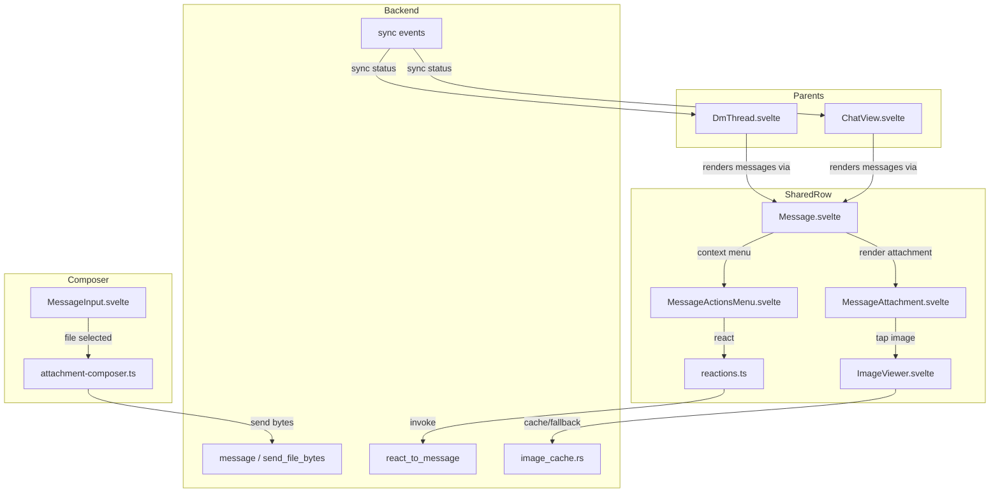

# Messaging v0.5 enhancements — reactions, attachments, image viewer, sync status

## Goal Capsule

- **Objective:** Add the missing Svelte frontend UI and integration for backend capabilities that already exist: message reactions, file attachments, an in-app image viewer, and per-conversation sync status. The work must function the same way in DMs and MLS squad channels.
- **Authority:** `docs/brainstorms/2026-07-24-messaging-v0.5-enhancements-requirements.md`.
- **Execution profile:** Frontend-heavy implementation in Svelte/Tauri v2, with no backend protocol changes. Reuses existing backend commands and event storage.
- **Stop conditions:**
  - All three acceptance examples are exercisable in a manual smoke test.
  - New unit tests for reaction aggregation, attachment preview helpers, context menu actions, image viewer controls, and sync status mapping pass.
  - Existing DM and squad message flows show no regressions in `bun run check` and `bun run test`.
- **Tail ownership:** `ce-work` or equivalent executor.

## Product Contract

### Summary

Pacto's Rust backend already supports reactions, file attachments, edits, and image caching, but the Svelte frontend has no consistent way to add, display, or interact with these content types. This plan closes that gap for v0.5 by adding a shared per-message context menu, reaction chips, a composer attachment affordance, an in-app image viewer, and sync status indicators for both DMs and MLS squad channels.

### Problem Frame

The backend ships protocol capabilities that members cannot reach through the UI. They cannot react to messages, send or view attachments, or see whether a conversation is still catching up with relays. This makes the app feel incomplete compared with its protocol surface and pushes members toward workarounds.

### Actors

- **A1. Sender** — A member composing a message with text or an attachment.
- **A2. Recipient / viewer** — A member reading a conversation and reacting to, viewing, or replying to messages.
- **A3. Squad participant** — The same as A2, but inside an MLS group channel.
- **A4. Operator / self-user** — A member who wants to know whether local state is in sync with the network.

### Key Flows

- **F1. React to a message.** A2 opens the per-message context menu, chooses a reaction emoji, and the reaction is sent over the existing protocol path. The message row updates to show the aggregated reaction.
- **F2. Send a file attachment.** A1 clicks the attachment affordance in the composer, picks a file, sees a preview, and sends. The message appears as a file bubble in the thread.
- **F3. View an attached image.** A2 taps an image attachment and sees it in an in-app viewer with zoom and reveal-in-folder.
- **F4. Check sync status.** A2 looks at a DM or squad thread header and sees whether the client is still catching up.

### Requirements

#### Reactions

- R1. Every message row (own and others, DM and MLS) exposes a way to add a reaction.
- R2. The reaction picker is the system/emoji picker used elsewhere in the composer, limited to a single emoji per reaction.
- R3. A member can add one reaction of each emoji to a given message; adding the same emoji again removes it (toggle behavior).
- R4. The client displays aggregated reactions below the message bubble as a row of emoji chips with a count.
- R5. The current user's own reactions are visually distinct from reactions left by others.
- R6. Reactions are supported for both DMs and MLS squad messages.
- R7. The backend `Message::add_reaction` path (existing `kind=7` event storage) is used unchanged.

#### Attachments

- R8. The composer exposes an attachment affordance (paperclip icon) for both DMs and MLS.
- R9. Selecting a file shows a sendable preview in the composer: file name, size, and an image thumbnail when applicable.
- R10. Image attachments are compressed on the backend (`send_file_bytes` with `use_compression`) when compression saves at least 10%.
- R11. Non-image attachments are sent as-is.
- R12. The message bubble distinguishes an attachment from text and renders it safely (no inline executable previews).

#### Image viewer

- R14. Tapping an image attachment opens an in-app modal/overlay viewer.
- R15. The viewer supports zoom (pinch / wheel / buttons) and pan.
- R16. The viewer has a button to reveal the file in the system file manager / folder.
- R17. The viewer closes with Escape, back button, or an explicit close affordance.
- R18. The viewer uses the existing image cache (`src-tauri/src/image_cache.rs`) where available and falls back to the original attachment path.

#### Sync status indicator

- R19. DM and squad thread views display a sync status indicator in the header or message list.
- R20. The indicator communicates at least these states: idle/in-sync, catching-up/fetching, and error/failed.
- R21. The indicator reflects the existing backend sync lifecycle exposed to `src/stores/dm.ts` and related subscription events.
- R22. The indicator does not block sending or reading messages.

#### Cross-cutting UX

- R23. All message actions (react, copy, reply, delete where available) live in a single per-message context menu triggered by right-click/long-press or an overflow button.
- R24. The same message row component is used for DMs and MLS squad channels; behavior differences are driven by props/store context, not separate components.
- R25. New stores/helpers added for reactions, attachment previews, and sync state must reset on logout.

### Acceptance Examples

- **AE1. Toggle reaction.** User A reacts with 👍 on a message. The message shows 👍 1. User A taps 👍 again; the reaction is removed and the count disappears.
- **AE2. Image send and view.** User A sends a photo. User B sees a thumbnail in the thread. User B taps it, sees the full image, zooms in, and opens the containing folder.
- **AE3. Sync catching up.** User opens a squad channel after being offline. A spinner/text in the header reads "Catching up…" until the relay catch-up completes, then the indicator disappears or changes to the normal state.

### Scope Boundaries

#### Deferred for later

- Message editing (#142).
- Voice messages and local transcription (#144).
- Message threading / replies beyond the existing reply preview.
- Forwarding messages.
- Polls inside messages.
- Attachment download manager or global file library.
- OCR or image content analysis.
- Server-side message search.
- Push notifications for reactions or edits.

#### Outside this product's identity

- Adding new backend protocol features.
- Changing encryption or MLS semantics.
- Cloud file hosting or CDN delivery.

#### Deferred to follow-up work

- True reaction removal / toggle on the backend. The existing `react_to_message` command has no remove path, so v0.5 prevents duplicate emoji sends from the same user but cannot reliably remove an already-persisted reaction.
- A distinct backend "sync failed" event. The current backend lifecycle emits `sync_progress` / `sync_finished`; v0.5 will show an idle/syncing indicator and can surface a client-side "stalled" state after a timeout, but a dedicated error/failed event is follow-up work.

### Key Decisions

- **K1. Build one shared per-message context menu.** Reactions and future actions share the same interaction surface, keeping the message row uniform across DMs and squads.
- **K2. Attachments use the existing `send_file_bytes` backend path.** No new wire format; image compression stays in Rust.
- **K3. Image viewer is in-app only for v0.5.** Zoom, pan, and reveal-in-folder are the initial feature set.
- **K4. Sync status is purely informational.** It surfaces existing backend sync state without introducing new protocol logic or pausing the UI.

### Open Questions

- **Q1. Long-press on mobile/tablet.** Resolved: include long-press trigger on mobile/tablet in addition to right-click on desktop and the overflow button everywhere.
- **Q2. "Copy" option in the context menu.** Resolved: include "Copy message text".
- **Q3. Emoji picker for reactions.** Resolved: use the OS native emoji picker, not the existing composer inline picker.
- **Q4. Maximum attachment size limit.** Resolved: enforce a 25 MB client-side limit.

## Planning Contract

### Product Contract preservation

Product Contract unchanged. Implementation limitations for R3 and R20 are recorded below as Key Technical Decisions and Assumptions rather than product-scope changes.

### Key Technical Decisions

- **KTD1. Reaction toggle is client-side only for v0.5.** (session-settled: user-approved — chosen over requesting a backend remove-reaction command: R7 explicitly keeps the backend path unchanged.) The existing `react_to_message` command creates a new kind=7 event for each call and `Message::add_reaction` deduplicates by reaction event id, not by emoji+author. The frontend will prevent a user from sending a second reaction with the same emoji to the same message. True removal of an already-persisted reaction requires a backend remove path and is deferred.
  - Governs R3, R7.

- **KTD2. Sync status UI maps to the existing two-state backend lifecycle plus a client-side stall heuristic.** (session-settled: user-approved — chosen over adding a backend error event: R21 says the indicator must reflect the existing lifecycle.) The backend emits `sync_progress` and `sync_finished` through `src/lib/app/tauri-subscriptions.ts`. The UI shows idle when no sync is active, catching-up while `dmSyncStatus` is `syncing`, and can fall back to a "stalled" label if `syncing` exceeds a generous timeout. A dedicated error/failed state requires a new backend event and is deferred.
  - Governs R20, R21.

- **KTD3. Use the OS native emoji picker for reactions where available.** (session-settled: user-directed — chosen over reusing the composer inline picker per Q3 resolution.) On macOS/Windows the implementation will focus the message row and trigger the system emoji input method shortcut; on platforms without a programmatic native picker (Linux, web preview) it falls back to the existing inline composer picker. The trade-off is platform inconsistency in appearance and the need to limit selection to a single emoji in the action handler.
  - Governs R2.

- **KTD4. Attachment preview is handled in the composer with platform-specific file reading.** (session-settled: user-approved — chosen over a separate upload modal.) On desktop, the Tauri dialog plugin returns a path and `readFile`/`get_file_info` provide bytes and metadata. On web preview and Android, a hidden file input plus `FileReader` or the Android cache path is used. The same preview strip component is used for all platforms.
  - Governs R8, R9.

- **KTD5. Image viewer uses a custom Svelte modal with CSS transforms.** (session-settled: user-directed — chosen over a dedicated viewer library per the zoom/pan resolution.) Wheel and pinch events adjust `scale` and `translate` CSS variables; pan is implemented with pointer-drag. Reveal-in-folder uses `@tauri-apps/plugin-opener` on desktop and is hidden on platforms without a file manager.
  - Governs R15, R16.

- **KTD6. Enforce a 25 MB attachment size limit in the UI.** (session-settled: user-directed — chosen over 50 MB or no limit per Q4 resolution.) The limit is checked against the file metadata before reading bytes. It is advisory/pre-send; backend/relay limits may still apply.
  - Governs R8.

### Assumptions

- The OS native emoji picker is not a single cross-platform Tauri API; the implementation must use the system shortcut/IME on desktop and fall back to the existing inline composer picker elsewhere. If a picker allows multi-emoji input, the action handler will take only the first grapheme cluster.
- `send_file_bytes` returns `true` on success and raises on failure; the composer will mark the pending attachment as failed and surface the error via the existing `dmSendError` / `groupSendError` stores.
- Squad channels already share `src/components/dm/Message.svelte` via `src/components/channel/ChatView.svelte`; no new squad-specific row component is needed to satisfy R24.
- Existing logout reset logic in `src/lib/utils/clear-account-state.ts` will be extended for any new runtime stores; localStorage keys for new persisted state will follow the existing npub-scoped prefix pattern.

### High-Level Technical Design

The shared `Message.svelte` row is the integration hub. It receives the same prop shape from both DM and squad parents, so reactions and attachments render identically. The composer, image viewer, and reaction helpers are messaging utilities that operate on backend-agnostic data. Sync status is a global indicator surfaced in the two thread headers.

### Sequencing

1. **Shared primitives first:** context menu component, reaction API wrapper and aggregation helper, attachment preview helper. These have no UI parents and unblock the row work.
2. **Composer attachment affordance.** Independent of row rendering; can ship as soon as the helper exists.
3. **Message row extensions.** Add reaction chips, attachment card, and context menu wiring to `Message.svelte`.
4. **Image viewer.** Builds on the attachment card tap path.
5. **Sync status header indicators.** Mostly store-driven; can be done in parallel with row work once the indicator component exists.
6. **Logout reset and cross-cutting tests.** Final cleanup before verification.

## Implementation Units

### U1. Shared per-message context menu

- **Goal:** Create a single menu component that surfaces message actions (React, Copy, Reply) for both DMs and squad channels.
- **Requirements:** R1, R23.
- **Dependencies:** None.
- **Files:**
  - `src/components/dm/MessageActionsMenu.svelte` (create)
  - `src/components/dm/MessageActionsMenu.test.ts` (create)
- **Approach:**
  - Accept props: `actions: MessageAction[]`, `messageId`, `mine`, `open`, `x`, `y`, plus an `onSelect(action)` dispatch.
  - Render a floating menu near the trigger point; close on Escape, click outside, or action selection.
  - Actions are "react", "copy", "reply". The host decides which actions are available.
  - For desktop, the parent positions the menu at the cursor; for mobile/tablet, the menu can be a bottom-sheet-style panel if the existing modal pattern is preferable.
- **Patterns to follow:** Existing `src/components/ui/Modal.svelte` for overlay/backdrop behavior; use `createEventDispatcher` or Svelte 5 runes for event dispatch.
- **Test scenarios:**
  - Renders the actions passed in.
  - Calls `onSelect` with the correct action and message id.
  - Closes on Escape key.
  - Does not render actions not provided by the parent.
- **Verification:** `bun run test src/components/dm/MessageActionsMenu.test.ts` passes.

### U2. Reaction API wrapper and aggregation helper

- **Goal:** Wire the backend `react_to_message` command and provide a pure helper that turns a list of backend `Reaction`s into display rows.
- **Requirements:** R1, R4, R5, R6, R7.
- **Dependencies:** None.
- **Files:**
  - `src/lib/api/nostr.ts` (add `reactToMessage` wrapper)
  - `src/lib/messaging/reactions.ts` (create)
  - `src/lib/messaging/reactions.test.ts` (create)
  - `src/stores/dm.ts` (extend `DmMessage` with `reactions?: Reaction[]`)
- **Approach:**
  - Add `reactToMessage(chatId, messageId, emoji)` in `src/lib/api/nostr.ts` invoking `react_to_message`.
  - Define frontend `Reaction` type matching the backend shape: `{ id, reference_id, author_id, emoji }`.
  - Implement `aggregateReactions(reactions, currentUserNpub)` returning `{ emoji, count, hasMe }[]`.
  - To satisfy KTD1, track the set of `(messageId, emoji)` pairs the current user has already sent in this session and suppress duplicate calls.
  - Extend `DmMessage` to include optional `reactions` so the backend-emitted payloads flow through without loss.
- **Patterns to follow:** Existing API wrappers in `src/lib/api/nostr.ts` (logging, error pass-through); pure helper style from `src/lib/dm/message-stack.ts`.
- **Test scenarios:**
  - Aggregates multiple authors for the same emoji into one chip with the right count.
  - Marks `hasMe=true` when `author_id` matches the current user npub.
  - Prevents a second `reactToMessage` call for the same `(messageId, emoji)` pair in the same session.
  - Returns empty array when `reactions` is undefined.
- **Verification:** `bun run test src/lib/messaging/reactions.test.ts` passes.

### U3. Render reaction chips in the message row

- **Goal:** Show aggregated reactions below each message bubble and allow opening the reaction picker from the context menu.
- **Requirements:** R1, R3 (client-side half), R4, R5, R6.
- **Dependencies:** U1, U2.
- **Files:**
  - `src/components/dm/Message.svelte` (modify)
  - `src/components/dm/Message.test.ts` (create or extend)
  - `src/components/dm/DmMessageRouter.svelte` (modify to pass callbacks)
  - `src/components/channel/ChatView.svelte` (modify to pass callbacks)
- **Approach:**
  - Extend `Message.svelte` props to accept `reactions`, `attachments`, `currentUserNpub`, `onReact(messageId, emoji)`, `onCopy(text)`, `onReply(messageId)`, and a `chatId`.
  - Render a row of reaction chips under `message-text`. Each chip shows emoji + count and uses a distinct style when `hasMe` is true.
  - Wire the context menu: selecting "react" opens the OS native emoji picker where available, falling back to the existing inline composer picker, and passes the selected emoji to `onReact`.
  - Selecting "copy" writes the message body to the clipboard via `navigator.clipboard`.
  - Selecting "reply" dispatches `onReply`.
- **Patterns to follow:** Existing `FormattedMessageBody` integration; keep styling in the component's `<style>` block; avoid inline CSS.
- **Test scenarios:**
  - Renders reaction chips with counts.
  - Highlights the current user's reactions.
  - Opens the emoji picker and calls `onReact` with the chosen emoji.
  - Copies message text when "Copy" is selected.
  - Renders attachment cards when `attachments` are provided.
- **Verification:** Component tests pass and a manual smoke test shows chips in both a DM and a squad channel.

### U4. Composer attachment affordance and preview

- **Goal:** Add a paperclip button to `MessageInput` that lets the user pick a file, previews it, and sends it via `send_file_bytes`.
- **Requirements:** R8, R9, R10, R11, R25.
- **Dependencies:** None.
- **Files:**
  - `src/components/dm/MessageInput.svelte` (modify)
  - `src/lib/messaging/attachment-composer.ts` (create)
  - `src/lib/messaging/attachment-composer.test.ts` (create)
  - `src/lib/api/nostr.ts` (add `sendFileBytes` wrapper)
- **Approach:**
  - Add a paperclip button next to the emoji trigger.
  - On desktop, use `open` from `@tauri-apps/plugin-dialog` to get a file path, then read bytes with `@tauri-apps/plugin-fs` `readFile`.
  - On web preview / Android, use a hidden `<input type="file">` and `FileReader` to get an `ArrayBuffer`.
  - Validate size <= 25 MB before reading; if over, show a toast and abort.
  - Show an inline preview strip with file name, formatted size, and an image thumbnail. For desktop files, call backend `get_image_preview_base64` when the file is an image. For web files, use `URL.createObjectURL`.
  - Send via `sendFileBytes(receiver, repliedTo, bytes, fileName, useCompression)` where `useCompression` is true for supported images and false otherwise.
  - Clear the preview after send or on explicit cancel.
- **Patterns to follow:** Existing `MessageInput` emoji picker positioning and click-outside handling; file-size formatting from backend or a small local helper.
- **Test scenarios:**
  - Rejects files larger than 25 MB.
  - Passes `useCompression=true` for images (png/jpg/jpeg/webp) and `false` for PDFs/zip files.
  - Calls `sendFileBytes` with the right receiver and optional reply id.
  - Clears pending file state after send.
- **Verification:** Unit tests pass; manual smoke sends a photo in a DM and a squad channel.

### U5. Attachment rendering in the message row

- **Goal:** Render received attachments as image thumbnails or file cards inside the shared message row.
- **Requirements:** R12.
- **Dependencies:** U4 is not a hard dependency; this can ship before send if messages with attachments already exist in the backend.
- **Files:**
  - `src/components/dm/MessageAttachment.svelte` (create)
  - `src/components/dm/MessageAttachment.test.ts` (create)
  - `src/components/dm/Message.svelte` (modify to render attachments)
  - `src/lib/api/nostr.ts` (add `downloadAttachment` wrapper)
- **Approach:**
  - Create `MessageAttachment` that receives an `Attachment` object.
  - For images: if `downloaded` and a local path exists, render it via `convertFileSrc` from `@tauri-apps/api/tauri`; otherwise show the `img_meta.blurhash` as a placeholder (using the existing blurhash decoder command) and a download button.
  - For non-images: render a file card with icon, name, size, and download button.
  - Download uses the existing backend `download_attachment` command; update the local message via `message_update` after success.
  - Tapping an image attachment opens the image viewer (U6).
  - Pass `attachments` through the existing `DmMessageRouter` prop path and the `toMessageProps` mapping in `ChatView.svelte`.
- **Patterns to follow:** Existing image cache usage in avatar rendering; file type descriptions from backend if exposed, otherwise a local extension-to-label map.
- **Test scenarios:**
  - Renders a downloaded image with a local path.
  - Renders a non-downloaded image with a placeholder and download button.
  - Renders a non-image file card.
  - Calls `downloadAttachment` when the download button is pressed.
- **Verification:** Component tests pass.

### U6. In-app image viewer

- **Goal:** Build a modal overlay for viewing attached images with zoom, pan, and reveal-in-folder.
- **Requirements:** R14, R15, R16, R17, R18.
- **Dependencies:** U5.
- **Files:**
  - `src/components/dm/ImageViewer.svelte` (create)
  - `src/components/dm/ImageViewer.test.ts` (create)
  - `src/lib/utils/open-external.ts` or a new `src/lib/utils/reveal-in-folder.ts` (create)
- **Approach:**
  - Modal overlay with a large `` element.
  - CSS transform `scale()` and `translate()` driven by Svelte state; wheel and pinch events adjust scale; pointer-drag adjusts translate.
  - Provide on-screen zoom-in/zoom-out/reset buttons.
  - Close on Escape, clicking the backdrop, or a close button.
  - Resolve the image source: first call `get_or_cache_image` from the backend image cache; if that returns a path, use `convertFileSrc`; otherwise fall back to the attachment `url`.
  - Reveal-in-folder: on desktop, call the Tauri opener plugin's `revealItemInDir`; hide the button on Android/web where the concept does not apply.
- **Patterns to follow:** Existing `Modal.svelte` for overlay; keep transforms GPU-accelerated with `will-change: transform`.
- **Test scenarios:**
  - Opens with the correct image source.
  - Zoom in and out update the transform.
  - Pan updates the transform.
  - Closes on Escape.
  - Reveal-in-folder calls the opener when available.
- **Verification:** Component tests pass; manual smoke opens a received image in both DM and squad contexts.

### U7. Sync status indicator in thread and channel headers

- **Goal:** Surface the existing `dmSyncStatus` store in both DM thread and squad channel headers.
- **Requirements:** R19, R20 (client-side mapping), R21, R22.
- **Dependencies:** None.
- **Files:**
  - `src/components/dm/DmThread.svelte` (modify)
  - `src/components/channel/ChatView.svelte` (modify)
  - Optional: `src/components/dm/SyncStatusIndicator.svelte` (create if inline rendering becomes noisy)
- **Approach:**
  - Read `$dmSyncStatus` in both headers.
  - `idle` / `finished` → show nothing or a subtle in-sync dot.
  - `syncing` → show "Catching up…" with a spinner.
  - If `syncing` persists beyond a timeout (e.g., 30 seconds), switch to "Catching up… (slow)" or a "Stalled" label. This satisfies the spirit of the error/failed state within the existing event surface.
  - Ensure the indicator does not steal focus, block clicks, or push the message list vertically by more than a single line.
- **Patterns to follow:** Existing `dm-thread-error` / `channel-send-error` status copy pattern.
- **Test scenarios:**
  - Shows catching-up text when `dmSyncStatus` is `syncing`.
  - Shows no indicator when `dmSyncStatus` is `idle`.
  - Does not block the composer or message list interactions.
- **Verification:** Unit tests for mapping logic pass; manual smoke shows the indicator when opening a channel after a fresh login.

### U8. Reset new runtime state on logout

- **Goal:** Ensure any new stores or module-level state used by reactions, attachment previews, and sync helpers are cleared when the user logs out.
- **Requirements:** R25.
- **Dependencies:** U2, U4, U7.
- **Files:**
  - `src/lib/utils/clear-account-state.ts` (modify)
  - Any new Svelte stores in `src/stores/dm.ts` or `src/lib/messaging/attachment-composer.ts`
- **Approach:**
  - If attachment preview state lives in a Svelte store, add it to `clearAccountState`.
  - If reaction state uses session-only in-memory maps, they are already cleared by the process reload that follows `logout`. Document this assumption.
  - Add any new npub-scoped localStorage prefixes to `SCOPED_KEY_PREFIXES` if needed.
- **Patterns to follow:** Existing `clearAccountState` reset list.
- **Test scenarios:**
  - After `clearAccountState()`, pending attachment preview store is empty.
  - New localStorage prefixes are removed when an npub is provided.
- **Verification:** Unit tests for `clear-account-state` still pass; manual logout/login smoke shows no stale attachment preview.

## Verification Contract

Run the following gates before declaring the work done:

| Gate | Command | Applies to |
|---|---|---|
| Unit / component tests | `bun run test` | All new helpers and components (U1–U8) |
| Type check | `bun run check` | Whole frontend |
| Lint | `bun run lint` | Whole frontend |
| Manual smoke — DM | `bun run tauri:dev` | AE1, AE2 in a DM |
| Manual smoke — squad | `bun run tauri:dev` | AE1, AE2, AE3 in a squad channel |

Per-unit verification is listed under each U above. The manual smoke should exercise a complete round-trip: send an image from one account, receive it in another, react to it, copy message text, open the image viewer, zoom, reveal-in-folder, and observe sync status after restarting offline.

## Definition of Done

- All implementation units above are complete and their tests pass.
- `bun run test`, `bun run check`, and `bun run lint` pass with no new warnings.
- The acceptance examples AE1, AE2, and AE3 are demonstrable in a local Tauri dev build, accounting for the documented backend limitations in KTD1 and KTD2.
- No new absolute paths, no new undocumented stores, and no unreset runtime state remain.
- Any experimental or abandoned approaches (e.g., alternative image viewer prototypes) are removed from the working tree before final review.

## Appendix

### Sources & research

- Backend commands and types: `src-tauri/src/message.rs` (`Message`, `Attachment`, `Reaction`, `react_to_message`, `send_file_bytes`).
- Backend command registration and sync events: `src-tauri/src/lib.rs` (`handle_reaction`, `sync_progress`, `sync_finished`, `dmSyncStatus` wiring).
- Rumor processing for reactions and attachments: `src-tauri/src/rumor.rs` (`process_reaction`, `process_file_attachment`).
- Image cache: `src-tauri/src/image_cache.rs` (`get_or_cache_image`, `cache_url_image`).
- Frontend DM store and message type: `src/stores/dm.ts` (`DmMessage`, `backendDmMessages`, `dmSyncStatus`).
- Frontend MLS/squad store: `src/stores/mls-chat.ts` (`backendGroupMessages`).
- Shared message row: `src/components/dm/Message.svelte`.
- Squad channel view: `src/components/channel/ChatView.svelte`.
- Composer: `src/components/dm/MessageInput.svelte`.
- Message routing/presentation: `src/components/dm/DmMessageRouter.svelte`, `src/lib/dm/resolve-dm-message-presentation.ts`.
- Tauri subscriptions: `src/lib/app/tauri-subscriptions.ts`.
- Logout reset: `src/lib/utils/clear-account-state.ts`.
- API wrappers: `src/lib/api/nostr.ts`.