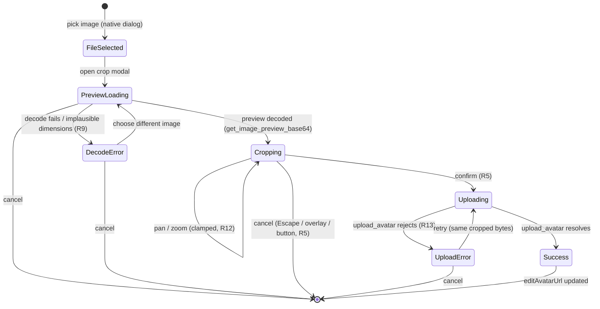
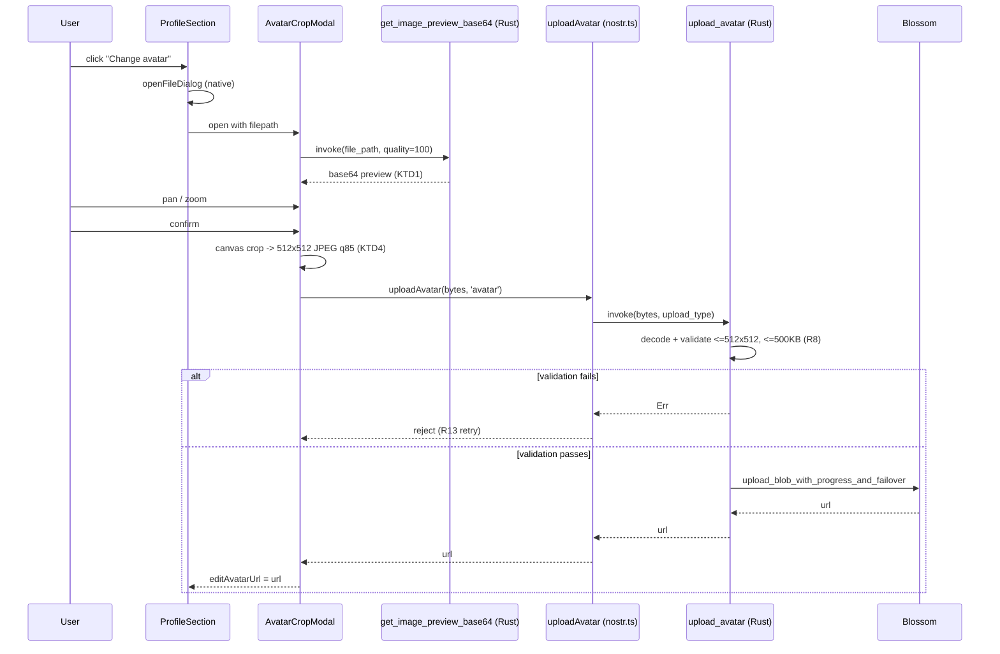

# Avatar Crop and Resize on Profile Setup - Plan

## Goal Capsule

- **Objective:** Let a user pan/zoom-crop their avatar image before it uploads, cap the uploaded file's dimensions and size so an oversized source photo doesn't cost every viewer a full-size download, and show recommended size/aspect guidance during selection, so avatars stop looking randomly zoomed in or oddly framed.
- **Product authority:** Standalone fix scoped to the existing avatar upload flow; no broader roadmap dependency.
- **Open blockers:** None. Both former implementation questions are resolved in Planning Contract (KTD1, KTD2).

## Product Contract

### Summary

Add an interactive crop step to the existing "Change avatar" flow: after picking an image file, the user pans and zooms a circular preview before confirming; the confirmed crop is resized/re-encoded to a fixed small output before upload. The picker also surfaces recommended image dimensions up front with a non-blocking warning for undersized images.

### Problem Frame

GitHub issue #127: users setting up a profile cannot resize the avatar image, so it can look zoomed in, and there is no guidance on a good source image size. Confirmed in `src/components/settings/ProfileSection.svelte` (`handleChangeAvatar`, lines 79-98): the native file picker (`openFileDialog`) only filters by file extension, then uploads the raw selected file directly via `uploadAvatar` with no crop or size step in between. The rendered avatar is a 128px circle with `object-fit: cover` (lines 423-429), so whatever region the browser's default crop lands on is what the user is stuck with — there is currently no way to choose which part of a non-square photo becomes the visible avatar. Separately verified: nothing in the upload path (`src-tauri/src/profile.rs:663-742`, `src-tauri/src/blossom.rs`) enforces a maximum file size — a large source photo uploads and gets downloaded by every viewer at full size, with no existing size cap for avatars anywhere in the backend.

### Requirements

**Image selection & guidance**

- R1. Before file selection, the user sees the recommended avatar resolution (at least 512x512, matching the R6 output cap) and aspect ratio (square, 1:1).
- R2. If the selected image is below 512x512, the app shows a warning but still allows the user to proceed with it.

**Crop interaction**

- R3. After a valid image file is selected, an interactive crop step opens with a circular preview matching the avatar's final square (1:1) display.
- R4. The user can pan and zoom the source image within the crop step to choose which region becomes the avatar.
- R5. Confirming the crop step applies the crop and uploads the cropped image as the new avatar; canceling discards the selection and leaves the current avatar untouched.
- R6. The confirmed crop is resized to a fixed maximum of 512x512 pixels, re-encoded as lossy JPEG at quality 85 (matching the existing re-encode convention in `src-tauri/src/message.rs:997`), and targets well under 500KB before upload, regardless of the source image's original dimensions or file size.

**Scope**

- R7. This applies to the avatar image only, via the existing "Change avatar" action in `ProfileSection.svelte`. Profile banner is out of scope — it currently has no upload UI at all (`profile.banner` is only ever preserved on save, never set through a control in this component).

**Server-side enforcement**

- R8. The backend `upload_avatar` command independently validates uploaded avatar bytes against the 512x512/500KB cap before forwarding to Blossom, rejecting oversized or wrong-dimension payloads regardless of which client code path produced the file.

**Error handling**

- R9. If the selected file fails to decode or reports implausible pixel dimensions, the crop step shows an inline error and lets the user pick a different file instead of failing silently.
- R10. The undersized-image warning (R2) is re-evaluated against the actual cropped region at confirm time, not only against the full source image at selection time.

**Interaction & accessibility**

- R11. The crop modal follows the app's existing dialog accessibility pattern: `role="dialog"`, `aria-modal`, focus trapped inside, and Escape triggers cancel (equivalent to R5's cancel behavior).
- R12. Zoom is clamped so the image always fully covers the circular crop (no zooming out below cover-fit), and pan is clamped so the image can't be dragged past the circle's edge, with a maximum zoom that avoids selecting a source region too small to upsample cleanly to 512x512.

**Upload feedback**

- R13. While the post-confirm resize and upload run, the crop step shows a busy indicator; on failure it shows a retry-capable error and leaves the current avatar unchanged (consistent with R5's cancel guarantee).

### Key Flows

- F1. **Crop and save a new avatar.** Trigger: user clicks "Change avatar" while editing their profile. Steps: file picker shows size/aspect guidance (R1) → user selects an image → crop step opens with pan/zoom circular preview (R3, R4) → user confirms → cropped image is resized/re-encoded to the capped output (R6) → upload populates the edit form's avatar (R5) → user saves the profile. Covers R1, R3, R4, R5, R6.
- F2. **Undersized source image.** Trigger: selected image is below the recommended minimum resolution. Steps: crop step still opens; a warning is shown; user may crop and proceed anyway; the warning is re-checked against the actual cropped region at confirm time (R10). Covers R2, R10.
- F3. **Cancel mid-crop.** Trigger: user opens the crop step then cancels instead of confirming. Outcome: no upload occurs; the profile edit form's avatar is unchanged. Covers R5.

### Acceptance Examples

- AE1. **Off-center photo.** A user selects a wide group photo where they appear off to one side. In the crop step they pan and zoom to center themselves in the circle, confirm, and the saved avatar shows that framing instead of an arbitrary default crop. Covers R3, R4, R5.
- AE2. **Small image, soft warning.** A user selects a 64x64 icon, below the 512x512 recommended minimum. The crop step still opens with a visible "image is smaller than recommended" warning; the user proceeds and the avatar uploads successfully. Covers R2.
- AE3. **Cancel preserves the existing avatar.** A user with an avatar already set opens "Change avatar," picks a new file, opens the crop step, then cancels. Returning to the edit form, their original avatar is still shown as unchanged. Covers R5.
- AE4. **Large source photo stays small on upload.** A user selects a 20MB DSLR photo. After cropping, the uploaded avatar file is at most 512x512 pixels and well under 500KB, regardless of the source file's size. Covers R6.

### Key Decisions

- **Interactive pan/zoom crop step, not auto-center-crop with guidance text only** (session-settled: user-directed — chosen over an auto-crop-only approach for full user control over framing). Governs R3, R4, R5.
- **Soft warning for undersized images, not a hard block or guidance-only** (session-settled: user-directed — chosen over silently blocking uploads or only showing hint text with no feedback on the actual selected file). Governs R2.
- **Fixed 512x512 output cap, well under 500KB, enforced client-side by construction** (session-settled: user-directed — chosen over a 256x256/200KB tighter cap, trading a little upload/download weight for headroom on high-DPI screens). Verified no upload-side size limit exists today (`src-tauri/src/profile.rs:663-742`); R8 adds a server-side backstop so the cap holds regardless of client. The size guarantee depends on the lossy JPEG re-encode in R6, not on fixed pixel dimensions alone. Governs R6, R8.
- **Avatar-only scope.** Verified there is no banner upload control anywhere in `ProfileSection.svelte` today (`profile.banner` is display-only, wired through on save but never set by any button); adding banner upload is new scope beyond issue #127, not a same-flow extension. Also verified banner and avatar are independent, non-overlapping blocks in the current layout (`:396-429` — banner is a full-width rectangle, avatar is a separate centered circle below it), so avatar cropping has no compositing dependency on banner sizing. Governs R7.

### Scope Boundaries

- Banner image upload and crop — no upload UI exists for banner today (a wide, non-square aspect ratio, e.g. 3:1), so this would need its own upload control and crop step, not a reuse of the avatar flow's UI; considered and explicitly deferred to a separate future item.
- Image filters, rotation, or adjustments beyond pan/zoom crop.
- Re-cropping an already-saved avatar without re-selecting the source file (re-running "Change avatar" with the same file is sufficient).
- Animated GIF avatars: `gif` stays an allowed picker extension, but R6's re-encode produces a static image, so an animated GIF avatar loses its animation after cropping.

### Dependencies / Assumptions

- The crop step cannot load the picker's selected file path via `convertFileSrc` for an in-app preview: the app's asset protocol scope is restricted to `$APPDATA/cache/**` (`src-tauri/tauri.conf.json:29-33`), which does not cover an arbitrary freshly-picked file. The existing `convertFileSrc` usage for cached avatar/banner display (`src/lib/utils/profile.ts:1-52`) only works because those paths are already inside that scope.
- The crop aspect ratio (1:1, circular) is fixed by the avatar's existing display size and shape (`src/components/settings/ProfileSection.svelte:423-429`, 128px circle, `object-fit: cover`); the 512x512 output cap (R6) gives roughly 4x headroom over that display size for higher-DPI screens.

### Outstanding Questions

- **Resolved (KTD2):** `uploadAvatar` (`src/lib/api/nostr.ts:197-208`) and the backend `upload_avatar` command (`src-tauri/src/profile.rs:663-666`) change from filepath-based input to bytes-based input; the crop step's client-side canvas output reaches the backend as base64 bytes, not a filesystem path. See Planning Contract.
- **Resolved (KTD1):** The crop step's live preview reuses the existing, currently-unused `get_image_preview_base64` command (`src-tauri/src/message.rs:1907`), which already reads arbitrary picker-selected paths on shipped desktop targets and returns a base64 data URI — no new command needed (its Android branch is a separate pre-existing gap, see KTD1). See Planning Contract.
- **Deferred:** Touch pinch-zoom for R4/R12's pan/zoom interaction has no mechanism in U3's Approach (only `wheel`+`ctrlKey` and pointer drag, both desktop-oriented). Android has no buildable `gen/android` scaffold in this repo today (see KTD1's Android-branch note), so this plan does not add touch-gesture support; revisit if/when Android becomes a real target for this flow.
- **Deferred:** Keyboard-only pan/zoom for R4/R11/R12. R11 covers dialog-level accessibility (focus trap, Escape-cancel), but the crop mechanism itself (pan/zoom) has no keyboard path in U3's Approach. Exact bindings and step increments need a design decision; not added in this plan.

### Sources / Research

- `src/components/settings/ProfileSection.svelte:79-98` — current `handleChangeAvatar`: file picker → direct upload, no crop step.
- `src/components/settings/ProfileSection.svelte:423-429` — avatar rendered as a 128px circle, `object-fit: cover`.
- `src/components/settings/ProfileSection.svelte:149-167` — banner is display-only; no banner upload control exists in this component.
- `src/lib/api/nostr.ts:192-208` — `uploadAvatar(filepath, uploadType)` uploads a file path directly; no resize/crop step.
- `src-tauri/src/profile.rs:663-666` — backend `upload_avatar` command signature (filepath + upload_type).
- `src/lib/utils/profile.ts:1-52` — existing `convertFileSrc` pattern for displaying local file paths as images in the Tauri webview.
- `src-tauri/src/blossom.rs:362-366` — `upload_blob_with_progress_and_failover` uploads whatever bytes it's given with no size validation.
- `src-tauri/src/audio.rs:953-958`, `src-tauri/src/image_cache.rs:324-327` — the only existing file-size caps in the backend (notification sounds, cached image reads), neither applicable to avatar upload.
- `src-tauri/tauri.conf.json:29-33` — `assetProtocol.scope` is restricted to `$APPDATA/cache/**`, which a freshly picker-selected file is not under.
- `src-tauri/src/message.rs:997` — existing JPEG re-encode convention (`JpegEncoder::new_with_quality(&mut cursor, 85)`) reused for R6's re-encode quality.
- `src/components/ui/Modal.svelte` — shared dialog: focus trap, Escape/overlay dismiss, `dismissible` prop for in-flight async work; pattern reused for R11/KTD5.
- `src-tauri/src/message.rs:1907` — existing unused `get_image_preview_base64(file_path, quality)` command; reused for the crop preview per KTD1.
- `src-tauri/src/util.rs:404-456` — `nearest_neighbor_downsample`, used internally by `get_image_preview_base64`.
- `src-tauri/src/message.rs:1519` — `img.resize(..., FilterType::Lanczos3)` resize-filter convention.
- `src-tauri/Cargo.toml:63` — `base64 = "0.22.1"`, reused for KTD2's server-side decode.
- `src/lib/api/nostr.test.ts:186-193` — existing test convention for `uploadAvatar`, updated in U2.
- `src/components/backup/BackupVerificationModal.svelte:181`, `src/components/wallet/WalletHomeSendModal.svelte:284-285` — existing `dismissible={!busyFlag}` precedent for async-work modals, mirrored in KTD5.
- `src/lib/i18n/locales/en/profile.json` — existing `profile.*` key namespace/style, extended with `profile.crop.*` keys.

---

## Planning Contract

**Product Contract preservation:** unchanged — all R/A/F/AE IDs and Key Decisions carried verbatim from the brainstorm; both former Outstanding Questions are resolved below by KTD1 and KTD2.

### Key Technical Decisions

- KTD1. **Reuse the existing, currently-unused `get_image_preview_base64` command for the crop step's live preview** (`src-tauri/src/message.rs:1907`), calling it with `quality=100` against the picker-selected filepath, instead of adding a new preview command. The command already reads arbitrary picker-selected paths on non-Android desktop targets — decodes, and returns a base64 data URI; at quality 100 it applies no downsampling, only its existing JPEG-quality-70 (or lossless PNG for alpha) re-encode. That re-encode is a negligible quality cost against a 512x512 final output, and for AE4's large-photo case it typically *shrinks* the IPC payload versus sending the raw file. The command also carries an Android branch (`message.rs:1984-1992`) intended to read from `ANDROID_FILE_CACHE`, but that branch calls `filesystem::read_android_uri_bytes`, which is not defined anywhere in this crate — it would not currently compile for Android, and no `gen/android` scaffold exists in this repo today, so this reuse decision is scoped to the shipped desktop targets; the Android branch is a pre-existing gap this plan neither introduces nor is required to fix. Alternative considered: a new raw-passthrough command returning unmodified original bytes — rejected as new backend surface with no visible benefit at 512x512 output resolution, and a strictly larger payload for large sources. Resolves the former Outstanding Question on preview delivery. Governs R3, R4.
- KTD2. **Change `upload_avatar` from filepath-based input to bytes-based input** (`bytes: String`, base64; replacing `filepath: String`), decoding via the existing `base64` crate (`src-tauri/Cargo.toml:63`), and perform R8's dimension/size validation immediately after decode, before the Blossom upload call, gated on `upload_type == "avatar"`. `uploadAvatar`'s one live caller (`ProfileSection.svelte:90`) is updated in this same plan (U2, U4), and `upload_type: "banner"` has no live UI caller today (Scope Boundaries), so this is a clean break with nothing else to migrate. It also removes the Android-specific `filesystem::read_android_uri` branch from `upload_avatar` entirely — bytes now always arrive from the client's already-loaded canvas, which itself works on shipped desktop targets via KTD1's preview command (Android reuse is a pre-existing gap noted in KTD1). Banner's future crop flow (deferred, Scope Boundaries) will reuse this same bytes-based path; its mime handling is deferred alongside banner itself. (session-settled: user-approved — chosen over adding a parallel `bytes` parameter alongside the existing `filepath` parameter: with exactly one live caller, a clean break avoids permanent dual-input branching and a write-then-read temp-file workaround.) Resolves the former Outstanding Question on bytes delivery. Governs R6, R8.
- KTD3. **Render R1's size/aspect guidance as always-visible inline helper text next to the "Change avatar" control**, not a separate pre-picker confirmation dialog. (session-settled: user-approved — chosen over a pre-picker dialog: keeps the existing single-click "open native picker" flow intact and avoids an extra step for every avatar change.) Governs R1.
- KTD4. **Client-side crop confirm produces the final JPEG via `<canvas>`**: draw the panned/zoomed source region into an offscreen 512x512 canvas — filled white first, since canvas has no native alpha-to-JPEG blending and a PNG/GIF/WEBP source may carry transparency inside the crop region — at a `devicePixelRatio`-aware resolution, then `canvas.toBlob('image/jpeg', 0.85)`. If the resulting blob exceeds a safety margin under the 500KB cap (e.g. >400KB), step the JPEG quality down (85 -> 75 -> 65 -> ...) and re-encode until under budget. This makes R6's "well under 500KB, regardless of source" promise hold even for adversarial high-entropy source images, not just typical photos. Governs R6.
- KTD5. **All three crop-modal dismiss paths (Escape, overlay click, explicit Cancel button) route through the shared `Modal.svelte`'s single `onClose` callback** — its `dismissible` prop already unifies Escape and overlay-click, and the Cancel button wires to the same handler — so R5/R11's cancel guarantee is structural, not three independently-implemented paths that can drift. `dismissible={!uploading}` while the busy/uploading state is active, mirroring the existing convention used by every other async-work modal in this codebase (e.g. `BackupVerificationModal.svelte:181`, `WalletHomeSendModal.svelte:285`). The explicit Cancel button additionally carries `disabled={uploading}` — `dismissible` only gates Escape and overlay-click, not a button rendered in the modal's own slot content — matching `WalletHomeSendModal.svelte:385`'s button-level guard alongside its `dismissible={!sending}`. Governs R5, R11, R13.

### High-Level Technical Design

Two aspects benefit from visualization: the crop step's state machine (idle through upload retry) and how image bytes flow across the webview/backend boundary.

**Crop step lifecycle:**



**Bytes flow (client crops and encodes; server only validates):**



### Risks & Dependencies

- **EXIF orientation.** Phone-camera photos commonly carry an EXIF orientation tag; if the webview's `<canvas>` `drawImage()` doesn't auto-apply it (most modern engines do, following spec changes over the last several years, but Tauri's system webviews vary by OS — WKWebView, WebView2, WebKitGTK), a cropped avatar from a sideways/rotated phone photo could come out rotated or mirrored. Verify empirically with a real phone-photo test image on each target platform before considering U3 done; if not auto-handled, read and apply the EXIF `Orientation` tag before drawing.
- **Large-source preview latency.** `get_image_preview_base64` at quality 100 (AE4's 20MB DSLR case) still decodes and re-encodes at full resolution before the crop modal becomes interactive — expect a brief (sub-second to low-seconds) delay proportional to source resolution. U1/U3 should show a loading state in the crop modal while the preview command resolves, matching the `PreviewLoading` state above.

---

## Implementation Units

### U1. Backend: bytes-based `upload_avatar` with server-side validation backstop

- **Goal:** Replace `upload_avatar`'s filepath input with bytes input and add the R8 dimension/size validation backstop.
- **Requirements:** R6, R8 (F1; KTD2)
- **Dependencies:** none
- **Files:**
  - `src-tauri/src/profile.rs` (`upload_avatar`, ~663-742)
  - `src-tauri/src/profile.rs` (new `#[cfg(test)]` module for the validation helper)
- **Approach:**
  1. Change the signature to `pub async fn upload_avatar(bytes: String, upload_type: Option<String>) -> Result<String, String>`.
  2. Decode `bytes` via `base64::engine::general_purpose::STANDARD.decode(...)`, mapping decode errors to a clear message.
  3. Extract a pure helper (e.g. `fn validate_avatar_bytes(bytes: &[u8]) -> Result<(), String>`) that, in order: (a) rejects `bytes.len() > 500_000` immediately, before any decode; (b) decodes using the `image` crate's `Limits` API with `max_image_width`/`max_image_height` set to 512 (an explicit `Limits`, not the unbounded `image::load_from_memory`), so a small file with a maliciously large declared header can't force a multi-gigabyte pixel-buffer allocation before its dimensions are ever checked; (c) confirms the guessed/decoded format is JPEG (`image::guess_format`), rejecting any other format so step 5's hardcoded `extension`/mime stays accurate and non-JPEG decoders never run on untrusted bytes; (d) checks `width <= 512 && height <= 512`. Returns a descriptive `Err` on the first violation — kept free of Tauri state so it's unit-testable in isolation (no existing `#[cfg(test)]` module in `profile.rs` today).
  4. Call the helper only when `upload_type == "avatar"` (default), before building `AttachmentFile` / calling Blossom.
  5. Hardcode `extension: "jpg"`, mime `"image/jpeg"` for the avatar path (client always sends JPEG per R6); remove the `#[cfg(target_os = "android")]` `read_android_uri` branch entirely (bytes no longer come from a filesystem path).
  6. Keep the existing progress-emit, precache, and Blossom-upload logic unchanged downstream of the decoded bytes.
- **Patterns to follow:** existing `handle.fs().read(...).map_err(...)` error-mapping style (`profile.rs:675`); `image::load_from_memory` + dimension checks per `message.rs` conventions; base64 decode mirrors the existing `base64::engine::general_purpose::STANDARD.encode` usage (`message.rs:1151`) in reverse.
- **Test scenarios:**
  - Valid 512x512 JPEG bytes under 500KB: `validate_avatar_bytes` returns `Ok`.
  - 600x600 JPEG bytes: `validate_avatar_bytes` returns `Err` (dimension violation).
  - Valid dimensions but `bytes.len() > 500_000`: returns `Err` (size violation).
  - Malformed / non-image bytes (fails to decode): returns `Err` with a decode-failure message, not a panic.
  - Malformed base64 input to `upload_avatar` itself: returns `Err`, not a panic.
  - Non-JPEG image (e.g. a valid PNG) within size/dimension limits: `validate_avatar_bytes` returns `Err` (format violation).
  - A file under 500KB whose header declares implausibly large dimensions (e.g. 50000x50000): rejected via the `Limits`-bounded decode without allocating a full-resolution pixel buffer (decompression-bomb guard).
- **Verification:** `cd src-tauri && cargo test profile::` covers the new validation helper; `cargo build` confirms the signature change and Android-branch removal compile cleanly.

### U2. Frontend: `uploadAvatar` API wrapper takes bytes

- **Goal:** Update the typed wrapper to match U1's new bytes-based backend contract.
- **Requirements:** R6, R8 (F1; KTD2)
- **Dependencies:** U1
- **Files:**
  - `src/lib/api/nostr.ts` (`uploadAvatar`, ~192-208)
  - `src/lib/api/nostr.test.ts` (~186-193)
- **Approach:**
  1. Change the signature to `uploadAvatar(bytes: string, uploadType: 'avatar' | 'banner'): Promise<string>` (bytes = base64, no data-URI prefix).
  2. Update the `invoke('upload_avatar', { ... })` call to pass `{ bytes, upload_type: uploadType }`.
  3. Update the existing test's mock assertion from `{ filepath, upload_type }` to `{ bytes, upload_type }`.
- **Patterns to follow:** existing `dmLog`/`dmError` logging around the invoke call; existing vitest `vi.mock('@tauri-apps/api/core')` + `vi.mocked(invoke)` pattern (`nostr.test.ts`).
- **Test scenarios:**
  - `uploadAvatar(base64Bytes, 'avatar')` calls `invoke('upload_avatar', { bytes: base64Bytes, upload_type: 'avatar' })` and returns the resolved URL.
  - Invoke rejection propagates as a rejected promise (error passthrough, no silent swallow).
- **Verification:** `pnpm test src/lib/api/nostr.test.ts`.

### U3. Frontend: `AvatarCropModal` component (pan/zoom crop, client-side encode)

- **Goal:** New component implementing the interactive crop step end to end — preview load, pan/zoom, confirm-to-upload, cancel, error/retry.
- **Requirements:** R2, R3, R4, R5, R9, R10, R11, R12, R13 (F1, F2, F3; KTD1, KTD4, KTD5)
- **Dependencies:** U2
- **Files:**
  - `src/components/settings/AvatarCropModal.svelte` (new)
  - `src/lib/i18n/locales/en/profile.json`, `src/lib/i18n/locales/es/profile.json` (`profile.crop.*` keys)
- **Approach:**
  1. Wrap `src/components/ui/Modal.svelte` (`titleId`, `descriptionId`, `onClose`, `dismissible={!uploading}`) per KTD5; props: `open: boolean`, `filepath: string`, `onConfirm: (url: string) => void`, `onCancel: () => void` (callback-prop convention matching every other modal in this codebase — no `createEventDispatcher` usage exists here).
  2. On open, invoke `get_image_preview_base64` with `file_path` set to the picker-selected path and `quality=100` (KTD1; note the underscore — distinct from `upload_avatar`'s `filepath` parameter); while pending, render a loading state (`PreviewLoading` in the HTD state diagram); on error, render the decode-failure state (R9, `role="alert"`) with a "choose different image" action that re-opens the native file dialog without closing the modal.
  3. After decode, check `naturalWidth`/`naturalHeight` for implausible values (0, or absurdly large) as an additional R9 check beyond decode failure.
  4. Pan/zoom: cover-fit minimum zoom (image always fully covers the circular crop), clamped maximum pan (can't drag the image edge inside the circle), and a maximum zoom clamp so the selected source region can't shrink below roughly 512x512 source pixels (R12) — wheel/trackpad-pinch (`wheel` + `ctrlKey`) with `{ passive: false }` to allow `preventDefault()`, plus pointer drag for panning.
  5. Evaluate R2/R10's undersized warning (`role="status"`) against the *currently selected crop region's effective source resolution* (not the full source image), re-evaluated on every pan/zoom change and again at confirm time.
  6. On confirm: draw the selected region into an offscreen 512x512 canvas per KTD4 (white background fill, `devicePixelRatio`-aware draw, quality-stepdown loop), base64-encode the resulting blob, set `uploading = true`, call `uploadAvatar(bytes, 'avatar')` (U2). On success, call `onConfirm(url)`. On failure, show an inline retry-capable error (R13, `role="alert"`) and keep the modal open with the same cropped bytes so retry doesn't require re-cropping.
  7. Cancel (Escape / overlay-click / explicit Cancel button — all wired to the same `onClose`/`onCancel` per KTD5; the Cancel button additionally carries `disabled={uploading}` so a mid-upload click can't close the modal before the in-flight upload resolves and silently overwrite `editAvatarUrl`) discards the selection with no upload; the parent's avatar stays unchanged.
- **Technical design** (directional, not implementation-ready code):
  ```
  minZoom = coverFitZoom(imageSize, cropDiameter)
  maxZoom = cropDiameter / 512   // zoom = CSS px per source px; never lets the selected crop region shrink below ~512 source px across the crop diameter
  zoom = clamp(zoom, minZoom, maxZoom)
  pan = clampToKeepCoverage(pan, zoom, imageSize, cropDiameter)
  ```
- **Patterns to follow:** `Modal.svelte` integration exactly as used in `WalletHomeSendModal.svelte:284-285` / `BackupVerificationModal.svelte:180-181` (`{#if open}` + `dismissible={!busyFlag}`); component-local reactive state (`let ...`) per `ProfileSection.svelte:70-75`, not a new global store; i18n keys follow the existing `profile.*` namespace and naming style.
- **Execution note:** Verify EXIF-oriented preview/crop correctness empirically (see Risks & Dependencies) before considering this unit done.
- **Test scenarios:**
  - Happy path: preview loads, pan/zoom changes crop region, confirm uploads and calls `onConfirm(url)`. Covers AE1.
  - Undersized source (below 512x512): warning shown, user can still confirm and upload succeeds. Covers AE2.
  - Cancel via Escape, via overlay click, and via the Cancel button all leave the parent's avatar unchanged and never call `uploadAvatar`. Covers AE3.
  - Canceling (Escape / overlay click / Cancel button) while the preview is still loading (before `get_image_preview_base64` resolves) dismisses the modal with no side effects and never calls `uploadAvatar`.
  - Confirm with a large (>512x512) source: uploaded bytes decode to exactly 512x512 and stay under 500KB. Covers AE4.
  - Zoom clamped at minimum (cover-fit) and at maximum (512px-source floor); pan clamped so the circle never shows outside the image.
  - Undersized warning re-evaluated against the cropped region, not just the full source: a large source zoomed in tight enough to select a sub-512px region shows the warning even though the source itself was large enough (R10).
  - Decode failure (corrupt bytes / non-image despite passing the extension filter): inline error shown, "choose different image" re-opens the picker without closing the modal, no upload attempted (R9).
  - Implausible dimensions (e.g. 0x0 or absurd width/height): treated as a decode-class error (R9).
  - Upload failure after confirm: busy indicator during upload, retry-capable inline error on failure, `dismissible=false` while uploading (R13); retry re-sends the same cropped bytes without re-cropping.
  - Quality-stepdown fallback: a synthetic high-entropy 512x512 source that would exceed 500KB at quality 85 gets re-encoded at a lower quality until under budget (KTD4).
- **Verification:** This repo has no component-level Svelte test harness (`Test expectation` on the component itself is a manual/MCP walkthrough, not `pnpm test`); MCP-driven UI verification per AGENTS.md's Tauri MCP workflow (pan/zoom, cancel via all three paths, confirm, undersized warning, decode-failure recovery, upload retry) with screenshots as evidence.

### U4. Wire `AvatarCropModal` into `ProfileSection`, R1 guidance text

- **Goal:** Replace the current direct-upload `handleChangeAvatar` with the crop-modal flow, and surface R1's sizing/aspect guidance.
- **Requirements:** R1, R7 (F1, F3; KTD3)
- **Dependencies:** U3
- **Files:**
  - `src/components/settings/ProfileSection.svelte` (`handleChangeAvatar`, ~79-98; avatar edit control, ~216-230)
  - `src/lib/i18n/locales/en/profile.json`, `src/lib/i18n/locales/es/profile.json` (`profile.crop.guidance` key, if not already added in U3)
- **Approach:**
  1. Add always-visible inline helper text near the "Change avatar" control (KTD3), i18n'd, stating the recommended minimum resolution (512x512) and aspect ratio (square, 1:1) per R1.
  2. Change `handleChangeAvatar` so, after `openFileDialog` returns a path, it opens `AvatarCropModal` with that `filepath` instead of calling `uploadAvatar` directly.
  3. Wire `onConfirm={(url) => { editAvatarUrl = url; }}` and `onCancel={() => {}}` (no-op; selection discarded, existing `editAvatarUrl` untouched) per AE3.
  4. Remove the now-unused direct `uploadAvatar`/`uploadingAvatar` call from `handleChangeAvatar` (the crop modal owns its own upload/busy state per U3); confirm whether `uploadingAvatar`/`saveError` local state is still needed elsewhere in the component (profile save flow) before deleting any of it.
- **Patterns to follow:** existing `openFileDialog` filter config (`ProfileSection.svelte:82-86`, extensions unchanged); existing icon-button/edit-control styling for placement of the new guidance text.
- **Test scenarios:**
  - Clicking "Change avatar" still opens the native file dialog with the same extension filters as today.
  - Selecting a file opens `AvatarCropModal` with that filepath (rather than uploading immediately).
  - Guidance text is visible before any file is selected (R1).
  - Confirming a crop updates `editAvatarUrl` (visible on the next `handleSaveProfile`); canceling leaves it unchanged (AE3).
- **Verification:** `pnpm test` for any covered logic; MCP-driven UI walkthrough of the full "Change avatar" -> crop -> save flow per AGENTS.md's UI Validation workflow, since this is a user-visible flow change.

---

## Verification Contract

| Command | Applies to | What it proves |
|---|---|---|
| `pnpm test src/lib/api/nostr.test.ts` | U2 | `uploadAvatar` wrapper's new bytes contract |
| `pnpm test` | U1-U4 | full frontend suite, no regressions |
| `pnpm check` | U3, U4 | Svelte/TypeScript types clean for the new component and wiring |
| `pnpm lint` | all | zero new lint violations (AGENTS.md: run before commit) |
| `cd src-tauri && cargo test profile::` | U1 | `validate_avatar_bytes` dimension/size backstop |
| `cd src-tauri && cargo build` | U1 | signature change + Android-branch removal compiles |
| Tauri MCP walkthrough (AGENTS.md UI Validation) | U3, U4 | pan/zoom, cancel (all 3 paths), confirm, undersized warning, decode-failure recovery, upload retry — screenshots + DOM snapshot as evidence |

---

## Definition of Done

- All four units implemented and passing their listed verification.
- `pnpm lint`, `pnpm check`, `pnpm test`, and `cd src-tauri && cargo test` all pass with zero new failures.
- AE1-AE4 each demonstrated via the MCP walkthrough (screenshots attached to the PR/handoff).
- No dead code left behind: `uploadingAvatar`/`saveError` local state in `ProfileSection.svelte` reviewed and removed if the crop modal fully supersedes their avatar-upload use (retained only if still used by the profile-save path).
- `get_image_preview_base64` has its first real caller (no longer dead code).
- The EXIF-orientation risk (Risks & Dependencies) is explicitly verified on at least one platform with a real phone-photo test image before this plan is considered done.
