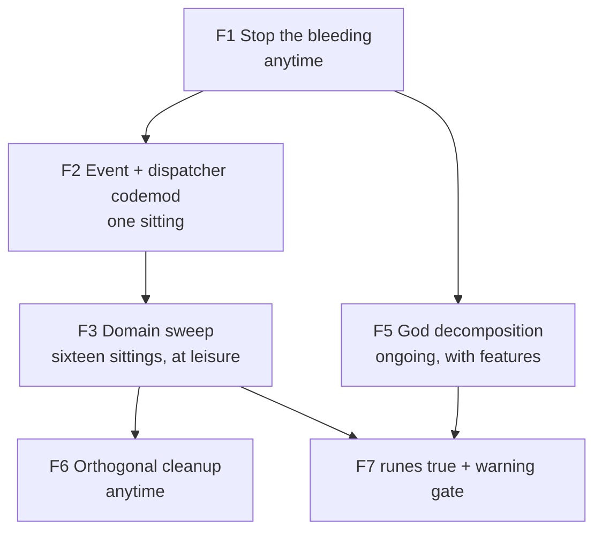
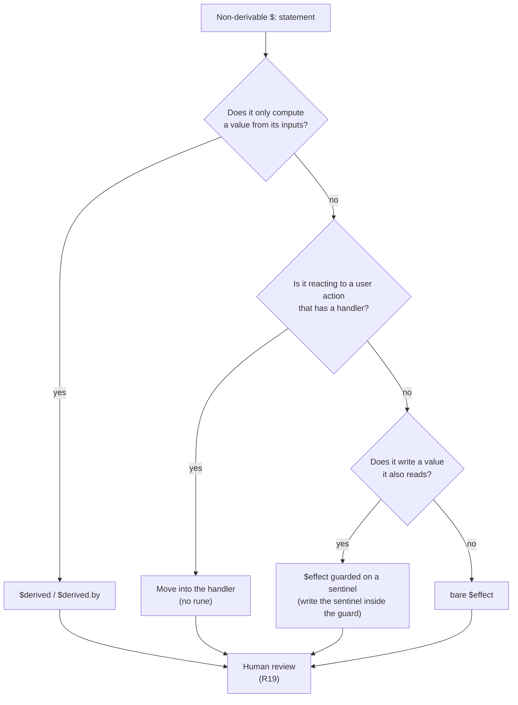
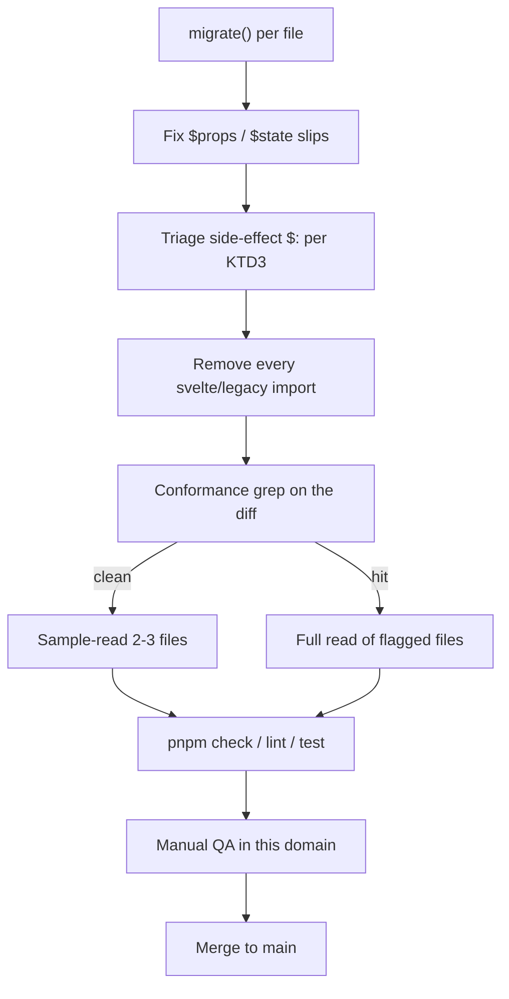

# Svelte 5 Runes Migration - Plan

## Goal Capsule

- **Objective:** Convert 125 of the 128 components to Svelte 5 runes in sixteen independently-landable batches, then close the gate with `compilerOptions.runes: true` plus a zero-deprecation-warning check. The three god components stay legacy shells and are decomposed into runes children as feature work touches them.
- **Authority hierarchy:** The Product Contract owns product scope and batch policy. The Planning Contract owns conversion mechanics and gate composition. A unit overrides neither.
- **Product authority:** This plan owns the component layer only. The 44 store modules under `src/stores/` stay on `svelte/store`.
- **Execution profile:** One batch per sitting, merged to `main` before the next starts. No feature freeze and no coordinated cutover window, with one coordination point: U2 touches every component file, so component-touching feature branches either land before it starts or rebase after it merges.
- **Stop conditions:** Stop and surface if a batch cannot reach `pnpm check` 0 errors, if a side-effect conversion changes observable behavior in manual QA, or if a `svelte/legacy` import cannot be removed from a converted file.
- **Tail ownership:** Each batch is its own commit and its own merge. No batch waits on a later one.
- **Open blockers:** None.

---

## Product Contract

### Summary

Convert 125 components to runes in sixteen domain-sized batches that each land independently on `main`, preceded by a small pre-cleanup, a repo-wide event-directive codemod, and a DM dispatcher-to-callback conversion. The three god components are decomposed rather than converted. Slot-providing components convert inside their own domain batches — research disproved the interop constraint that previously required holding them back for a coordinated cutover.

### Problem Frame

Svelte `5.46.0` is installed and shipping. Nothing is broken, no deprecation removes legacy syntax today, and no performance complaint exists. The pressure is a closing window rather than an accruing cost: the product is pre-alpha with no production users, so the blast radius of a reactivity regression is the lowest it will ever be, and the codebase is 128 components rather than the 300 it will be after the planned roadmap lands.

The roadmap spreads evenly across messaging, governance, wallet, and Commons, so waiting and converting only on touch would leave the codebase mixed-idiom indefinitely with no point at which enforcement becomes possible.

The hazard surface is unusually clean.
There are zero `let:` directives, zero named slots, zero `$$props`/`$$restProps`/`$$slots` reads, zero `<svelte:self>`, and only six `<slot>` sites.
Cross-mode interop is permissive in both directions, so no batch can break another.
Against that, the reactive surface is large — 742 `$:` statements, 777 `export let` declarations, 514 `on:` directives, 186 `bind:` usages — and roughly 252 of the `$:` statements are side effects rather than computed values.
That last group is the real cost: `$:` and `$effect` differ in timing, dependency tracking, and re-run behavior, and a wrong conversion compiles, type-checks, and looks correct.

### Key Decisions

- KD1. **Sweep the 125 normal components; decompose the 3 god components instead of converting them.** (session-settled: user-directed — chosen over converting all 128: converting `ChatView.svelte` yields a 1643-line runes component, which preserves the actual problem in new syntax.) Governs R16, R17.
- KD2. **Batch by domain directory, not by risk tier.** Side-effect `$:` blocks appear in 68 non-god files spread across every domain, so a quarantined "risky files" tier is not constructible; the domain directory doubles as the manual-QA scope. Governs R10, R12, R21.
- KD3. **Batches are independently landable; no feature freeze.** Legacy and runes components interoperate for props, events, `bind:`, and slot content in both directions, so a converted and an unconverted file coexist on `main` indefinitely. Governs R11, R13, R14.
- KD4. **The store layer stays on `svelte/store`.** (session-settled: user-approved — chosen over converting the 7 simple stores or all 44: `$store` works in runes mode and is not deprecated, so there is no deadline, and the only measurable payoff is finer invalidation on ~6 record-shaped stores against no observed performance problem.) Governs R23.
- KD5. **The done gate is `compilerOptions.runes: true` plus a zero-deprecation-warning check.** `runes: true` alone hard-errors `export let` and `$:` but only warns on `on:` and `<slot>` and silently accepts `createEventDispatcher` and `svelte/legacy` imports, so it is unfakeable for the two largest constructs and blind to the rest. Governs R3, R25, R26.
- KD6. **The event-directive codemod runs before the sweep, not after.** `event_directive_deprecated` fires only in runes-mode components, so converting files first would generate fresh `on:` warnings in every batch and destroy the warning count as a verification signal. Governs R7, R9.
- KD7. **Mechanical batches are reviewed by pattern audit; side-effect conversions are not.** (session-settled: user-approved — chosen over reading every diff: the transformation is deterministic, so sampling plus a conformance check is the difference between one day of review and two and a half.) Governs R18, R19.
- KD8. **Pre-cleanup splits by migration leverage.** Only the work that reduces migration volume runs first; the orthogonal cleanup costs the same afterward and would otherwise put two large diffs over the same files back to back. Governs R4, R5, R6.

### Requirements

**Enforcement and authoring policy**

- R1. `AGENTS.md` instructs agents to author runes in all new and rewritten `.svelte` files; the instruction not to introduce `$state`/`$derived` is removed.
- R2. Every new component created after R1 lands is authored in runes mode.
- R3. `compilerOptions.runes: true` is set in `svelte.config.js` once no legacy-mode component remains.

**Pre-migration cleanup**

- R4. The 4 props reported by `export_let_unused` are deleted rather than converted.
- R5. The computed block duplicated across `src/components/commons/CommonsBroadcastCard.svelte` and `src/components/commons/CommonsBroadcastDetailModal.svelte` is extracted to one shared module before either file is converted.
- R6. Orthogonal cleanup — 54 unused CSS selectors and the remaining accessibility warnings — runs after the sweep completes.

**Event and component-event conversion**

- R7. All 514 `on:` directives convert to event attributes in a single change.
- R8. The 29 modifier-carrying directives convert to handlers that preserve their `stopPropagation` and `preventDefault` semantics.
- R9. R7 lands before the first domain batch.
- R24. The four components using `createEventDispatcher` convert to callback props, together with the three consumers that listen to their events.

**Domain sweep**

- R10. Components convert in domain-directory batches, each landing on `main` independently.
- R11. Each batch leaves the application working; no batch depends on a later batch.
- R12. Batches run in this order: `ui/`, `announcements/`, the small-file cluster (`auth/`, `backup/`, `squad/`, `profile/`, `inbox/`, `updater/`), `settings/`, `channel/`, `dm/`, `wallet/`, `commons/`, `parent/`, `parent/dashboard/`, `parent/governance/`, `layout/`, `src/routes/+layout.svelte`. Every directory holding a `.svelte` file appears exactly once.
- R13. A batch is scheduled against a domain that no in-flight feature branch is modifying.
- R25. No converted file imports from `svelte/legacy`.

**Slot providers**

- R14. The six slot-providing components — `src/components/ui/Modal.svelte`, `ui/ResizableSidebar.svelte`, `ui/Tab.svelte`, `src/components/settings/SettingsPage.svelte`, `settings/SettingsCollapsibleSection.svelte`, and `src/routes/+layout.svelte` — convert inside their own domain batches, replacing `<slot />` with `{@render children()}` in the same change. No consumer changes with them.
- R15. `src/routes/+layout.svelte` converts as the final batch, since it is the only file in `src/routes/` outside the god shell.
- R27. A permanent regression test proves that a legacy-mode parent renders content into a runes-mode child through `{@render children()}`, so the assumption the batch independence rests on stays executable rather than asserted.

**God component decomposition**

- R16. `src/routes/+page.svelte`, `src/components/channel/ChatView.svelte`, and `src/components/parent/ParentDashboard.svelte` are not converted wholesale.
- R17. Functionality is carved out of each shell into runes-native child components as feature work touches that area.

**Verification**

- R18. A mechanical batch is reviewed by pattern audit: a sample is read closely and the remainder verified by a conformance check that flags any diff containing a construct outside the known transformation set.
- R19. Every side-effect `$:` conversion receives human judgment and is never accepted on a conformance check alone.
- R20. Component tests are added for side-effect conversions, using a per-file jsdom environment rather than a global change to the Vitest environment. A conversion that guards a secret reveal, a transaction submission, or a capability gate carries a test asserting the guard holds across a re-run; manual QA alone is not sufficient for those.
- R21. Each batch is manually exercised in its own domain before the next batch starts.
- R22. `pnpm check` reports 0 errors, `pnpm lint` reports 0 problems, and `pnpm test` passes at every batch boundary.
- R26. At the gate, `pnpm check` reports zero `event_directive_deprecated` and zero `slot_element_deprecated` warnings, and no `createEventDispatcher` import remains in `src/`.

**Store layer**

- R23. The 44 modules under `src/stores/` keep their `svelte/store` implementation; runes components read them through `$store` auto-subscription.

### Key Flows

- F1. Stop the bleeding
  - **Trigger:** Plan accepted.
  - **Steps:** Invert the `AGENTS.md` Svelte guidance; delete the unused props; extract the duplicated Commons broadcast computeds.
  - **Outcome:** New code stops adding legacy syntax; work that would have been migrated needlessly or twice is gone.
  - **Scheduling:** Anytime. No coordination.
  - **Covered by:** R1, R2, R4, R5

- F2. Event and component-event codemod
  - **Trigger:** F1 complete and no feature branch mid-flight.
  - **Steps:** Convert 470 plain directives to event attributes; convert 29 modifier directives to explicit handlers; convert 15 bare-forwarding directives to callback props or inline handlers; convert the four DM dispatchers to callback props.
  - **Outcome:** Zero `on:` directives and zero `createEventDispatcher` calls remain, so no batch generates deprecation noise.
  - **Scheduling:** Touches most files, so it lands the same day it starts. Not a freeze.
  - **Covered by:** R7, R8, R9, R24

- F3. Domain sweep
  - **Trigger:** F2 landed.
  - **Steps:** For each batch in R12 order, convert its components (excluding any god component), pattern-audit the diff, apply judgment to that batch's side-effect blocks, exercise the domain manually, and merge.
  - **Outcome:** 125 components in runes mode, arrived at through sixteen independent merges.
  - **Scheduling:** At leisure, one batch per sitting, against a domain no feature branch is touching.
  - **Covered by:** R10, R11, R12, R13, R14, R15, R18, R19, R20, R21, R22, R25

- F5. God component decomposition
  - **Trigger:** Any feature touching a god component.
  - **Steps:** Carve the affected functionality into a runes-native child component hosted by the legacy shell; ship it with the feature.
  - **Outcome:** Each shell shrinks until converting the remainder is trivial.
  - **Scheduling:** Ongoing, no deadline.
  - **Covered by:** R16, R17

- F6. Orthogonal cleanup
  - **Trigger:** F3 complete.
  - **Steps:** Remove the 54 unused CSS selectors and resolve the 7 accessibility warnings.
  - **Scheduling:** Anytime after the sweep.
  - **Covered by:** R6

- F7. Close the gate
  - **Trigger:** F5 complete for all three shells.
  - **Steps:** Set `compilerOptions.runes: true`; add the deprecation-warning check; fix whatever they surface.
  - **Outcome:** Legacy syntax becomes a compile error and deprecated syntax becomes a gate failure. Migration is provably done.
  - **Covered by:** R3, R25, R26

### Acceptance Examples

- AE1. **Covers R11, R13.** Given `wallet/` has been converted and `commons/` has not, when a feature branch modifies `src/components/commons/CommonsView.svelte`, then the branch compiles and runs against the converted `wallet/` without change, and the `commons/` batch is deferred until that branch merges.
- AE2. **Covers R14.** Given `src/components/ui/Modal.svelte` converts to runes with `{@render children()}` in the `ui/` batch, when any of its 23 still-legacy consumers renders content into it, then that content displays unchanged, because a legacy parent's default slot content compiles to the same `children` snippet a runes child renders.
- AE3. **Covers R16, R17.** Given a feature adds a panel to `ParentDashboard.svelte`, when the work lands, then the panel is a new runes child component and the shell remains legacy mode, rather than the shell being converted as part of the feature.
- AE4. **Covers R18, R19.** Given a converted batch of 12 files where 9 contain only prop and computed conversions and 3 contain side-effect `$:` blocks, when the batch is reviewed, then the 9 are accepted on sampling plus conformance check and the 3 are read in full.
- AE5. **Covers R20, R22.** Given a component test is added for a side-effect conversion, when `pnpm test` runs, then the 190 existing test files still execute under the node environment and the coverage gate still passes, because the jsdom environment is declared per file.
- AE6. **Covers R3.** Given every batch has landed but one god component shell remains in legacy mode, when `compilerOptions.runes: true` is attempted, then the build fails with `legacy_export_invalid` or `legacy_reactive_statement_invalid`, and the gate is correctly reported as not yet reachable.
- AE7. **Covers R25, R26.** Given a batch was converted with the shipped migration tool and one file retained a `run()` call imported from `svelte/legacy`, when the batch's conformance check runs, then it fails on the `svelte/legacy` import even though `pnpm check` reports 0 errors.

### Success Criteria

- No batch merge requires a follow-up fix to an unrelated domain.
- Only the files flagged by the conformance check are read in full; the rest of each mechanical batch is accepted on sampling.
- Feature work continues throughout, with no scheduled interruption longer than a single sitting.
- `compilerOptions.runes: true` and the deprecation-warning check are both reachable without a further migration project.

### Scope Boundaries

**Deferred for later**

- Store migration to `$state` or `.svelte.ts` modules. Revisit only if a measurable interaction cost appears on the record-shaped hot stores — `backendGroupMessages`, `profiles`, `dmChatsByNpub`, `squads`, `membersByGroupId`, `squadInfraByParentId` — where a single `.update()` currently notifies every subscriber regardless of which key changed. The trigger is an observed symptom, not a schedule.
- Wholesale conversion of the three god components, which is superseded by decomposition.
- The 54 unused CSS selectors and 7 accessibility warnings, until after the sweep.

**Outside this plan's identity**

- Any global change to the Vitest environment. Rune reactivity does not work under `environment: 'node'`, but the fix is a per-file declaration, not a config change that would disturb 190 passing test files and the 80% coverage gate.
- Performance optimization. No performance problem has been observed, and none is claimed as a goal.
- Adding a component test layer for the mechanical conversions.

**Deferred to follow-up work**

- Splitting `src/components/dm/MessageInput.svelte` (1537 lines) into smaller components. Its runes conversion is in scope and happens in U10 — only the decomposition is deferred. It is not one of the three named god components, but its size makes it the next decomposition candidate after the three shells.

### Dependencies and Assumptions

- Svelte `5.46.0` is installed. Runes mode is auto-detected per component when any rune is referenced, so no global switch is needed to begin.
- `export let` and `$:` are hard compile errors in runes mode, so a component converts whole or not at all.
- `$store` auto-subscription works in runes mode and is not deprecated, which is what allows R23 to hold indefinitely.
- `bind:` is opted into by the child via `$bindable()`, so a legacy parent can bind to a runes child and the component-to-component binding sites do not force paired conversion.
- Cross-mode interop is permissive in every direction that this migration exercises, verified by runtime test rather than inference. A legacy parent passes default slot content into a runes child through both `<slot />` and `{@render children()}`; `createEventDispatcher` events cross in both directions; a runes child's bare `on:click` forwarding reaches a legacy parent. This is why no batch requires a coordinated window.
- `jsdom` and `@testing-library/svelte` are dependencies, `svelteTesting()` is already wired into `vite.config.ts`, and seven DM test files already use `// @vitest-environment jsdom`, so R20 requires no new packages and no new pattern.
- The migration tool ships in `node_modules/svelte/src/compiler/migrate/index.js` and is available without installation.

---

## Planning Contract

### Product Contract preservation

Changed, with reasons:

- R14, R15, F4, AE2 — rewritten; F4 deleted. The brainstorm assumed a legacy parent cannot pass content into a runes child's `{@render children()}`, and built a coordinated half-day cutover flow around it. A runtime test under jsdom disproved it: both `<slot />` and `{@render children()}` receive legacy-parent content. The six providers now convert inside their own batches and the cutover flow is gone.
- R4 — count corrected from 5 to 4. `svelte-check` now reports four `export_let_unused` warnings.
- R6 — scope corrected. The unused-exports and legacy-marker items the brainstorm listed are no longer reported; 54 unused CSS selectors and 7 accessibility warnings remain.
- R7, R8, R12 — counts and ordering refreshed against the current tree, and `announcements/Safe/` added to the ordering. Intent unchanged.
- KD1, KD5 — amended. KD1's file count moved 123 → 128. KD5 gained the companion warning check after probing showed `runes: true` only warns on `on:` and `<slot>` and accepts `createEventDispatcher` and `svelte/legacy`.
- R24, R25, R26, R27 — added. Recent DM work introduced `createEventDispatcher` in four components and 16 component-level `on:` sites, which the brainstorm measured as zero. R25 and R26 close the gate holes KD5 exposed. R27 makes the interop claim above executable rather than asserted, since the batching strategy depends on it.

Unchanged: KD2, KD3, KD4, KD6, KD7, KD8; R1, R2, R3, R5, R9, R10, R11, R13, R16-R19, R21-R23; F1, F5, F6, F7; AE1, AE3-AE6. R20 gained an automated-coverage floor for guard conversions but keeps its original intent. R1 has already landed in `AGENTS.md`.

### Key Technical Decisions

- KTD1. **Run the shipped migration tool as a mechanical first pass, then hand-fix its shim output.**
  `svelte.migrate()` correctly rewrites `export let` to `$props()`, simple `$: x = expr` to `$derived`, implicit reactive variables to `$state`, and `<slot />` to `{@render children()}`.
  Every non-derivable `$:` becomes `run(() => {…})` imported from `svelte/legacy` — a compatibility shim the repo's greenfield posture forbids.
  Using the tool for the mechanical bulk and gating on R25 gets the leverage without the shim, which beats both "tool only" and "all hand edits". Governs R25.
- KTD2. **Convert in a fixed order within each file:** props, then computed statements, then side effects, then slots. Props first because `legacy_export_invalid` makes the file uncompilable until every `export let` is gone, so an incremental prop conversion has no valid intermediate state.
- KTD3. **Triage every non-derivable `$:` against a four-way rubric** rather than converting it uniformly to `$effect`.
  Most are `$derived` in disguise; some are event-time code belonging in the handler that caused it; some are sentinel-guarded state syncs; only genuine external synchronization becomes a bare `$effect`.
  The sentinel-guard shape is the one this codebase repeats and the one that breaks worst — `$: if (key !== appliedKey) { …; appliedKey = key; }`, as in `src/components/wallet/WalletTransferStubModal.svelte`. It writes a value it also reads, so a bare `$effect` conversion loops. It converts to an `$effect` whose guard compares against the sentinel, with the sentinel write kept inside the guard.
  Defaulting everything to `$effect` reproduces Svelte 4 timing bugs in new syntax and creates re-run loops that `$:` did not have. Governs R19.
- KTD4. **Slot providers convert with their domain, replacing `<slot />` in the same change.** Keeping `<slot />` inside a runes component is legal but emits `slot_element_deprecated`, which would leave a warning to chase at the gate. Since consumers need no change either way, converting fully is free. Governs R14.
- KTD5. **`createEventDispatcher` converts to callback props, and the change is confined to `dm/`.** All four dispatcher components and all three consumers live in `src/components/dm/`, and all four already have jsdom test files covering their event surface. Governs R24.
- KTD6. **The done gate is three checks, not one.** `compilerOptions.runes: true` catches `export let` and `$:`; a grep gate catches `svelte/legacy` and `createEventDispatcher`; a warning-count gate catches `on:` and `<slot>`. Governs R3, R25, R26.
- KTD7. **`parent/governance/` splits three ways by feature area** — deploy and launch, actions and proposals, treasury and roles and security — rather than two. Twenty-three files and 7119 lines is three sittings at the size of the other batches, and the three groups are the units a reviewer would manually QA together. Governs R12.
- KTD8. **`dm/` splits two ways** — message rendering, then composer and thread. At 6564 lines it is the largest non-governance domain, and the rendering half is exactly the set already covered by jsdom tests. Governs R12.
- KTD9. **The conformance check is a diff grep, not a reviewer instruction.** A batch diff is scanned for constructs outside the known transformation set; any hit routes that file to full human review. This is what makes KD7's sampling defensible. Governs R18.
- KTD10. **Component tests follow the existing `src/components/dm/` pattern verbatim** — `// @vitest-environment jsdom` at the top of the file plus `@testing-library/svelte`. `svelteTesting()` is already in `vite.config.ts` and `src/**/*.svelte` is already excluded from coverage, so no config changes. Governs R20.

### High-Level Technical Design

Side-effect `$:` triage (KTD3). Every non-derivable reactive statement runs this rubric before conversion:

Per-batch pipeline. Every domain unit runs the same loop:

### Assumptions

- The batch order in R12 is preserved from the brainstorm rather than re-derived. `announcements/` sits second despite having the highest reactive density per line of any early batch, because its absolute volume is small (29 statements across 861 lines) and it is self-contained.
- The side-effect count of roughly 252 statements across 71 files uses a conservative rule — any `$:` that is not a plain single-target assignment. The brainstorm's narrower count of 44 files is a subset. The number affects review-effort estimation, not batching.

### Sequencing

U1 and U2 gate everything. U3 gates the two `dm/` batches. U4 through U19 are mutually independent and may land in any order, though R12 fixes the intended sequence. U20 is feature-driven and unscheduled. U22 requires U19, U20, and U21.

Five requirements are cross-cutting and owned by no single unit. R12 fixes the batch order that the unit index follows. R13 is a scheduling rule applied when picking the next batch, not work inside one. R2 and R23 are standing policies with no conversion work attached. R1 has already landed in `AGENTS.md`; U22 removes the batch-conversion guidance it added once the gate closes.

---

## Implementation Units

### Unit index

| U-ID | Title | Primary files | Depends on |
|---|---|---|---|
| U1 | Pre-cleanup: unused props and Commons extraction | `src/components/commons/`, 3 files with unused exports | — |
| U2 | Event-directive codemod, repo-wide | all 128 `.svelte` files | U1 |
| U3 | DM dispatchers to callback props | `src/components/dm/` (7 files) | U2 |
| U4 | Convert `ui/` | `src/components/ui/` (6) | U2 |
| U5 | Convert `announcements/` | `src/components/announcements/` (7) | U2 |
| U6 | Convert the small-file cluster | `auth/`, `backup/`, `squad/`, `profile/`, `inbox/`, `updater/` (13) | U2 |
| U7 | Convert `settings/` | `src/components/settings/` (11) | U2 |
| U8 | Convert `channel/` | `src/components/channel/` (4) | U2 |
| U9 | Convert `dm/` message rendering | `src/components/dm/` (7) | U3 |
| U10 | Convert `dm/` composer and thread | `src/components/dm/` (6) | U3 |
| U11 | Convert `wallet/` | `src/components/wallet/` (13) | U2 |
| U12 | Convert `commons/` | `src/components/commons/` (12) | U1, U2 |
| U13 | Convert `parent/` | `src/components/parent/` (5) | U2 |
| U14 | Convert `parent/dashboard/` | `src/components/parent/dashboard/` (13) | U1, U2 |
| U15 | Convert governance: deploy and launch | `src/components/parent/governance/` (7) | U2 |
| U16 | Convert governance: actions and proposals | `src/components/parent/governance/` (8) | U2 |
| U17 | Convert governance: treasury, roles, security | `src/components/parent/governance/` (8) | U2 |
| U18 | Convert `layout/` | `src/components/layout/` (4) | U2 |
| U19 | Convert `src/routes/+layout.svelte` | `src/routes/+layout.svelte` | U2 |
| U20 | God component decomposition | the 3 shells | U2 |
| U21 | Orthogonal cleanup | 22 files with warnings | U19 |
| U22 | Close the gate | `svelte.config.js`, `package.json` | U19, U20, U21 |

### U1. Pre-cleanup: unused props and Commons extraction

- **Goal:** Remove props that would otherwise be converted for nothing, and de-duplicate the Commons broadcast computeds so U12 converts one copy instead of two.
- **Requirements:** R4, R5
- **Dependencies:** none
- **Files:**
  - `src/components/parent/dashboard/DashboardGovernanceTab.svelte` — delete `pactoGovTopHatId`
  - `src/components/channel/Channel.svelte` — delete `type`
  - `src/components/parent/dashboard/ParentDashboardModals.svelte` — delete `onDeploySafe`, `onImportSafe`
  - `src/lib/commons/broadcast-presentation.ts` — new shared module
  - `src/components/commons/CommonsBroadcastCard.svelte`, `src/components/commons/CommonsBroadcastDetailModal.svelte` — consume the shared module
  - `src/lib/commons/broadcast-presentation.test.ts` — new
- **Approach:**
  1. Delete the four props and every callsite that passes them. `svelte-check` reports them as unused exports, so no consumer reads them, but a parent may still be passing them.
  2. Extract the 15 reactive lines duplicated verbatim between the two Commons broadcast components into a plain function that takes the broadcast, the profile record, the squad list, and the current npub, and returns the presentation fields. Keep it a pure function so it is testable under the existing `environment: 'node'` config.
  3. Both components keep a single `$:` calling the shared function. That one statement converts to `$derived` in U12.
- **Patterns to follow:** existing pure helpers under `src/lib/` with co-located `.test.ts`.
- **Test scenarios:**
  - Squad-subject broadcast returns the squad name as title and the squad icon as cover image.
  - User-subject broadcast with a resolved profile returns the profile display name as title and the profile avatar as cover image.
  - User-subject broadcast with no profile in the record falls back to the truncated npub label rather than throwing.
  - Squad-subject broadcast whose squad id is already in the local squad list returns a join-block reason.
  - Broadcast authored by the current npub returns neither a message action nor a join action.
  - A message longer than the preview maximum is reported as truncated and the preview is shortened; one at exactly the maximum is not truncated.
- **Verification:** `pnpm check` reports 0 errors and the `export_let_unused` warning count drops from 4 to 0. Commons cards and the detail modal render identically for a squad broadcast and a user broadcast.

### U2. Event-directive codemod, repo-wide

- **Goal:** Remove every `on:` directive so no later batch generates `event_directive_deprecated` noise.
- **Requirements:** R7, R8, R9
- **Dependencies:** U1
- **Files:** all 128 `.svelte` files under `src/`; concentrated in `src/components/dm/` (112), `src/components/settings/` (88), `src/components/wallet/` (43), `src/components/channel/` (42), `src/components/parent/dashboard/` (42).
- **Approach:** Three distinct transformations, not one.
  1. **470 plain directives** — `on:click={fn}` becomes `onclick={fn}`. Purely mechanical.
  2. **29 modifier directives** — `on:submit|preventDefault={fn}` becomes an arrow that calls the modifier method then the handler. Preserve the modifier's exact semantics; `|once` and `|self` need different shapes from `|preventDefault` and `|stopPropagation`.
  3. **15 bare-forwarding directives** — two cases that look identical and are not.
     - Genuine forwarding, on `ui/EditIconButton.svelte` and `ui/RefreshIconButton.svelte`: the bare `on:click` forwards to a parent, so the component takes an `onclick` prop and puts it on the button, and all 12 consumer sites change from `on:click={fn}` to `onclick={fn}` in this same change.
     - Bubbling-stoppers, everywhere else: on a plain element the bare `on:click|stopPropagation` forwards to nobody and exists only to stop the event, so it becomes an inline handler that calls `stopPropagation` and nothing else. These sit in `ui/Modal.svelte`, `settings/DangerZoneSection.svelte`, `settings/EvmAccountKeyExportModal.svelte`, `settings/ExportAllSecretsModal.svelte`, `commons/CommonsTagPicker.svelte`, the three `channel/` modals, `dm/Message.svelte`, and `dm/MessageInput.svelte`.
- **Patterns to follow:** `src/components/ui/RefreshIconButton.svelte` and `src/components/ui/EditIconButton.svelte` become the reference shape for callback-prop components.
- **Execution note:** This is the one batch where a wrong mechanical edit is silent — a forwarding directive converted as a bubbling-stopper drops a click handler with no warning. Exercise every icon-button consumer and every modal backdrop by hand before merging.
- **Test scenarios:**
  - Clicking the refresh icon in the Commons view triggers a refresh, confirming the callback prop reaches the button.
  - Clicking the edit icon in the EVM accounts section opens the edit flow.
  - Clicking a modal backdrop dismisses the modal; clicking inside the modal body does not.
  - Submitting the broadcast form does not reload the page, confirming `preventDefault` survived.
  - Dragging on the image viewer does not scroll the underlying thread, confirming `stopPropagation` on the pointer handlers survived.
- **Verification:** `grep -rnE '\son:[a-zA-Z]' --include=*.svelte src` returns nothing. The bare pattern `on:` is unusable here — it also matches the CSS properties `position:`, `transition:`, and `animation:`, so it reports hundreds of false positives and can never reach zero. `pnpm check` reports 0 errors and no increase in warning count. `pnpm test` passes.

### U3. DM dispatchers to callback props

- **Goal:** Remove `createEventDispatcher`, the last deprecated component-event mechanism, before the two `dm/` batches convert.
- **Requirements:** R24
- **Dependencies:** U2
- **Files:**
  - Dispatchers: `src/components/dm/MessageActionsMenu.svelte` (`copy`, `reply`), `src/components/dm/MessageAttachment.svelte` (`showMessage`), `src/components/dm/DmMessageRouter.svelte` (`reply`), `src/components/dm/ImageViewer.svelte` (`showMessage`)
  - Consumers: `src/components/dm/Message.svelte`, `src/components/dm/DmThread.svelte`, `src/components/dm/MessageAttachment.svelte`
  - Tests: the existing `src/components/dm/MessageActionsMenu.test.ts`, `MessageAttachment.test.ts`, `ImageViewer.test.ts`, `Message.test.ts`
- **Approach:** Each dispatched event becomes a prop named for the event (`onCopy`, `onReply`, `onShowMessage`). The child calls the prop directly with the former `detail` payload as its argument, so consumers stop unwrapping `event.detail`. All seven files are in one directory and change together; nothing outside `dm/` listens to these events.
- **Patterns to follow:** the callback-prop shape established in U2 for the icon buttons.
- **Execution note:** The four dispatcher components already have jsdom test files asserting their event surface. Update those assertions first and let them drive the prop signatures.
- **Test scenarios:**
  - Invoking copy from the message actions menu calls `onCopy` once with the message body.
  - Invoking reply from the message actions menu calls `onReply` once with the message id.
  - Selecting an attachment calls `onShowMessage` with the attachment reference, and the parent scrolls to that message.
  - Requesting show-message from the image viewer propagates through the attachment to the thread.
  - A consumer that passes no callback does not throw when the child would have dispatched.
- **Verification:** `grep -r createEventDispatcher src` returns nothing. The four existing DM test files pass with updated assertions. Copy, reply, and jump-to-message work by hand in a DM thread.

### U4. Convert `ui/`

- **Goal:** Convert the six shared UI primitives, including three of the six slot providers.
- **Requirements:** R10, R11, R14, R18, R21, R22, R25, R27
- **Dependencies:** U2
- **Files:**
  - `src/components/ui/Toast.svelte`, `Tab.svelte`, `Modal.svelte`, `ResizableSidebar.svelte`, `RefreshIconButton.svelte`, `EditIconButton.svelte` (781 lines, 26 `export let`, 1 `$:`)
  - `src/components/ui/cross-mode-interop.test.ts` — new
- **Approach:** The lightest batch and the right place to establish the per-batch loop.
  `Modal.svelte`, `ResizableSidebar.svelte`, and `Tab.svelte` replace `<slot />` with `{@render children()}` here; their 26 combined consumers stay legacy and are not touched.
  `Tab.svelte`'s `<slot>{firstLetter}</slot>` carries fallback content, so it becomes `{#if children}{@render children()}{:else}{firstLetter}{/if}`. Dropping the `{:else}` arm silently blanks every tab label and no gate catches it, so this is the one conversion in the batch with a required test.
  This batch also lands the R27 interop regression test — fixture components, not production ones, so it keeps proving the claim after every provider has converted.
- **Patterns to follow:** the seven jsdom test files in `src/components/dm/` for test structure. Nothing else — this batch defines the reference conversion for the rest.
- **Execution note:** `Modal.svelte` has 23 consumers across 11 domains. Open a modal from at least three different unconverted domains before merging; that is the by-hand counterpart to the R27 test.
- **Test scenarios:**
  - A legacy-mode parent renders content into a runes-mode child's `{@render children()}`. This is the assumption R11 batch independence rests on; if it fails, the slot providers need a coordinated cutover after all and the plan's sequencing is wrong.
  - A legacy-mode parent renders content into a runes-mode child that still uses `<slot />`, confirming the intermediate state is safe if a provider converts without its slot.
  - A runes-mode child's bare `on:click` forwarding reaches a legacy-mode parent's handler.
  - `Tab` with content passed renders that content; `Tab` with no content renders the `firstLetter` fallback.
- **Verification:** `pnpm check` 0 errors, `pnpm lint` clean, `pnpm test` passing with the new interop file. By hand: a toast appears and dismisses; a tab switches; the sidebar resizes and persists its width; modals opened from `wallet/`, `commons/`, and `parent/governance/` render their content, close on backdrop click, and do not close on body click.

### U5. Convert `announcements/`

- **Goal:** Convert the announcement card and body components.
- **Requirements:** R10, R11, R18, R19, R21, R22, R25
- **Dependencies:** U2
- **Files:** `src/components/announcements/AnnounceCard.svelte`, `SquadBotAnnounceCard.svelte`, `GovernanceUpdatedAnnounceBody.svelte`, `SignerShareAnnounceBody.svelte`, `PactoGovDeployedAnnounceBody.svelte`, `DashboardPollCreatedAnnounceBody.svelte`, `Safe/SafeAnnounceBody.svelte` (861 lines, 28 `export let`, 29 `$:`)
- **Approach:** High reactive density for its size, but the statements are overwhelmingly presentation computeds that become `$derived`. The 13 side-effect statements concentrate in `SquadBotAnnounceCard.svelte`, `AnnounceCard.svelte`, and `Safe/SafeAnnounceBody.svelte`; triage each per KTD3.
- **Patterns to follow:** the U4 conversion shape.
- **Test scenarios:**
  - A governance-updated announcement renders the new authority address after the underlying store updates.
  - A Safe announcement body renders its deployment fields, and re-renders when the chain id prop changes.
  - A squad-bot announcement whose side-effect block triggers a lookup performs that lookup once per distinct input, not on every unrelated store change.
- **Verification:** `pnpm check` 0 errors, suite green. By hand: scroll an announcements channel containing each announcement type and confirm each body renders.

### U6. Convert the small-file cluster

- **Goal:** Convert six low-volume domains in one sitting.
- **Requirements:** R10, R11, R18, R19, R21, R22, R25
- **Dependencies:** U2
- **Files:** 13 files, 2636 lines, 31 `export let`, 20 `$:`
  - `src/components/auth/` — `Login.svelte`, `WelcomeScreen.svelte`, `KeyImport.svelte`, `PinInput.svelte`
  - `src/components/backup/` — `BackupBanner.svelte`, `BackupVerificationModal.svelte`
  - `src/components/squad/` — `SquadJoinRequestsPanel.svelte`, `PairWithSquadModal.svelte`, `SquadCommonsVisibilityFields.svelte`
  - `src/components/profile/Profile.svelte`
  - `src/components/inbox/SquadRosterKeyInboxCard.svelte`
  - `src/components/updater/` — `UpdateAvailablePanel.svelte`, `UpdateAvailableModal.svelte`
- **Approach:** Nine of the thirteen files have two or fewer reactive statements. `PairWithSquadModal.svelte` and `SquadCommonsVisibilityFields.svelte` carry 9 `bind:` usages between them; every bound prop needs `$bindable()`.
- **Patterns to follow:** the U4 conversion shape; `$bindable()` on any prop a parent binds.
- **Test scenarios:**
  - PIN entry advances focus per digit and fires the completion callback exactly once on the final digit.
  - Key import validates a malformed key and surfaces the error without clearing the field.
  - Two-way bound squad visibility fields propagate an edit back to the parent form.
  - The update modal opens when an update becomes available and does not reopen after dismissal within the same session.
- **Verification:** `pnpm check` 0 errors, suite green. By hand: log out and back in, run the backup verification flow, open a squad pairing modal, and confirm the roster-key inbox card renders.

### U7. Convert `settings/`

- **Goal:** Convert the settings surface, including two slot providers.
- **Requirements:** R10, R11, R14, R18, R19, R20, R21, R22, R25
- **Dependencies:** U2
- **Files:** all 11 files under `src/components/settings/` (5229 lines, 34 `export let`, 38 `$:`)
- **Approach:** `SettingsPage.svelte` and `SettingsCollapsibleSection.svelte` replace `<slot />` with `{@render children()}`.
  Their six consumers include `src/components/profile/Profile.svelte`, converted in U6, and four sibling settings sections converted here. Neither ordering matters.
  The 13 side-effect statements cluster in `EvmWalletExtras.svelte`, `DefaultWalletConfig.svelte`, `EvmAccountsSection.svelte`, `EvmAccountKeyExportModal.svelte`, and `ExportAllSecretsModal.svelte` — all wallet-key handling, so triage conservatively.
- **Patterns to follow:** `src/components/ui/Modal.svelte` from U4 for the slot conversion.
- **Execution note:** The key-export and secrets-export paths handle private material. Prefer moving user-action-triggered reactive blocks into their handlers over wrapping them in `$effect`; an `$effect` that re-runs on an unrelated store change could re-trigger a reveal. The two reveal-guard scenarios below are R20 tests, not manual checks — a spurious re-reveal leaves no trace for manual QA to find.
- **Test scenarios:**
  - Changing the default EVM account updates the displayed default and persists across a remount.
  - The key-export modal requires confirmation before revealing material, and reveals it exactly once per confirmation.
  - Closing and reopening the export-all-secrets modal resets its revealed state rather than retaining it.
  - Toggling a collapsible section shows and hides its slotted children.
  - Switching locale in app settings re-renders settings labels.
- **Verification:** `pnpm check` 0 errors, suite green. By hand: walk every settings section, open both export modals, and confirm no secret is revealed without an explicit confirm.

### U8. Convert `channel/`

- **Goal:** Convert the four non-god channel components.
- **Requirements:** R10, R11, R16, R18, R19, R21, R22, R25
- **Dependencies:** U2
- **Files:** `src/components/channel/CreateChannelModal.svelte`, `InviteToParentModal.svelte`, `ExitParentModal.svelte`, `Channel.svelte` (851 lines, 45 `export let`, 9 `$:`). `ChatView.svelte` is held out per R16.
- **Approach:** Prop-heavy and reactivity-light — 45 `export let` across 851 lines. `CreateChannelModal.svelte` alone has 20 props, which becomes one `$props()` destructuring with a `Props` type. `ChatView.svelte` stays legacy and continues to host these modals; it passes them props only, so nothing about its mode constrains this batch.
- **Patterns to follow:** the U4 conversion shape.
- **Test scenarios:**
  - Creating a channel with a valid name closes the modal and calls the creation callback once.
  - Creating a channel with a blank name keeps the modal open and surfaces validation.
  - The invite modal renders the invitee list passed by the legacy `ChatView` parent, confirming legacy-to-runes prop flow.
  - Confirming exit-parent calls the exit callback; cancelling does not.
- **Verification:** `pnpm check` 0 errors, suite green. By hand: create a channel, open the invite modal from `ChatView`, and cancel out of the exit modal.

### U9. Convert `dm/` message rendering

- **Goal:** Convert the message-rendering half of the DM surface.
- **Requirements:** R10, R11, R18, R19, R20, R21, R22, R25
- **Dependencies:** U3
- **Files:** `src/components/dm/Message.svelte`, `MessageAttachment.svelte`, `ImageViewer.svelte`, `FormattedMessageBody.svelte`, `LinkPreview.svelte`, `MessageActionsMenu.svelte`, `SyncStatusIndicator.svelte` (2855 lines, 48 `export let`, 35 `$:`)
- **Approach:** This is the best-defended batch in the plan — every one of these seven files already has a jsdom test file. `MessageAttachment.svelte` (15 `$:`) and `LinkPreview.svelte` (7 `$:`) carry the side-effect concentration; both do asynchronous loading keyed on a prop, which is the canonical `$effect` case and also the canonical infinite-loop case if the effect writes a value it also reads.
- **Patterns to follow:** the existing tests in `src/components/dm/*.test.ts` for structure; KTD3 for triage.
- **Execution note:** Run the seven existing test files after each file's conversion rather than at the end of the batch; they are the fastest signal in the plan.
- **Test scenarios:**
  - An attachment whose decryption is in flight shows the pending state, then the decoded image, and fetches once per attachment rather than once per re-render.
  - Changing the attachment prop cancels or ignores the previous in-flight load rather than rendering the stale result.
  - A link preview resolves once per distinct URL and does not re-fetch when an unrelated store updates.
  - The sync-status indicator transitions pending to synced to failed and back without a stale intermediate frame.
  - A message with reactions re-renders when the reaction store updates for that message id and not for another.
  - Opening the image viewer traps focus and restores it to the invoking element on close.
- **Verification:** All seven existing DM test files pass. `pnpm check` 0 errors, suite green. By hand: open a DM thread with images and links, react to a message, open and close the image viewer.

### U10. Convert `dm/` composer and thread

- **Goal:** Convert the composer, thread, and messenger shell.
- **Requirements:** R10, R11, R18, R19, R20, R21, R22, R25
- **Dependencies:** U3
- **Files:** `src/components/dm/MessageInput.svelte`, `DmThread.svelte`, `MessengerNavbar.svelte`, `InviteCard.svelte`, `DmMessageRouter.svelte`, `MessengerChatView.svelte` (3709 lines, 66 `export let`, 38 `$:`)
- **Approach:** `MessageInput.svelte` is 1537 lines with 6 `bind:` usages and 28 former event directives — the single hardest file outside the god components. `DmThread.svelte` holds 6 side-effect statements driving scroll position and read receipts, where `$effect` timing differs most visibly from `$:`.
- **Patterns to follow:** the existing `src/components/dm/MessageInput.test.ts` for composer assertions; KTD3 for triage.
- **Execution note:** Scroll-anchoring and read-receipt effects run after DOM update in runes mode where `$:` ran before it. Verify scroll position on new-message arrival by hand; a unit test will not catch a one-frame jump.
- **Test scenarios:**
  - Typing and sending clears the composer and appends the message optimistically.
  - Sending with an attachment queued uploads once and clears the queue.
  - Pressing Enter sends; Shift-Enter inserts a newline.
  - Arriving messages keep the thread pinned to the bottom when already at the bottom, and do not scroll when the user has scrolled up.
  - Opening a thread marks it read once, not once per re-render.
  - An invite card accepts and the thread transitions without a full remount.
- **Verification:** `pnpm check` 0 errors, suite green including the existing `MessageInput.test.ts`. By hand: send text, send an attachment, scroll up during an incoming message, and accept an invite.

### U11. Convert `wallet/`

- **Goal:** Convert the wallet surface.
- **Requirements:** R10, R11, R18, R19, R20, R21, R22, R25
- **Dependencies:** U2
- **Files:** all 13 files under `src/components/wallet/` (5001 lines, 59 `export let`, 87 `$:`, 28 `bind:`)
- **Approach:** The highest side-effect concentration in the plan: `WalletTransferStubModal.svelte` (12), `WalletHomeSendModal.svelte` (11), `WalletBar.svelte` (4), and three more with 3 each. Both send modals use the same shape — a prefill key compared against an applied key to decide whether to reset the form — which is a guarded effect and will loop if converted naively. `WalletAdvancedPanel.svelte` has 11 `bind:` usages needing `$bindable()`.
- **Patterns to follow:** KTD3 for triage; U4 for the mechanical shape.
- **Execution note:** Convert `WalletTransferStubModal.svelte` first and derive the guarded-effect pattern from it, then apply that pattern to `WalletHomeSendModal.svelte`. Add component tests for both prefill guards per R20 — these are the two conversions in the plan most likely to produce a silent loop.
- **Test scenarios:**
  - Opening the send modal with a prefill populates the form once and does not overwrite subsequent user edits.
  - Opening the send modal without a prefill leaves the form blank.
  - Reopening with a different prefill replaces the form values; reopening with the same prefill does not.
  - Switching chain when the current chain leaves the supported list falls back to a supported chain exactly once.
  - An amount above the available balance disables confirm and shows insufficient funds; reducing it re-enables confirm.
  - A failed transaction surfaces a retry affordance and an explorer link, and the error text contains no RPC URL.
- **Verification:** `pnpm check` 0 errors, suite green plus the two new prefill tests. By hand: open send from the wallet bar and from a transfer request, switch chains, and trigger an insufficient-funds state.

### U12. Convert `commons/`

- **Goal:** Convert the Commons surface.
- **Requirements:** R10, R11, R18, R19, R21, R22, R25
- **Dependencies:** U1, U2
- **Files:** all 12 files under `src/components/commons/` (3344 lines, 43 `export let`, 81 `$:`, 22 `bind:`)
- **Approach:** Reactivity-dense but overwhelmingly computed — after U1 extracts the shared broadcast presentation, `CommonsBroadcastCard.svelte` and `CommonsBroadcastDetailModal.svelte` drop from 34 combined statements to a handful. `CommonsView.svelte` holds 5 side-effect statements driving feed loading and 7 `bind:` usages.
- **Patterns to follow:** `src/lib/commons/broadcast-presentation.ts` from U1; KTD3 for triage.
- **Test scenarios:**
  - Changing the category filter reloads the feed once, not once per filter field.
  - Clearing all filters restores the unfiltered feed.
  - Selecting a tag in the picker adds it to the bound tag list and closes the menu.
  - A broadcast card and its detail modal show identical title, subtitle, and cover image for the same broadcast.
  - Joining a squad from a card disables the join action for that squad without a full feed reload.
- **Verification:** `pnpm check` 0 errors, suite green including the U1 presentation tests. By hand: filter the Commons feed, open a broadcast detail, and pick tags.

### U13. Convert `parent/`

- **Goal:** Convert the five non-god components directly under `parent/`.
- **Requirements:** R10, R11, R16, R18, R19, R21, R22, R25
- **Dependencies:** U2
- **Files:** `src/components/parent/DeploySafeModal.svelte`, `DashboardPollsPanel.svelte`, `CreatePollModal.svelte`, `MyDashboard.svelte`, `ParentSettingUp.svelte` (1580 lines, 20 `export let`, 21 `$:`). `ParentDashboard.svelte` is held out per R16.
- **Approach:** `ParentDashboard.svelte` stays legacy and hosts these as children, which is the interop direction already exercised since U4. `DeploySafeModal.svelte` carries 8 reactive statements over a deployment flow; `DashboardPollsPanel.svelte` has 3 side-effect statements loading poll state.
- **Patterns to follow:** the U4 conversion shape; KTD3 for triage.
- **Test scenarios:**
  - The polls panel loads polls once per parent id and not on unrelated dashboard state changes.
  - Creating a poll with fewer than two options is rejected before submission.
  - The Safe deploy modal disables confirm while a deployment is in flight and re-enables it on failure.
  - `MyDashboard` renders when hosted by the still-legacy `ParentDashboard` shell.
- **Verification:** `pnpm check` 0 errors, suite green. By hand: open the polls panel from the legacy dashboard shell, create a poll, and open the Safe deploy modal.

### U14. Convert `parent/dashboard/`

- **Goal:** Convert the dashboard tabs and panels.
- **Requirements:** R10, R11, R18, R19, R21, R22, R25
- **Dependencies:** U1, U2
- **Files:** all 13 files under `src/components/parent/dashboard/` (3852 lines, 174 `export let`, 62 `$:`, 19 `bind:`)
- **Approach:** The most prop-dense batch by far — 174 `export let` across 3852 lines, concentrated in `ParentDashboardModals.svelte` (48 after U1's deletions), `DashboardCrewTab.svelte` (23), `DashboardStatusTab.svelte` (21), and `GovernanceDeployCoordinator.svelte` (21). Mostly mechanical; declare a `Props` type per component rather than inlining 48 fields. `GovernanceDeployCoordinator.svelte` has 13 `bind:` usages needing `$bindable()`.
- **Patterns to follow:** the `Props` type shape from `CreateChannelModal.svelte` in U8.
- **Test scenarios:**
  - The crew tab renders roster rows and reflects a roster store update without remount.
  - The status tab's side-effect refresh fires once per dashboard-view entry, not on every store tick.
  - The deploy coordinator's bound fields propagate edits back to the hosting shell.
  - The treasury tab loads balances once per parent id.
  - Switching dashboard tabs preserves each tab's already-loaded state.
- **Verification:** `pnpm check` 0 errors, suite green. By hand: cycle every dashboard tab twice and confirm no duplicate network activity on the second pass.

### U15. Convert governance: deploy and launch

- **Goal:** Convert the deployment and launch modals.
- **Requirements:** R10, R11, R18, R19, R20, R21, R22, R25
- **Dependencies:** U2
- **Files:** `src/components/parent/governance/DeployPactoGovAndSponsorModal.svelte`, `DeploySquadSponsorExtModal.svelte`, `LaunchpadModal.svelte`, `GovBootstrapCrewModal.svelte`, `DeployPactoGovModal.svelte`, `DeploySquadAdminModal.svelte`, `SquadDeployNetworkField.svelte` (2208 lines, 50 `export let`, 42 `$:`)
- **Approach:** `DeployPactoGovAndSponsorModal.svelte` (805 lines, 17 `$:`) and `DeploySquadSponsorExtModal.svelte` (452 lines, 13 `$:`) hold 10 side-effect statements between them, driving multi-step deployment progress. Step state that advances on a reactive condition is the highest-risk shape here — a re-running `$effect` could re-submit a transaction.
- **Patterns to follow:** the guarded-effect pattern derived in U11.
- **Execution note:** Prefer moving deployment-step advancement into the callback that completed the previous step over expressing it as an `$effect`. Where an effect is unavoidable, guard on a submitted-step marker.
- **Test scenarios:**
  - Advancing a deployment step does not re-trigger the previous step's transaction.
  - A failed deployment step leaves the wizard on that step with a retry affordance.
  - Closing and reopening the deploy modal resets step state rather than resuming mid-flight.
  - Changing the network field revalidates the target chain without clearing entered addresses.
  - A deployment failure surfaces an error containing no RPC URL, matching the redaction the backend applies before returning it.
- **Verification:** `pnpm check` 0 errors, suite green. By hand on a testnet: open each deploy modal, advance one step, and confirm no duplicate transaction is submitted.

### U16. Convert governance: actions and proposals

- **Goal:** Convert the governance action and proposal surface.
- **Requirements:** R10, R11, R18, R19, R20, R21, R22, R25
- **Dependencies:** U2
- **Files:** `src/components/parent/governance/GovCaptainActions.svelte`, `GovCrewActions.svelte`, `PactoGovGovernanceShell.svelte`, `GovProcessCard.svelte`, `GovProposalsBoard.svelte`, `PactoGovInfraList.svelte`, `GovProposeForm.svelte`, `GovCtaButton.svelte` (2028 lines, 74 `export let`, 45 `$:`)
- **Approach:** The 10 side-effect statements sit in `GovProcessCard.svelte`, `PactoGovGovernanceShell.svelte`, `GovCaptainActions.svelte`, `GovCrewActions.svelte`, and `GovProposalsBoard.svelte`, and mostly drive capability preflight loading. Capability checks gate destructive actions, so an effect that runs before its inputs settle could briefly render an action as permitted.
- **Patterns to follow:** the guarded-effect pattern from U11; KTD3 for triage.
- **Execution note:** Ensure the capability-preflight state has an explicit unresolved value distinct from denied, so the initial effect pass cannot render a gated action as available.
- **Test scenarios:**
  - Captain-only actions render as unavailable until the capability preflight resolves, never as available-then-revoked.
  - A crew member without the required hat sees the action disabled with a reason.
  - The proposals board reloads once per parent id change.
  - Submitting a proposal disables the form until the transaction settles.
  - The CTA button reflects the current process state and updates when that state changes.
  - A failed governance write surfaces an error containing no RPC URL.
- **Verification:** `pnpm check` 0 errors, suite green. By hand: load the governance board as a captain and as a crew member and confirm no action flashes as available before preflight resolves.

### U17. Convert governance: treasury, roles, and security

- **Goal:** Convert the treasury, roles, and security panels.
- **Requirements:** R10, R11, R18, R19, R20, R21, R22, R25
- **Dependencies:** U2
- **Files:** `src/components/parent/governance/SquadSponsorTreasuryPanel.svelte`, `SmartContractSecuritySection.svelte`, `TreasurySafeModulePanel.svelte`, `SquadRolesModal.svelte`, `HatsTreeNode.svelte`, `SquadSponsorWithdrawModal.svelte`, `TreasuryProposalCard.svelte`, `HatsTreeDiagram.svelte` (2883 lines, 46 `export let`, 46 `$:`)
- **Approach:** `SquadSponsorTreasuryPanel.svelte` (744 lines, 17 `$:`, 6 side-effect) is the heaviest file. `HatsTreeNode.svelte` renders recursively via direct import rather than `<svelte:self>`, so it converts as an ordinary component.
- **Patterns to follow:** the sentinel-guard pattern from U11 and KTD3.
- **Execution note:** This batch moves value out of a treasury, so it carries the same re-submission hazard as U15 and the same control. Keep withdrawal submission in the confirm handler rather than an `$effect`; where an effect must drive it, guard on a submitted marker so a re-run cannot fire a second withdrawal. Add the R20 guard test for that path — a duplicate withdrawal is not recoverable by manual QA after the fact.
- **Test scenarios:**
  - The treasury panel loads balances once per safe address and refreshes on explicit refresh only.
  - A withdrawal above the available balance is rejected before submission.
  - Confirming a withdrawal submits exactly one transaction, and a subsequent re-render of the modal does not submit a second.
  - The roles modal reflects a hat assignment change without a full reload.
  - A recursive hats tree renders nested nodes to full depth.
  - The security section renders module status for a safe with no modules installed without throwing.
  - A failed withdrawal surfaces an error containing no RPC URL.
- **Verification:** `pnpm check` 0 errors, suite green including the withdrawal guard test. By hand on a testnet: open the treasury panel, refresh it, submit one withdrawal and confirm exactly one transaction, expand the hats tree, and open the roles modal.

### U18. Convert `layout/`

- **Goal:** Convert the navigation shell.
- **Requirements:** R10, R11, R18, R19, R20, R21, R22, R25
- **Dependencies:** U2
- **Files:** `src/components/layout/Navbar.svelte`, `ParentNavbar.svelte`, `ParentSidebar.svelte`, `TopNavbar.svelte` (2270 lines, 25 `export let`, 69 `$:`, 13 `bind:`)
- **Approach:** The densest batch per line and deliberately last among the component domains. `ParentNavbar.svelte` has 15 side-effect statements in 575 lines — the highest ratio in the codebase outside the god components — driving join-request hydration, roster deferral, and personal-alert refresh keyed on the active tab. `Navbar.svelte` has 5 side-effect statements and 8 `bind:` usages.
- **Patterns to follow:** KTD3 for triage; the guarded-effect pattern from U11.
- **Execution note:** `ParentNavbar.svelte`'s effects chain — one computes a sync key, the next acts on it. In runes mode a `$derived` key feeding an `$effect` is the correct shape; expressing both as effects reintroduces ordering dependence that `$:` handled by topological sort and `$effect` does not. Add component tests per R20 for the join-request and alert-refresh guards.
- **Test scenarios:**
  - Switching to the squads tab with squads present hydrates join requests once per squad, not once per navbar render.
  - Switching away and back does not re-hydrate an already-hydrated squad.
  - The personal-alert refresh fires when the active parent changes and not when an unrelated store updates.
  - Creating a squad from the navbar disables the create action until it settles and re-enables it on failure.
  - The sidebar's bound width persists across a remount.
- **Verification:** `pnpm check` 0 errors, suite green plus the new navbar guard tests. By hand: cycle top-level tabs repeatedly and confirm join-request hydration fires once per squad.

### U19. Convert `src/routes/+layout.svelte`

- **Goal:** Convert the last non-god file, the SvelteKit root layout.
- **Requirements:** R10, R11, R14, R15, R18, R21, R22, R25
- **Dependencies:** U2
- **Files:** `src/routes/+layout.svelte` (47 lines, 0 `export let`, 1 `$:`, 1 `<slot />`)
- **Approach:** Replace `<slot />` with `{@render children()}`. `src/routes/+page.svelte` remains a legacy shell and is passed in as the layout's children by SvelteKit's generated root, which is already a runes component — so the page's mode does not constrain the layout's, and the layout's does not constrain the page's.
- **Patterns to follow:** the slot conversions from U4.
- **Test scenarios:** `Test expectation: none — 47-line layout with no behavioral branch.` Verified by the app booting.
- **Verification:** `pnpm check` 0 errors, suite green. By hand: `pnpm tauri:dev` boots to the login screen and the main view renders inside the layout.

### U20. God component decomposition

- **Goal:** Shrink the three legacy shells until converting each remainder is trivial.
- **Requirements:** R16, R17
- **Dependencies:** U2
- **Files:** `src/routes/+page.svelte` (1325 lines, 27 `$:`), `src/components/channel/ChatView.svelte` (1643 lines, 36 `$:`), `src/components/parent/ParentDashboard.svelte` (1078 lines, 45 `$:`)
- **Approach:** Not a scheduled batch. When feature work touches a shell, carve the affected functionality into a new runes child under the shell's domain directory and have the shell render it. The shell keeps `export let`, `$:`, and its existing structure until enough has been carved out that converting the rest is a small diff. A legacy shell hosting runes children is exercised continuously from U4 onward, so this needs no separate proof.
- **Patterns to follow:** the runes components produced by whichever domain batch already converted alongside the shell.
- **Execution note:** No deadline and no target size, but the stall is not allowed to be silent. Each shell's remaining line count is the progress signal; record it whenever a carve-out lands. If U19 and U21 have both landed and any shell is still large enough that converting its remainder is not a small diff, stop and raise it as a decision — see U22's precondition. The only hard requirement meanwhile is that no feature converts a shell wholesale as a side effect of unrelated work.
- **Test scenarios:** Each carved-out child carries the test scenarios its own feature requires; there is no batch-level scenario set.
- **Verification:** After each carve-out, `pnpm check` 0 errors and the shell's domain works by hand. The unit is complete when all three shells are in runes mode.

### U21. Orthogonal cleanup

- **Goal:** Clear the warnings that the sweep did not touch.
- **Requirements:** R6
- **Dependencies:** U19
- **Files:** the 22 files reported by `pnpm check`, concentrated in `src/components/wallet/WalletView.svelte` and `src/routes/+page.svelte`
- **Approach:** Delete the 54 unused CSS selectors and resolve the 7 accessibility warnings. Deliberately after the sweep so two large diffs do not land over the same files back to back. Some selectors may have become unused during conversion; re-run `pnpm check` immediately before starting rather than working from this plan's counts.
- **Patterns to follow:** existing `RefreshIconButton` and `EditIconButton` accessible-naming shape for any a11y fix touching an icon control.
- **Test scenarios:** `Test expectation: none — dead-CSS removal and accessibility attributes carry no behavioral change.`
- **Verification:** `pnpm check` reports 0 errors and 0 warnings. Visual spot-check of the wallet view and main page, since a selector reported unused may still be applied dynamically.

### U22. Close the gate

- **Goal:** Make legacy syntax a compile error and deprecated syntax a gate failure.
- **Requirements:** R3, R25, R26
- **Dependencies:** U19, U20, U21
- **Files:** `svelte.config.js`, `package.json`
- **Precondition — U20 is the only unscheduled dependency in the plan, so check it before starting.** `runes: true` hard-fails while any shell holds `export let` or `$:`, so this unit cannot land until all three are converted. If U19 and U21 have landed and decomposition has stalled, do not force the gate and do not quietly convert a shell wholesale — R16 forbids that, and it would reproduce the 1600-line component KD1 exists to avoid. Raise the choice instead: schedule dedicated decomposition work for the remaining shells, or accept a mixed-idiom codebase until feature work reaches them. Either answer is legitimate; leaving the gate silently unreachable is not.
- **Approach:** Add `compilerOptions: { runes: true }` to the SvelteKit config and fix whatever it surfaces. Then add the two checks `runes: true` does not cover, per KTD6: a script that fails on any `svelte/legacy` import or `createEventDispatcher` reference under `src/`, and a `pnpm check` invocation that fails on any `event_directive_deprecated` or `slot_element_deprecated` warning. Wire both into the `check` script so they run wherever `pnpm check` already runs.
- **Patterns to follow:** the existing `check` script in `package.json`.
- **Execution note:** Set `runes: true` before adding the greps. It is the check most likely to surface a missed file, and its error message names the file and construct directly.
- **Test scenarios:**
  - With `runes: true` set and every component converted, `pnpm check` reports 0 errors.
  - Reintroducing an `export let` in any component fails the build with `legacy_export_invalid`.
  - Reintroducing a `$:` statement fails the build with `legacy_reactive_statement_invalid`.
  - Reintroducing an `on:click` directive fails the gate on the warning check, even though the build succeeds.
  - Reintroducing a `svelte/legacy` import fails the gate on the grep check, even though the build succeeds and reports no warning.
- **Verification:** `pnpm check` 0 errors and 0 warnings, `pnpm lint` clean, `pnpm test` fully passing, `pnpm tauri:dev` boots and the app is exercisable end to end.

---

## Verification Contract

| Gate | Command | When | Pass condition |
|---|---|---|---|
| Type and template check | `pnpm check` | every unit | 0 errors; warning count never above the 68-warning baseline |
| Lint | `pnpm lint` | every unit | no problems reported |
| Unit and store tests | `pnpm test` | every unit | every test passing — no regression against the 190-file / 1704-test baseline, plus any tests the unit adds |
| No legacy shim | `grep -rn "svelte/legacy" src` | every conversion unit | no matches |
| No dispatcher | `grep -rn "createEventDispatcher" src` | U3 onward | no matches |
| No event directive | `grep -rnE '\son:[a-zA-Z]' --include=*.svelte src` | U2 onward | no matches |
| Cross-mode interop | `pnpm test src/components/ui/cross-mode-interop.test.ts` | U4 onward | passing |
| Deprecation warnings | `pnpm check` | U22 | zero `event_directive_deprecated` and `slot_element_deprecated` |
| Runes gate | `pnpm check` with `runes: true` | U22 | 0 errors |
| Manual domain QA | `pnpm tauri:dev` | every conversion unit | the unit's listed by-hand checks pass in the running desktop app |

Coverage thresholds stay at 80% for statements, branches, functions, and lines. `src/**/*.svelte` is excluded from coverage, so component tests added under R20 do not move the number; they exist for regression safety, not coverage.

Component tests declare `// @vitest-environment jsdom` on the first line, following the seven existing files in `src/components/dm/`. Do not change `test.environment` in `vite.config.ts`.

The event-directive gate needs the whitespace anchor. A bare `on:` search also matches the CSS properties `position:`, `transition:`, and `animation:`, which produces hundreds of matches that never go to zero and makes the gate useless.

---

## Definition of Done

**Global**

- All 125 non-god components are in runes mode, and all three god shells have been decomposed and converted.
- `compilerOptions.runes: true` is set and `pnpm check` reports 0 errors and 0 warnings.
- No `svelte/legacy` import, `createEventDispatcher` reference, `on:` directive, or `<slot>` element remains under `src/`.
- The 44 modules under `src/stores/` are unchanged and still export `svelte/store` primitives.
- `pnpm lint` is clean and `pnpm test` passes with no test skipped or weakened to accommodate a conversion.
- `AGENTS.md` reflects the finished state: the batch-conversion instruction and the god-component exception are removed, since neither applies once the gate is closed.
- No exploratory or abandoned conversion attempt remains in the tree — no commented-out legacy block kept "for reference", no half-converted file, no `run()` wrapper left behind.

**Per unit**

- The unit's listed files are converted whole; no file is left with `export let` beside `$props()`.
- Every side-effect `$:` in the unit was read by a human and triaged per KTD3, not accepted on a conformance check.
- The unit's test scenarios are covered, or the unit carries an explicit `Test expectation: none` with a reason.
- The unit's domain was exercised by hand in the running app before merge.
- The unit landed on `main` as its own commit without requiring a change to any unconverted domain.
