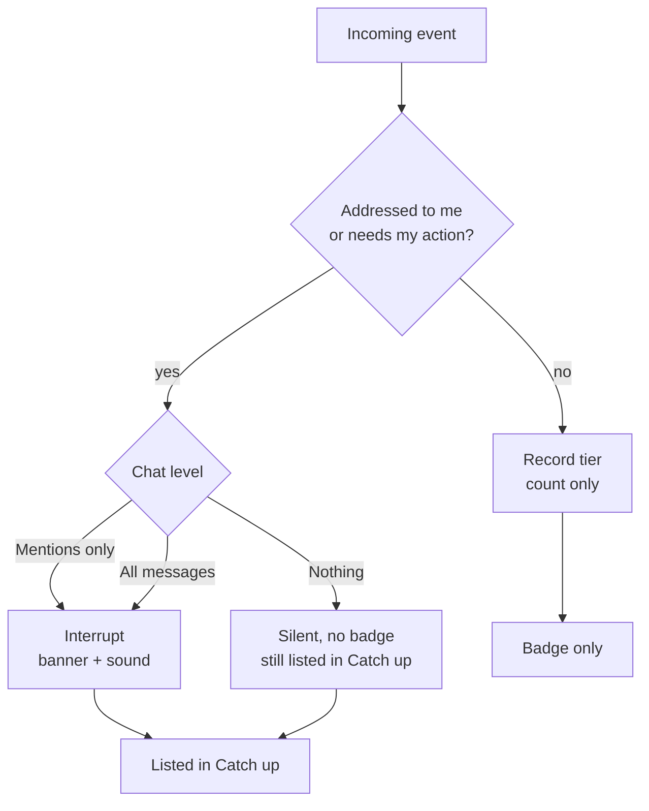
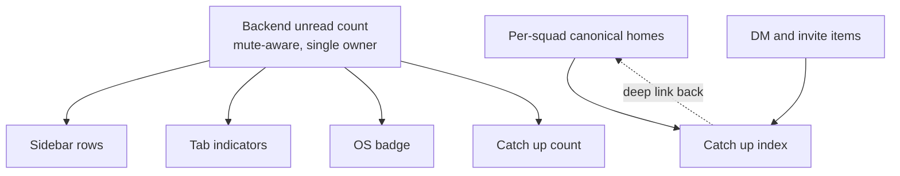

# Calm Notifications - Plan

## Goal Capsule

- **Objective:** Make Pacto quiet by default and give members one cross-squad place to review what they missed. This plan owns alert delivery, mute and sound preferences, unread-count integrity, and the Catch up review surface. The notification router extraction and governance deadline reminders are not active scope.
- **Product authority:** Decisions in this contract are settled. Planning chooses how to build them, not whether.
- **Open blockers:** None. Planning can begin.

---

## Product Contract

### Summary

Group channels stop firing an OS banner per message and become silent-but-counted by default, while direct messages, mentions, and action-required items still interrupt. A new cross-squad Catch up surface indexes everything a member missed, and every badge in the app derives from one backend-owned count.

### Problem Frame

Every silence control Pacto needs already exists in the backend and dead-ends before the UI. `chats.muted` is persisted and checked at three notification gates, but no command can set it, so it is permanently false. All four notification-sound commands are registered with zero callers. `profile::toggle_muted` emits an event nothing listens for. A member drowning in a busy squad has no recourse at any level.

Meanwhile the alert path has no volume control of any kind. Every accepted group message calls the OS notification helper individually, so one excited sender produces a banner per message. Internal dogfooding in test squads hit exactly this.

The counting surfaces disagree with each other. The frontend unread hydrate skips every chat whose id is not an npub, dropping all squad conversations. MLS chats never get a `last_read` written, yet that value feeds the OS badge. The backend counter skips muted chats while frontend badges ignore mute entirely. A badge that contradicts itself teaches members to ignore badges.

Nothing that arrives while a member is away is reviewable afterward. Welcomes are consumed silently, join-request outcomes render as one-shot elements, and toasts occupy a single slot that the next toast destroys.

### Key Decisions

- KD1. **Catch up indexes; per-squad homes stay canonical.** (session-settled: user-directed — chosen over a standalone global inbox and over per-squad-only alerts: delivers one review place without giving any item two owners.) Governs R19, R21, R26.
- KD2. **Groups are quiet by default.** (session-settled: user-directed — chosen over preserving today's loud behavior: the interrupt bar is whether a human addressed you.) Governs R10.
- KD3. **A three-state per-chat level replaces a binary mute toggle.** (session-settled: user-directed — chosen over the binary mute named in issue #148: identical default behavior plus a way to raise one squad to full alerts.) Governs R4.
- KD4. **Muting stops badging, never recording.** (session-settled: user-directed — chosen over full suppression and over dimmed muted counts: preserves the badge contract and the review guarantee at once.) Governs R17, R24.
- KD5. **Catch up admits only items addressed to the member or needing their action.** (session-settled: user-approved — proposed with the second-firehose risk surfaced; user assented.) Governs R20.
- KD6. **Actionability derives the tier table once; it is not evaluated at runtime.** Pure runtime actionability under-alerts on ordinary direct messages, which should still interrupt. Governs R8, R9.
- KD7. **The notification router is extracted later, not now.** Building the seams first lets the router be shaped by three real producers instead of a guess.
- KD8. **Catch up occupies a top-level navigation slot.** (session-settled: user-directed — chosen over a pinned row inside DMs and over nesting under a squad dashboard: a cross-squad surface should not live inside a single-squad or person-to-person tab.) Governs R19.

### Actors

- A1. **Squad member** — receives alerts, sets per-chat levels, reviews Catch up. The primary actor for every requirement below.
- A2. **Message sender** — another member whose message may or may not earn an interrupt for A1.
- A3. **Pacto backend** — derives severity, owns unread counts, and emits alerts to the UI and the OS.

### Requirements

**Preferences and controls**

- R1. Settings exposes a Notifications section alongside the existing sections.
- R2. A member can choose a notification sound, preview it before saving, and supply a custom sound file.
- R3. A global mute switch silences all notification sound without affecting counts or Catch up.
- R4. Each chat carries a notification level of All messages, Mentions only, or Nothing.
- R5. A member can mute an individual DM peer from the peer's existing options menu.
- R6. The sound path honors the per-chat notification level, not only the global mute switch.
- R7. The app requests OS notification permission before relying on it, and surfaces the result in the Notifications section.

**Severity policy**

- R8. Every notifiable event resolves to exactly one of three tiers: Interrupt, Record, or Passive.
- R9. Interrupt produces an OS banner and sound; Record is silent but counted and reviewable; Passive renders inline only and never counts.
- R10. A chat's default notification level is Mentions only, for existing and newly joined chats alike.

**Volume shaping**

- R11. Concurrent Interrupt-tier messages for one chat collapse into a single notification carrying a count rather than one banner per message.
- R12. A mention suppresses the collapsed generic notification for its chat so it is not buried in a summary.
- R13. Welcome-notification deduplication survives an app restart.

**Count integrity**

- R14. The backend owns one unread count per chat; sidebar rows, tab indicators, the OS badge, and the Catch up count all derive from it.
- R15. Unread hydration and counting include MLS and squad chats, not only DM peers.
- R16. Marking a chat read works for MLS chats and persists a read watermark.
- R17. A chat at Nothing contributes no badge to any surface.
- R18. The unread count is recomputed when an MLS message arrives, not only on DM arrival.

**Catch up review surface**

- R19. Catch up is a single cross-squad surface listing what the member missed, reached from a top-level destination alongside DMs, Squads, and Commons.
- R20. An event earns a Catch up entry only when it is addressed to the member or requires their action; ordinary group messages are counted but never listed.
- R21. Catch up references items whose canonical home is elsewhere; it does not become a second store of record.
- R22. Every Catch up entry deep links to the surface that owns it.
- R23. A member can clear entries individually or mark the whole surface read.
- R24. Items from chats set to Nothing still appear in Catch up but never contribute to its count.
- R25. Catch up can be filtered to needs-action items, mentions, or a single squad.
- R26. Resolving an item in its canonical home clears it in Catch up, and clearing it in Catch up marks it resolved.

The tier a member experiences is the intersection of the event's nature and the chat's level. Ordinary chatter never reaches the Interrupt branch regardless of level, except when the level is All messages.

One authority feeds every count surface, and Catch up holds references rather than copies.

### Key Flows

- F1. Burst arrives in a quiet squad
  - **Trigger:** A2 sends six messages to a squad where A1's level is Mentions only, app unfocused.
  - **Steps:** Each message resolves to Record tier; no banner fires; the chat's unread count rises to six; no Catch up entry is created.
  - **Outcome:** A1 sees one badge and no interruptions.
  - **Covers R9, R10, R14, R20.**

- F2. Mention inside a quiet squad
  - **Trigger:** A2 mentions A1 in that same squad.
  - **Steps:** The event resolves to Interrupt; the collapsed generic notification for the chat is suppressed; a banner and sound fire; a Catch up entry is created.
  - **Outcome:** A1 is interrupted exactly once, for the message that named them.
  - **Covers R11, R12, R20, R22.**

- F3. Muting a noisy squad without losing its important items
  - **Trigger:** A1 sets a squad to Nothing.
  - **Steps:** The chat stops contributing to every badge; subsequent needs-action items for that squad still land in Catch up unlisted by any count.
  - **Outcome:** A1 gets silence and can still find what mattered.
  - **Covers R4, R17, R24.**

- F4. Catching up after a day away
  - **Trigger:** A1 opens Catch up after being offline.
  - **Steps:** Entries list mentions, welcomes, join outcomes, invites, and needs-action prompts across all squads; A1 filters to needs-action, follows a deep link, resolves the item in its canonical home, and the entry clears.
  - **Outcome:** The surface empties as A1 works through it.
  - **Covers R19, R21, R22, R23, R25, R26.**

### Acceptance Examples

- AE1. **Covers R17, R24.** Given a squad set to Nothing, when a needs-action prompt arrives for it, then no badge changes anywhere and the prompt appears in Catch up without incrementing its count.
- AE2. **Covers R11.** Given six Interrupt-tier messages arriving for one chat inside the collapse window, when they are delivered, then exactly one OS notification is present and it reports six.
- AE3. **Covers R10, R20.** Given a newly joined squad and no level chosen, when an ordinary message arrives, then no banner fires, the unread count increases, and no Catch up entry is created.
- AE4. **Covers R4, R9.** Given a chat raised to All messages, when an ordinary message arrives, then a banner and sound fire subject to burst collapse.
- AE5. **Covers R26.** Given a needs-action item listed in Catch up, when the member resolves it in its canonical per-squad home, then the Catch up entry clears without further action.
- AE6. **Covers R14, R17.** Given one chat at Nothing with unread messages and another at Mentions only with two unread, when any badge surface is read, then every surface reports two.
- AE7. **Covers R13.** Given a welcome that already produced a notification, when the app restarts and resyncs, then no second notification fires for it.

### Scope Boundaries

**Deferred for later**

- The typed notification pipeline and severity router extraction. The seams this plan creates are its inputs; extracting first would mean migrating those call sites twice.
- Governance deadline reminders, including a poll close time and the proximity escalation ladder. Independent of this work and gated on a wire-format change.
- Time-boxed mutes and snooze-with-expiry. The three-state level covers v1.
- Per-event-kind notification preferences. Depends on the tier table existing first.
- A scheduled digest or briefing view. A view over Catch up once it holds real content.

**Outside this plan**

- Toast history. Toasts remain transient; Catch up is not a log of everything the app said.
- Any server-side notification routing or push. Alerts stay local to the client.

### Dependencies / Assumptions

- The virtual channel routing contract in `docs/mls/VIRTUAL_CHANNEL_ROUTING_ADR.md` stays normative. Catch up depends on the `inbox` bucket remaining the canonical home for personal prompts.
- Greenfield posture applies. No migration preserves current loud behavior, so every existing chat becomes Mentions only on first launch after this ships.
- Desktop is the target surface. The Android notification path exists but is not shaped by this plan.
- Per-squad canonical alert homes must be readable for Catch up to index them. Where a canonical home does not yet render, this plan creates the reader.

### Outstanding Questions

**Deferred to planning**

- OQ1. The burst collapse window length and group key, and whether the key is the chat or the sender within the chat.
- OQ2. Whether the notification plugin supports replacing an existing notification on each target platform. If not, collapse degrades to a short coalescing delay that emits one summary.
- OQ3. Whether counts are recomputed fully on every arrival or incremented with periodic reconciliation, given large chat sets.

<!-- ce-section: work-relationships -->
### How This Work Fits Together

This plan owns the calm stack: silence controls, the severity table, burst collapse, count integrity, and the Catch up surface. The breakdown below is the current understanding of the surrounding notification work, not a committed roadmap.

- Notification pipeline extraction — a single typed envelope and one policy choke point replacing per-producer gating.
  - Depends on this plan; its seams are what the router would consolidate.
  - Enables new event types without new gating decisions.
- Governance deadline reminders — a poll close time plus a proximity escalation ladder.
  - Can proceed independently of this plan.
  - Shares the tier vocabulary defined in R8 and R9.
  - Still to decide: whether reminders route through Catch up or interrupt directly.
- Per-event-kind preferences — muting by category rather than by chat.
  - Depends on the tier table in R8 and R9.

### Sources / Research

- `src-tauri/src/audio.rs:215-220` — the notification settings shape; `875-927` — the four registered commands with no callers.
- `src-tauri/src/lib.rs:3654` — the single OS notification choke point, gated only on window focus; `2196`, `2284`, `2412` — the duplicated mute gate; `2241`, `2338`, `2450` — the per-message notification calls; `213` — in-memory welcome deduplication.
- `src-tauri/src/profile.rs:749-801` — `toggle_blocked` is wired end to end and is the structural template for the unwired `toggle_muted`.
- `src/stores/dm-unread.ts:67` — the hydrate filter that drops every non-DM chat.
- `src/routes/+page.svelte:607` — the only frontend call site marking a chat read.
- `src/lib/pacto-app-inbox.ts:27-29` — the invite-only routing predicate the Catch up index replaces.
- `src/components/settings/SettingsPage.svelte:10-15` — the hardcoded section list a Notifications section extends.
- `docs/mls/VIRTUAL_CHANNEL_ROUTING_ADR.md:39-52` — the `inbox` bucket definition and the rule that it surfaces inside dashboards rather than as a channel.
- `docs/communities/DESIGN.md:52` — personal alerts as prompts to action for the viewing member only.
- Slack's notification rebuild and Activity tab — the three-level per-channel control and the inbox-versus-feed distinction.
- Element and Matrix quiet-by-default room modes; iOS Scheduled Notification Summary — precedent for bundling non-urgent alerts while letting time-critical ones through.
