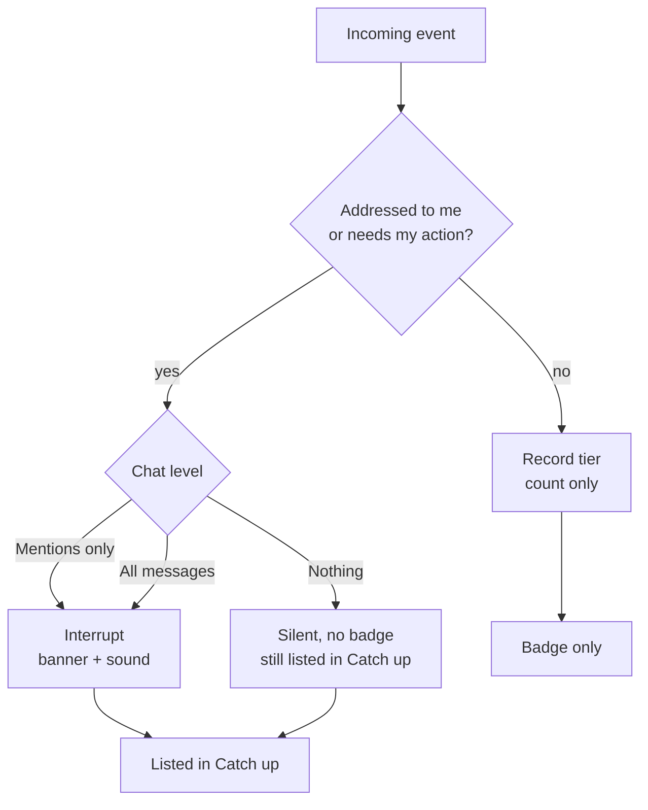
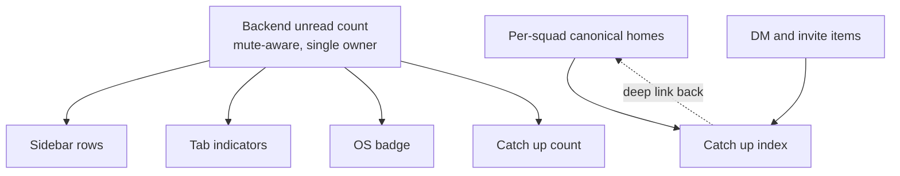
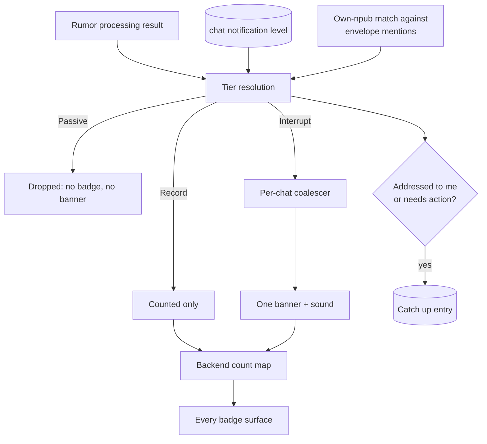
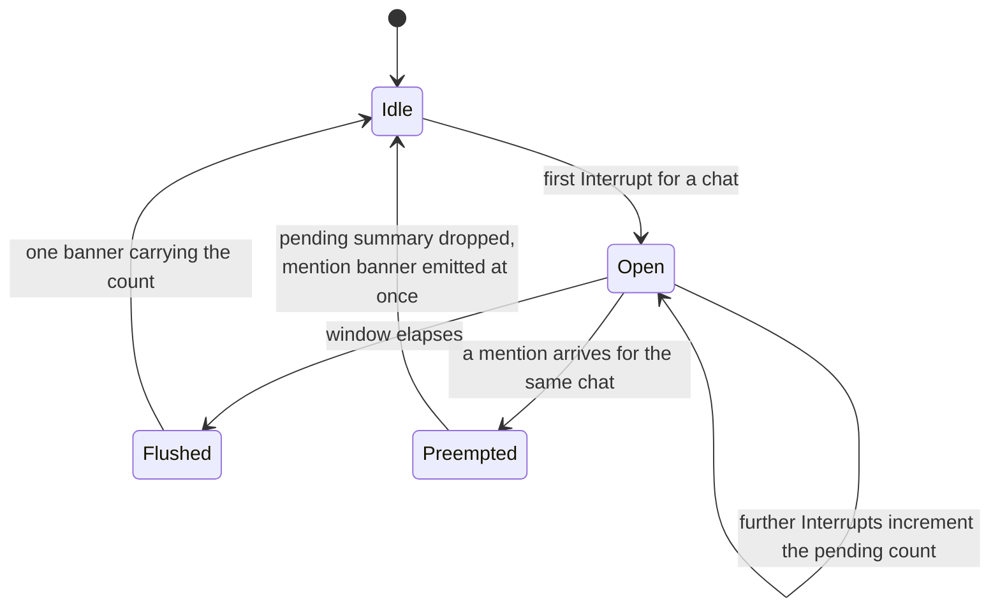
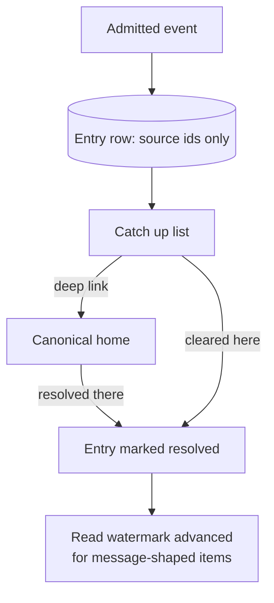

# Calm Notifications - Plan

## Goal Capsule

- **Objective:** Make Pacto quiet by default and give members one cross-squad place to review what they missed. This plan owns alert delivery, mute and sound preferences, unread-count integrity, and the Catch up review surface. The notification router extraction and governance deadline reminders are not active scope.
- **Product authority:** Decisions in the Product Contract are settled. Planning chose how to build them, not whether.
- **Execution profile:** Eleven units in four phases behind one prerequisite. U11 repairs the migration baseline first; Phase A then rebuilds the backend severity path, Phase B the count authority, Phase C the preference surfaces, Phase D the Catch up index. Units within a phase can overlap; phases are dependency-ordered.
- **Stop conditions:** Stop and surface a blocker if the notification plugin's desktop behavior differs from KTD1's finding, if dropping `chats.muted` breaks an index this plan did not anticipate, or if two-way Catch up resolution (R26) needs a resolve point that no canonical home exposes.
- **Tail ownership:** Standalone runs own lint, tests, and MCP verification before declaring done. No commits or pushes without an explicit request.
- **Product Contract preservation:** Changed, user-directed at the 2026-07-27 review. R19 reworded to match R20's admission rule — clarification, no behavior change. R27 (in-context level indicator) and R28 (Catch up empty-state guidance) added. No requirement was removed or narrowed. The three planning-deferred questions were resolved as asked and moved into Key Technical Decisions (KTD1, KTD5, KTD9); the now-empty Outstanding Questions section was removed. Sources gained verified line numbers and the plugin-capability finding.
- **Open blockers:** None.

---

## Product Contract

### Summary

Group channels stop firing an OS banner per message and become silent-but-counted by default, while direct messages, mentions, and action-required items still interrupt. A new cross-squad Catch up surface indexes everything a member missed, and every badge in the app derives from one backend-owned count.

Implementation replaces the three duplicated mute gates and seven scattered notification call sites with a single tier-aware emit, moves mention detection into the backend, drops `chats.muted` for a three-state level, and adds a references-only Catch up table that also carries restart-safe welcome deduplication.
### Problem Frame

Every silence control Pacto needs already exists in the backend and dead-ends before the UI. `chats.muted` is persisted and checked at three notification gates, but no command can set it, so it is permanently false. All four notification-sound commands are registered with zero callers. `profile::toggle_muted` emits an event nothing listens for. A member drowning in a busy squad has no recourse at any level.

Meanwhile the alert path has no volume control of any kind. Every accepted group message calls the OS notification helper individually, so one excited sender produces a banner per message. Internal dogfooding in test squads hit exactly this.

The counting surfaces disagree with each other. The frontend unread hydrate skips every chat whose id is not an npub, dropping all squad conversations. MLS chats never get a `last_read` written, yet that value feeds the OS badge. The backend counter skips muted chats while frontend badges ignore mute entirely. A badge that contradicts itself teaches members to ignore badges.

Nothing that arrives while a member is away is reviewable afterward. Welcomes are consumed silently, join-request outcomes render as one-shot elements, and toasts occupy a single slot that the next toast destroys.

### Key Decisions

- KD1. **Catch up indexes; per-squad homes stay canonical.** (session-settled: user-directed — chosen over a standalone global inbox and over per-squad-only alerts: delivers one review place without giving any item two owners.) Governs R19, R21, R26.
- KD2. **Groups are quiet by default.** (session-settled: user-directed — chosen over preserving today's loud behavior: the interrupt bar is whether a human addressed you.) Governs R10.
- KD3. **A three-state per-chat level replaces a binary mute toggle.** (session-settled: user-directed — chosen over the binary mute named in issue #148: identical default behavior plus a way to raise one squad to full alerts.) Governs R4.
- KD4. **Muting stops badging, never recording.** (session-settled: user-directed — chosen over full suppression and over dimmed muted counts: preserves the badge contract and the review guarantee at once.) Governs R17, R24.
- KD5. **Catch up admits only items addressed to the member or needing their action.** (session-settled: user-approved — proposed with the second-firehose risk surfaced; user assented.) Governs R20.
- KD6. **Actionability derives the tier table once; it is not evaluated at runtime.** Pure runtime actionability under-alerts on ordinary direct messages, which should still interrupt. Governs R8, R9.
- KD7. **The notification router is extracted later, not now.** Building the seams first lets the router be shaped by three real producers instead of a guess.
- KD8. **Catch up occupies a top-level navigation slot.** (session-settled: user-directed — chosen over a pinned row inside DMs and over nesting under a squad dashboard: a cross-squad surface should not live inside a single-squad or person-to-person tab.) Governs R19.

### Actors

- A1. **Squad member** — receives alerts, sets per-chat levels, reviews Catch up. The primary actor for every requirement below.
- A2. **Message sender** — another member whose message may or may not earn an interrupt for A1.
- A3. **Pacto backend** — derives severity, owns unread counts, and emits alerts to the UI and the OS.

### Requirements

**Preferences and controls**

- R1. Settings exposes a Notifications section alongside the existing sections.
- R2. A member can choose a notification sound, preview it before saving, and supply a custom sound file.
- R3. A global mute switch silences all notification sound without affecting counts or Catch up.
- R4. Each chat carries a notification level of All messages, Mentions only, or Nothing.
- R5. A member can mute an individual DM peer from the peer's existing options menu.
- R6. The sound path honors the per-chat notification level, not only the global mute switch.
- R7. The app requests OS notification permission before relying on it, and surfaces the result in the Notifications section.
- R27. A chat whose notification level is not the default shows an in-context indicator of that level, with direct access to change it from where the member notices the silence.

**Severity policy**

- R8. Every notifiable event resolves to exactly one of three tiers: Interrupt, Record, or Passive.
- R9. Interrupt produces an OS banner and sound; Record is silent but counted and reviewable; Passive renders inline only and never counts.
- R10. A chat's default notification level is Mentions only, for existing and newly joined chats alike.

**Volume shaping**

- R11. Concurrent Interrupt-tier messages for one chat collapse into a single notification carrying a count rather than one banner per message.
- R12. A mention suppresses the collapsed generic notification for its chat so it is not buried in a summary.
- R13. Welcome-notification deduplication survives an app restart.

**Count integrity**

- R14. The backend owns one unread count per chat; sidebar rows, tab indicators, the OS badge, and the Catch up count all derive from it.
- R15. Unread hydration and counting include MLS and squad chats, not only DM peers.
- R16. Marking a chat read works for MLS chats and persists a read watermark.
- R17. A chat at Nothing contributes no badge to any surface.
- R18. The unread count is recomputed when an MLS message arrives, not only on DM arrival.

**Catch up review surface**

- R19. Catch up is a single cross-squad surface listing the items addressed to the member or awaiting their action, reached from a top-level destination alongside DMs, Squads, and Commons.
- R20. An event earns a Catch up entry only when it is addressed to the member or requires their action; ordinary group messages are counted but never listed.
- R21. Catch up references items whose canonical home is elsewhere; it does not become a second store of record.
- R22. Every Catch up entry deep links to the surface that owns it.
- R23. A member can clear entries individually or mark the whole surface read.
- R24. Items from chats set to Nothing still appear in Catch up but never contribute to its count.
- R25. Catch up can be filtered to needs-action items, mentions, or a single squad.
- R26. Resolving an item in its canonical home clears it in Catch up, and clearing it in Catch up marks it resolved.
- R28. Catch up's empty state explains what the surface collects and what it deliberately omits, so a sparse list reads as working rather than broken.

The tier a member experiences is the intersection of the event's nature and the chat's level. Ordinary chatter never reaches the Interrupt branch regardless of level, except when the level is All messages.

One authority feeds every count surface, and Catch up holds references rather than copies.

### Key Flows

- F1. Burst arrives in a quiet squad
  - **Trigger:** A2 sends six messages to a squad where A1's level is Mentions only, app unfocused.
  - **Steps:** Each message resolves to Record tier; no banner fires; the chat's unread count rises to six; no Catch up entry is created.
  - **Outcome:** A1 sees one badge and no interruptions.
  - **Covers R9, R10, R14, R20.**

- F2. Mention inside a quiet squad
  - **Trigger:** A2 mentions A1 in that same squad.
  - **Steps:** The event resolves to Interrupt; the collapsed generic notification for the chat is suppressed; a banner and sound fire; a Catch up entry is created.
  - **Outcome:** A1 is interrupted exactly once, for the message that named them.
  - **Covers R11, R12, R20, R22.**

- F3. Muting a noisy squad without losing its important items
  - **Trigger:** A1 sets a squad to Nothing.
  - **Steps:** The chat stops contributing to every badge; subsequent needs-action items for that squad still land in Catch up unlisted by any count.
  - **Outcome:** A1 gets silence and can still find what mattered.
  - **Covers R4, R17, R24.**

- F4. Catching up after a day away
  - **Trigger:** A1 opens Catch up after being offline.
  - **Steps:** Entries list mentions, welcomes, join outcomes, invites, and needs-action prompts across all squads; A1 filters to needs-action, follows a deep link, resolves the item in its canonical home, and the entry clears.
  - **Outcome:** The surface empties as A1 works through it.
  - **Covers R19, R21, R22, R23, R25, R26.**

### Acceptance Examples

- AE1. **Covers R17, R24.** Given a squad set to Nothing, when a needs-action prompt arrives for it, then no badge changes anywhere and the prompt appears in Catch up without incrementing its count.
- AE2. **Covers R11.** Given six Interrupt-tier messages arriving for one chat inside the collapse window, when they are delivered, then exactly one OS notification is present and it reports six.
- AE3. **Covers R10, R14, R20.** Given a newly joined squad and no level chosen, when an ordinary message arrives, then no banner fires, the unread count increases, and no Catch up entry is created.
- AE4. **Covers R4, R9.** Given a chat raised to All messages, when an ordinary message arrives, then a banner and sound fire subject to burst collapse.
- AE5. **Covers R26.** Given a needs-action item listed in Catch up, when the member resolves it in its canonical per-squad home, then the Catch up entry clears without further action.
- AE6. **Covers R14, R17.** Given one chat at Nothing with unread messages and another at Mentions only with two unread, when any badge surface is read, then every surface reports two.
- AE7. **Covers R13.** Given a welcome that already produced a notification, when the app restarts and resyncs, then no second notification fires for it.

### Scope Boundaries

**Deferred for later**

- The typed notification pipeline and severity router extraction. The seams this plan creates are its inputs; extracting first would mean migrating those call sites twice.
- Governance deadline reminders, including a poll close time and the proximity escalation ladder. Independent of this work and gated on a wire-format change.
- Time-boxed mutes and snooze-with-expiry. The three-state level covers v1.
- Per-event-kind notification preferences. Depends on the tier table existing first.
- A scheduled digest or briefing view. A view over Catch up once it holds real content.

**Outside this plan**

- Toast history. Toasts remain transient; Catch up is not a log of everything the app said.
- Any server-side notification routing or push. Alerts stay local to the client.

**Deferred to follow-up work**

- Incremental unread counting with periodic reconciliation. The full recompute is adequate at current chat volumes; see KTD9 for the measured trigger that would change this.
- A distinct mention highlight on channel rows. U5 retires the ephemeral mention counter as a badge source; if a separate visual treatment is wanted it is styling on the same row, not a second count.
- Android notification parity. The tier resolution is platform-neutral, but the coalescer and permission surface are shaped for desktop only.

### Dependencies / Assumptions

- The virtual channel routing contract in `docs/mls/VIRTUAL_CHANNEL_ROUTING_ADR.md` stays normative. Catch up depends on the `inbox` bucket remaining the canonical home for personal prompts.
- Greenfield posture applies. No migration preserves current loud behavior, so every existing chat becomes Mentions only on first launch after this ships. The change is communicated in the release notes rather than in the app: no in-app first-run notice is in scope (user-directed at the 2026-07-27 review, chosen over a one-time in-app explanation and over keeping existing chats loud). R27's in-context indicator is what carries the explanation once a member notices the silence.
- Desktop is the target surface. The Android notification path exists but is not shaped by this plan.
- Per-squad canonical alert homes must be readable for Catch up to index them. Where a canonical home does not yet render, this plan creates the reader. Research resolved this to a no-op: every item kind Catch up indexes already renders somewhere, so this plan creates no new canonical reader — only the cross-squad index and the deep links into those existing homes.

<!-- ce-section: work-relationships -->
### How This Work Fits Together

This plan owns the calm stack: silence controls, the severity table, burst collapse, count integrity, and the Catch up surface. The breakdown below is the current understanding of the surrounding notification work, not a committed roadmap.

- Notification pipeline extraction — a single typed envelope and one policy choke point replacing per-producer gating.
  - Depends on this plan; its seams are what the router would consolidate.
  - Enables new event types without new gating decisions.
- Governance deadline reminders — a poll close time plus a proximity escalation ladder.
  - Can proceed independently of this plan.
  - Shares the tier vocabulary defined in R8 and R9.
  - Still to decide: whether reminders route through Catch up or interrupt directly.
- Per-event-kind preferences — muting by category rather than by chat.
  - Depends on the tier table in R8 and R9.

### Sources / Research

- `src-tauri/src/lib.rs:3654` — `show_notification_generic`, the single OS notification helper, gated only on window focus. Call sites: `1801` DM text, `1808` wallet announcement, `1913` file attachment, `2241` group message, `2338` group file, `2450` poll create, `6117` welcome invite.
- `src-tauri/src/lib.rs:2196`, `2284`, `2412` — three byte-identical `!chat.muted && !message.mine` gates, in the text, file, and poll-create arms of the MLS handler.
- `src-tauri/src/lib.rs:213-217` — `NOTIFIED_WELCOMES`, a `lazy_static` `HashSet<String>` keyed by wrapper event id, in-memory only; inserted at `6120`.
- `src-tauri/src/lib.rs:399-452` — `count_unread_messages`, an in-memory walk that skips muted chats at `407`. `4964-5004` — `update_unread_counter`, which sets the OS badge. Called from `1819` and `1924` on DM arrival, never from the MLS arrival handler at `2449-2478`.
- `src-tauri/src/audio.rs:876`, `886`, `909`, `927` — the four notification-sound commands, complete and registered in `generate_handler!` at `lib.rs:6918-6924`, with zero frontend callers. Settings persist under the `notif_global_mute` and `notif_sound` keys.
- `src-tauri/src/profile.rs:776-801` — `toggle_blocked`, wired end to end, the structural template. `804-829` — `toggle_muted`, registered at `lib.rs:6729` but emitting `profile_muted` to no listener and invoked by no frontend caller; `Profile.muted` at `27` is never read outside `lib.rs`.
- `src-tauri/src/message.rs:3248-3252` — the mention envelope struct, which deserializes only `kind` and `body`. `3256` — `extract_mention_notification_body`. The backend performs no mention detection.
- `src/lib/messaging/mentions.ts` — the `pacto.mentions.envelope.v1` wire shape, whose `mentions` array is parsed only client-side today.
- `src-tauri/src/migrations/mod.rs` — refinery runner with a baseline path for pre-refinery databases, plus a test module that applies the real migration set. Highest applied version is V27.
- `src-tauri/Cargo.toml:69` — `rusqlite` 0.32 with `bundled`, so `ALTER TABLE ... DROP COLUMN` is available.
- `src/stores/dm-unread.ts:69` — the `startsWith('npub1')` hydrate filter that drops every MLS chat.
- `src/stores/navigation.ts:1-10` — `TopNavTab` as a three-value union; `src/components/layout/TopNavbar.svelte:26-28` renders it; `src/routes/+page.svelte:1195-1208` branches on it.
- `src/lib/pacto-app-inbox.ts` — the `__pacto_app__` synthetic DM thread carrying squad invites, the invite-only routing predicate the Catch up index replaces.
- `src/components/settings/SettingsPage.svelte:9-14` — `SECTION_LINKS`; `src/lib/settings/settings-section-collapse.ts:3,10` — the parallel id list; `src/components/settings/AppSettingsSection.svelte` — the native-control preferences pattern.
- `src/lib/i18n/index.ts:33-34` — glob-based catalog loading, so a new namespace file needs no registration.
- `docs/mls/VIRTUAL_CHANNEL_ROUTING_ADR.md:39-52` — the `inbox` bucket definition and the rule that it surfaces inside dashboards rather than as a channel.
- `docs/communities/DESIGN.md:52` — personal alerts as prompts to action for the viewing member only.
- `tauri-plugin-notification` 2.3.1 (`plugins/notification/src/models.rs`, `src/desktop.rs`) — the `id` field exists but drives no replacement on macOS, Windows, or Linux; `group`/`group_summary` are Android-only; desktop permission is granted unconditionally; sound landed in 2.3.1. Dock badging is Tauri core's `setBadgeCount`, not the plugin.
- Slack's notification rebuild and Activity tab — the three-level per-channel control and the inbox-versus-feed distinction.
- Element and Matrix quiet-by-default room modes; iOS Scheduled Notification Summary — precedent for bundling non-urgent alerts while letting time-critical ones through.

---

## Planning Contract

### Key Technical Decisions

- KTD1. **Burst collapse is a trailing coalescing window, not banner replacement.** (session-settled: user-directed — chosen over emitting the first banner immediately with a trailing summary: preserves the single-banner guarantee AE2 states, at the cost of a few seconds of latency on every alert including DMs.) `tauri-plugin-notification` 2.3.1 carries an `id` field but never uses it for replacement on any desktop platform, and grouping is Android-only, so the collapse cannot happen in the OS. The first Interrupt for a chat opens a window; arrivals inside it increment a pending count; one banner emits at close. Resolves the brainstorm's collapse-mechanism question. Governs R11.
- KTD2. **The collapse key is the chat, not the sender.** R11 scopes the guarantee to a chat, and a per-sender key would let three people in one channel produce three banners — the exact dogfooding failure this plan exists to fix. Governs R11.
- KTD3. **Mention detection moves into the backend.** Tier resolution owns the Interrupt decision, so it cannot depend on a frontend parse. The envelope's `mentions` array becomes backend-deserializable and is matched against the member's own npub, resolved through the Nostr client signer the way `message.rs` already does. Governs R8, R12.
- KTD4. **One tier-aware emit replaces three gates and seven call sites.** This is not the router extraction KD7 defers — it is a single `resolve` plus a single guarded emit, so the eventual router consolidates one producer instead of seven. Governs R8, R9.
- KTD5. **`chats.muted` is dropped, not reinterpreted.** A new `notification_level` column with a `'mentions'` default delivers R10 for existing and new chats through the column default alone, with no data carry-over from the old boolean. Reinterpreting `muted = 0` as "All messages" would preserve exactly the loud behavior KD2 removes. Governs R4, R10.
- KTD6. **Profile-level mute is deleted.** (session-settled: user-directed — chosen over keeping it beside the new per-chat level: two mute concepts would contradict the single-owner badge contract.) The path is wired but unreachable: `profiles.muted` gates the unread counter at `lib.rs:416` and suppresses DM notifications at `lib.rs:1775` and `1894`, and `toggle_muted` is registered at `lib.rs:6729`, but no frontend caller invokes it and its `profile_muted` event has no listener — so the flag is false on every live database. Deleting the field means re-homing those three gates onto the DM chat's level, which is where DM muting belongs under KD3. Governs R5.
- KTD7. **Tier, badge contribution, and Catch up admission are three separate predicates.** Folding Nothing into the tier enum cannot satisfy R9 and R17 at once, because Record is defined as counted. Tier decides banner and sound; badge contribution is `tier is not Passive and level is not Nothing`; Catch up admission is `addressed to me or needs my action`, independent of level. Governs R9, R17, R20, R24.
- KTD8. **Catch up is a backend table of references with persisted resolution state.** (session-settled: user-approved — proposed against a store derived from the existing in-memory alert stores; user assented.) Rows carry source ids, kind, and a resolution timestamp, never item content, which is what keeps KD1's index-not-owner rule enforceable at the schema level. Restart survival is what R13 needs anyway, so welcome deduplication keys off the same unique source id rather than a second log, and the in-memory `NOTIFIED_WELCOMES` set is deleted. Governs R13, R19, R21, R23, R26.
- KTD9. **Unread stays a full in-memory recompute, debounced.** The existing counter already walks every chat on each DM arrival, and adding MLS chats keeps it linear in chats times messages-back-to-watermark. The real risk is contention rather than CPU: the walk takes the same global state lock the rumor loop holds, and a busy squad delivers far more traffic than DMs, so an undebounced recompute on every MLS arrival competes on a hot path. Debouncing the recompute and emitting only changed entries preserves the simple design without that cost. Incremental counting with reconciliation is deferred until a measured recompute exceeds 50ms or an account carries more than roughly 250 chats — a checkable trigger rather than a judgement call. Resolves the brainstorm's counting-strategy question. Governs R14, R18.
- KTD10. **OS permission is surfaced as system state, not an app toggle.** (session-settled: user-approved — proposed with the inertness surfaced; user assented.) The plugin answers granted unconditionally on desktop even when the OS has notifications switched off for Pacto, so the section reports the plugin's answer and points at OS settings rather than implying the app controls delivery. Governs R7.
- KTD11. **The notification module is a leaf; its context is passed in, not imported.** `lib.rs` is roughly 6,900 lines holding the global state, the app handle, and the rumor loop. A notification module that reaches up for those globals gains an initialization-ordering dependency and stops being independently extractable — exactly the property KD7's later router extraction needs it to keep. Tier resolution and the two predicates are pure functions; the emit path receives the app handle, the database connection, and the member's own npub as parameters. Governs R8, R11.
- KTD12. **A failed Catch up write never fails the message.** Tier resolution failing is a programming error and should surface. A failed notification emit or entry write is logged and skipped. The unread count derives from messages present in the database, so it stays correct even when the index write loses, and Catch up must never become the reason a message goes unpersisted. Governs R21.

### The tier table

Derived once per KD6. Rows are event kinds; columns are the chat's level.

| Event | Nothing | Mentions only | All messages |
|---|---|---|---|
| Own message; typing, reaction, edit | Passive | Passive | Passive |
| Ordinary group message | Record | Record | Interrupt |
| Mention of the member | Record | Interrupt | Interrupt |
| Direct message | Record | Interrupt | Interrupt |
| Welcome, invite, join outcome, needs-action prompt | Record | Interrupt | Interrupt |

The two predicates that ride alongside it, per KTD7:

- **Contributes to badges** when the tier is not Passive and the level is not Nothing. This is what makes a Nothing chat silent *and* unbadged while still recording the message.
- **Earns a Catch up entry** when the event is addressed to the member or needs their action, at any level. This is what puts a Nothing chat's needs-action prompt on the surface without moving the count.

### High-Level Technical Design

The notification path, from rumor to banner:

The coalescer, which exists only because the OS cannot replace a banner:

The Catch up write-and-resolve loop, which is why the table holds references and nothing else:

### Implementation constraints

- **No component-rendering harness.** Vitest runs in a `node` environment over `src/**/*.test.ts`; there are no DOM or component tests in the repo. Every UI unit is verified by driving the running app through the Tauri MCP bridge, per the project's UI validation policy. Do not introduce a component-testing framework as a side effect of this plan.
- **Runes for new components, legacy shells untouched.** `src/routes/+page.svelte` stays a legacy shell; the Catch up branch it gains renders a runes child. Every new `.svelte` file in this plan is runes-mode.
- **Stores stay on `svelte/store`.** New stores follow the existing writable/derived pattern; do not convert them to `.svelte.ts` runes modules.
- **Both locale catalogs move together.** Every new key lands in `en` and `es`. The glob loader means a new namespace file needs no registration.
- **Migrations are additive files.** Two new numbered migrations; never edit an applied one. Migration tests apply the real set through the runner rather than inlining DDL.

### Sequencing

U11 comes first. It repairs a migration-baseline defect that would otherwise cause both new migrations to be skipped silently on some databases. Phase A (U1-U3) then rebuilds the backend severity path and must land before anything reads a tier. Phase B (U4-U5) makes the count authoritative. Phase C (U6-U7) surfaces the preferences. Phase D (U8-U10) builds the index.

U5 cannot start until U4's per-chat map command is registered and its tests pass, because the frontend has nothing to read before then. U10 must not land before U9, because retiring the synthetic invite thread without the Catch up index in place would leave squad invites with no visible home. Phases B and C can otherwise run concurrently once A lands, and Phase D's backend half (U8) can start alongside B.

### System-Wide Impact

**Badge surfaces are wider than the count stores.** Beyond the DM navbar and tab dots, squad channel rows render an alert badge from a prop chain (`src/components/channel/Channel.svelte:20-22` fed by `src/components/layout/ParentNavbar.svelte:83-86`), and squad rows render one from `hubChannelAlertCount` in `src/stores/squad-hub-alerts.ts:45-63`. That helper reads two ephemeral in-memory stores — `mentionsBySquadChannel` and `pendingJoinRequestsBySquadId` — plus `personalAlertsNeededBySquadId`. None of them survive a restart and none of them respect a chat's level, so all three contradict R14 and R17 today. U5 owns re-pointing them.

**The init payload leaks the dropped column.** `Chat` is serialized as `SlimChat` in `src-tauri/src/db.rs` around 3528, 3540, 3604, and 3612, so `muted` reaches the frontend on every hydrate. Removing the field from the struct removes it from the payload; any frontend type mirroring it must move in the same unit.

**The new backend module must not reach upward.** Per KTD11 the notification module stays a leaf. Its pure half (tier table, badge-contribution predicate, Catch up admission predicate) imports only the chat and message models; its effectful half receives the app handle, connection, and member npub as parameters.

**The navigation union has one non-loop consumer.** The tab strip is loop-driven and extends for free, but `src/components/layout/Navbar.svelte:275-282` keys a per-destination label record off the union and will fail to compile — or silently omit — without an entry for the new value, and the root shell's branch at `src/routes/+page.svelte` currently ends in an implicit `{:else}` that would swallow the new destination into the squads view.

**Retiring the synthetic invite thread touches eight files.** `src/lib/pacto-app-inbox.ts` is imported by `src/components/dm/DmThread.svelte`, `src/components/layout/Navbar.svelte`, `src/lib/squad-pair-create.ts`, `src/lib/parent/invite-members-flow.ts`, `src/lib/app/tauri-subscriptions.ts`, `src/lib/dm/resolve-dm-message-presentation.ts`, `src/stores/dm.ts`, and `src/routes/+page.svelte`, plus their tests. `sendSquadInviteDm` is the invite send path and must survive the retirement even though the synthetic thread does not.

**Failure propagation is bounded at the index.** Per KTD12, a notification or entry-write failure degrades Catch up, never message persistence or the count.

### Risks & Dependencies

- **The migration baseline would silently skip both new migrations.** `run_migrations` baselines a database that has `settings` but no `refinery_schema_history` (`src-tauri/src/migrations/mod.rs:24-37`), and `baseline_existing_account` then stamps *every* embedded migration as applied (line 53). Adding V28 and V29 to the embedded set means such a database is marked current while carrying neither the new column nor the new table, and the failure surfaces later as a runtime query error rather than a migration failure. U11 caps the baseline at the migrations that existed when refinery was introduced. This is the highest-severity item in the plan and it gates U1.
- **Recomputing unread on every MLS arrival contends on a hot path.** The counter and the rumor loop take the same global lock, and squad traffic is an order of magnitude heavier than DM traffic. Mitigated by KTD9's debounce and changed-entry-only emission; the exit criterion for revisiting is written into that decision rather than left to judgement.
- **Governance needs-action prompts resolve by derivation, not by an event.** Their state comes from re-running a backend query, so there is no resolve point to hook. U9 reconciles that item kind on refresh instead of subscribing, which is a different mechanism from the other four kinds and is the most likely place for R26 to be implemented incorrectly.
- **Foreign keys are not enforced.** The connection sets only WAL journaling and never enables foreign-key enforcement, so any references the new table declares are decorative. Orphan prevention for entries whose chat or squad disappears must be an explicit cleanup, not a cascade.
- **Dropping the column is verified safe but irreversible.** No index, view, trigger, or generated column references `muted`, and the bundled SQLite clears the version threshold for `DROP COLUMN`. Under greenfield posture no rollback path is warranted; the acceptance criterion is a forward verification that the column is gone and the new one is present, not a down-migration.
- **Every alert gains latency.** KTD1's coalescing window delays all Interrupt banners, including direct messages. The window length is the single lever; if it proves noticeable in dogfooding, shorten it rather than reverting to per-message banners.

---

## Implementation Units

| U-ID | Unit | Key files | Depends on |
|---|---|---|---|
| U11 | Cap the migration baseline at the pre-refinery set | `migrations/mod.rs` | — |
| U1 | Per-chat notification level replaces the mute boolean | `migrations/V28__*.sql`, `chat.rs`, `db.rs`, `profile.rs`, `lib.rs` | U11 |
| U2 | Severity tier resolution and backend mention detection | `notification/severity.rs`, `message.rs` | U1 |
| U3 | One tier-aware emit with burst coalescing | `notification/emit.rs`, `notification/coalesce.rs`, `lib.rs` | U2 |
| U4 | Backend-owned unread counts covering MLS | `lib.rs`, `chat.rs` | U1, U2 |
| U5 | Frontend badges derive from the backend count | `stores/unread.ts`, `MessengerNavbar.svelte`, `Navbar.svelte`, `ParentNavbar.svelte`, `Channel.svelte`, `squad-hub-alerts.ts` | U4 |
| U6 | Notifications settings section | `NotificationsSection.svelte`, `audio.rs` registration | U1 |
| U7 | Per-chat level control in the chat and peer menus | `NotificationLevelMenu.svelte`, `chat.rs` | U1, U6 |
| U8 | Catch up entry store | `migrations/V29__*.sql`, `catch_up.rs` | U2, U11 |
| U9 | Catch up counts, filters, and two-way resolution | `catch_up.rs`, `stores/catch-up.ts` | U4, U8 |
| U10 | Catch up destination | `CatchUpView.svelte`, `navigation.ts`, `TopNavbar.svelte`, `pacto-app-inbox.ts` | U9 |

### U11. Cap the migration baseline at the pre-refinery set

**Goal:** Adding a migration stops silently marking itself applied on databases that never ran it.

**Requirements:** none directly; unblocks U1 and U8.

**Dependencies:** none.

**Files:**
- `src-tauri/src/migrations/mod.rs` — `run_migrations` at 14-44 and `baseline_existing_account` at 51-86
- `src-tauri/src/migrations/mod.rs` — the existing test module

**Approach:**
1. `baseline_existing_account` stamps whatever `get_migrations` returns, which is the whole embedded set at compile time. Its doc comment asserts a database reaching that path is already at the final schema state — true when the baseline was written, false the moment a new migration is added.
2. Cap the stamp at the highest version that existed when refinery was introduced. Every migration above that ceiling then runs normally on a baselined database.
3. The ceiling is a hard-coded constant, not a computed maximum — computing it from the embedded set reintroduces the defect. Derive its value once from the commit that added `migrations/mod.rs`: the highest `V<N>` file present in that commit is the ceiling. Record the number and that derivation in a comment beside the constant, because a future reader cannot recover it from the code alone.

**Patterns to follow:** the existing baseline transaction and its checksum-stamping loop stay as they are; only the set being iterated changes.

**Execution note:** Land this before U1. A V28 written first would be stamped-not-run on exactly the databases hardest to debug afterward.

**Test scenarios:**
- A database with `settings` and no history table, baselined against an embedded set containing a migration above the ceiling, has that migration actually executed rather than stamped.
- The same database ends with history rows for the full set, so a second run is a no-op.
- A fresh database with no `settings` table runs every migration normally and is unaffected by the ceiling.
- A database baselined at the ceiling, then opened again after two further migrations are added, runs both rather than stamping either.
- A database already carrying a history table is never baselined, regardless of the ceiling.

**Verification:** `cargo test` green, with a test that fails against the current uncapped baseline — if it passes before the change, it is not testing the defect.

### U1. Per-chat notification level replaces the mute boolean

**Goal:** One persisted three-state level per chat, defaulting to Mentions only, with the profile-level mute path deleted and its three live gates re-homed onto the chat level.

**Requirements:** R4, R10; KTD5, KTD6.

**Dependencies:** U11.

**Files:**
- `src-tauri/src/migrations/V28__chat_notification_levels.sql` (new)
- `src-tauri/src/chat.rs` — `Chat.muted` at 14, the `muted()` getter at 233-235, the default at 34
- `src-tauri/src/db.rs` — `save_chat` at 3597-3610, the row-to-`Chat` mapping, and the `SlimChat` serialization around 3528, 3540, 3604, 3612 that currently exposes `muted` to the init payload
- `src-tauri/src/profile.rs` — delete `toggle_muted` (804-829) and `Profile.muted` (27, 61)
- `src-tauri/src/lib.rs` — the three `profiles.muted` gates at 416, 1775, and 1894 that must be re-homed, and the `profile::toggle_muted` entry in `generate_handler!` at 6729 that must be removed
- `src/lib/api/nostr.ts:36` — drop `muted` from `NostrProfile`
- `src/lib/api/mock-fixtures.ts:71`, `src/stores/profiles.test.ts:54`, `src/components/dm/Message.test.ts:36` — drop the fixture field
- `src-tauri/src/migrations/mod.rs` — extend the existing migration test module

**Approach:**
1. Add the migration: a `notification_level TEXT NOT NULL DEFAULT 'mentions'` column on `chats`, then drop `muted`. The drop is verified safe — no index, view, trigger, or generated column references the column, and the bundled SQLite clears the version threshold.
2. Define a `NotificationLevel` enum with `all` / `mentions` / `nothing` serde representations, a `Default` of Mentions, and a permissive parse that maps an unrecognized stored string back to the default rather than failing the row.
3. Replace `Chat.muted` with the new field; update `save_chat`'s column list, the load mapping, and the `SlimChat` shape so the dropped field stops reaching the frontend.
4. Re-home the three `profiles.muted` gates onto the chat level. Each currently suppresses a DM notification or skips a chat in the unread walk when the *peer profile* is muted; the equivalent condition is now that peer's DM chat sitting at Nothing. No frontend caller ever invokes `toggle_muted`, so the flag is false on every live database and this is a behavior-preserving move rather than a data migration.
5. Delete the profile mute path end to end — the command, its `generate_handler!` registration, the struct field, the TypeScript type, and the three test fixtures that set it.

**Patterns to follow:** `ChatType` in `chat.rs` is the existing enum-persisted-as-a-scalar precedent. `V27__sensitive_export_log.sql` is the migration file shape. The migration test module in `migrations/mod.rs` shows how to apply the real runner against an in-memory connection.

**Execution note:** Land the migration and its round-trip test before deleting the `muted` call sites — the compiler then enumerates the remaining references for you.

**Test scenarios:**
- Applying the full migration set to a fresh in-memory database yields a `chats` table with `notification_level` and no `muted` column.
- A chat row written under the pre-V28 schema reads back at Mentions after migration, which is R10 for existing chats.
- `save_chat` round-trips each of the three levels.
- An unrecognized `notification_level` string in the database reads back as Mentions instead of erroring the row.
- A newly created chat has Mentions without the caller setting anything.
- The serialized chat payload carries no `muted` key.
- A DM whose peer chat sits at Nothing produces no notification, covering the behavior the profile gate used to provide.

**Verification:** `cargo test` green; a freshly created account database shows the new column and no `muted`; no reference to `profiles.muted`, `Chat::muted`, or `toggle_muted` remains anywhere in the tree.

### U2. Severity tier resolution and backend mention detection

**Goal:** A pure function mapping event kind, chat level, authorship, and mention-hit to exactly one tier, plus the backend mention match it needs.

**Requirements:** R8, R9, R10; KD6, KTD3, KTD7.

**Dependencies:** U1.

**Files:**
- `src-tauri/src/notification/mod.rs` (new)
- `src-tauri/src/notification/severity.rs` (new)
- `src-tauri/src/message.rs` — the envelope struct at 3248-3252 and `extract_mention_notification_body` at 3256
- `src-tauri/src/lib.rs` — declare the module

**Approach:**
1. Extend the envelope struct to deserialize the `mentions` array with a serde default, so plain-text content and older envelopes still parse.
2. Add a mention-match helper beside the existing body extractor, reusing the same parse and comparing against the member's own npub. Resolve that npub through the Nostr client signer the way `message.rs` already does at 453-456.
3. Implement tier resolution against the table in the Planning Contract. It is a lookup over the event kind and level, not a runtime actionability probe — that is what KD6 settles.
4. Implement the two companion predicates from KTD7 alongside it: badge contribution and Catch up admission. Keep all three in this module so no caller re-derives them.

**Patterns to follow:** the existing test module beside `extract_mention_notification_body` at 3265-3298 already covers envelope parsing, malformed JSON, and wrong-kind passthrough; extend that shape rather than starting a new convention.

**Execution note:** Implement resolution test-first from the tier table. It is the plan's central invariant and six later units read it.

**Test scenarios:**
- Every event-kind and level pair resolves to exactly one tier matching the published table.
- Own messages resolve Passive at all three levels.
- An ordinary group message resolves Record at Mentions only and Interrupt at All messages. (Covers AE3, AE4.)
- A mention of the member resolves Interrupt at Mentions only and Record at Nothing.
- The mention match returns true when the envelope names the member's npub and false when it names only other npubs.
- The mention match returns false for plain-text content and for malformed JSON without panicking.
- The envelope still yields its body when the `mentions` key is absent.
- Badge contribution is false for every event in a chat at Nothing and true for a Record-tier event at Mentions only.
- Catch up admission is false for an ordinary group message at every level and true for a needs-action prompt at Nothing.

**Verification:** `cargo test` green, with the tier table exercised exhaustively rather than by sampling.

### U3. One tier-aware emit with burst coalescing

**Goal:** Replace the three duplicated gates and seven scattered emit call sites with one guarded path that collapses bursts into a single counted banner.

**Requirements:** R6, R9, R11, R12; KTD1, KTD2, KTD4, KTD11, KTD12.

**Dependencies:** U2.

**Files:**
- `src-tauri/src/notification/emit.rs` (new)
- `src-tauri/src/notification/coalesce.rs` (new)
- `src-tauri/src/lib.rs` — `show_notification_generic` at 3654, the gates at 2196/2284/2412, the call sites at 1801/1808/1913/2241/2338/2450/6117
- `src-tauri/src/audio.rs` — `play_notification_if_enabled` at 784

**Approach:**
1. Introduce one emit entry point that resolves the tier, returns early on Record and Passive, and hands Interrupt to the coalescer. Every existing call site routes through it.
2. Keep the module a leaf per KTD11. The emit path takes the app handle, the database connection, and the member's own npub as parameters rather than reaching for the globals in `lib.rs`; the tier table and predicates stay pure.
3. Key the coalescer by chat id per KTD2. The first Interrupt opens a window holding a pending summary; further Interrupts inside it increment the count; window close emits one banner carrying the count.
4. A mention arriving while a generic summary is pending for that chat drops the pending entry and emits immediately, so R12's guarantee that a mention is never buried holds.
5. Keep the window-focus check ahead of the coalescer so a focused window still costs nothing.
6. Move the sound call behind the tier decision. It fires once per emitted banner, not once per collapsed event, which is what makes the per-chat level gate sound rather than only the global switch (R6).
7. Delete the three inline mute conditions — tier resolution subsumes them.
8. Apply KTD12's failure boundary: a failed emit is logged and skipped, never propagated into the rumor handler where it could cost a message.

**Technical design (directional):** the coalescer state machine is diagrammed in the Planning Contract. The window length is a single named constant, chosen short enough that the added latency on a DM is imperceptible; treat it as tunable during implementation rather than a fixed contract.

**Notification payload contract:** the collapsed banner carries the chat or squad name as its title and a bare count as its body. No message text, no sender list, no preview. This is a privacy boundary, not a copy choice — banner content leaves the app's encryption envelope and lands in OS notification centers, lock screens, and system logs, which is precisely the metadata exposure Pacto exists to avoid. A single-message Interrupt keeps today's shape; only the collapsed summary is constrained here.

**Focus handling:** the focus check runs once, when the window opens, not again at flush. A member who focuses the app mid-window has seen the chat, so the pending summary is discarded rather than fired at a window they are already looking at. A mention preempting a pending summary re-checks focus at that moment and suppresses its own banner if focused.

**Execution note:** The coalescer holds state across await points. Put it behind an async mutex and never hold the lock across the emit itself.

**Test scenarios:**
- Six Interrupt events for one chat inside the window produce exactly one emitted banner reporting six. (Covers AE2.)
- Interrupt events for two different chats inside the same window produce two separate banners, one per chat.
- An event arriving after a window closes opens a new window rather than joining the closed one.
- A window that opens unfocused and flushes after the app regains focus emits nothing.
- A mention preempting a pending summary while the app is focused emits no banner and still records its Catch up entry.
- The collapsed banner body contains only a count — no message text and no sender name.
- A mention arriving while a generic summary is pending for that chat cancels the pending summary and emits at once.
- A Record-tier event never reaches the coalescer and never triggers sound.
- Sound fires once per emitted banner, not once per collapsed event.
- With the global mute switch on, an Interrupt still emits a banner and still counts, but plays no sound. (R3's boundary against R9.)
- A failing emit leaves the message persisted and the count correct.
- The module compiles without importing the global state or app handle from `lib.rs`.

**Verification:** `cargo test` green; with the app running and a test squad channel raised to All messages, six rapid messages produce one banner reporting six and one sound.

### U4. Backend-owned unread counts covering MLS

**Goal:** One backend count per chat that includes MLS chats, respects the notification level, and recomputes on MLS arrival.

**Requirements:** R14, R15, R16, R17, R18; KTD7, KTD9.

**Dependencies:** U1, U2.

**Files:**
- `src-tauri/src/lib.rs` — `count_unread_messages` at 399-452 including the `profiles.muted` skip at 416, `update_unread_counter` at 4964-5004, the MLS arrival handler at 2449-2478
- `src-tauri/src/chat.rs` — `mark_as_read` at 302-351
- `src-tauri/src/lib.rs` — register the new per-chat count command

**Approach:**
1. Split the counter in two: a per-chat count and a total that sums the map. The total keeps feeding the OS badge; the map becomes the single source every frontend badge reads, which is R14.
2. Replace both skips in the walk — the `chat.muted` skip at 406 and the `profiles.muted` skip at 416 — with U2's single badge-contribution predicate, so a chat at Nothing contributes zero to map and total (R17) while its messages are still recorded.
3. Add a command returning the whole per-chat map so the frontend hydrates in one call instead of reconstructing counts from an init payload. Give it an immediate, non-debounced path: a level change must move badges in the same interaction (R17), so it cannot ride the arrival debounce introduced below.
4. Call the counter from the MLS arrival handler alongside the existing event emit (R18). Debounce it per KTD9: squad traffic is far heavier than DM traffic and the walk contends with the rumor loop for the same global lock, so a recompute per message would put contention on a hot path.
5. Emit only entries whose count changed rather than the whole map on every refresh. A full map on every arrival is the same contention problem moved to serialization.
6. `mark_as_read` already writes `last_read` for both chat types and persists through `save_chat`; the gap is that nothing invokes it for MLS chats. Confirm the watermark round-trips and cover it (R16).

**Patterns to follow:** the existing counter's reverse walk that stops at the member's own most recent message is the semantics to preserve — extend its reach to MLS chats, do not redefine what unread means.

**Test scenarios:**
- A chat at Nothing with unread messages contributes zero to the per-chat map and to the total. (Covers AE1, AE6.)
- Two unread in a Mentions-only chat plus any number in a Nothing chat make the total two. (Covers AE6.)
- The per-chat map includes MLS chats keyed by group id, not only npub-keyed DM chats. (Covers R15.)
- Marking an MLS chat read persists its watermark and drops its count to zero. (Covers R16.)
- The reverse walk stops at the member's own most recent message for MLS chats, matching DM behavior.
- Changing a chat's level recomputes immediately rather than waiting out the arrival debounce.
- A chat holding unread messages at Nothing, then raised to Mentions only, reports those messages as unread on the next read.
- An MLS message arriving for a chat that is not open raises that chat's count. (Covers R18.)
- Raising a chat from Nothing to Mentions only makes its already-received messages count again.
- A burst of MLS messages triggers one debounced recompute rather than one per message.
- A refresh emits only the chats whose counts changed, not every chat.

**Verification:** `cargo test` green; with the app running, a message into a background squad channel raises the dock badge, and opening that channel clears it.

### U5. Frontend badges derive from the backend count

**Goal:** Every unread indicator reads one backend-fed store, and the npub-only hydrate filter is gone.

**Requirements:** R14, R15, R17.

**Dependencies:** U4.

**Files:**
- `src/stores/unread.ts` (new), replacing `src/stores/dm-unread.ts`
- `src/stores/unread.test.ts` (new), replacing `src/stores/dm-unread.test.ts`
- `src/lib/api/notifications.ts` (new) — typed count wrapper
- `src/lib/app/tauri-subscriptions.ts:266-290` — handle the refreshed map on MLS arrival
- `src/components/dm/MessengerNavbar.svelte:143,160,183` — inbox badge and per-peer row badges
- `src/components/layout/Navbar.svelte:573-597` — tab dots
- `src/components/layout/ParentNavbar.svelte:83-86` — squad and channel row alert props
- `src/components/channel/Channel.svelte:20-22` — the channel row badge those props feed
- `src/stores/squad-hub-alerts.ts:45-63` — `hubChannelAlertCount`, and the `mentionsBySquadChannel`, `pendingJoinRequestsBySquadId`, `personalAlertsNeededBySquadId` stores behind it
- `src/routes/+page.svelte:603-607,637`
- `src/lib/dm/dm-unread.ts` — delete `countUnreadInThread` once nothing counts client-side

**Approach:**
1. New store holding the backend map keyed by chat id, with derived selectors for per-peer count, per-squad-channel count, and tab dots.
2. Hydrate from the backend command at init. This deletes the `startsWith('npub1')` filter outright rather than widening it — the frontend stops deciding which chats count.
3. Subscribe to the changed-entry event so MLS arrivals move badges without the chat being opened.
4. Re-point every badge surface, not only the DM ones. Squad and channel rows currently take an alert count through a prop chain from `hubChannelAlertCount`, which reads three ephemeral in-memory stores that neither survive restart nor respect a chat's level. Those rows read the backend map after this unit.
5. `mentionsBySquadChannel` stops being a badge source. If a distinct mention highlight is still wanted it becomes styling on the row driven by the Catch up index, not a second count — the plan defers that to follow-up work rather than carrying two numbers.
6. `pendingJoinRequestsBySquadId` and `personalAlertsNeededBySquadId` stop feeding badges too; their items are Catch up entries after U8, so the count comes from there.

**Patterns to follow:** the existing `dm-unread` store's derived-selector shape and its test file's store-reset discipline.

**Test scenarios:**
- Hydration populates counts for MLS chat ids as well as npub ids.
- A chat at Nothing renders no badge on any surface even when it has unread messages. (Covers AE1, AE6.)
- A tab dot sets when any chat in that tab has a nonzero count and clears when all reach zero.
- A changed-entry event updates a per-peer badge without that chat being opened.
- Marking a chat read clears its badge and clears the tab dot when it was that tab's last unread chat.
- A squad row and a channel row both take their count from the backend map rather than from the retired alert stores.
- No selector computes a count from message arrays — every number traces to the backend map.

**Verification:** `pnpm test` and `pnpm check` green; MCP: a background squad message raises the squad row badge, opening the channel clears it, and a chat set to Nothing shows no badge while still accumulating messages.

### U6. Notifications settings section

**Goal:** A Settings section exposing sound choice, preview, custom sound, the global mute switch, and OS permission state.

**Requirements:** R1, R2, R3, R7; KTD10.

**Dependencies:** U1.

**Files:**
- `src-tauri/src/lib.rs` — the four `audio.rs` commands are already registered at 6918-6924; no handler change is needed
- `src/lib/api/notifications.ts` — typed wrappers
- `src/lib/api/notifications.test.ts` (new)
- `src/components/settings/NotificationsSection.svelte` (new, runes)
- `src/components/settings/SettingsPage.svelte:9-14` — add to `SECTION_LINKS`
- `src/lib/settings/settings-section-collapse.ts:3,10` — add the section id
- `src/components/profile/Profile.svelte:16-31` — render the section
- `src/lib/i18n/locales/en/notifications.json`, `src/lib/i18n/locales/es/notifications.json` (new)
- `src/lib/i18n/locales/{en,es}/nav.json` — the sidebar label key

**Approach:**
1. The four sound commands are complete and already registered — they simply have no callers. The backend side of this unit is therefore nothing; the work is the typed wrappers and the UI that finally calls them.
2. Build the section in runes mode, mirroring `AppSettingsSection`'s native radio and checkbox shape. The repo has no shared toggle or select component — do not introduce one here.
3. Custom sound reuses the file-dialog pattern from the avatar picker in `ProfileSection`; the existing command already copies the chosen file into the sound cache.
4. The permission row calls the plugin's permission API, reports what it returns, and states that the OS governs delivery. Per KTD10 that answer is unconditionally granted on desktop, so the copy must not imply the app controls it.
5. Add the new `notifications` namespace in both locales. The glob loader picks the files up with no registration step.

**Patterns to follow:** `AppSettingsSection.svelte` for control shape and subsection separation; `ProfileSection.svelte` for the file dialog; `settings-section-collapse.test.ts` for the store test shape.

**Test scenarios:**
- Each wrapper invokes its snake_case command with the expected payload and returns the parsed result.
- Saving with the global mute on persists mute without changing the selected sound.
- Selecting a custom sound stores the returned path; cancelling the dialog leaves the previous selection intact.
- Preview invokes the preview command without persisting a settings change.
- Both locale catalogs define every key the section renders.

**Verification:** `pnpm test`, `pnpm check`, and `pnpm lint` clean with zero raw-text warnings; MCP: open Settings, expand Notifications, preview a sound, toggle global mute, and confirm the permission row renders its state.

### U7. Per-chat level control in the chat and peer menus

**Goal:** A member can set any chat's level from where they already manage that chat.

**Requirements:** R4, R5, R6, R27; KTD6.

**Dependencies:** U1, U6.

**Files:**
- `src-tauri/src/chat.rs` — a `set_notification_level` command
- `src-tauri/src/lib.rs` — register it
- `src/lib/api/notifications.ts` — wrapper
- `src/components/ui/NotificationLevelMenu.svelte` (new, runes)
- the DM peer options menu and the squad channel options menu components
- `src/stores/notification-levels.ts` (new) and its test

**Approach:**
1. Mirror `toggle_blocked`'s end-to-end shape: mutate state, persist through `save_chat`, refresh the unread counter, and emit an update the frontend actually listens for. `toggle_muted` is the anti-pattern this unit exists to avoid repeating — its event had no listener, which is precisely why the feature was invisible.
2. Build one shared three-option control and use it from both menus, so DM and squad chats cannot drift apart.
3. Changing a level to or from Nothing must refresh badges in the same interaction, because the badge-contribution predicate just changed for that chat (R17). Call U4's immediate recompute path, not the debounced arrival path, or the member watches a stale badge for the debounce interval.
4. Reach the control through the same affordance each surface already uses to expose per-chat actions — the DM peer row's existing options trigger and the squad channel's existing options trigger. Do not invent a new gesture; a control that requires a gesture members have never used repeats the invisibility that made the old mute toggle useless.
5. R5 is satisfied by this control on the DM peer's menu; there is no separate peer-mute path.
6. Render the in-context indicator R27 requires on any chat sitting at a non-default level, on the same row the level was set from, opening this control when activated. Because the release notes rather than an in-app notice carry the default change, this indicator is the only thing that explains a silent squad to a member who did not read them — it is load-bearing, not decoration.

**Patterns to follow:** `profile.rs:776-801` for the command wiring; the existing options-menu components for placement and trigger conventions.

**Test scenarios:**
- Setting a level persists it and a subsequent read returns it.
- Setting a chat to Nothing removes its badge from every surface without a reload. (Covers AE1's badge half.)
- Raising a chat to All messages makes an ordinary incoming message produce a banner. (Covers AE4.)
- The DM peer menu and the squad channel menu both write through the same command.
- The emitted update event has a registered frontend listener.

**Verification:** `cargo test` and `pnpm test` green; MCP: set a squad to Nothing and confirm its badge disappears, then raise it to All messages and confirm an incoming message banners.

### U8. Catch up entry store

**Goal:** A persisted table of references to items the member must review, written at tier resolution.

**Requirements:** R13, R20, R21, R24; KD1, KD5, KTD8.

**Dependencies:** U2, U11.

**Files:**
- `src-tauri/src/migrations/V29__catch_up_entries.sql` (new)
- `src-tauri/src/catch_up.rs` (new)
- `src-tauri/src/notification/emit.rs` — write the entry beside tier resolution
- `src-tauri/src/lib.rs` — delete `NOTIFIED_WELCOMES` at 213-217, its insert at 6120, and the removal at 6208 that `accept_mls_welcome` performs

**Approach:**
1. Schema: a unique source event id, kind, chat id, squad id, actor npub, creation timestamp, and a nullable resolution timestamp. References only — no body, no title snapshot. The absence of a content column is what makes KD1's index-not-owner rule enforceable rather than aspirational.
2. Admission uses U2's predicate, implementing R20: addressed to the member or needing their action. An ordinary group message never produces a row at any level, which is what stops Catch up becoming the second firehose KD5 warns about.
3. Entries are written for admitted events in chats at Nothing too (R24). The level governs the count, not admission.
4. This unit owns orphan cleanup. Foreign keys are not enforced on these connections, so any references the table declares are documentation only, and a deleted chat or squad would otherwise leave dangling rows that surface in Catch up pointing at nothing. Delete an entry's row wherever its owning chat or squad is deleted — an explicit cleanup, never a cascade. A listed entry whose target no longer resolves is a bug in this unit, not a rendering concern for U10.
5. Welcome deduplication keys off the unique source event id: a welcome that already has a row does not re-notify, and because the row is in SQLite that holds across a restart (R13). Delete the in-memory set rather than keeping both.
6. Preserve the set's second behavior. `accept_mls_welcome` removes the wrapper id from `NOTIFIED_WELCOMES` today, so accepting a welcome un-suppresses it. Under the table that same action resolves the entry — same intent, durable storage. Losing this turns an accepted welcome into a permanently stale Catch up row.
7. Insert with conflict-tolerant semantics on the unique source id. Two arrival paths can process the same event, and the uniqueness constraint is the dedup mechanism rather than a read-then-write check that would race.

**Patterns to follow:** `V27__sensitive_export_log.sql` for the table-plus-index migration shape; the migration test module in `migrations/mod.rs` for applying the real runner in tests.

**Execution note:** The restart half of the welcome-dedup scenario is what catches a regression here. Exercise it by reopening the database, not by clearing an in-memory set.

**Test scenarios:**
- An ordinary group message creates no entry at any of the three levels. (Covers AE3.)
- A mention, a welcome, an invite, a join outcome, and a needs-action prompt each create exactly one entry.
- A needs-action prompt in a chat at Nothing creates an entry. (Covers AE1.)
- Re-processing the same welcome event id creates no second row and fires no second notification, including after the connection is closed and reopened. (Covers AE7.)
- Two concurrent inserts of the same source event id yield one row and no error.
- Deleting a chat removes its Catch up entries; deleting a squad removes entries for every chat beneath it.
- No listed entry survives whose deep-link target no longer resolves.
- Accepting a welcome resolves its entry rather than leaving it listed.
- The schema has no content column, so an entry cannot carry item text.
- Resolving an entry sets the resolution timestamp and leaves the row in place.
- Filtering unresolved entries by kind and by squad uses an index rather than a scan.

**Verification:** `cargo test` green; the welcome-dedup test passes across a database reopen, which is the behavior the in-memory set could never provide.

### U9. Catch up counts, filters, and two-way resolution

**Goal:** Commands and a store exposing the entry list with filters, keeping resolution in sync with each item's canonical home.

**Requirements:** R14, R22, R23, R24, R25, R26; KD1, KTD8.

**Dependencies:** U4, U8.

**Files:**
- `src-tauri/src/catch_up.rs` — list, resolve, and resolve-all commands
- `src-tauri/src/lib.rs` — register them; `accept_mls_welcome` at 6239-6246 as a resolve point
- `src/lib/api/catch-up.ts` (new) and its test
- `src/stores/catch-up.ts` (new) and its test
- `src/stores/squad-hub-alerts.ts:39-42` — `clearMentionAlert`, called from `src/components/channel/ChatView.svelte:653,661`
- `src/stores/squad-join-requests.ts:117-125` — `removePendingJoinRequest`, called from `src/components/squad/SquadJoinRequestsPanel.svelte:60,77,102`
- `src/lib/invites/accept-invite.ts:354,406` — squad and channel invite accept paths
- `src/routes/+page.svelte:1028-1035` — invite accept and decline handlers
- `src/stores/squad-hub-alerts.ts:78-92` — `setPersonalAlertNeeded` and the background refresh that reconciles governance prompts
- `src/lib/squad/squad-roster-key-choice.ts:67` — `needsSquadRosterKeyChoice`, the derived governance predicate

**Approach:**
1. The list command returns unresolved entries with a deep-link target, filterable to needs-action, mentions, or one squad (R25).
2. The Catch up count excludes entries whose chat sits at Nothing (R24) and derives from the same authority as every other badge (R14) — it is not counted independently.
3. Four of the five item kinds resolve through an explicit chokepoint and can be hooked directly: mentions through the mention-clear helper, join outcomes through the pending-request removal, welcomes and invites through the accept path and its backend command.
4. Governance needs-action prompts are the exception and must not be hooked. Their state is derived by re-running a backend predicate, so no resolution event exists to subscribe to. Reconcile them instead: on the existing background refresh, re-evaluate the predicate and resolve any entry whose condition no longer holds. Treating this kind like the other four is the most likely way R26 gets implemented incorrectly.
5. Resolving from Catch up writes the resolution timestamp and, for message-shaped entries, advances that chat's read watermark so the canonical home agrees rather than diverging.
6. Mark-all-read resolves exactly the entries currently listed under the active filter, not the whole table (R23).

**Test scenarios:**
- The needs-action filter returns only needs-action entries; the squad filter returns only that squad's.
- The count excludes entries whose chat is at Nothing while the list still shows them. (Covers AE1.)
- Marking a chat read resolves that chat's mention entries without a Catch up interaction. (Covers AE5.)
- Accepting a join request resolves its entry without a Catch up interaction. (Covers AE5.)
- A governance prompt whose underlying condition is satisfied resolves on the next reconciliation pass, with no resolution event involved. (Covers AE5 for the derived kind.)
- A governance prompt whose condition still holds survives a reconciliation pass unresolved.
- Resolving a mention entry from Catch up advances that chat's read watermark.
- Mark-all-read resolves everything currently listed and nothing the active filter excluded.
- A resolved entry does not reappear after a restart.

**Verification:** `cargo test` and `pnpm test` green, with both directions of R26 covered by distinct tests rather than one symmetric assertion.

### U10. Catch up destination

**Goal:** A fourth top-level destination listing entries, filtering them, and deep linking into each item's canonical home.

**Requirements:** R19, R22, R23, R25, R28; KD8.

**Dependencies:** U9.

**Files:**
- `src/stores/navigation.ts:1-10` — extend the destination union
- `src/components/layout/TopNavbar.svelte:26-28` — the tab, which is loop-driven and extends without a switch
- `src/components/layout/Navbar.svelte:275-282` — the per-destination label record keyed off the union, which needs an entry for the new value
- `src/routes/+page.svelte` — the root-shell branch, whose trailing `{:else}` must become explicit so the new destination is not swallowed into the squads view
- `src/components/catch-up/CatchUpView.svelte`, `CatchUpEntry.svelte`, `CatchUpFilters.svelte` (new, runes)
- `src/lib/navigation/open-squad-dashboard.ts` — generalize into a deep-link resolver
- `src/components/ui/Toast.svelte:20-37` — route its navigation through the shared resolver
- `src/lib/pacto-app-inbox.ts` and its eight importers: `src/components/dm/DmThread.svelte`, `src/components/layout/Navbar.svelte`, `src/lib/squad-pair-create.ts`, `src/lib/parent/invite-members-flow.ts`, `src/lib/app/tauri-subscriptions.ts`, `src/lib/dm/resolve-dm-message-presentation.ts`, `src/stores/dm.ts`, `src/routes/+page.svelte`, plus their tests
- `src/lib/i18n/locales/{en,es}/notifications.json` and `nav.json`
- `src/stores/catch-up.test.ts`

**Approach:**
1. Add the destination to the union, a tab button, and a branch in the root shell. `+page.svelte` stays a legacy shell; the new view is a runes child, not a conversion.
2. Deep links need generalizing before they can serve R22. Squad navigation must set the destination, squad id, channel id, view mode, and the last-opened memories together — the toast handler is the only complete example. No DM-opening equivalent exists at all, so the resolver adds that case rather than generalizing one.
3. Retire the synthetic invite thread, but keep the invite send path. `sendSquadInviteDm` is how invites are delivered and has callers in squad-pair creation and the member-invite flow; only the synthetic thread, its routing predicates, and its unread badge go away. Deleting the send path would silently stop invites being sent.
4. The tab badge reads the Catch up count from the shared store, so a Nothing chat's entries appear in the list without moving the number.
5. Specify the surface states before building: a loading state, newest-first ordering, and grouping by squad with DM and invite items in their own group. The empty state is distinct from loading and satisfies R28 by naming what Catch up collects — mentions, invites, welcomes, join outcomes, and needs-action prompts — and what it deliberately omits, so a member who reads it understands a short list is correct rather than broken. The repo has no component-rendering harness, so an unspecified state is a state nobody will notice is wrong until a member hits it.

**Patterns to follow:** the toast's existing navigation handler is the reference for what a complete navigation state change must set; the resolver generalizes it rather than replacing its behavior.

**Execution note:** This is the unit the MCP bridge exists for. The repo has no component-rendering harness, so the surface is only proven by driving the running app.

**Test scenarios:**
- Store-level: the filter selector narrows the rendered set to needs-action, to mentions, or to a single squad.
- Store-level: clearing one entry removes it from the list and decrements the count; mark-all-read empties both.
- The deep-link resolver produces correct navigation state for a squad channel, a squad dashboard tab, and a DM peer.
- Selecting the new destination renders Catch up rather than falling through to the squads view.
- Store-level: the empty state is distinguishable from the loading state rather than both rendering as an empty list.
- Entries render newest-first and grouped by squad.
- Squad invites still send after the synthetic thread is retired.
- No caller of the retired invite-routing predicates remains.

**Verification:** `pnpm test`, `pnpm check`, and `pnpm lint` clean; MCP walkthrough with entries present — open Catch up, filter to needs-action, follow a deep link into the canonical home, resolve it there, return and confirm the entry is gone. Capture a screenshot and an accessibility snapshot at each step.

---

## Verification Contract

| Gate | Command | Applies to | Signal |
|---|---|---|---|
| Rust tests | `cd src-tauri && cargo test` | U1-U4, U7-U9, U11 | all green |
| Frontend tests | `pnpm test` | U5-U7, U9, U10 | all green |
| Type check | `pnpm check` | every unit touching `src/` | no new errors |
| Lint | `pnpm lint` | every unit | zero violations, required before any commit |
| Migration replay | `cargo test` baseline cases | U11, U1, U8 | a baselined database runs V28 and V29 rather than stamping them |
| i18n parity | catalog review | U6, U7, U10 | `en` and `es` define every new key; zero raw-text warnings |
| UI smoke | Tauri MCP bridge against `make dev` | U6, U7, U10 | screenshots and accessibility snapshots captured |

Acceptance examples trace to the units that prove them:

| AE | Proven in | Method |
|---|---|---|
| AE1 | U4, U7, U8, U9 | Rust count and admission tests, plus MCP badge check |
| AE2 | U3 | coalescer test, plus MCP six-message burst |
| AE3 | U2, U8 | tier resolution and admission tests |
| AE4 | U2, U7 | tier resolution test, plus MCP level-raise check |
| AE5 | U9 | resolution tests in both directions |
| AE6 | U4, U5 | backend count tests and store selector tests |
| AE7 | U8 | welcome-dedup test across a database reopen |

---

## Definition of Done

**Global:**

- Every requirement R1 through R28 is implemented, or explicitly traced to the unit that defers it.
- All seven current notification call sites route through the single tier-aware emit; no caller reaches the OS helper directly.
- Every badge surface reads the backend count map — DM rows, tab dots, squad rows, and channel rows alike; no surface computes a count from message arrays.
- `chats.muted`, `profiles.muted`, `toggle_muted`, the in-memory welcome set, the npub-only hydrate filter, the ephemeral alert stores behind the squad and channel badges, and the synthetic invite thread are gone from the tree — no shims, no dual-read branches, no deprecated aliases.
- The migration baseline no longer stamps migrations it did not run, and a baselined database reaches the current schema.
- Squad invites still send after the synthetic thread is retired.
- `cargo test`, `pnpm test`, `pnpm check`, and `pnpm lint` are all clean.
- Both locale catalogs carry every key the new surfaces render.
- MCP evidence is captured for the Notifications section, the per-chat level control, and the Catch up surface, with the navigation path described in the handoff.
- Dead-end and experimental code from approaches that did not pan out is removed rather than left in the diff.

**Per unit:**

| U-ID | Done signal |
|---|---|
| U11 | A baselined database runs new migrations instead of stamping them |
| U1 | Fresh database has `notification_level` and no `muted`; no profile-mute reference anywhere |
| U2 | Tier table exercised exhaustively; mention match works against the real envelope shape |
| U3 | A six-message burst produces one banner reporting six; three duplicated gates deleted |
| U4 | Per-chat map includes MLS chats; a Nothing chat contributes zero to map and total |
| U5 | Every badge traces to the backend map; the npub-only filter is deleted |
| U6 | Notifications section renders, previews a sound, and reports permission state |
| U7 | Level set from both menus persists and moves badges in the same interaction; a non-default level is visible in context |
| U8 | Welcome dedup holds across a database reopen; no content column exists |
| U9 | Both directions of resolution covered by distinct tests |
| U10 | Catch up reachable as a top-level destination; deep links resolve for all three target kinds; the empty state explains what the surface collects |
