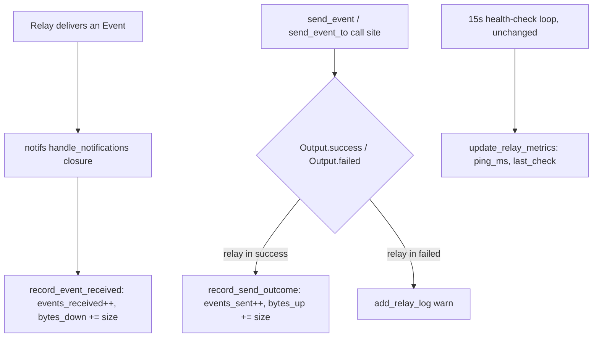

# Per-Relay Health Detail - Plan

## Goal Capsule

- **Objective:** Give users per-relay connection health in Nostr settings — status, latency, last-checked time, recent activity, and approximate transferred-data counts — matching the visibility Vector already provides.
- **Product authority:** GitHub issue [covenant-gov/pacto-app#147](https://github.com/covenant-gov/pacto-app/issues/147) plus verified backend state in this repo. Product Contract below is authoritative for scope; this plan does not reopen it.
- **Execution profile:** Standard. 4 implementation units, no phased delivery needed.
- **Stop conditions:** A unit whose approach contradicts a cited R-ID or KTD is a blocker — stop and report rather than improvising new product or technical scope.
- **Tail ownership:** Implementer runs `cargo test` (backend units) and `pnpm test`/`pnpm check`/`pnpm lint` (frontend units), then a Tauri MCP UI smoke test per this repo's AGENTS.md before declaring done.

---

## Product Contract

### Summary

Add an inline, expandable health detail to each relay row in `NostrSettingsSection.svelte`: connection status, ping, last-checked time, recent activity logs, and approximate transferred-data counters. The status/ping/log data already exists on the backend; the transferred-data counters exist as struct fields but are never populated today and get instrumented as part of this plan.

### Problem Frame

The backend already tracks per-relay `ping_ms` and `last_check` (updated by a 15s health-check loop) and up to 10 recent log lines per relay (status changes, health-check failures), exposed via the already-registered `get_relay_metrics`/`get_relay_logs` commands. `RelayMetrics` also declares `bytes_up`, `bytes_down`, `events_received`, and `events_sent`, but nothing in the backend ever increments them — they always read zero. The frontend relay list shows URL, mode, and status only; there's no way to see any of this.

### Requirements

**Relay detail panel**

- R1. Each relay row gets an inline expand affordance. Expanding shows connection status, ping (latency), last-checked time, and up to the 10 most recent activity log lines for that relay.
- R2. Expanding fetches current data on demand (`get_relay_metrics` + `get_relay_logs`); a manual refresh control inside the open detail re-fetches the same way. No live event subscription is added.
- R3. When a relay has no recorded ping/last-check yet (just added, or the health-check loop hasn't reached it — checks start 60s after monitoring begins and run on a 15s cadence), the detail shows an explicit "not yet checked" state instead of blank or zero values.
- R4. The detail shows approximate transferred-data counts (bytes up/down, events sent/received) per relay, labeled as approximate — see R5–R7.

**Backend counter instrumentation**

- R5. `RelayMetrics.events_received` increments per relay each time that relay delivers a new event, hooked into the existing relay-notification stream already consumed for gift-wrap/MLS message routing — not a new polling loop.
- R6. `RelayMetrics.events_sent` increments per relay when that relay confirms publish (an `OK` relay message) for an event this client sent, hooked into the same notification stream as R5.
- R7. `RelayMetrics.bytes_up`/`bytes_down` accumulate an approximate byte count (serialized event JSON size) for sent/received events per relay, on the same hook points as R5/R6.

### Key Decisions

- **Detail expands inline in the relay row, not a popover/modal.** No overlay positioning/click-outside/escape handling to build, and it degrades gracefully at any window width. (session-settled: user-directed — chosen over popover/modal: simpler, holds up on narrow/resized windows, this is a desktop-only app today with no mobile scaffolding). Governs R1.
- **Detail data is fetched on expand and on manual refresh, never via a live event subscription.** The backend already emits `relay_status_change`/`relay_health_check` events, but nothing in the frontend listens to them today; adding that wiring would be new push infrastructure, not just detail display. Governs R2.
- **Counters route through the single existing relay-notification handler, not through the ~10 scattered `send_event`/`send_event_to` call sites** across `commons.rs`, `lib.rs`, and `mls.rs`. `RelayPoolNotification::Event`/`::Message` both carry `relay_url`, and a successful publish surfaces as `RelayMessage::Ok { status: true, .. }` through the same stream — one hook point covers both directions. Governs R5, R6.
- **Byte counters are an approximation, not exact wire bytes.** `nostr-sdk`'s notification API surfaces parsed events/messages, not raw wire-frame sizes; serialized JSON length is the practical proxy. Governs R7.

### Acceptance Examples

- AE1. Relay was just added and the health-check loop hasn't reached it yet → expanding shows "not yet checked" for ping/last-check, no log entries, no error state. **Covers R3.**
- AE2. Relay is connected and healthy → expanding shows status "Connected", ping in ms, last-checked timestamp, recent log lines newest-first, and per-relay byte/event counts labeled approximate. **Covers R1, R4, R5, R6, R7.**
- AE3. Relay is disconnected or erroring → status reflects the actual state (disconnected/banned/etc.), and recent logs show the warn/error entries the health-check loop already records (e.g., "Health check failed: timeout"). **Covers R1.**
- AE4. User clicks refresh inside an open detail panel → re-invokes `get_relay_metrics`/`get_relay_logs` for that relay only and updates the shown values, without reloading the full relay list. **Covers R2.**

### Scope Boundaries

- Live-push updates to an already-open detail panel — refresh stays on-demand only (R2).
- Changing the top-level relay list row (badges, mode, enable toggle) beyond adding the expand affordance.
- A popover/modal detail variant.
- Changing the health-check loop's cadence or reconnection logic — unchanged.

**Deferred to Follow-Up Work**

- Pruning `RELAY_METRICS`/`RELAY_LOGS` entries when a custom relay is removed — existing behavior, negligible growth for this use case, not required here.

### Dependencies / Assumptions

- `get_relay_metrics(url)` and `get_relay_logs(url)` remain the read path for status/ping/logs; no new commands needed for those.
- Confirmed present in `src-tauri/Cargo.toml`: pinned `nostr-sdk 0.43` / `nostr-relay-pool 0.43.1`, whose notification API (`RelayPoolNotification::Event`/`::Message`, `RelayMessage::Ok`) supplies the instrumentation hook points for R5–R7.

- `src-tauri/src/lib.rs` — `RelayMetrics`/`RelayLog` structs (~2740-2777), `get_relay_metrics`/`get_relay_logs` commands (~2813-2834), `monitor_relay_connections` health-check loop (60s start delay, 15s cadence, ~3386-3558), single `handle_notifications` subscription loop in `notifs()` (~2080-2707).
- `src/components/settings/NostrSettingsSection.svelte` — current relay list markup (URL, badges, mode, status, enable toggle, remove).
- `src/lib/api/relays.ts` — existing relay API wrappers and `RelayInfo`/`RelayStatus` types.
- `nostr-relay-pool` 0.43.1 crate source (`src/pool/mod.rs`, `src/pool/output.rs`, `src/relay/inner.rs`) — `RelayPoolNotification` variants, `Output<T>.success`, `RelayMessage::Ok`.
- `nostr-sdk` 0.43.0 crate source (`src/client/mod.rs:156` for `Client::database()`; `src/client/mod.rs:30` for `Client`'s `#[derive(Debug, Clone)]`) and `nostr-database` 0.43.0 (`src/lib.rs:165` for `NostrDatabase::event_by_id`) — confirm KTD2's lookup and client-clone mechanism exist as described.
- `src-tauri/src/lib.rs:3461` (`let client_health = client.clone();`) and `src-tauri/src/lib.rs:3484-3491` (`tokio::time::timeout(Duration::from_secs(3), ...)`) — existing in-file precedent for cloning `client` into a spawned async context and bounding a relay probe with a timeout.

---

## Planning Contract

**Product Contract preservation:** unchanged. Both Outstanding Questions carried from the requirements doc (exact byte-approximation formula; whether send/receive direction can be cleanly attributed at the notification hook point) are resolved below by KTD2 — no Requirement, Key Decision, or Acceptance Example changed.

### Key Technical Decisions

- KTD1. Bind `relay_url` in the existing `RelayPoolNotification::Event` match arm in `notifs()`'s `handle_notifications` closure (`src-tauri/src/lib.rs`, currently discarded via `..`) and call a new `record_event_received(relay_url, event)` helper that increments `events_received` and adds `event.as_json().len()` to `bytes_down` via the existing `update_relay_metrics`. Runs unconditionally, before the existing `gift_sub_id`/`mls_sub_id` branching, so it covers every delivered event regardless of subscription. Governs R5, R7.
- KTD2. `RelayMessage::Ok`/notification-stream lookup does not work: this app's `Client::builder()` (`src-tauri/src/lib.rs`, three call sites) never configures a database, so it defaults to `MemoryDatabase` in ID-tracking-only mode (`MemoryDatabaseOptions::events` defaults to `false`) — `event_by_id` on that database always returns `None`, confirmed against `nostr-database-0.43.0/src/memory.rs:160-170`. Instead, add `record_send_outcome(event, output)`: for every relay in the `Output<EventId>` that `send_event`/`send_event_to` already return, increments `events_sent` and adds the event's serialized size to `bytes_up` for each URL in `output.success`, and logs a `"warn"` entry via the existing `add_relay_log` for each URL in `output.failed`. Called once per existing send call site (`src-tauri/src/lib.rs` x3, `src-tauri/src/commons.rs` x2, `src-tauri/src/mls.rs` x4 production sites — the two calls inside the `#[cfg(test)]`-gated smoke-test helper are left uninstrumented as test-only, never-compiled-into-release code), using the `event`/`Output` each call site already has in scope. Governs R6, R7.
- KTD3. `record_event_received`/`record_send_outcome` are small helper functions taking already-extracted data (relay URL, event, `Output`) rather than the raw `RelayPoolNotification`, so counter logic is unit-testable without a live relay connection — following the repo's one existing test module (`validate_relay_url_tests`, `src-tauri/src/lib.rs` ~2983). Governs U1, U2.
- KTD4. Frontend expand state uses a `Set<string>` of open relay URLs, mirroring `CommonsTagMenu.svelte`'s `openIds` toggle (`src/components/commons/CommonsTagMenu.svelte:20-42`) rather than `SettingsCollapsibleSection`'s single-boolean toggle, since relay rows must expand independently of each other. Governs R1, U4.
- KTD5. Expanding a row (or clicking its refresh control) calls new `getRelayMetrics(url)`/`getRelayLogs(url)` wrappers — thin `invoke()` calls mirroring `listRelays()` — and re-fetches only that relay's detail, using the existing `RefreshIconButton` component per this repo's icon-only refresh convention. No subscription to `relay_status_change`/`relay_health_check` is added. Governs R2, R4, U3, U4.
- KTD6. `ping_ms === null && last_check === null` renders the "not yet checked" state; this is exposed as a small pure helper (`hasRelayHealthData`) in `relays.ts` rather than inline template logic, so it's covered by this repo's Vitest suite. Governs R3, U3, U4.
- KTD7. Approximate byte counts render via the existing `formatFileSize` helper (`src/lib/messaging/attachment-composer.ts:77`), labeled "approx." next to the relay's `events_sent`/`events_received` counts. Governs R4, U4.
- KTD8. New i18n keys follow the existing flat `settings.relay*`-prefixed convention already in `settings.json` (e.g. `settings.relayEnabledLabel`, `settings.relayOff`) rather than a nested `settings.relay.detail.*` namespace, and are added to both `en` and `es` catalogs: `settings.relayDetailToggle` (expand/collapse aria-label), `settings.relayPingLabel`, `settings.relayLastCheckedLabel`, `settings.relayNotYetChecked`, `settings.relayRecentActivityLabel`, `settings.relayApproxBytesLabel`, `settings.relayApproxEventsLabel`, `settings.refreshRelayDetail` (refresh aria-label). Governs U4.

### High-Level Technical Design

Backend counter flow: two independent hook points, neither adding a new subscription or polling loop:

### Assumptions

- None of R5-R7's counters depend on the client's configured `NostrDatabase`; `record_event_received` reads the notification stream directly and `record_send_outcome` reads the `Output` each send call already returns, so both work regardless of database backend or mode.

### Risks & Dependencies

- `record_send_outcome` is called at 9 production call sites across three files. Each call site's edit is a single added line using data already in scope (the sent `event` and its `Output`) — no shared state or ordering dependency between call sites, so they can land independently without conflicting.

---

## Implementation Units

### U1. Backend: instrument events_received/bytes_down on event receipt

- **Goal:** Every event a relay delivers increments that relay's `events_received` and adds its serialized size to `bytes_down`.
- **Requirements:** R5, R7 (KTD1, KTD3)
- **Dependencies:** None
- **Files:**
  - `src-tauri/src/lib.rs` — new `record_event_received` helper near `update_relay_metrics`/`add_relay_log` (~2810); call site in the `RelayPoolNotification::Event` arm of `notifs()`'s `handle_notifications` closure (~2082)
- **Approach:**
  1. Add `fn record_event_received(relay_url: &str, event: &Event)`: calls `update_relay_metrics(relay_url, |m| { m.events_received += 1; m.bytes_down += event.as_json().len() as u64; })`.
  2. In the closure's `RelayPoolNotification::Event { relay_url, event, subscription_id, .. }` arm, bind `relay_url` (currently discarded) and call `record_event_received(&relay_url.to_string(), &event)` unconditionally, ahead of the existing `gift_sub_id`/`mls_sub_id` branching.
- **Patterns to follow:** `update_relay_metrics` (`src-tauri/src/lib.rs:2804`); existing `add_relay_log` call-site style for the surrounding closure.
- **Test scenarios:**
  - Calling `record_event_received` twice for the same relay URL with two distinct events accumulates `events_received == 2` and `bytes_down` equal to the sum of both events' `as_json().len()`.
  - Two different relay URL casings/trailing-slash variants (which `update_relay_metrics`'s existing normalization already handles) accumulate independently — no cross-relay leakage.
  - `get_relay_metrics` returns the updated counters after `record_event_received` runs, confirming the already-registered read command reflects the new write path.
- **Verification:** `cd src-tauri && cargo test record_event_received` passes.

### U2. Backend: instrument events_sent/bytes_up and log rejected publishes at send call sites

- **Goal:** Every relay a `send_event`/`send_event_to` call reaches gets `events_sent`/`bytes_up` on acceptance or a warn log on rejection.
- **Requirements:** R6, R7 (KTD2, KTD3)
- **Dependencies:** None (touches different call sites than U1; independent of U1 beyond sharing `update_relay_metrics`/`add_relay_log`)
- **Files:**
  - `src-tauri/src/lib.rs` — new `record_send_outcome` helper near `record_event_received`; 3 call sites (`~4694`, `~5205`, `~5721`)
  - `src-tauri/src/commons.rs` — 2 call sites (`~550`, `~778`)
  - `src-tauri/src/mls.rs` — 4 production call sites (`~660`, `~739`, `~827`, `~917`), plus the typing-indicator/normal-wrapper `if`/`else` at `~2056`
- **Approach:**
  1. Add `pub(crate) fn record_send_outcome(event: &Event, output: &Output<EventId>)`: for each `RelayUrl` in `output.success`, calls `update_relay_metrics(url, |m| { m.events_sent += 1; m.bytes_up += event.as_json().len() as u64; })`; for each `(RelayUrl, String)` in `output.failed`, calls `add_relay_log(url, "warn", reason)`.
  2. At each production `send_event`/`send_event_to` call site, capture the `Output<EventId>` (via the existing `?`/`match`/`if let Err` shape at that site) and call `record_send_outcome(&event, &output)` on the success path — do not change error-path control flow (existing `?`/early-return/log-and-continue behavior stays exactly as it was).
  3. Skip the two `send_event_to` calls inside the `#[cfg(test)]`-gated MLS smoke-test helper (`src-tauri/src/mls.rs`, only compiled for `cargo test`, guarded behind an `#[ignore]`d integration test) — no production traffic flows through them.
- **Patterns to follow:** `record_event_received` (U1) for the helper shape; each call site's existing error-handling style (`?`, `match`, or `if let Err`) is preserved, not unified into one style.
- **Test scenarios:**
  - `record_send_outcome` with an `Output` whose `success` set contains one relay increments that relay's `events_sent` by 1 and `bytes_up` by the event's `as_json().len()`.
  - `record_send_outcome` with an `Output` whose `failed` map contains one relay adds a `"warn"`-level log entry with the failure reason for that relay, and leaves `events_sent`/`bytes_up` at 0 for it.
  - `record_send_outcome` with an `Output` whose `success` set contains two relays increments each relay's counters independently.
- **Verification:** `cd src-tauri && cargo test record_send_outcome` passes; `cd src-tauri && cargo test` (full suite) passes, confirming the call-site edits didn't change existing error-path behavior.

### U3. Frontend: relay metrics/logs API wrappers + pure health-state helper

- **Goal:** Typed, tested read path for the two existing backend commands, plus a pure helper for the "not yet checked" decision.
- **Requirements:** R2, R3 (KTD5, KTD6)
- **Dependencies:** None — the Rust struct shapes are already fixed (`RelayMetrics`, `RelayLog`), so this unit can proceed independently of U1/U2
- **Files:**
  - `src/lib/api/relays.ts`
  - `src/lib/api/relays.test.ts`
- **Approach:**
  1. Add `RelayMetrics` (`ping_ms: number | null`, `bytes_up: number`, `bytes_down: number`, `last_check: number | null`, `events_received: number`, `events_sent: number`) and `RelayLog` (`timestamp: number`, `level: string`, `message: string`) types, matching the Rust structs field-for-field.
  2. Add `getRelayMetrics(url: string): Promise<RelayMetrics>` and `getRelayLogs(url: string): Promise<RelayLog[]>`, thin `invoke()` wrappers mirroring `listRelays()`.
  3. Add `hasRelayHealthData(metrics: RelayMetrics): boolean` — `true` when `ping_ms !== null || last_check !== null` (KTD6).
- **Patterns to follow:** `listRelays()` (`src/lib/api/relays.ts:96-98`); existing type definitions in the same file (`RelayInfo`, `CustomRelay`); test conventions in `src/lib/api/relays.test.ts:1-14, 92-98` (mock `invoke`, assert call args and return shape).
- **Test scenarios:**
  - `getRelayMetrics('wss://relay.example.com')` calls `invoke('get_relay_metrics', { url: 'wss://relay.example.com' })` and returns the mocked result.
  - `getRelayLogs(...)` calls `invoke('get_relay_logs', { url })` and returns the mocked array.
  - `hasRelayHealthData` returns `false` when both `ping_ms` and `last_check` are `null`, and `true` when either is set.
- **Verification:** `pnpm test src/lib/api/relays.test.ts` passes; `pnpm check` reports no new type errors.

### U4. Frontend: inline expandable relay detail panel

- **Goal:** Each relay row can expand in place to show status, ping/last-check (or "not yet checked"), recent logs, and approximate byte/event counts, with a manual refresh.
- **Requirements:** R1, R2, R3, R4 (KTD4, KTD5, KTD6, KTD7, KTD8)
- **Dependencies:** U3 (consumes `getRelayMetrics`/`getRelayLogs`/`hasRelayHealthData`)
- **Files:**
  - `src/components/settings/NostrSettingsSection.svelte`
  - `src/lib/i18n/locales/en/settings.json`
  - `src/lib/i18n/locales/es/settings.json`
- **Approach:**
  1. Add `openUrls: Set<string>` (KTD4) plus a per-row disclosure toggle (`aria-expanded`) next to each relay row (~236-251 today), following `CommonsTagMenu.svelte`'s open-Set toggle pattern.
  2. When a URL enters `openUrls`, show a lightweight loading state for that row while `getRelayMetrics(url)` + `getRelayLogs(url)` (KTD5) are in flight; on success render: status (existing `relayStatusLabel`), ping/last-checked or the "not yet checked" state per `hasRelayHealthData` (KTD6), up to 10 recent log lines newest-first, and approximate byte/event counts via `formatFileSize` (KTD7, `src/lib/messaging/attachment-composer.ts:77`) labeled "approx."; on failure show an inline error via the same `getInvokeErrorMessage`/`showToast` pattern `handleToggleEnabled`/`refreshRelays` already use, not a silent blank panel.
  3. Add a `RefreshIconButton` inside the open panel that re-runs the same per-URL fetch (KTD5) — never the full-list `refreshRelays()` — with its `spinning`/`disabled` props tracking that relay's own in-flight fetch, not the list-wide `loading` flag the top-level refresh button uses.
  4. Add the new i18n keys to both locale catalogs following the existing flat `settings.relay*` convention (KTD8) — see the exact key list on KTD8.
  5. The disclosure toggle is a native `<button aria-expanded>` (KTD4), so Tab-focus and Enter/Space activation are free per the standard ARIA disclosure pattern; no additional keyboard wiring is needed beyond what `CommonsTagMenu.svelte` already does.
- **Patterns to follow:** `CommonsTagMenu.svelte:20-42` (open-Set toggle); `NostrSettingsSection.svelte`'s existing `handleToggleEnabled`/`refreshRelays` for per-item busy state and error handling (`getInvokeErrorMessage`/`showToast`); `RefreshIconButton` per this repo's icon-only-refresh convention.
- **Test scenarios:** Test expectation: none — this repo's Vitest suite (`environment: 'node'`, `include: ['src/**/*.test.ts']`) does not exercise Svelte component rendering/DOM (no test file exists for `NostrSettingsSection.svelte` today); the testable logic (`hasRelayHealthData`, API wrappers) lives in U3. Verified via the Tauri MCP UI smoke test below.
- **Verification:** `pnpm lint` reports zero raw-text warnings for the new copy; Tauri MCP UI smoke test (per this repo's AGENTS.md "UI Validation with Tauri MCP") exercising: expand a relay row and confirm status/ping/last-check/logs/counts render (**AE2**); expand a freshly-added relay and confirm the "not yet checked" state (**AE1**); expand a disconnected/erroring relay and confirm status + warn/error logs (**AE3**); click refresh inside an open panel and confirm only that relay's data re-fetches (**AE4**).

---

## Verification Contract

| Command | Scope | Applies to |
|---|---|---|
| `cd src-tauri && cargo test` | New `record_event_received`/`record_send_outcome` unit tests plus existing suite | U1, U2 |
| `pnpm test src/lib/api/relays.test.ts` | New API wrapper + `hasRelayHealthData` tests | U3 |
| `pnpm check` | Svelte/TypeScript type checking, whole repo | U3, U4 |
| `pnpm lint` | ESLint, including raw-text (i18n) rule | U4 |
| Tauri MCP UI smoke test (`make dev` + driver session, per AGENTS.md) | Manual verification of AE1–AE4 | U4 |

`release:validate` and behavioral skill evaluation do not apply — this is a UI + backend instrumentation feature with no release-config or skill-prompt surface.

## Definition of Done

- U1–U4 implemented; `cargo test`, `pnpm test`, `pnpm check`, and `pnpm lint` all pass with no new failures.
- Tauri MCP smoke test confirms AE1–AE4 render correctly in the running app (screenshot evidence).
- New i18n keys present in both `en` and `es` catalogs; no hardcoded user-facing English text introduced.
- No dead-end or experimental code left from approaches that didn't pan out (e.g., an abandoned live-subscription attempt if one was tried before landing on KTD5's on-demand approach).
