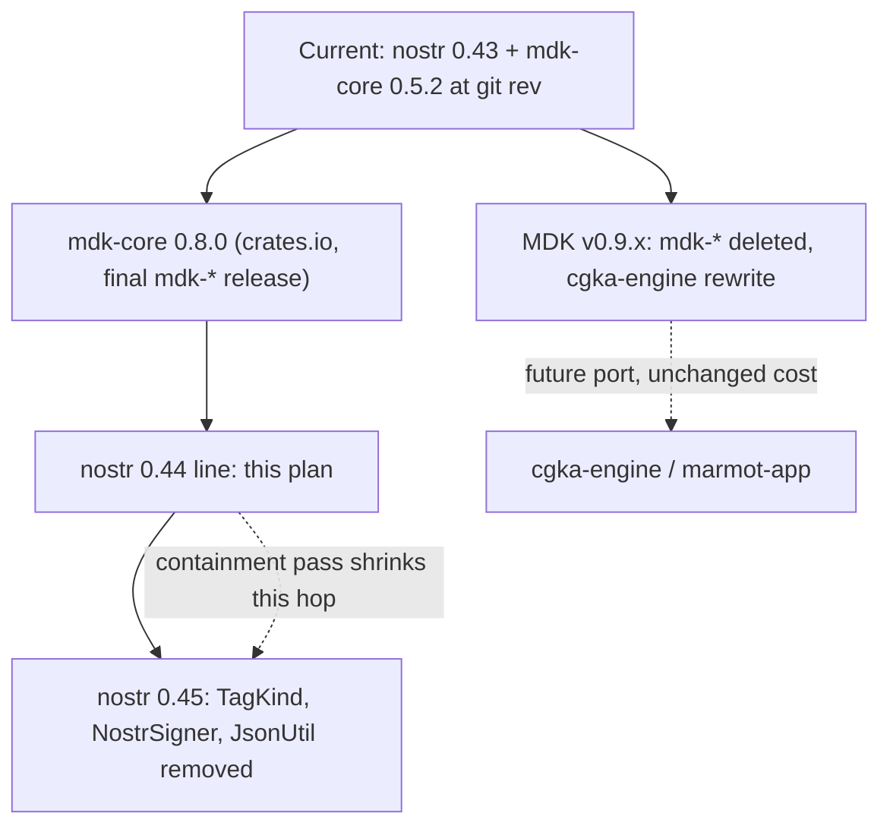
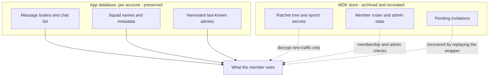
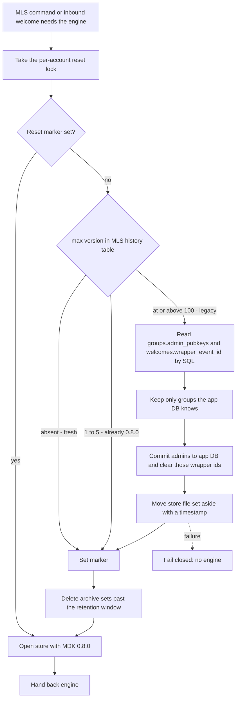

# Nostr 0.44 and MDK 0.8.0 Upgrade - Plan

## Goal Capsule

- **Objective:** Move the Rust backend onto `nostr` 0.44.7 and MDK 0.8.0, absorb the forced SQLite-layer bump, reset the MLS store instead of migrating it, and contain the app's exposure to the nostr 0.45 removals.
- **Product authority:** The Product Contract below governs product behavior. The Planning Contract governs implementation mechanism. The `cgka-engine` / `marmot-app` port and the nostr 0.45 line are named for orientation only and are not active scope.
- **Execution profile:** Land the intake failure boundary and the containment refactors first against the current dependency set, so each is proven green before any version moves. Verify the reset path against a copy of a real pre-upgrade store, not a synthetic one.
- **Stop conditions:** Stop and report rather than guessing if the reconciled SQLite feature set fails to build on any target platform, if the legacy store cannot be read by direct SQL after the bump, or if a 0.44 client proves unable to share a group with a 0.43 peer in a way that makes R17's rollout fallback unworkable.
- **Tail ownership:** No commit, push, or PR without an explicit request; leave changes in the working tree for review.

---

## Product Contract

### Summary

Move onto `nostr` 0.44.7 via `nostr-sdk` 0.44.1, `nostr-blossom` 0.44.0, and the three `mdk-*` crates at 0.8.0 from crates.io, replacing the current git-rev pins and closing two reachable NIP-44 advisories. On first run after the upgrade the MLS store is archived and recreated, and members re-join their squads. A containment pass moves the app's use of nostr symbols that 0.45 removes behind app-local seams.

### Problem Frame

The backend has been pinned to the nostr 0.43 line by a transitive constraint, not by choice. The `mdk-*` crates are consumed at git rev `f46875ec` and that workspace pins `nostr = "0.43"`; because Cargo resolves one `nostr` version for the whole graph, `nostr-sdk` cannot move without MDK moving first.

Three things changed upstream since that pin was taken, and all three cut against waiting.

The nostr 0.43 line carries unpatched security advisories and will never receive a fix. Two of the eight RUSTSEC advisories open against the `nostr` crate are reachable from this app's gift-wrap intake: RUSTSEC-2026-0216, a panic in NIP-44 v2 decryption, and RUSTSEC-2026-0227, resource exhaustion on the same path that does not require the attacker to hold the conversation key. Both are remotely triggerable by any npub whose event a relay delivers. The remaining six require NIP-04, NIP-46, NIP-47, NIP-60, NIP-98, or a local relay, none of which this app uses. Neither advisory discloses data.

The blast radius is worse than the advisories suggest, and it is why R24 exists alongside the version bump. `handle_event` is awaited inline rather than spawned, both in the relay notification closure at `src-tauri/src/lib.rs:2874` and in the historical sync loop at `src-tauri/src/lib.rs:1487`. An unwind out of the gift-wrap intake therefore ends the intake loop, not one event. In the sync case it also strands `state.is_syncing`, which is set before the loop and cleared after it and is the in-flight guard every later sync consults, so one crafted event silently disables message intake for the process lifetime and is re-fetched on the next launch. Moving to 0.44.7 closes the two known payloads; it does not bound the next one.

The decisive fact about the version is the availability of a remedy: `nostr` published only 0.43.0 and 0.43.1, and every fix lands on 0.44.5 or later. Staying on 0.43 means declining all future nostr security fixes.

Both upstream repositories were renamed. `parres-hq/mdk` is now `marmot-protocol/mdk`, and `rust-nostr/nostr` is now `nostrdevkit/nostr`. The git URL in `src-tauri/Cargo.toml` resolves only through GitHub's 301 redirect. That is a live build-integrity exposure today, independent of any version decision.

More consequentially, MDK stopped being the project this app depends on. Tag `v0.9.0` deleted every `mdk-*` crate and replaced them with a different architecture — `cgka-engine`, `cgka-session`, `storage-sqlite`, `traits`, `transport-nostr-*`, `marmot-app` — in a workspace marked `publish = false`, against a forked OpenMLS. So `mdk-core` 0.8.0, published 2026-05-04, is the final release of the API this app is written against. There is no future version of it to upgrade to.

That reshapes what "upgrade now so it is easier later" can deliver. On the MDK axis it delivers nothing: the eventual port to `cgka-engine` costs the same whether or not 0.8.0 lands first. On the nostr axis the picture inverts — 0.44 is a small hop, and the disruptive change is the unreleased 0.45 line, which removes `TagKind`, `TagStandard`, `NostrSigner`, `JsonUtil`, `Timestamp::as_u64`, and `EventBuilder::sign_with_keys`. `TagKind` alone appears roughly 93 times across seven files. Landing 0.44 does not reduce that cost. Containing those symbols behind app-local seams does.

### Key Decisions

- KTD1. **Land MDK 0.8.0 from crates.io rather than forking MDK or waiting.** Accepts a terminal API to reach nostr 0.44 without owning a fork of the MLS stack; also removes the git-rev pin and its redirect dependency. *(session-settled: user-approved — chosen over forking MDK 0.5.x to patch its `nostr` pin: a fork strands the app on `openmls` 0.7.4 with no upstream security path.)* Governs R3.
- KTD2. **Archive and recreate the MLS store; write no migration.** MDK 0.8.0 ships no bridge from the on-disk layout this app wrote, and the data at risk is cryptographic group state rather than user-visible history. *(session-settled: user-directed — chosen over a bespoke auto-migration: message bodies, chat list, and group names live in the app's own database, so a reset costs re-joining squads, not losing chats.)* Governs R11, R12, R14.
- KTD3. **Treat the nostr 0.45 containment pass as part of this work, not a follow-up.** It is the only component that reduces future cost; deferring it makes this a plain version bump. Governs R7, R8, R9.
- KTD4. **Convert every nostr `Timestamp::as_u64` call site now, while 0.44 only deprecates it.** Removal lands in 0.45, and the conversion is mechanical today. Governs R6.
- KTD5. **Surface the reset inside each affected squad channel rather than as a launch-time interruption.** The channel is where the confusion lands, and an inline surface persists exactly as long as the condition does. *(session-settled: user-directed — chosen over a one-time modal: a modal explains what happened but leaves no reminder while the member waits to be re-invited.)* Governs R12.
- KTD6. **Prune the archived store after a short window rather than keeping it.** *(session-settled: user-directed — chosen over retaining until manually removed: a bounded window still covers late-surfacing reset bugs without leaving key material that has no reason to exist.)* Governs R11.
  - **Conflict call-out from security review:** the window bounds exposure, it does not revoke anything. The reset is local, so no member commits a Remove and the upgrading member's leaf stays authorized in the live group while its private key sits in the archive. Anyone who obtains the archive during the window can decrypt that group's ongoing traffic and send as the member, and deleting the archive later does not invalidate a credential the group still honors. R23 is the actual revocation, and this decision stands only as a disk-hygiene bound alongside it.
- KTD7. **Harvest admin public keys out of the legacy store before archiving it, and treat sole-admin squads as re-create rather than re-join.** Admin authority is MLS-resident and never mirrored to the app database, so a reset otherwise leaves a member unable to name anyone who can re-invite them. *(session-settled: user-directed — chosen over accepting orphaned squads: it makes every reset notice name a real person, and names the one case where no person exists.)* Governs R20, R21, R22, R26.

### Actors

- A1. **Upgrading member** — runs the new build, and cannot decrypt new group traffic until re-welcomed.
- A2. **Squad admin** — restores a member's access, and is the only party who can do so. An admin is also an upgrading member: their own store is reset in turn, and they can only restore someone while they still hold group state.
- A3. **Peer on the pre-upgrade build** — MLS interoperability with this peer is unverified and must not be assumed.
- A4. **Former squad co-member** — receives an invitation to a re-created squad and has no in-product explanation for why it duplicates a squad they already belong to.

### Requirements

**Dependency versions**

- R1. The `nostr` crate resolves to 0.44.7 or later, so that both reachable advisories are patched, and `nostr-sdk` resolves to 0.44.1.
- R2. `nostr-blossom` resolves to 0.44.0.
- R3. `mdk-core`, `mdk-sqlite-storage`, and `mdk-storage-traits` resolve to 0.8.0 from crates.io, with no git dependency on any MDK repository remaining in `src-tauri/Cargo.toml`.
- R4. `rusqlite` resolves to a single version compatible with MDK 0.8.0's requirement, with the app's feature selection reconciled against MDK's SQLCipher-backed build.
- R5. `refinery` resolves to a single version across the whole graph, collapsing the current 0.8.16 and 0.9.2 split.

**Nostr 0.44 code migration**

- R6. No nostr `Timestamp::as_u64` call site remains; `as_u64` calls on non-nostr types are untouched.
- R7. The reaction send path builds its event without `EventBuilder::reaction_extended`.

**Nostr 0.45 containment**

- R8. Nostr tag construction and inspection reach the app through an app-local seam, so that the symbols 0.45 removes are referenced from a bounded set of files rather than spread across the backend.
- R9. Event signing and event JSON serialization each reach the app through a single app-local seam.

**Intake hardening**

- R24. A failure while handling one inbound gift wrap ends the handling of that event only, whether it unwinds or fails to terminate: the relay notification loop and the historical sync loop both survive it, every sync in-flight guard is released on the failing path, and a wrapper whose failure is permanent is recorded so it is not retried on every launch.

**MLS store reset**

- R10. The backend detects an MLS store written by the previous MDK pin before MDK 0.8.0 opens it.
- R11. A detected legacy store is moved aside as a complete file set rather than deleted, and that whole set is removed on the first launch after a short retention window elapses.
- R12. Each squad channel whose group state was lost renders an inline explanation in place of its composer, naming the upgrade as the cause and the remedy; the explanation is present only while the member lacks group state for that squad and clears without a relaunch once a welcome restores it.
- R13. Reset happens once per account, and concurrent callers cannot run it twice.
- R14. Message history, the chat list, and squad names remain readable after a reset.
- R25. An invitation that was pending and unaccepted in the legacy store can still be accepted after the reset.
- R27. The participant list already recorded for each affected squad chat survives the reset and is not overwritten by a membership sync while that group has no state.
- R28. A reset invalidates the account's published device KeyPackage and publishes a fresh one backed by the new store, before any restoration is attempted.

**Sole-admin recovery and restoration**

- R20. The admin public keys recorded for each group in the legacy store are read out and persisted to the app database before that store is archived.
- R21. A channel's reset explanation names the harvested admins who can restore the member's access.
- R22. Where a group's harvested admin set holds exactly one key, the explanation states the squad must be re-created rather than presenting anyone as able to restore access — naming the member themselves when that key is theirs, and naming the other admin as the person who will need to re-create it when it is not.
- R26. Harvested admins are persisted only for groups the app already knows, and are presented as the last admins recorded on this device rather than as a verified authority.
- R29. Rollout ordering follows the squad's admin count: a squad with two or more admins upgrades its admins one at a time so a co-admin still holding group state can restore each one, and a squad with a single admin is re-created rather than restored.
- R23. Restoring a reset member's access removes their stale leaf before re-adding them, so the epoch advances and the archived credential stops being accepted by the group. Revocation only happens when the restoring admin runs the upgraded build; a restoration performed from the pre-upgrade build restores access without revoking, and the archived credential then stands until its retention window prunes it.

**Verification**

- R15. `cargo test` passes in `src-tauri`, and the app builds on macOS, Windows, and Linux with the reconciled SQLite feature set.
- R16. Sending and receiving both a direct message and a squad channel message is exercised on a build that has been through a reset, after that member's access has been restored.
- R17. Interoperability between the upgraded build and a peer still on the pre-upgrade build is either verified, or the rollout is sequenced so it is never relied upon.
- R18. The MLS, nostr, and storage-layout docs describe the post-upgrade dependency and storage reality, including the vendored crypto versions that shipped.
- R19. GitHub issue #53 is corrected or closed, since its dependency claims no longer describe upstream.

### Key Flows

- F1. First launch after upgrade
  - **Trigger:** A1 launches a build carrying MDK 0.8.0 against an account whose MLS store predates it.
  - **Actors:** A1
  - **Steps:** Backend detects the legacy store; harvests admin keys and pending-invitation wrappers from it; moves the store file set aside; marks the account reset; affected channels render the inline explanation in place of their composer.
  - **Covered by:** R10, R11, R12, R13, R20, R25

- F2. Restoring squad access
  - **Trigger:** A1 has completed F1 and has no usable group state.
  - **Actors:** A1, A2
  - **Steps:** A1 reads the last-known admins from the channel explanation and asks one of them; A2 — who must still hold group state, meaning their own store has not been reset yet — removes A1's stale leaf and re-adds them in the same restoration; A1 processes the welcome; the explanation clears and the channel decrypts new traffic again.
  - **Covered by:** R12, R14, R21, R23, R29

- F3. Rollout across a squad
  - **Trigger:** A squad's members upgrade, and each upgrade resets that member's group state.
  - **Actors:** A1, A2, A3
  - **Steps:** One admin holds back on the pre-upgrade build while the other members upgrade and are restored; that admin then upgrades and is restored by a co-admin who has already been restored, since a re-added admin is still named in the group's admin set. A squad with only one admin has no such hand-off and goes to F4 instead.
  - **Covered by:** R17, R29
  - **Note:** the group's admin set is fixed when the group is created and the app exposes no way to change it, so the hand-off depends on the squad having been created with more than one admin.

- F4. Re-creating a single-admin squad
  - **Trigger:** A1 completes F1 for a group whose harvested admin set holds exactly one key, so no co-admin can restore anyone.
  - **Actors:** A1, A4
  - **Steps:** The channel explanation states the squad must be re-created; the admin creates a fresh squad and invites the former members, read from the preserved participant list; each invited A4 sees a new squad alongside the old one, which stays readable as history.
  - **Covered by:** R22, R14, R27

- F5. Hostile inbound event
  - **Trigger:** A relay delivers a gift wrap crafted to fail decryption in a way that unwinds.
  - **Actors:** A1
  - **Steps:** Handling of that event fails and is contained; the wrapper is recorded as discarded; the sync flag is released; the next well-formed event is processed normally.
  - **Covered by:** R24

### Acceptance Examples

- AE1. Legacy store detected
  - **Covers R10, R11, R12.**
  - **Given** an account whose MLS store was written by the previous MDK pin,
  - **When** the upgraded build opens that account,
  - **Then** the old store and its sidecar files are present under a distinct archive name, a new store exists, and each affected channel shows the inline explanation instead of a composer.

- AE2. Fresh install
  - **Covers R10, R13.**
  - **Given** an account with no MLS store on disk,
  - **When** the upgraded build opens that account,
  - **Then** nothing is archived and no channel shows the explanation.

- AE3. Archive pruned
  - **Covers R11.**
  - **Given** an archived legacy store older than the retention window, including its sidecar files,
  - **When** the app next launches,
  - **Then** every file in that archive set is gone and the active store is untouched.

- AE4. History survives the reset
  - **Covers R14.**
  - **Given** an account that has completed a reset and has not yet had access restored,
  - **When** the member opens a squad channel they previously used,
  - **Then** prior messages and the squad name still render, and only new traffic is undecryptable.

- AE5. Non-nostr conversions left alone
  - **Covers R6.**
  - **Given** call sites that invoke `as_u64` on types unrelated to nostr,
  - **When** the timestamp migration is applied,
  - **Then** those call sites are unchanged.

- AE6. Admin names surfaced
  - **Covers R20, R21.**
  - **Given** a legacy store recording two admins for a group the app already knows, neither of them the current member,
  - **When** that account is reset and the member opens the channel,
  - **Then** the explanation names both as the last admins recorded on this device.

- AE7. Sole-admin squad
  - **Covers R22.**
  - **Given** a legacy store recording the current member as a group's only admin,
  - **When** that account is reset and the member opens the channel,
  - **Then** the explanation says the squad must be re-created and names no one to ask.

- AE8. Unknown group ignored
  - **Covers R26.**
  - **Given** a legacy store whose group rows reference no group the app database knows,
  - **When** the harvest runs,
  - **Then** nothing is persisted for those groups and nothing is displayed for them.

- AE9. Pending invitation survives
  - **Covers R25.**
  - **Given** a legacy store holding one unaccepted invitation,
  - **When** the account is reset and the next sync runs,
  - **Then** that invitation is offered again and can be accepted into the fresh store.

- AE10. Hostile event contained
  - **Covers R24.**
  - **Given** an inbound gift wrap whose payload fails decryption by unwinding,
  - **When** it is handled during a historical sync,
  - **Then** the sync completes, the in-flight flag is clear, a following well-formed direct message arrives, and the offending wrapper is not retried on the next launch.

- AE11. Restoration leaves one leaf
  - **Covers R23.**
  - **Given** a member whose access is being restored after a reset,
  - **When** the admin completes the restoration,
  - **Then** the group's member list carries exactly one leaf for that member's identity.

### What survives a reset

The reset is bounded because the app already mirrors what the UI shows into its own database. MDK's store is consulted for membership and admin checks, not for rendering.

### Success Criteria

- Per R8 and R9: counting occurrences of the removed symbols before and after shows them collapsed into the named seams, and the count outside those seams stops growing.
- Per R12 and R21, as the comprehension signal: a member who upgrades can say what happened to their squad access and who to ask, without being told out of band.
- Per R12, R23, and R29, as the outcome signal: a member whose access an admin restores decrypts new traffic in that channel and sees the explanation clear, and a member in a squad that cannot be restored is told to re-create rather than told to ask.
- Per R3: `src-tauri/Cargo.toml` names no upstream git repository, so a future rename cannot break the build.
- Per R24: one hostile event costs one event, and the member's messaging keeps working.

### Scope Boundaries

- The port to `cgka-engine` / `marmot-app` is not in scope. MDK v0.9.x is not a newer version of this dependency: the `mdk-*` crates do not exist there, the replacement workspace is `publish = false` and consumable only as a git rev, it pins a forked unreleased OpenMLS, and it resolves the same `nostr` 0.44 line — so it costs an MLS-subsystem rewrite and buys nothing on the axis this plan cares about. Revisit when those crates publish, OpenMLS returns to a release, and the release cadence settles.
- Moving to the nostr 0.45 line is not in scope; only reducing its future cost is.
- Forking MDK to patch its `nostr` pin is rejected, not deferred.
- Writing a migration for the existing MLS store is rejected, not deferred.
- Changing governance or wallet behavior is out of scope; frontend work is limited to the inline channel explanation.
- The detect, harvest, archive, and prune machinery in U6 is built for this upgrade and is not designed as a reusable reset capability. If the eventual `cgka-engine` port also breaks the on-disk store, members may be asked to re-join or re-create their squads a second time; whether U6 is generalized then is a decision for that work, not this one.

#### Deferred to Follow-Up Work

- Marking reset squads in the squad list or dashboard. The `mls_groups.evicted` flag is the pattern that would fit, but adding a list-level state is scope beyond the in-channel explanation.
- Clearing or re-submitting governance polls and queued outbound messages that reference a group the member can no longer decrypt.
- Hardening filesystem permissions on the account profile directory as a whole. See the not-funded note under Risks for why the archive-only version is not worth doing.

### Dependencies and Assumptions

- MDK 0.8.0 is the final `mdk-*` release. No further upstream release of this API is expected, so no later bump is available as a fallback.
- `nostr` 0.43 will not receive security backports. Only 0.43.0 and 0.43.1 were ever published, and every advisory fix lands on 0.44.5 or later, so R1 is the only route to a patched NIP-44 path.
- `nostr-sdk` 0.44.1 declares `nostr = "0.44"`, so Cargo resolves `nostr` 0.44.7 without waiting for a newer SDK release. R1 does not depend on upstream shipping `nostr-sdk` 0.44.2.
- MDK 0.8.0 requires a newer Rust edition and MSRV than the app currently declares. The local toolchain and the `stable` toolchain used in CI both satisfy it; no toolchain pin exists in the repo to update.
- `refinery` on the 0.9 line accepts the `rusqlite` version MDK 0.8.0 requires, so R4 and R5 are compatible.
- Governance and treasury do not read MLS state, so a reset cannot break them. Capability resolves from the logged-in npub plus app-database roster rows plus on-chain Hats reads.
- MDK 0.8.0's stored group still exposes admin public keys, so the post-upgrade admin check survives — but the type moved to a `BTreeSet<PublicKey>`, `nostr_group_id` moved from a string to a 32-byte array, and the group gained image and self-update fields. U4 owns reconciling the app's group-metadata mapping with that shape.
- The legacy store is an ordinary SQLite file, so its `groups` and `welcomes` tables are readable by direct SQL without MDK. SQLCipher opens unkeyed databases normally.
- The repo has no multi-statement SQL passed to `execute` or `prepare` and defines no custom `FromSql`/`ToSql`, so the rusqlite 0.34 and 0.35 breaking changes have no call sites here. Verified by search; U3's verification guards it.
- **Unverified:** whether a client on `openmls` 0.8.1 can participate in an MLS group alongside a peer still on 0.7.4. R17 discharges this, and F3 assumes the worst case until it does.
- **Unverified:** whether MDK 0.8.0 changes the MLS wire format in a way that is visible to other Marmot-ecosystem clients on relays.

### Outstanding Questions

**Deferred to Planning**

- Q1. Whether the archived store should be surfaced anywhere in the UI as recoverable state, or remain a backend-only artifact. Relates to R11.

### Sources and Research

Upstream state, verified against the registry and repositories on 2026-08-03:

| Fact | Source |
|---|---|
| `nostr-sdk` latest stable 0.44.1; `nostr` latest stable 0.44.7; 0.45 published only as alphas | crates.io registry |
| `nostr-blossom` latest stable 0.44.0 | crates.io registry |
| `mdk-core` / `mdk-sqlite-storage` / `mdk-storage-traits` latest published 0.8.0, 2026-05-04 | crates.io registry |
| MDK tags `v0.7.1` and `v0.8.0` contain `mdk-*`; `v0.9.0` through `v0.9.10` do not | `marmot-protocol/mdk` tag contents |
| MDK `v0.9.10` workspace is `publish = false` and pins a forked OpenMLS | `marmot-protocol/mdk` root manifest at `v0.9.10` |
| `mdk-sqlite-storage` 0.8.0 requires `rusqlite` 0.37 with `bundled-sqlcipher`, `openmls` 0.8.1, `refinery` 0.9 | published 0.8.0 manifest |
| `refinery-core` 0.9.2 accepts `rusqlite >= 0.23, <= 0.39` | published 0.9.2 manifest |
| RUSTSEC-2026-0216 (NIP-44 v2 decrypt panic) affects `>= 0.26.0, < 0.44.5`; RUSTSEC-2026-0227 (NIP-44 v2 resource exhaustion) patched `>= 0.44.7` | rustsec advisory-db, `crates/nostr/` |
| The other six `nostr` advisories require NIP-04, NIP-46, NIP-47, NIP-60, NIP-98, or a local relay, none of which appear in `src-tauri/src` | rustsec advisory-db plus repo search |
| `nostr` 0.43 does not check that a gift-wrap rumor's author matches the seal author; 0.44 added `Error::SenderMismatch`. Poll ingestion is gated to MLS groups at `src-tauri/src/rumor.rs:633`, so the DM path cannot reach vote attribution | `nostrdevkit/nostr` PR 1123 and repo read |
| MDK renumbered its migration series from V100–V104 to V001–V005 under an unchanged history table name `_refinery_schema_history_nostr_mls`, with no bridging migration | 0.8.0 migration set and `src/migrations.rs` |
| Legacy MDK `groups` carries `admin_pubkeys JSONB` and `nostr_group_id TEXT`; legacy `welcomes` carries `wrapper_event_id BLOB` and `state`; 0.8.0 keeps `admin_pubkeys` but changes `nostr_group_id` to `BLOB` and drops `group_type` | `V100__initial.sql` at rev `f46875e` vs `V001__initial_schema.sql` at 0.8.0 |
| MDK 0.8.0 `Group` exposes `admin_pubkeys: BTreeSet<PublicKey>` and `nostr_group_id: [u8; 32]` | `mdk-storage-traits-0.8.0/src/groups/types.rs:74-107` |
| Legacy migrations V101–V104 only add or drop image columns and drop `group_type`; `groups.admin_pubkeys`, `groups.nostr_group_id`, and `welcomes.wrapper_event_id` are untouched across the whole V100–V104 series, so the harvest is stable over every state KTD8 classifies as legacy | `V101`–`V104` migration files at rev `f46875e` |
| The group admin set is supplied only at `create_group` and no code path updates it, so a squad cannot promote a replacement admin | `src-tauri/src/mls.rs:276`, `:371`; no `update_group_data` call exists in the crate |
| Sync carries two in-flight guards set together — `is_syncing` and `slice_in_flight` — and only the former is cleared outside `record_slice_result` | `src-tauri/src/lib.rs:1387-1388`, `:584`, `:609`, `:747` |
| An admin re-adds a member using a KeyPackage resolved from a cached index or the newest published one; the member's bootstrap returns the cached entry and does not republish | `src-tauri/src/mls.rs:572-604`; `src-tauri/src/lib.rs:6709-6753` |
| rusqlite 0.35 made `Connection::execute` reject trailing unparsed statements and `Connection::prepare` reject multi-statement SQL; 0.34 changed `ValueRef` error types | rusqlite Changelog, releases 0.33–0.37 |
| `bundled-sqlcipher` links system OpenSSL and requires Perl on Windows; `bundled-sqlcipher-vendored-openssl` vendors it and removes that requirement. Feature unification across one rusqlite version resolves to the SQLCipher variant | `libsqlite3-sys` `Cargo.toml` and `build.rs` |
| SQLCipher with no key set behaves as stock SQLite, so existing unencrypted databases open normally | SQLCipher project documentation |
| `openmls_traits` storage `CURRENT_VERSION` is 1 in both 0.4.0 and 0.5.0 | published manifests and `src/storage.rs` |
| `parres-hq/mdk` → `marmot-protocol/mdk` and `rust-nostr/nostr` → `nostrdevkit/nostr`, both serving 301 redirects | GitHub repository metadata |

Local exposure, counted in `src-tauri/src`:

| Symbol | Occurrences | Files |
|---|---|---|
| `TagKind` | ~93 | `commons.rs`, `message.rs`, `rumor.rs`, `dashboard_poll.rs`, `lib.rs`, `mls.rs`, `profile.rs` |
| `as_u64` | 34 raw, ~28 on nostr `Timestamp` | `lib.rs`, `mls.rs`, `rumor.rs`, `commons.rs`, `squad_bot.rs`, `message.rs`; the `db.rs` hits are unrelated |
| `JsonUtil` / `as_json` / `from_json` | 12 | `lib.rs`, `db.rs`, `blossom.rs` |
| `sign_with_keys` | 6 | `commons.rs`, `lib.rs` |
| `NostrSigner` | 5 | `blossom.rs` |
| `TagStandard` | 1 | `lib.rs` |
| `EventBuilder::reaction_extended` | 1 | `src-tauri/src/message.rs` |

Repo anchors the implementer should read first:

- MLS store construction and lazy engine init: `src-tauri/src/mls.rs:145-189`. Admin check reading MDK's stored group: `src-tauri/src/mls.rs:892-901`.
- Gift-wrap intake: `src-tauri/src/lib.rs:2058`. `handle_event` awaited inline in the notification closure at `src-tauri/src/lib.rs:2874` and in the sync loop at `src-tauri/src/lib.rs:1487`. Sync in-flight flag set and cleared around `src-tauri/src/lib.rs:652` and `:1039`, consulted at `:584`.
- Welcome intake and its swallowed error: `src-tauri/src/lib.rs:2113-2121`. Pending welcomes read only from the engine: `src-tauri/src/lib.rs:7187`, `:7204`. Replay suppression: `src-tauri/src/db.rs:4306-4343`.
- App database path and connection pool: `src-tauri/src/account_manager.rs:49-55`; `run_migrations` call sites at `:342` and `:399`; WAL enabled around `:337`.
- Migration baseline logic and its rationale: `src-tauri/src/migrations/mod.rs:19-52`. Highest existing migration is `V29__catch_up_entries.sql`.
- One-time idempotent work exemplar: `src-tauri/src/db.rs:5312-5335`. Durable settings upsert pattern: `src-tauri/src/session.rs:304-306`.
- Composer render sites in the legacy channel shell: `src/components/channel/ChatView.svelte:905` and `:997`.
- Backend-to-frontend event registration: `src/lib/app/tauri-subscriptions.ts:85-98`, with MLS examples at `:299` and `:320`.
- Prior learning on commands that ship registered but never invoked: `docs/solutions/logic-errors/orphaned-relay-health-monitor-command.md`.
- No production precedent exists for archiving a database file; this plan introduces that pattern.

Docs that describe the current dependency and storage reality and will need review: `docs/mls/ARCHITECTURE.md`, `docs/nostr/ARCHITECTURE.md`, `docs/storage-layout/SQLITE_AND_FILES.md`, `docs/messaging/OVERVIEW.md`.

---

## Planning Contract

### Product Contract preservation

Changed: added R20–R29, KTD7, KTD18, A4, F4, F5, and AE6–AE11. R20–R22 and KTD7 are the user-directed sole-admin recovery. R23–R29 came out of the deepening and document-review passes and are surfaced rather than silently folded in: R23 revokes the stale leaf the reset leaves behind, R24 bounds the intake blast radius the version bump alone does not close, R25 preserves pending invitations that KTD14 wrongly assumed were safe, R26 binds the harvest to groups the app already knows, R27 preserves the participant list a re-created squad needs, R28 republishes the device KeyPackage so a restoration can actually be opened by the member, and R29 states the rollout ordering without which no admin retains the group state F2 depends on.

Document review corrected three errors in the previous revision rather than adding to it: F3 as written directed every member to upgrade before any restoration, which would have left no device holding group state and made F2 impossible; R22 keyed the re-create wording on whether the sole admin was the current member, which routed a squad's other members at an admin who could not help; and R12 defined only when the explanation appears, never when it clears. R11 now names the store as a file set. No existing R-ID changed meaning. Outstanding Questions Q1–Q6 from the requirements-only revision were resolved into the KTDs and units below; one genuinely open item remains as Q1.

Key Decisions keep their original `KTD1`–`KTD6` identifiers from the requirements-only revision rather than being renumbered into a separate product namespace, and the added product decision took the next unused number as `KTD7`. Planning decisions continue the same sequence from `KTD8`, so identifiers stay unique across the artifact.

### Key Technical Decisions

- KTD8. **Detect the legacy store by reading `max(version)` from `_refinery_schema_history_nostr_mls` inside `vector-mls.db`.** A value at or above 100 is the V100–V104 series the old pin wrote; 1 through 5 is a 0.8.0 store; an absent table is a fresh install. Two further on-disk states must be classified rather than fall through: a history table that exists but holds no rows, where `max(version)` is null, and a store file that exists but cannot be opened. Both classify as legacy so they are archived rather than handed to MDK 0.8.0. This reads the file as plain SQLite and needs no MDK code, so detection can run before MDK 0.8.0 ever opens the store. Governs R10.
- KTD9. **Declare `rusqlite` with `bundled-sqlcipher-vendored-openssl` on the app side.** Cargo unifies the app's `bundled` with MDK's `bundled-sqlcipher` to the SQLCipher variant, which links system OpenSSL and panics on Windows without Perl and has no documented Android support; the vendored variant is a superset that removes both requirements. Existing unencrypted databases keep opening because SQLCipher with no key set behaves as stock SQLite. The cost is that OpenSSL and SQLCipher advisories now require an app release rather than an OS update, which is why the Verification Contract adds an advisory scan and R18 records the shipped versions. Governs R4.
- KTD10. **Put reset detection, harvesting, archiving, and pruning in one new backend module invoked from the persistent-MLS constructor, single-flight per account and failing closed.** That constructor is the only place the store is opened, but it is not a single execution: it builds fresh storage on every call with no cache or lock, and one caller is the inbound welcome handler running concurrently with UI commands. Two callers could otherwise both classify the store as legacy and interleave, leaving the marker set while the rename did not land — the exact outcome R10 exists to prevent. Failing closed means refusing to hand back an engine, and the welcome intake path must propagate that instead of degrading it to a transient error. Governs R10, R11, R13, R20.
- KTD11. **Record reset completion as a per-account `settings` row, following the existing upsert pattern.** The `settings` table already lives in the per-account database, which makes the marker per-npub and durable without new lifecycle state. Governs R13.
- KTD12. **Render the reset explanation as a runes-mode child component conditionally replacing the composer, leaving the channel shell legacy.** `ChatView.svelte` is one of the three shells the project keeps in legacy syntax, and a legacy parent hosting a runes child is supported. Governs R12, R21, R22.
- KTD13. **Land the intake failure boundary and the containment seams before any version moves.** All three are changes against the current dependency set, so each can be proven green with no other variables in flight. Governs R8, R9, R24.
- KTD14. **Recover pending invitations by replaying their gift wraps, not by assuming they survive.** They do not survive: the app reads pending welcomes only from the engine, so they live solely in the archived store, and each wrapper was recorded in `discarded_giftwraps` when MDK first accepted it, which suppresses re-fetch forever. The reset therefore reads the legacy `welcomes` table by direct SQL, clears exactly those wrapper ids, and pairs the clear with a targeted re-fetch of those event ids by id rather than by time window — clearing the suppression alone would not make a windowed forward sync re-request an event the relay served days earlier. Already-joined groups are not recoverable this way and still require restoration by an admin. Governs R25.
- KTD15. **Treat the MLS store as a file set, not a file.** SQLite in WAL mode keeps `-wal` and `-shm` beside the database, and they survive any non-clean shutdown. Renaming only the main file leaves legacy frames next to the fresh store where recovery may apply them, and a prune that matches only the archive name leaves epoch secrets on disk past the retention window. Archive and prune move and remove the set together. Governs R11.
- KTD16. **Bind the harvest to groups the app database already knows, and label the result as last-known rather than verified.** Binding scopes the harvest to groups that are actually relevant and drops rows for groups the app never knew. It is a relevance filter, not a defence against a planted store: write access to the profile directory is outside the threat model, and the plaintext `mls_groups` rows sitting in the same directory make real group ids readable to anyone who has it. The control against a planted or stale store is the last-known-rather-than-verified labelling in R21 and R26, which keeps a member willing to sanity-check an unfamiliar key. Governs R26, R21.
- KTD18. **Treat the group's admin set as immutable and let it decide the recovery path.** Admins are supplied only at `create_group` (`src-tauri/src/mls.rs:276`, `:371`) and no code path updates them, so a squad cannot promote a replacement admin to unblock itself. A squad created with two or more admins can therefore hand off restoration between them, and a squad created with one cannot recover at all and must be re-created. This is why R22 keys on the harvested admin set holding exactly one key rather than on whether that key is the current member. Governs R22, R29.
- KTD17. **Order the reset as harvest, commit, move, mark — and make each step re-enterable.** Committing harvested rows before touching the filesystem means a crash before the move re-harvests idempotently on the next attempt, and a crash after the move but before the marker classifies the now-absent store as fresh and simply marks it. Committing the marker before the move would be unsafe: a crash there would leave a legacy store in place with the account marked done. Uniqueness on the harvested rows makes the re-entry harmless. Governs R11, R13, R20.

### High-Level Technical Design

The reset runs inside the lazy MLS init, before the store is opened, single-flight per account and gated by a durable marker.

Pruning runs on the same path rather than on a timer, so no scheduler is introduced. Directional only; the module owns the real control flow.

### Assumptions

- Relays still hold the gift wraps carrying pending invitations at the time the targeted re-fetch in KTD14 runs. Where they do not, that invitation is unrecoverable and the member must be invited again.
- Roughly seven days is a reasonable retention window for the archive: long enough for a tester to report a bad reset, short enough to bound how long the material sits on disk. The exact figure is a constant, not a product rule.
- The app's own database is opened by the same SQLCipher-compiled SQLite after this change. The file format for unkeyed databases is unchanged, so existing files and their WAL sidecars are expected to open normally — the Verification Contract proves it rather than assuming it.

### Sequencing

U10, U1, and U2 are independent of each other and of the version moves, and land first. U3 follows them. U4 requires U3 and is what restores a compiling tree, so every later unit depends on it: U5 requires U4, U6 requires U5, U7 requires U6, U8 requires U7, and U11 requires U4. U9 last.

---

## Implementation Units

| U-ID | Title | Key files | Depends on |
|---|---|---|---|
| U10 | Bound gift-wrap intake failures | `src-tauri/src/lib.rs` | — |
| U1 | Tag construction seam | `src-tauri/src/nostr_tags.rs` + 7 callers | — |
| U2 | Signing and event-JSON seams | `src-tauri/src/nostr_sign.rs`, `blossom.rs` | — |
| U3 | Dependency bump and SQLite build | `src-tauri/Cargo.toml`, `Cargo.lock` | U1, U2 |
| U4 | nostr 0.44 and MDK 0.8.0 API migration | `message.rs`, `mls.rs`, `rumor.rs`, `lib.rs` | U3 |
| U5 | Harvest store and legacy read | `migrations/V30__*.sql`, `db.rs` | U4 |
| U6 | Detect, archive, mark, prune | `src-tauri/src/mls_store_reset.rs`, `mls.rs` | U5 |
| U7 | Reset signal wiring | `lib.rs`, `src/lib/api/`, `tauri-subscriptions.ts` | U6 |
| U8 | Channel reset explanation | `src/components/channel/`, locales, `e2e/` | U7 |
| U11 | Remove-then-re-add on restoration | `src-tauri/src/mls.rs` | U4 |
| U9 | Docs and issue correction | `docs/` | U3, U6 |

### U10. Bound gift-wrap intake failures

- **Goal:** Make one hostile inbound event cost one event instead of the whole intake path.
- **Requirements:** R24. Governed by KTD13.
- **Dependencies:** none. Lands before the version moves so it is proven on the current dependency set.
- **Files:** `src-tauri/src/lib.rs` (the notification closure around line 2874, the sync loop around line 1487, and `handle_event` from line 2023).
- **Approach:**
  1. Put a failure boundary around per-event handling covering both terminations: catch an unwind, and bound the handler with a per-event deadline so a payload that allocates or spins is abandoned rather than wedging the loop. One of the two advisories is resource exhaustion, which never unwinds.
  2. Release every sync in-flight guard on the failing path. There are two, set together at `src-tauri/src/lib.rs:1387-1388`: `is_syncing`, consulted at `:584`, and `slice_in_flight`, consulted at `:609` and cleared only inside `record_slice_result` at `:747`, which a failing path skips. Releasing one and not the other still refuses every later slice.
  3. Record the offending wrapper as discarded only when its failure is permanent, preserving the existing transient-versus-permanent distinction at `src-tauri/src/lib.rs:2113-2143`. A wrapper that failed because the engine was unavailable must stay retryable, or a single bad launch permanently drops pending invitations.
  4. Leave the loops themselves iterating; the boundary is per event, not per loop.
- **Execution note:** Write the hostile-payload test first — it is the only proof that the boundary holds, and it is cheap to construct once and reuse for AE10.
- **Patterns to follow:** the existing discard-and-continue handling around `discarded_giftwraps` in `src-tauri/src/db.rs:4306-4343`.
- **Test scenarios:**
  - A payload that unwinds during gift-wrap handling leaves the sync loop running and the following event processed.
  - A payload that stalls rather than unwinding is abandoned at the deadline and the loop continues.
  - After either failure both sync in-flight guards read false.
  - A welcome that failed because the engine was unavailable is retried on the next launch rather than discarded.
  - The offending wrapper id is present in the discard table, and a second sync does not re-attempt it.
  - A well-formed direct message received immediately after the failure is stored and surfaced.
  - A well-formed event is unaffected by the boundary — no behavior change on the happy path.
- **Verification:** `cargo test` passes in `src-tauri`, and a synthetic hostile payload no longer stops intake.

### U1. Contain nostr tag construction behind an app-local seam

- **Goal:** Route every nostr tag construction and inspection through one app-local module so the 0.45 removals land in a bounded set of files.
- **Requirements:** R8. Governed by KTD3, KTD13.
- **Dependencies:** none.
- **Files:** new `src-tauri/src/nostr_tags.rs`; `src-tauri/src/lib.rs` (module declaration); callers in `src-tauri/src/commons.rs`, `src-tauri/src/message.rs`, `src-tauri/src/rumor.rs`, `src-tauri/src/dashboard_poll.rs`, `src-tauri/src/mls.rs`, `src-tauri/src/profile.rs`, `src-tauri/src/lib.rs`.
- **Approach:**
  1. Enumerate the distinct tag shapes actually used — `d` tags, custom kinds, single-letter tags, public-key tags, expiration tags — rather than wrapping `TagKind` one-to-one.
  2. Expose constructors and accessors named for the domain shape, so callers stop naming `TagKind` and `TagStandard` directly.
  3. Migrate callers file by file, keeping each file compiling as it goes.
  4. Leave the single `TagStandard` use in `src-tauri/src/lib.rs` behind an accessor on the seam.
- **Execution note:** Pure refactor with no behavior change; the proof is that the existing suite stays green while the symbol count outside the seam drops to zero.
- **Patterns to follow:** module-per-concern layout already used by `src-tauri/src/rumor.rs` and `src-tauri/src/stored_event.rs`.
- **Test scenarios:**
  - A `d`-tag round-trip through the seam produces the same tag as the direct construction it replaces.
  - A custom-kind tag with a multi-value payload round-trips without losing values.
  - A single-letter tag built through the seam is found by the same filter that found the direct version.
  - Reading an expiration tag off an event returns the same value as before the refactor.
- **Verification:** `cargo test` passes in `src-tauri`, and no `TagKind` or `TagStandard` reference remains outside `src-tauri/src/nostr_tags.rs`.

### U2. Contain event signing and event JSON behind app-local seams

- **Goal:** Give signing and event JSON one call path each, so the 0.45 signature and trait removals touch one place.
- **Requirements:** R9. Governed by KTD3, KTD13.
- **Dependencies:** none.
- **Files:** new `src-tauri/src/nostr_sign.rs`; `src-tauri/src/lib.rs` (module declaration); callers in `src-tauri/src/commons.rs`, `src-tauri/src/lib.rs`, `src-tauri/src/blossom.rs`.
- **Approach:**
  1. Wrap the six `sign_with_keys` call sites in one signing helper that takes the builder and the keys.
  2. Replace `JsonUtil`-derived `as_json` and `from_json` on nostr types with explicit serialization helpers in the same module, leaving the unrelated `serde_json` uses in `src-tauri/src/db.rs` alone.
  3. Keep the `NostrSigner` usage confined to `src-tauri/src/blossom.rs`, which already contains all five references, and treat that file as the third seam rather than relocating it.
- **Patterns to follow:** the error-wrapping style already used around nostr calls in `src-tauri/src/blossom.rs`.
- **Test scenarios:**
  - An event signed through the helper verifies against the same public key as one signed directly.
  - Serializing an event through the helper and parsing it back yields an equal event.
  - Parsing a malformed event JSON string returns an error rather than panicking.
  - The `db.rs` `serde_json` call sites are unchanged.
- **Verification:** `cargo test` passes in `src-tauri`, and `sign_with_keys` and `JsonUtil` appear only inside the seam modules.

### U3. Bump dependencies and reconcile the SQLite build

- **Goal:** Land the version moves and make the graph resolve one `rusqlite`, one `libsqlite3-sys`, and one `refinery`.
- **Requirements:** R1, R2, R3, R4, R5. Governed by KTD1, KTD9.
- **Dependencies:** U1, U2 (so the churn lands on contained code).
- **Files:** `src-tauri/Cargo.toml`, `src-tauri/Cargo.lock`.
- **Approach:**
  1. Replace the three `mdk-*` git dependencies with crates.io `0.8.0`, removing the `rev` pins and the repository URL.
  2. Move `nostr-sdk` to `0.44.1` keeping the `nip06`, `nip44`, `nip59` features, and `nostr-blossom` to `0.44.0`.
  3. Change the app's `rusqlite` to `0.37` with `bundled-sqlcipher-vendored-openssl` per KTD9.
  4. Confirm the lock resolves `nostr` at 0.44.7 or later, a single `rusqlite` and `libsqlite3-sys`, and a single `refinery`.
- **Execution note:** Expect this unit to fail compilation until U4 lands; that is the intended boundary. Prove resolution with a dependency-tree inspection rather than a green build.
- **Test scenarios:** Test expectation: none — this unit changes manifests only, and its outcome is proven by dependency resolution plus the platform builds in the Verification Contract.
- **Verification:** The dependency tree shows one `rusqlite`, one `libsqlite3-sys`, one `refinery`, and `nostr` at 0.44.7 or later; `src-tauri/Cargo.toml` contains no `git =` dependency; and no `execute` or `prepare` call site passes multi-statement SQL.

### U4. Migrate the nostr 0.44 and MDK 0.8.0 API breaks

- **Goal:** Make the crate compile and behave on the new versions.
- **Requirements:** R6, R7. Governed by KTD4.
- **Dependencies:** U3.
- **Files:** `src-tauri/src/message.rs`, `src-tauri/src/lib.rs`, `src-tauri/src/mls.rs`, `src-tauri/src/rumor.rs`, `src-tauri/src/commons.rs`, `src-tauri/src/squad_bot.rs`.
- **Approach:**
  1. Replace the roughly 28 nostr `Timestamp::as_u64` calls with `as_secs`, leaving the unrelated `as_u64` calls in `src-tauri/src/db.rs` untouched.
  2. Rewrite the single `EventBuilder::reaction_extended` call at `src-tauri/src/message.rs:2921` as `EventBuilder::reaction` with a `nip25::ReactionTarget`, preserving the private-direct-message kind it currently passes.
  3. Reconcile the group-metadata mapping with MDK 0.8.0's shape: admin keys are now a set rather than a sequence, and the nostr group id is a byte array rather than a hex string, so the conversions around `src-tauri/src/mls.rs:883-901` need adjusting.
  4. Fix whatever further compile errors surface, treating any that change behavior rather than types as a stop-and-report per the Goal Capsule.
- **Execution note:** Compiler-driven; the error list is the worklist. Resolve the reaction change and the group-id representation first because they are semantic, then sweep the mechanical timestamp conversions.
- **Test scenarios:**
  - A reaction sent to a direct message carries the same target event id and emoji content as before the change.
  - A reaction round-trips through `process_rumor` and lands with the same author attribution.
  - A group looked up by its wire id resolves to the same group after the byte-array change.
  - An admin check returns true for a member in the admin set and false for one outside it.
  - A timestamp written and read back through the events table is unchanged for a known fixed value.
  - `as_u64` calls in `src-tauri/src/db.rs` still compile untouched.
- **Verification:** `cargo test` passes in `src-tauri` and the crate builds with no deprecation warnings for `as_u64`.

### U5. Persist harvested admins with a V30 migration

- **Goal:** Give the app database a place to record what the legacy MLS store knew, read without MDK.
- **Requirements:** R20, R26. Governed by KTD7, KTD16.
- **Dependencies:** U4 — not U3. U3 leaves the tree uncompilable by design, so a `cargo test` verification line is only achievable once U4 restores the build.
- **Files:** new `src-tauri/src/migrations/V30__mls_legacy_admins.sql`; `src-tauri/src/db.rs`.
- **Approach:**
  1. Add `V30` creating a table keyed by the group identifier the app already uses, holding one admin public key per row plus a harvested-at timestamp, with uniqueness on the group-and-key pair so a re-entered harvest cannot duplicate rows. Depend on no table introduced by `V28` or `V29`.
  2. Add read and write helpers in `src-tauri/src/db.rs` following the existing query style there.
  3. Add a helper that reads `nostr_group_id`, `name`, and `admin_pubkeys` from the legacy `groups` table and `wrapper_event_id` from the legacy `welcomes` table by direct SQL, parsing the JSON arrays, and returns them without opening MDK.
  4. Parse each `admin_pubkeys` element with nostr's public-key parser, persist the canonical form, and drop elements that fail to parse. Rejecting malformed JSON is not enough: a well-formed array of non-key strings would otherwise reach the one surface that tells a member whom to trust, and the legacy column stores hex while the current account is compared as an npub, so an unnormalized value also breaks the single-admin comparison R22 keys on.
  5. Discard harvested groups that have no matching `mls_groups` row per KTD16.
  5. Treat a store whose tables are missing or unreadable as an empty harvest rather than an error, so detection never blocks startup.
- **Patterns to follow:** migration style of `src-tauri/src/migrations/V29__catch_up_entries.sql`; query helpers in `src-tauri/src/db.rs`; table-existence guard style of `src-tauri/src/db.rs:5312-5335`.
- **Test scenarios:**
  - Applying migrations to an in-memory database through `crate::migrations::run_migrations` creates the new table.
  - Applying migrations to a database baselined at the pre-refinery ceiling also creates it.
  - Harvesting from a fixture legacy store with two admins on a known group returns both, keyed to that group.
  - Harvesting from a fixture where the member is the only admin returns exactly that one key.
  - Harvesting a group with no matching `mls_groups` row persists nothing.
  - Harvesting from a file with no `groups` table returns empty rather than erroring.
  - A malformed `admin_pubkeys` JSON value yields empty for that group without aborting the harvest of other groups.
  - A well-formed `admin_pubkeys` array containing a non-key string persists nothing for that entry while valid entries in the same array survive.
  - Harvesting from a fixture stamped at V104, the highest level the old pin could have written, returns the same fields as a V100 fixture.
  - Running the harvest twice produces no duplicate rows.
  - Pending-invitation wrapper ids are returned from the legacy `welcomes` table.
- **Verification:** `cargo test` passes in `src-tauri`, and the migration applies cleanly on both a fresh database and one baselined at the pre-refinery ceiling.

### U6. Detect, archive, mark, and prune the legacy MLS store

- **Goal:** Ensure MDK 0.8.0 never opens a store the old pin wrote, and that the archive is bounded.
- **Requirements:** R10, R11, R13, R25, R27, R28. Governed by KTD8, KTD10, KTD11, KTD14, KTD15, KTD17.
- **Dependencies:** U5.
- **Files:** new `src-tauri/src/mls_store_reset.rs`; `src-tauri/src/lib.rs` (module declaration, and the welcome intake path around line 2113); `src-tauri/src/mls.rs` (call from the persistent constructor around lines 145-189).
- **Approach:**
  1. Serialize the whole sequence per account per KTD10, so two concurrent callers cannot interleave.
  2. Read the marker first and return immediately when it is set.
  3. Classify the store by `max(version)` from `_refinery_schema_history_nostr_mls` per KTD8.
  4. On a legacy classification, harvest through U5's helper, commit the harvested rows, clear the pending-invitation wrapper ids from the discard table per KTD14, then move the store file set aside with a timestamped name, then set the marker — the order KTD17 fixes.
  5. Move and later delete the whole file set including `-wal` and `-shm` per KTD15.
  6. On fresh or already-current classifications, set the marker and do nothing else.
  7. Delete archive sets older than the retention window on the same pass.
  8. After the fresh store exists, invalidate the account's published device KeyPackage and publish a replacement backed by the new store, before any restoration can be attempted. The private init key for the old KeyPackage is in the archive, so an admin re-adding the member against the cached or last-published KeyPackage would produce a welcome only the archive can open — the outcome R23 exists to prevent.
  9. Fail closed on any error: return no engine. The welcome intake path must surface that as a transient condition so the wrapper stays retryable, not as a permanent failure that discards a pending invitation.
- **Execution note:** Exercise against a real pre-upgrade store copied out of a dev account, not only a synthetic fixture — the failure this guards is a cryptic MDK error on real data. Include a case with a leftover `-wal` file, which is what a force-quit leaves behind.
- **Patterns to follow:** idempotent one-time work at `src-tauri/src/db.rs:5312-5335`; settings upsert at `src-tauri/src/session.rs:304-306`.
- **Test scenarios:**
  - A store stamped at version 104 is classified legacy, harvested, moved aside, and the marker set.
  - A store stamped at version 5 is left in place and the marker is set.
  - A missing store file is classified fresh, nothing is moved, and the marker is set.
  - A store whose history table exists but holds no rows is classified legacy and archived.
  - A store file that exists but cannot be opened is classified legacy and archived.
  - After a reset the account's published KeyPackage differs from the one recorded before it.
  - A second call with the marker already set performs no filesystem work.
  - A legacy store accompanied by `-wal` and `-shm` files moves all three, leaving none beside the fresh store.
  - An archive set older than the retention window is deleted in full, including sidecars; one inside the window survives.
  - The active store is never deleted by the prune step.
  - A legacy store holding one unaccepted invitation results in that wrapper id being cleared from the discard table.
  - A move failure returns an error and no engine, and does not set the marker.
  - Two concurrent callers produce exactly one archive and one marker write.
  - Interrupting after the harvest commit but before the move leaves the marker unset, and a re-run completes without duplicating harvested rows.
- **Verification:** `cargo test` passes in `src-tauri`, and launching against a copied real pre-upgrade account produces one archive set plus a working fresh store.

### U7. Wire the reset signal from backend to frontend

- **Goal:** Let the UI know which groups lost their state, through a path that is actually called.
- **Requirements:** R12 (backend half), R21, R22, R26. Governed by KTD10, KTD7, KTD16.
- **Dependencies:** U6.
- **Files:** `src-tauri/src/mls_store_reset.rs`, `src-tauri/src/lib.rs` (command registration), new or existing wrapper in `src/lib/api/`, `src/lib/app/tauri-subscriptions.ts`, a store under `src/stores/`.
- **Approach:**
  1. Expose a command returning, per group, whether state was lost and which harvested admins can restore it, including a sole-admin indicator derived by comparing the harvested set against the current account.
  2. Emit an event when the reset runs so a session that is already open updates without a relaunch, following the registration pattern at `src/lib/app/tauri-subscriptions.ts:85-98`.
  3. Call the command from a store on account load, so the state is available before a channel renders.
  4. Run `pnpm check:tauri-commands` — this is exactly the failure documented in `docs/solutions/logic-errors/orphaned-relay-health-monitor-command.md`, where a registered command shipped with no caller and the build stayed green.
- **Patterns to follow:** existing MLS event registrations at `src/lib/app/tauri-subscriptions.ts:299` and `:320`; typed `invoke` wrappers in `src/lib/api/`.
- **Test scenarios:**
  - The command returns an empty result for an account that was never reset.
  - The command reports a group as lost with two admin npubs when the harvest recorded two.
  - The command flags the sole-admin case when the only harvested admin equals the current account.
  - A group with no harvested admins reports as lost with no one to name.
  - The frontend store reflects the reset state after the event fires without a relaunch.
- **Verification:** `pnpm check:tauri-commands` passes with no new orphan, and `pnpm test` passes.

### U8. Render the channel reset explanation

- **Goal:** Replace the composer with an explanation naming the cause and the remedy for each affected channel.
- **Requirements:** R12, R21, R22, R26. Governed by KTD5, KTD12, KTD16, KTD18.
- **Dependencies:** U7.
- **Files:** new runes-mode component under `src/components/channel/`; `src/components/channel/ChatView.svelte` (conditional at the composer sites, lines 905 and 997); `src/lib/i18n/locales/en/messaging.json`; `src/lib/i18n/locales/es/messaging.json`; new spec under `e2e/`.
- **Approach:**
  1. Author the component in runes mode, taking the affected-group state as props; leave `ChatView.svelte` a legacy shell per the project's three-god-component rule.
  2. Replace the composer rather than disabling it, at both render sites, so the explanation occupies the space the input would.
  3. Branch on three states, not two, using U7's indicators rather than "any admin besides me": a group with two or more harvested admins names them as the last admins recorded on this device; a group whose harvested set holds exactly one key uses the re-create wording per R22, worded for whether that key is the member's own or someone else's; a group with no harvested admins at all says the record is missing and names no one, since nothing establishes the member was ever an admin.
  4. Render each named admin as a resolved profile display name paired with the npub, following the existing name-plus-npub pattern in `src/components/dashboard/DashboardCrewTab.svelte`. A display name alone would defeat R26's sanity-check intent, since a familiar-looking name on an unfamiliar key is exactly what that labelling guards against.
  5. Clear the explanation when group state returns, per R12, without requiring a relaunch.
  6. Add keys under the `messaging` namespace and translate them in the Spanish catalog in the same change.
- **Execution note:** Vitest cannot cover this — it runs in a `node` environment with no DOM. Playwright is the automated path; drive the running app through the Tauri MCP bridge for the visual confirmation on top of it.
- **Patterns to follow:** existing runes-mode children under `src/components/channel/`; the `messaging.*` key layout already in the English catalog.
- **Test scenarios:**
  - An account with a reset group renders the explanation in that channel and no composer.
  - An account with no reset renders a normal composer and no explanation.
  - A channel whose group has other harvested admins shows their names in the explanation.
  - A channel where the member was the only admin shows the re-create wording and names no one.
  - Switching from an affected channel to an unaffected one swaps the explanation back to a composer without a reload.
  - An affected Polls channel renders the explanation too, exercising the second composer branch independently of the first.
  - A group with no harvested admins renders the missing-record wording rather than the re-create wording.
  - A channel returns to a normal composer after the member is re-welcomed, without a relaunch.
- **Verification:** `pnpm check` and `pnpm lint` pass with no raw-text warnings, `pnpm test:e2e` passes including the new spec, both locale catalogs carry the new keys, and a driven session shows the explanation in an affected channel and a normal composer in an unaffected one.

### U11. Remove before re-adding on restoration

- **Goal:** Make restoring a reset member revoke their archived credential instead of leaving a second authorized leaf behind.
- **Requirements:** R23. Governed by KTD6, KTD18.
- **Dependencies:** U4.
- **Files:** `src-tauri/src/mls.rs` (the add-members path around line 622 and the remove path around line 914).
- **Approach:**
  1. When an admin restores a member who already holds a leaf in the group, remove that leaf and add the member back as one restoration, so the epoch advances past the archived secrets.
  2. Leave the ordinary first-time invite path unchanged; this applies only when the identity is already present.
  3. Surface a clear failure if the remove succeeds and the add does not, since that state leaves the member out of the group entirely.
  4. Resolve the member's KeyPackage freshly rather than from the admin's cached reference, so the welcome targets the KeyPackage the member republished after their reset per R28.
  5. Record that revocation only holds when this build performs the restoration; an admin still on the pre-upgrade build restores access without revoking, per R23.
- **Execution note:** The observable proof is the member list, not the return value — assert one leaf per identity after restoration.
- **Patterns to follow:** the existing admin-gated remove-and-commit sequence at `src-tauri/src/mls.rs:889-932`.
- **Test scenarios:**
  - Restoring a member who already has a leaf leaves exactly one leaf for that identity.
  - Restoring a member with no existing leaf behaves as a plain add.
  - The group epoch advances across a restoration.
  - A non-admin attempting a restoration is refused.
  - A failure between the remove and the add surfaces as an error rather than silently leaving the member out.
- **Verification:** `cargo test` passes in `src-tauri`, and the MLS smoke test covers a restoration producing a single leaf.

### U9. Update the docs and correct issue #53

- **Goal:** Leave the tracked docs and the originating issue describing reality.
- **Requirements:** R18, R19.
- **Dependencies:** U3, U6.
- **Files:** `docs/mls/ARCHITECTURE.md`, `docs/nostr/ARCHITECTURE.md`, `docs/storage-layout/SQLITE_AND_FILES.md`, `docs/messaging/OVERVIEW.md`.
- **Approach:**
  1. Update the dependency and storage descriptions to the post-upgrade versions, and describe the archive-and-recreate behavior, the file-set handling, and the harvested-admin table in the storage-layout doc.
  2. Record the vendored OpenSSL and SQLCipher versions that shipped, so a future advisory can be matched against the binary.
  3. Correct or close issue #53, recording that MDK v0.9.x removed the `mdk-*` crates and that its rusqlite and OpenMLS claims no longer hold.
- **Test scenarios:** Test expectation: none — documentation only.
- **Verification:** No doc still describes the git-rev MDK pin or the 0.43 nostr line, the vendored crypto versions are recorded, and issue #53 reflects the corrected upstream picture.

---

## System-Wide Impact

**The SQLite swap is app-wide, not MDK-only.** KTD9 changes what `libsqlite3-sys` compiles for the whole binary, so the app's own per-account `vector.db` is opened by a SQLCipher-compiled SQLite too. The invariant that must hold: an existing `vector.db` — including a hot `-wal` from a force-quit — opens, checkpoints, and reads identically under the new build. The file format for unkeyed databases is unchanged, so this is expected to hold; it is a verification gate rather than an assumption because the app enables WAL at `src-tauri/src/account_manager.rs:337` and a journal mismatch would surface as corruption rather than an error.

**Two databases, one sequence.** The reset spans a read of `mls/vector-mls.db`, a write to `vector.db`, and a filesystem move. There is no transaction across all three, so KTD17's ordering plus per-row uniqueness is what makes it safe to re-enter rather than atomic.

**A new native crypto surface.** Vendoring OpenSSL and SQLCipher moves both out of OS update scope and into app release scope, for every database the app opens. That is a deliberate trade for cross-platform buildability, and it is why the Verification Contract adds an advisory scan and R18 records the shipped versions.

**CI does not cover the platforms that can fail.** Every job in `.github/workflows/ci.yaml` runs on `ubuntu-latest`, while `.github/workflows/release.yaml` publishes macOS arm64 and x86_64, Ubuntu 22.04 amd64, Ubuntu 24.04 arm64, and Windows. A SQLCipher or vendored-OpenSSL build failure on macOS or Windows therefore first appears at tag time on a release build. `backend-tests` additionally runs `cargo test --lib --no-default-features` on Ubuntu only, so the feature combination that ships is not the one CI exercises.

**Intake is a single point of failure today.** U10 is in scope because the same inline-await structure that makes one panic wedge the sync loop also means any future decode fault in this path has the same reach, independent of dependency version.

---

## Risks & Dependencies

| Risk | Mitigation |
|---|---|
| macOS or Windows build fails on vendored OpenSSL, discovered only at tag time | Build both locally or in a pre-tag workflow run before tagging; the cross-platform row in the Verification Contract is a gate, not a formality |
| Vendored OpenSSL lengthens build time or breaks the Ubuntu arm64 cross-build | Measure on the arm64 release job before tagging; if it fails, the fallback is a per-target feature selection rather than abandoning KTD9 |
| The reset misbehaves on real data and is not caught until users are affected | Exercise U6 against a copied real pre-upgrade account, including a leftover `-wal`, before tagging |
| The archived store is a live credential for as long as the member's leaf stands | R23 makes restoration remove-then-re-add so the epoch advances; the retention window bounds disk exposure but is not the revocation |
| A member is never restored and stays silently cut off | R21 names who to ask and R22 names the re-create path; release notes must tell users what to do if no restoration arrives |
| An OpenSSL or SQLCipher advisory lands after shipping | Advisory scan gate over the new lock, plus R18 recording shipped versions so a future advisory can be matched to a binary |

**This change is effectively irreversible per user.** A downgraded 0.43 build cannot read a 0.8.0 store, and the archive it would find is one it also cannot use. There is no rollback plan to write, so the plan does not pretend to one: the controls are the pre-tag verification gates above and the bounded archive that supports manual inspection if something goes wrong.

**Considered and not funded.** Recorded so they are not re-raised as gaps: hardening permissions on the archive alone buys nothing, because a move preserves the source mode and neither the live store nor `vector.db` sets permissions today — hardening the profile directory as a whole is the coherent version and is deferred. Secure-overwrite before unlink is a false guarantee on copy-on-write filesystems and SSD wear levelling, so the effective control is the bounded window plus R23. Expiring the harvested admin rows buys nothing either, since `mls_groups` already stores `creator_pubkey` and group names as plaintext beside message bodies in the same database; deleting a group's rows when the member re-joins is tidiness, not a control. Retroactively scrubbing rows written under 0.43 would destroy legitimate reactions and edit history for a cosmetic gain, because conversation binding always used the authenticated seal sender and the forgeable surface was limited to reaction author and the `events.npub` column inside the attacker's own DM chat.

---

## Verification Contract

| Gate | Command or method | Applies to |
|---|---|---|
| Rust unit tests | `cd src-tauri && cargo test` | U10, U1, U2, U4, U5, U6, U11 |
| Typecheck | `pnpm check` | U7, U8 |
| Lint | `pnpm lint` | U7, U8 |
| Command wiring ratchet | `pnpm check:tauri-commands` | U7 |
| Frontend unit tests | `pnpm test` | U7 |
| Browser e2e | `pnpm test:e2e` | U8 |
| Host bundle | `pnpm tauri:build` | U3, R15 |
| Cross-platform build | `pnpm tauri:build` on macOS, Windows, and Linux before tagging, because CI is Ubuntu-only and cannot catch a SQLCipher failure on the other targets | R15, KTD9 |
| Advisory scan | Scan the regenerated lock for known advisories (`cargo audit` or equivalent) and confirm no advisory affects the vendored OpenSSL or SQLCipher versions being shipped | R1, KTD9 |
| App database compatibility | Open an existing pre-upgrade `vector.db` with a hot `-wal` under the new build; confirm it reads, checkpoints, and passes an integrity check | KTD9, System-Wide Impact |
| Reset against real data | Copy a pre-upgrade dev account's `mls/` directory into a sandbox profile, including a leftover `-wal`, launch, and confirm one archive set appears and a fresh store works | U6, R10, R11 |
| Hostile intake | Feed a malformed NIP-44 payload through the gift-wrap intake; confirm the sync completes, the in-flight flag clears, a following well-formed DM arrives, and the wrapper is not retried next launch | U10, R24 |
| Reset UI walkthrough | `make dev-sandbox`, then drive the app through the Tauri MCP bridge: authenticate, open an affected channel, confirm the explanation replaces the composer and names the last-known admins; open an unaffected channel and confirm a normal composer | U8, R12, R21, R22 |
| Restoration | After a reset, have an admin on the upgraded build restore access and confirm the group carries exactly one leaf for that identity, the explanation clears, and new traffic decrypts | U11, R23, R12 |
| Containment ratchet | Assert zero occurrences of `TagKind`, `TagStandard`, `NostrSigner`, `JsonUtil`, `sign_with_keys`, and nostr `Timestamp::as_u64` outside `src-tauri/src/nostr_tags.rs`, `src-tauri/src/nostr_sign.rs`, and `src-tauri/src/blossom.rs`. U4 sweeps the same files U1 and U2 drained, so without this the seams can silently refill | U1, U2, U4, R8, R9 |
| Messaging smoke | After the Restoration gate, send and receive a direct message and a squad channel message. The squad leg cannot pass before restoration | R16 |
| Interop | Run an upgraded build and a pre-upgrade build against one shared squad and record whether group traffic decrypts both ways. F3's ordering is mandatory either way — it exists because restoration needs a co-admin who still holds state, not because interop is unverified | R17, R29 |

**Release notes must say** that members will need their squad access restored by an admin after updating, that a squad whose only admin updates must be re-created, that a copy of the previous MLS state is kept locally for about a week and then removed, and what a member should do if no restoration arrives.

---

## Definition of Done

Global:

- Every requirement R1–R29 is either satisfied or explicitly recorded as deferred with a reason.
- Every gate in the Verification Contract has been run, and the interop gate's outcome is recorded either as verified or as a mandatory rollout ordering.
- `src-tauri/Cargo.toml` carries no `git =` dependency, and the lock resolves one `rusqlite`, one `libsqlite3-sys`, one `refinery`, and `nostr` at 0.44.7 or later.
- The symbols nostr 0.45 removes appear only inside `src-tauri/src/nostr_tags.rs`, `src-tauri/src/nostr_sign.rs`, and `src-tauri/src/blossom.rs`.
- A member upgrading from a real pre-upgrade account sees prior messages, chats, squad names, and the former participant list intact, and an explanation in each channel whose group state was lost that clears once their access is restored.
- One hostile inbound event costs one event, whether it panics or stalls: intake keeps running and both sync guards clear.
- Both locale catalogs carry the new keys and no raw-text lint warning was introduced.
- Release notes carry the four points named in the Verification Contract.
- Scaffolding and abandoned-attempt code from approaches that did not work out is removed, not left in the diff. This applies especially to U4, where the compile-error sweep invites throwaway shims.
- Changes are left in the working tree. No commit, push, or PR without an explicit request.

Per unit: the unit's own Verification line passes, and its test scenarios exist as tests except where it records `Test expectation: none` with a reason.
