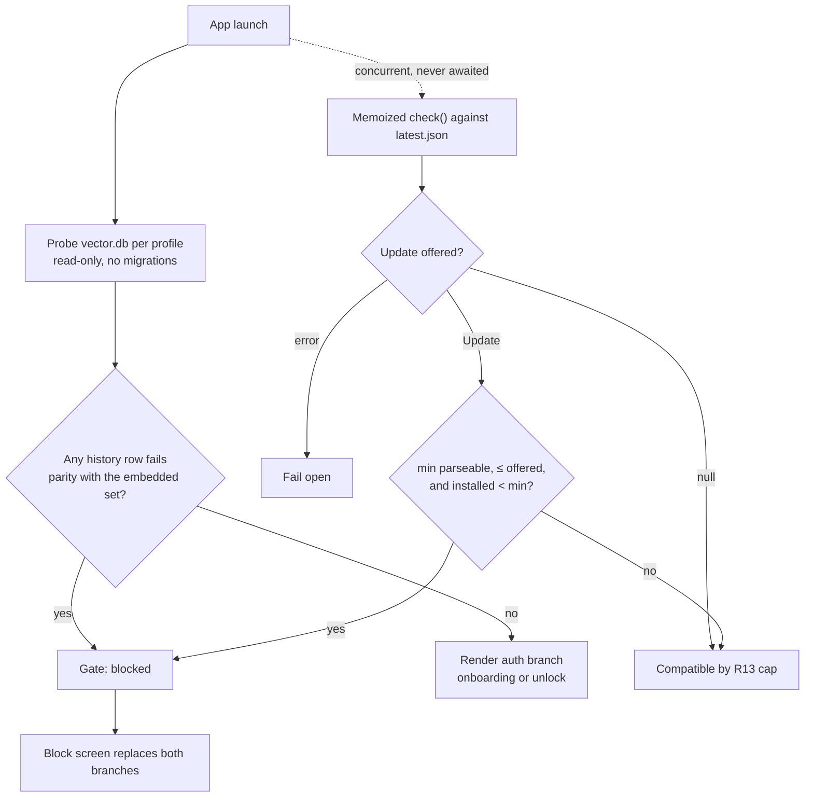
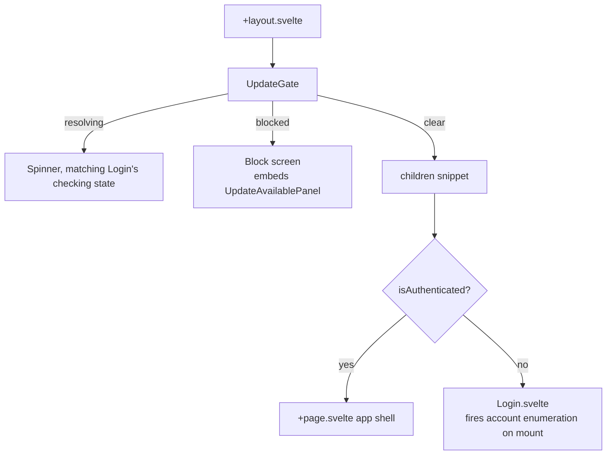
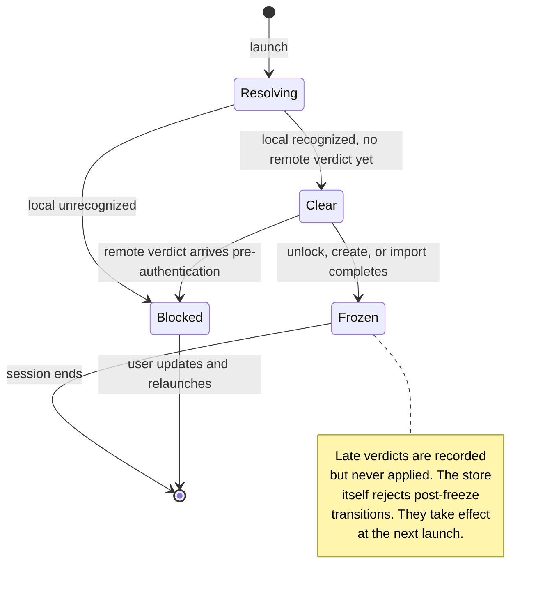
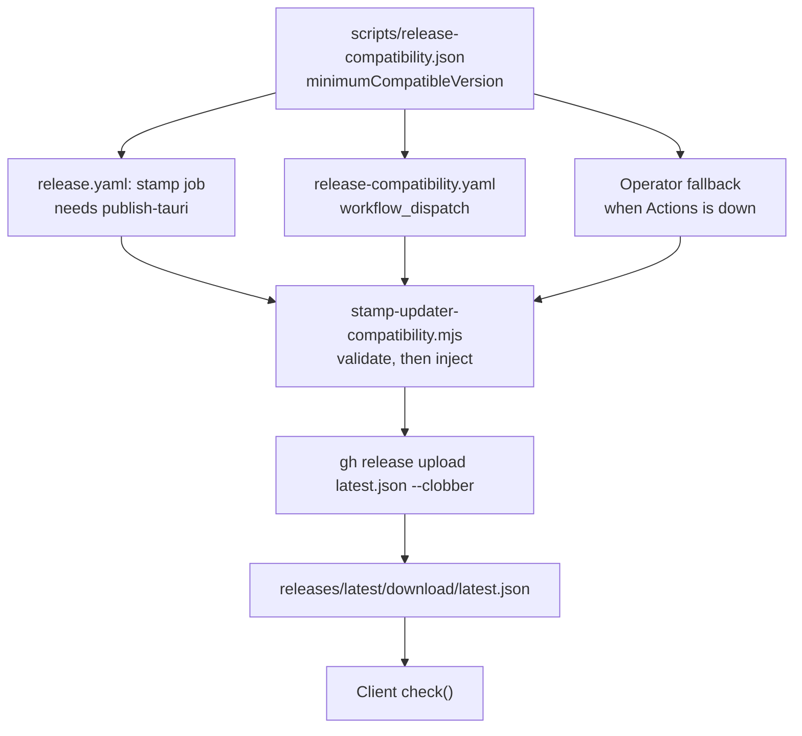

# Mandatory Update Gate for Breaking Releases - Plan

## Goal Capsule

- **Objective:** Ship a mandatory update gate that blocks an incompatible client from using the app — via an operator-published compatibility signal and an independent local storage-format check — before it can touch MLS group state or be misrouted into "create a new account." The guarantee reaches only installs that already carry the gate; see the forward-only note in Dependencies and Assumptions.
- **Product authority:** The Product Contract below governs product behavior. The Planning Contract governs implementation mechanism.
- **Execution profile:** Land the storage-format classifier and the cleanup safety fix first: today's orphan-directory cleanup can delete an account whose database a newer build wrote, and that is a live data-loss path independent of the rest of the feature. Prove the version comparator with unit tests before anything depends on it — a wrong comparison locks users out of a working install. Land U6 with U7; U6's launch-ordering guarantee depends on U7's wrapper.
- **Stop conditions:** Stop and report rather than guessing if the storage-format probe cannot classify a real pre-refinery profile without running migrations, if `check()` cannot be made to distinguish an unreachable endpoint from "no update available", or if the two-version smoke shows the gate blocking a compatible client.
- **Tail ownership:** No commit, push, or PR without an explicit request; leave changes in the working tree for review.

---

## Product Contract

### Summary

Add a mandatory, non-dismissible update gate that blocks the whole app when the installed build is behind a breaking release, checked at every cold launch and unlock. Two independent triggers enter the same block: an operator-published minimum-compatible-version signal carried on the existing updater manifest, and a local check of on-disk storage format that runs before the app decides between onboarding and unlock. The plan also closes a destructive path research uncovered on the second trigger's route: today's orphan-account cleanup can delete a profile a newer build wrote. This sits alongside, and does not change, the existing opt-in "check for updates" flow.

### Problem Frame

Pacto's MLS layer has already had at least one breaking wire-format change (the MDK 0.8.0 upgrade, `docs/plans/2026-08-03-001-chore-nostr-mdk-044-upgrade-plan.md`), which required detecting and archiving an incompatible local store. Nothing stops a client that never received that update from continuing to run against group state it cannot correctly interpret. The existing update flow (`docs/plans/2026-07-17-001-feat-in-app-check-for-updates-plan.md`) is opt-in, off by default, and purely a courtesy notification; it has no way to compel an update ahead of a known-incompatible release. Its own follow-up list already names the missing piece: a launch-time check that runs before PIN unlock.

The local half of the problem is sharper than the brainstorm assumed, and research pinned down exactly how it fails. The app database at `<app_data_dir>/<npub>/vector.db` is opened by three different paths at launch, and they disagree about what a future schema means.

`refinery` aborts on a database it does not recognize. `verify_migrations` in `refinery-core` 0.9.2 runs with the default `abort_missing: true` and `abort_divergent: true`, and it aborts on three distinct conditions: an applied version with no matching embedded migration (`MissingVersion`), an applied version whose embedded counterpart differs (`DivergentVersion`), and an embedded versioned migration at or below the database's current version that was never applied (`MissingVersion` again). A build whose embedded set stops at V30 therefore refuses to migrate a profile a V31 build wrote, and `get_db_connection` — which calls `run_migrations` on every acquisition — fails after the PIN is accepted, with an error that names a migration rather than an incompatible install.

`list_accounts` reaches the same database earlier and draws a different conclusion. It probes each `npub1*` directory with `account_has_valid_pkey`, which opens `vector.db` directly and reads `settings.pkey` without migrating. A future schema that keeps that row is classified `Include` and survives. One that renames or removes it returns `Ok(false)`, which `classify_account_scan` maps to `AccountScanVerdict::Delete`, and `list_accounts` calls `std::fs::remove_dir_all` on the profile. One that drops the `settings` table returns `Err`, which maps to `Skip`, leaving `check_any_account_exists` to report no account and the app to offer onboarding over data that is still on disk.

So the same on-disk state produces an opaque migration error, a silent account deletion, or a false "create a new account" prompt, depending on which future migration happened to land. All three are the same missing check: nothing asks whether the running build recognizes the storage before it acts on it.

### Key Decisions

- KD1. **Whole-app block, not feature-scoped gating.** Simpler to build and reason about than gating MLS alone; accepted trade-off is that unrelated features (wallet, governance) are also blocked during an MLS-only incompatibility. *(session-settled: user-directed — chosen over blocking only the incompatible feature: simplicity, accepted trade-off.)* Governs R2, R7, R14.
- KD2. **GitHub-hosted compatibility manifest, correctable without a new signed release.** Reuses the existing updater/release trust boundary (Ed25519-signed installers, `latest.json` discovery over HTTPS) rather than introducing a new relay-published signal; the relay-published alternative is deferred. *(session-settled: user-directed — chosen over a Nostr-relay-published signal: reuses proven infra, satisfies the fast-correction requirement without new relay-protocol surface.)* Governs R1, R3.
- KD3. **Checks run only at cold launch and unlock; network-unreachable fails open.** Never interrupts an already-unlocked live session, and never locks a user out purely because the update-check endpoint was unreachable. *(session-settled: user-directed — chosen over mid-session interruption and fail-closed: avoids disrupting active use and avoids false lockouts from connectivity problems.)* Governs R4, R9.
  - **Conflict call-out from security review:** fail-open is symmetric. Anyone who can interfere with the manifest fetch — blackhole the endpoint, corrupt the response into a parse failure — reaches the same path a genuine offline launch reaches, and the remote trigger silently does not fire. No signature forgery is needed, because the manifest is unsigned. This is the accepted cost of never locking a user out over connectivity, not an oversight; the local trigger (KD4) is what remains non-defeatable from the network.
- KD4. **Local storage-format check as a second, network-independent trigger.** Runs before the app decides onboarding vs. unlock on every cold launch, closing the gap where KD3's fail-open behavior would otherwise let an offline client with unrecognized local data fall through to a false "create new account" prompt. *(session-settled: user-directed — chosen over relying on the remote signal alone: protects the offline case.)* Governs R5, R6, R12, R14.
- KD5. **The gate is independent of the existing opt-in startup-check preference.** The mandatory gate is not something a user can opt out of by leaving "check for updates on startup" off; that toggle only ever governed the courtesy notification. Chosen over honoring the toggle, which would let the users most exposed to a breaking release opt out of learning about it. The accepted cost is real and worth naming for a privacy-differentiated product: a user who turned that toggle off specifically to stop the app contacting an external host now has it contact GitHub at every cold launch and unlock, with no opt-out. What bounds it is that the request is the same pinned endpoint the updater already used, carries no account identity, and reveals only that some install checked in. Governs R10.
- KD6. **The local format check extends the existing MDK schema-history detection precedent rather than a new marker.** Reuses the proven legacy-store detection approach from the MDK 0.8.0 upgrade instead of adding a second, purpose-built format marker. *(session-settled: user-directed — chosen over a new purpose-built marker: reuses proven detection, less new surface.)* Governs R5, R6.
- KD7. **The minimum-compatible-version is a new field on the existing `latest.json` manifest, not a separate file.** Reuses the fetch path the updater already has and the same asset-re-upload correction mechanism, rather than standing up a second endpoint. *(session-settled: user-directed — chosen over a separate compat manifest file: reuses the existing fetch path and correction mechanism.)* Governs R1, R3, R13.

### Requirements

**Compatibility signal (remote)**

- R1. The app checks an operator-published minimum-compatible-version value at every cold launch and every unlock, before allowing use of the app.
- R2. When the installed version is below the minimum-compatible-version, the app blocks all use of the app until the user updates.
- R3. The minimum-compatible-version value is correctable by the operator without cutting a new signed app release.
- R4. When the minimum-compatible-version check cannot be completed (offline, endpoint unreachable), the app does not block on that basis and continues its normal launch flow, subject to R6.
- R13. The app blocks only on a minimum-compatible-version at or below the version the same manifest offers as the update. A higher, absent, or unparseable value is ignored and does not block.

**Local storage-format detection**

- R5. Before routing to onboarding (create/import account) or the unlock screen, the app inspects local account storage for a recognizable format.
- R6. When local storage exists in a format the running build does not recognize, the app blocks with the same forced-update screen as R2 rather than routing to onboarding — including when the R1 check could not be completed.
- R12. Orphan-account cleanup never deletes a profile directory whose storage the running build does not recognize.
- R14. The block applies to the whole installation. One profile in an unrecognized format blocks every account on that machine, including profiles the build recognizes.

**Blocking UX**

- R7. The forced-update block screen is not dismissible and offers no path to proceed without updating.
- R8. The forced-update block screen reuses the existing check/download/install/relaunch mechanics from the courtesy update flow, and where those mechanics cannot run — no reachable manifest, no platform asset — it names the release page instead of presenting a dead install action.
- R9. A breaking-release block never interrupts an already-running, already-unlocked session; it applies only at the next cold launch or unlock.
- R10. The forced-update gate operates independently of the existing opt-in "check for updates on startup" preference.

**Operator workflow**

- R11. Release operators have a documented way to mark a release as breaking (raise the minimum-compatible-version) and to correct that value quickly if set in error.

### Actors

- A1. **End user** — running the Pacto desktop app, potentially on any past release that carries the gate.
- A2. **Release operator** — publishes releases and the minimum-compatible-version signal through the existing GitHub release pipeline.

### Key Flows

- F1. Remote-triggered block at cold launch
  - **Trigger:** App launches or unlocks; the minimum-compatible-version check succeeds and the installed version is below it.
  - **Actors:** A1
  - **Steps:** App checks the compatibility signal before onboarding/unlock routing → version is below threshold and at or below the offered update → non-dismissible block screen appears → user downloads, installs, and relaunches.
  - **Covers:** R1, R2, R7, R8, R13

- F2. Local-format-triggered block at cold launch (offline)
  - **Trigger:** App launches; the remote check in F1 cannot complete (fails open per R4); local account storage is in an unrecognized format.
  - **Actors:** A1
  - **Steps:** App inspects local storage before any account enumeration → format unrecognized → the profile is exempted from orphan cleanup → the same block screen appears instead of onboarding, for every account on the machine.
  - **Covers:** R5, R6, R7, R12, R14

- F3. Compatible client, normal launch
  - **Trigger:** Installed version meets the minimum-compatible-version (or the check failed open) and local storage is recognized.
  - **Actors:** A1
  - **Steps:** App proceeds to onboarding or unlock as normal; this feature has no visible effect.
  - **Covers:** R4, R9

- F4. Operator marks a release breaking, then corrects a mistake
  - **Trigger:** Operator ships a breaking release, or discovers the minimum-compatible-version was set incorrectly.
  - **Actors:** A2
  - **Steps:** Operator raises the tracked minimum-compatible-version alongside a breaking release and the release pipeline stamps it onto the published manifest; if set wrong, the operator republishes a corrected value against the same tag without cutting a new signed release.
  - **Covers:** R3, R11

### Acceptance Examples

- AE1. **Given** a client several versions behind a breaking release, **when** it launches with the compatibility check reachable, **then** it is blocked before reaching onboarding or unlock. Covers R1, R2.
- AE2. **Given** a client offline with local storage in an unrecognized format, **when** it launches, **then** it is blocked by the local format check even though the remote check failed open. Covers R4, R5, R6.
- AE3. **Given** a client offline with local storage in a recognized format, **when** it launches, **then** it proceeds normally — no false lockout from the unreachable network check. Covers R4.
- AE4. **Given** the app is already unlocked and running, **when** the operator publishes a breaking release mid-session, **then** the running session is not interrupted; the block applies at the next launch or unlock. Covers R9.
- AE5. **Given** an operator mistakenly sets the minimum-compatible-version too high, **when** they publish a correction, **then** previously-blocked compatible clients unblock on their next check without a new signed release. Covers R3, R11.
- AE6. **Given** a manifest whose minimum-compatible-version exceeds the version that same manifest offers, **when** a client reads it, **then** the client ignores the value and does not block. Covers R13.
- AE7. **Given** a profile directory whose database this build does not recognize and whose `pkey` row it cannot read, **when** the app enumerates accounts at launch, **then** the directory is still on disk afterwards and the block screen is shown. Covers R12, R6.
- AE8. **Given** a machine holding one profile the build recognizes and one it does not, **when** the app launches, **then** the recognized profile is also blocked until the unrecognized one is resolved. Covers R14.

### Scope Boundaries

- **Deferred for later:**
  - Relay-published compatibility signal (publishing the minimum-compatible-version as a signed Nostr event on `TRUSTED_RELAYS` instead of a GitHub-hosted manifest).
  - Feature-scoped gating (blocking only MLS messaging instead of the whole app).
- **Out of scope:**
  - Any change to the existing opt-in "check for updates on startup" flow's default or cadence.
  - Interrupting an already-unlocked, already-running session.
  - Classifying the MLS store (`<npub>/mls/vector-mls.db`) as part of the gate. KTD5 records why this is a constraint rather than a preference.
  - Signing or otherwise authenticating `latest.json`. The manifest is unsigned today; KTD2 bounds the blast radius and Risks records what remains open.
  - Per-profile blocking. R14 states the machine-wide behavior, and the gate's verdict is machine-wide because the routing decision it precedes is machine-wide. This is a structural consequence of where the check runs, not backlog.

#### Deferred to Follow-Up Work

- A gate-aware recovery path for a profile the running build cannot open — export, archive, or downgrade assistance. The gate tells the user to update, which is the correct remedy in every case this plan covers; a user who cannot update needs something this plan does not build, and U9 documents the manual route in the meantime.
- Surfacing the compatibility floor anywhere in Settings alongside the installed version.

### Dependencies and Assumptions

- **The gate is forward-only.** A client can only be blocked if it already carries this code, so the first release containing the gate cannot protect anything shipped before it. Every install predating this feature stays reachable only through out-of-band messaging. The gate starts protecting the field one release after it lands.
- `@tauri-apps/plugin-updater` is at `^2.10.1`; `rawJson` on the returned `Update` was added in plugin 2.4.0, so the field is available on the pinned version. `RemoteRelease`'s deserializer in the plugin sets no `deny_unknown_fields`, so an added manifest key is inert to the existing update path.
- The gate's `check()` call must never pass `allowDowngrades`. The plugin's default comparator is `offered > current`, which is what makes KTD1's "null implies compatible" inference sound; `allowDowngrades` switches it to `offered != current` and silently invalidates that inference. Neither existing call site passes options, and the gate's must not either.
- `latest.json` is unsigned. Only the installers carry Ed25519 signatures, verified against the `pubkey` in `src-tauri/tauri.conf.json`. HTTPS to a pinned `github.com` endpoint is the only integrity control on the manifest itself.
- `tauri-apps/tauri-action@v1` offers no input for extra `latest.json` keys, so the field must be stamped onto the published asset after the release matrix completes.
- `vector.db` is unencrypted SQLite with no `PRAGMA key`; `account_has_valid_pkey` already opens it before the PIN exists. A read-only schema probe before unlock is therefore possible.
- `refinery` 0.9.2 runs with default `abort_missing: true` and `abort_divergent: true`, and `verify_migrations` compares every applied row against the embedded set, not only the highest. KTD3's probe reproduces all three of its abort conditions.
- `embed_migrations!` is a compile-time macro, so there is no runtime window where the embedded set is unpopulated and the derived ceiling could read as zero. A build shipped with an incomplete embedded set is a build-time defect, guarded by the embedded-set assertion in the Verification Contract.
- The release pipeline can rewrite a published asset in place: `.github/workflows/release.yaml:204` already does exactly this for `CHANGELOG.md` with `gh release upload … --clobber`.
- Dev builds short-circuit the updater (`isDevBuild()` in `src/lib/updater/update-check.ts:11`), so the remote half of the gate is unverifiable outside a release build. `scripts/local-update-test.mjs` builds two versions and serves a local manifest, and U8 extends it to emit a minimum so the smoke test is runnable as written.
- `switch_account` (`src-tauri/src/account_manager.rs:436`) is registered but has no frontend caller anywhere under `src/`. It is outside the gate's reach today because it is unreachable; a future consumer must not assume the gate covers it.
- Svelte 5 compiles default-slot content passed into a runes-mode child as a lazily-invoked children snippet regardless of the parent's own mode, so wrapping the legacy layout's `{#if}/{:else}` block in a runes-mode `UpdateGate` genuinely defers `Login.svelte`'s `onMount`. KTD6's ordering premise depends on this and it is verified, not assumed.
- A single global minimum-compatible-version applies across all platforms; no evidence surfaced of a platform-specific breaking change.

### Outstanding Questions

**Deferred (non-blocking)**

- Q1. Whether the first breaking release after the gate ships warrants out-of-band messaging for pre-gate installs, which the gate cannot reach. This is a release-communications decision for that release, not a build decision here.

### Sources and Research

Verified in the repository on 2026-08-05:

- Existing courtesy update flow: `src/lib/updater/update-check.ts` (state machine, `resolveInstalledVersion`, `friendlyErrorMessage`, `checkForUpdates`), `src/stores/startup-check.ts`, `src/lib/app/post-login-sync.ts:63-74` (`runStartupUpdateCheckIfEnabled`, the only caller of `checkForUpdates`), `src/components/updater/UpdateAvailableModal.svelte`, `src/components/updater/UpdateAvailablePanel.svelte` (subscribes to `updateStatus` directly; no `Modal` dependency; legacy syntax), `src/components/settings/AppSettingsSection.svelte`.
- Launch routing: `src/routes/+layout.svelte:4,31-37` (the sole `<Login />` mount site), `src/components/auth/Login.svelte:23-35` (onboarding-vs-unlock decision) and `:145-149` (the existing `checking-screen` spinner), `src/stores/auth.ts:164` (`checkAuthStatus`), `:195` (`createAccount`, which calls `runPostLoginNetworkSync` at `:219` before `isAuthenticated.set(true)` at `:221`), `:243` (`importAccount`, which sets the flag at `:271` before syncing at `:279`), `:294` (`unlockWithPin`, syncing at `:306` before the flag at `:308`), and `src/stores/auth.test.ts` (existing suite covering all three).
- Account enumeration and the destructive path: `src-tauri/src/account_manager.rs:92` (`list_accounts`, including `remove_dir_all` at `:121`), `:156` (`account_has_valid_pkey`, with its 2000 ms busy timeout at `:171`), `:187` (`classify_pkey_query_result`), `:222` (`classify_account_scan`), `:345` (WAL mode on `vector.db`).
- Migration runner and abort semantics: `src-tauri/src/migrations/mod.rs:15` (`PRE_REFINERY_CEILING`), `:22` (`run_migrations`), `:80-117` (`baseline_existing_account`, which stamps history without validating table structure; `checksum` is a plain `VARCHAR(255)`), and `refinery-core` 0.9.2 `src/traits/mod.rs:14-92` (`verify_migrations` — the applied-row loop at `:22-51`, `MissingVersion` at `:28`, `DivergentVersion` at `:36`, and the unapplied-below-current case at `:69-88`) with `src/runner.rs:240-241` confirming the aborting defaults.
- Format-detection precedent: `src-tauri/src/mls_store_reset.rs:51` (`history_version`), `:67` (`classify_version`), `:88` (`classify_store`, which needs the PIN-derived key for current stores and sets no busy timeout).
- Rust test harness precedent: `tauri::test::mock_app()` with `get_profile_directory`, used in `src-tauri/src/crypto.rs:462-469` and `src-tauri/src/chat.rs:634-646`.
- Updater plugin behavior: `tauri-apps/plugins-workspace` `plugins/updater/src/updater.rs` (the `RemoteRelease` deserializer with no `deny_unknown_fields`; the default `offered > current` comparator), `plugins/updater/guest-js/index.ts` (`CheckOptions`, `Update.rawJson`, `check()` resolving `null`), plugin `CHANGELOG.md` 2.4.0 (`rawJson` introduction).
- Release pipeline: `.github/workflows/release.yaml:8-9,61-62` (explicit `contents: write` scoping), `:181-204` (`tauri-action` with `uploadUpdaterJson: true`, then the `--clobber` re-upload), `:206` (`update-homebrew-tap` as the existing `needs: publish-tauri` precedent), `src-tauri/tauri.conf.json` updater block, `docs/build/OPERATOR_UPDATES.md`, `scripts/local-update-test.mjs` (`generateManifest` emits only `version`, `notes`, `pub_date`, `platforms`), `scripts/generate-release-manifest.mjs`.
- CI gates and script-test convention: `.github/workflows/ci.yaml` (`pnpm check`, `pnpm lint`, `pnpm check:tauri-commands`, `pnpm test:coverage`, `pnpm test:e2e`, `cargo test --lib --no-default-features`), `:249-250` (`node --test scripts/generate-release-manifest.test.mjs`), `vite.config.ts:73` confirming vitest collects only `src/**/*.test.ts`, and `Makefile:45` (`dev-sandbox`).
- Capability model: custom app commands carry no entry in `src-tauri/capabilities/`; `check_any_account_exists` and `list_all_accounts` are registered in `generate_handler!` with no capability ACL, confirming a new command needs none.
- Command-wiring rule: `docs/solutions/logic-errors/orphaned-relay-health-monitor-command.md`, enforced by `scripts/check-orphaned-tauri-commands.mjs` — also the repo's precedent for statically enforcing a cross-cutting invariant in CI.
- SQLite WAL read semantics: https://www.sqlite.org/wal.html section 5 — a read-only open of a WAL database may recover the wal-index and write `-shm`.

---

## Planning Contract

### Product Contract preservation

Changed: added R12, R13, R14, AE6, AE7, AE8, and Q1; resolved and removed both `Deferred to Planning` questions. R12 is the confirmed scope addition — research found `list_accounts` can delete a profile whose `pkey` row a future schema moved, which is worse than the mis-routing the Problem Frame originally described. R13 is the client-side cap on the published minimum, added so a mistyped or tampered value fails open instead of locking the fleet out; KD7 now governs it. R14 states the machine-wide scope of the block, which was previously described only in Scope Boundaries and System-Wide Impact and therefore had no acceptance example and no verification gate; it documents behavior KD1 and KD4 already implied rather than adding scope. R8 gained a clause for the case where the install mechanics cannot run, which the offline trigger makes reachable. KD3 gained a conflict call-out from security review recording that fail-open is symmetric and defeatable, and KD5 gained the rationale it was missing, naming the privacy cost of contacting GitHub unconditionally. Neither decision changed. The ordering question resolves in KTD6 and the block-screen treatment in KTD9. KD1–KD7 and R1–R11 are otherwise unchanged in meaning and ID.

### Key Technical Decisions

- KTD1. **Read the minimum out of the launch `check()`'s `rawJson`, and route that same result into the shared `updateStatus` store.** The plugin already fetches the configured endpoint and hands back the untouched manifest, so a hand-rolled second HTTP path would duplicate the endpoint config, the timeout handling, and the proxy support for no gain. `check()` resolving `null` means the installed build is at or above the offered version, which under R13's cap means it is also at or above the minimum — so the null case needs no manifest at all. The result must land in `updateStatus` rather than a private field, because that store is what `UpdateAvailablePanel` reads and is therefore what makes R8's install action live on the block screen. One memoized per-launch `check()` promise serves both the gate and the courtesy flow; sharing the network primitive does not weaken R10, because the gate's decision still runs regardless of the opt-in preference. Governs R1, R2, R8, R10.
- KTD2. **Ignore a minimum greater than the manifest's own `version`, and reject the same condition on every publish path.** The manifest is unsigned, so without a cap one bad value blocks every install with no in-app recovery. Capping at the version the manifest actually offers means a block is always paired with an update the client can install and verify. Enforcing it in both places is deliberate: the publish-time check catches operator error early, the client-side check is what actually protects users, because it also covers a manifest the pipeline never wrote. The cap is a real control against a mistyped value and against a network attacker facing a pinned `github.com` endpoint; it is not a control against a compromised release or a malicious operator, whose reach is bounded only by the installer-signing boundary. Governs R13, R3.
- KTD3. **Answer refinery's question read-only, before refinery asks it.** The probe opens `vector.db` on a read-only connection and compares the whole `refinery_schema_history` table against the build's embedded migration set, reproducing all three conditions `verify_migrations` aborts on: an applied row with no embedded counterpart, an applied row whose embedded counterpart differs, and an embedded versioned migration at or below the database's current version that was never applied. Checking only the highest row would have closed the above-ceiling case and left the other two producing exactly the opaque unlock failure this plan exists to eliminate — `verify_migrations` loops over every applied row, so the probe must too. Reading roughly thirty rows per profile is cheap; the aggregate scan's cost bound in System-Wide Impact is what keeps that honest. The probe must not go through `get_db_connection`, which runs migrations. The highest recognized version stays derived from the embedded set rather than hard-coded, because it means "the highest schema this binary understands", which changes with the binary; that is the opposite of `PRE_REFINERY_CEILING`, whose purpose is to stay pinned to a historical commit, and the two must never be unified. Governs R5, R6.
  - **Binding constraint this decision depends on:** no future migration may drop or rename `refinery_schema_history`. `baseline_existing_account` stamps a forged history onto any database that has `settings` but no history table, without validating structure, so a build that removed the history table would be classified pre-refinery, stamped, and then migrated blind — worse than the abort the gate exists to prevent. U2 records this constraint beside the classifier in the same style `PRE_REFINERY_CEILING` records its own. It is documentation, not enforcement; whether to add a static CI guard is an open decision recorded in Risks.
- KTD4. **Run the storage probe before any account enumeration, and make the orphan-cleanup verdict format-aware.** `list_accounts` deletes directories as a side effect of the same scan that answers `check_any_account_exists`, so a probe that runs after it runs after the damage. `classify_account_scan` takes the format verdict as a third input and never returns `Delete` for an unrecognized profile, which keeps the fix in the already-extracted pure function rather than in the scan loop. This backend verdict is the durable half of the protection: it holds regardless of frontend mount order, which is why R12 survives a UI regression that R6 would not. Governs R12, R5.
- KTD5. **Scope the local check to `vector.db` and exclude the MLS store.** Current MLS stores are SQLCipher-encrypted and `classify_store` needs the Argon2id-derived key to read them, which does not exist before the PIN is entered — so a pre-unlock MLS classification is not possible, not merely undesirable. The MLS store already fails closed on an unrecognized schema at engine init and has its own in-channel explanation surface. Governs R5.
- KTD6. **The local check gates routing; the remote check runs concurrently and never delays it.** This is the brainstorm's deferred ordering question. Fail-open (R4) means a network round trip must never sit between launch and the unlock screen, while R5 means the local probe must precede routing by construction. Running them concurrently satisfies both: the local verdict releases the launch, and the remote verdict lands into the same gate state whenever it resolves. Governs R1, R4, R5, R6.
  - **Invariant this decision depends on:** onboarding and unlock must only ever render inside the gate's clear state. The ordering is enforced by mount structure — `Login.svelte` fires the account enumeration from its own `onMount`, so keeping it unmounted is what keeps the probe first — not by an await inside `checkAuthStatus`. Any future entry point that renders `Login` or re-runs `checkAuthStatus` outside the gate wrapper regresses R6 silently, while R12 stays protected by KTD4.
- KTD7. **Freeze the gate verdict on every path that authenticates, and take the bounded await before any side effect on those paths — not merely before the session flag.** Without the await, a verdict that resolves a second after authentication has nowhere to land and the launch that could have blocked does not; without the freeze, a late verdict would interrupt a live session and violate R9. Placement is the load-bearing detail: `unlockWithPin` and `createAccount` already call `runPostLoginNetworkSync` — which connects to relays and syncs MLS groups — *before* they set `isAuthenticated`, so an await sitting just ahead of the flag would let a blocked client reach the network anyway, which is precisely what the objective forbids. The await therefore goes at the top of each of the three functions, ahead of every backend call, and the freeze goes on each success path. The timeout is what keeps the await honest — it expires into fail-open, so a slow network delays authentication briefly and never denies it. Governs R2, R9.
- KTD8. **Compare versions with an app-local semver comparator instead of adding a dependency.** The repo has no `semver` package and the comparison is a few dozen lines, but it is the single point where a mistake locks a user out of a working install, so it lands as a pure function with its own tests rather than inline in the gate. It must tolerate a leading `v`: `resolveInstalledVersion` falls back to `buildVersion`, which is the git tag (`v0.2.0`), while `getVersion()` returns the bare bundle version. Governs R1, R2.
- KTD9. **Render the block as a gate wrapper above both auth branches, not through the existing `UpdateAvailableModal`.** The modal is dismissible by design and mounts inside `+page.svelte`, which never renders while blocked; reusing it would mean defeating its dismissal path and moving it. A wrapper component around the layout body owns the three states the gate has — resolving, blocked, clear — and renders `UpdateAvailablePanel` inside the blocked state so the install mechanics are reused without the dismissible chrome. The rejected alternative was a block living only inside the `Login` shell: smaller, but it leaves a verdict arriving just after authentication with no surface to render on, trading a real hole for a slightly smaller diff. This is the brainstorm's deferred treatment question. Governs R7, R8, R14.
- KTD10. **Stamp the manifest from a tracked value in a job that runs after the whole release matrix, and correct it through a dispatchable workflow.** `tauri-action` runs once per platform and each run rewrites `latest.json`, so any injection inside the matrix loses a race with the next platform; a `needs: publish-tauri` job is the same shape `update-homebrew-tap` already uses. Keeping the value in a tracked file rather than a workflow input means the next release cannot silently regress it, and the dispatchable workflow reuses the same script so a correction and a release produce identical manifests. Both entry points run the same validator, and the documented manual fallback runs it too — the least-protected path is the one used under the most time pressure, so it does not get to skip the check. Governs R3, R11.

### High-Level Technical Design

Gate resolution at cold launch. The local branch is on the critical path; the remote branch is not.

Component placement. The wrapper sits above the auth branch, which is what makes "no auth surface renders behind the block" checkable by reading the tree.

Gate verdict lifecycle. The freeze is what reconciles R2 with R9.

Publish and correction. All three paths run the same validator against the same tracked value.

### Assumptions

- Stamping runs after the release is already published, so there is a window of a few minutes where `latest.json` carries no minimum. Clients checking inside that window fail open, which is the same outcome as an unreachable endpoint and is acceptable.
- A ten-second cap on the authentication-time await is long enough for a check started at launch to have resolved and short enough not to read as a hang. No baseline latency measurement backs the figure; it is a constant to tune against the fail-open smoke, not a product rule.
- Blocking whenever the on-disk history fails parity with the embedded set is not over-strict: `refinery` already refuses that database, so the alternative to a block is a broken unlock, not a working one.
- A read-only open of a WAL-mode database can still recover the wal-index and write `-shm`. That is correct SQLite behavior and is benign here — the same process may legitimately write the file moments later — so the probe must not set `immutable=1`.

### Sequencing

U1 and U2 are independent and land first. U3 and U4 both require U2 and touch disjoint surfaces. U5 requires U1 and U4. **U6 and U7 land together**: U6 wires the gate into the authentication paths, but its launch-ordering guarantee is only real once U7's wrapper keeps `Login.svelte` unmounted, because `Login`'s own `onMount` is what triggers account enumeration. U7 is deliverable on its own; the dependency runs one way. U8 is independent of the app-side work and can land at any point; U9 documents what U8 builds and follows it.

---

## Implementation Units

### U1. App-local semver comparison

- **Goal:** Give the gate one tested function that answers whether the installed version is below a published minimum.
- **Requirements:** R1, R2. Governed by KTD8.
- **Dependencies:** None.
- **Files:**
  - `src/lib/updater/version-compare.ts` (new)
  - `src/lib/updater/version-compare.test.ts` (new)
- **Approach:**
  1. Export a parser that accepts an optional leading `v`, requires `major.minor.patch`, and returns `null` for anything it cannot parse.
  2. Export a comparator over parsed versions following SemVer 2.0.0 precedence, including pre-release ordering (`1.0.0-beta` precedes `1.0.0`) and build metadata being ignored.
  3. Export the gate's question directly — given an installed version and a candidate minimum, return whether the installed build is below it — so callers never re-derive the comparison. An unparseable input on either side answers "not below", matching R13's fail-open posture.
- **Execution note:** Write this test-first. It is the one function whose defect is a lockout of a working install, and it has no dependencies to stand up.
- **Patterns to follow:** `src/lib/updater/update-check.ts` for module shape and named exports; existing pure-function tests under `src/lib/`.
- **Test scenarios:**
  - Equal versions: installed `0.3.0` against minimum `0.3.0` is not below.
  - Below across each component: `0.2.9` vs `0.3.0`, `0.3.0` vs `1.0.0`, `1.2.3` vs `1.2.4`.
  - Above: `1.0.0` vs `0.9.9` is not below.
  - Leading `v` tolerated on either side and on both: `v0.2.0` vs `0.3.0`, `0.2.0` vs `v0.3.0`.
  - Numeric, not lexical, ordering: `0.10.0` is not below `0.9.0`.
  - Pre-release precedence: `1.0.0-beta.1` is below `1.0.0`; `1.0.0` is not below `1.0.0-beta.1`; `1.0.0-alpha` is below `1.0.0-beta`.
  - Build metadata ignored: `1.0.0+abc` and `1.0.0` compare equal.
  - Unparseable minimum (`""`, `"latest"`, `"1.0"`, `null`) answers "not below".
  - Unparseable installed version answers "not below".
- **Verification:** `pnpm test` passes and no call site outside this module parses a version string.

### U2. Storage-format classification for the app database

- **Goal:** Let the backend answer whether this build recognizes the on-disk schema of every profile, without migrating anything.
- **Requirements:** R5, R6. Governed by KTD3, KTD5.
- **Dependencies:** None.
- **Files:**
  - `src-tauri/src/storage_format.rs` (new)
  - `src-tauri/src/lib.rs` (declare the module — siblings are flat `mod X;` declarations, no module-list indirection)
  - `src-tauri/src/migrations/mod.rs` (expose the highest embedded version and the embedded migration set for parity comparison)
  - `src-tauri/src/mls_store_reset.rs` (adopt the extracted history-read helper)
- **Approach:**
  1. Extract the read-only history read — table-existence check plus the applied rows — into one helper parameterized by history-table name, and have both `mls_store_reset` and this module call it instead of each carrying the same queries. `mls_store_reset` reduces the rows to a max version as it does today; this module needs the whole set. `embedded::migrations::runner().get_migrations()` is already reachable from inside `migrations/mod.rs`; no visibility change is needed.
  2. Add functions to `migrations` returning the highest embedded version and the embedded set, with a doc comment stating why the ceiling is derived while `PRE_REFINERY_CEILING` is pinned.
  3. Classify one database from a read-only `Connection::open_with_flags` with a short busy timeout mirroring `account_has_valid_pkey`'s 2000 ms — never `get_db_connection`, which migrates.
  4. Return a five-way classification. Absent file is `Fresh`. History table absent with a `settings` table present is `PreRefinery` (recognized — `run_migrations` baselines it). A history table present with no rows is `Recognized`, matching what `run_migrations` would do with it. Otherwise run parity against the embedded set and reproduce refinery's three abort conditions: an applied row with no embedded counterpart is `Unrecognized(version)`; an applied row whose embedded counterpart differs on name or checksum is `Divergent(version)`; an embedded versioned migration at or below the database's highest applied version that is absent from history is `Divergent(version)`. Everything else is `Recognized`. `Unrecognized` and `Divergent` both block — the remedy and the failure they prevent are identical — and both are distinguished in logs.
  5. Any failure to read — the file exists but will not open, or a query errors after a successful open — classifies as `Recognized`. Corruption and transient locks are not version problems, and telling the user to update would not fix either; the existing error paths own those cases.
  6. Record the KTD3 binding constraint as a doc comment beside the `PreRefinery` arm: no future migration may drop or rename `refinery_schema_history`, because `baseline_existing_account` would then forge history over a database it never validated.
  7. Add a scan over the profile directories returning the aggregate verdict, the count of unrecognized profiles, and the highest offending version — enough for the block screen's copy and for support, and nothing more. No npub and no filesystem path appears in the report or in any error it returns. Bound the aggregate scan with an overall time cap; on expiry, report recognized rather than blocking, consistent with every other read failure.
- **Patterns to follow:** `src-tauri/src/mls_store_reset.rs:51-100` for the read-only probe and the pure `classify_*` split that keeps the logic unit-testable without a filesystem; `src-tauri/src/account_manager.rs:171` for the busy-timeout precedent.
- **Test scenarios:**
  - Classification is a pure function over `(applied rows, history_table_exists, settings_table_exists, embedded set)`, exercised directly: a full matching history is recognized; a row above the highest embedded version is unrecognized; a row whose checksum differs from its embedded counterpart is divergent; a row whose name differs is divergent; an embedded migration missing from history below the applied maximum is divergent; no rows with history present is recognized; no history but `settings` present is pre-refinery; neither present is fresh.
  - A checksum mismatch on a **middle** row, not the highest, is divergent — the case a top-row-only probe would wave through into a `DivergentVersion` abort at unlock.
  - Against a real in-memory database migrated by `crate::migrations::run_migrations`: classifies as recognized, and the probe leaves `refinery_schema_history` byte-identical.
  - A database with `settings` present, no history table, and a structure that is not pre-refinery-shaped still classifies as pre-refinery — asserting the documented constraint is the only thing protecting this arm, so the test pins the behavior the doc comment explains.
  - Covers AE2. A profile directory whose `vector.db` fails parity makes the aggregate scan report unrecognized and surface that version.
  - A profile directory with no `vector.db` does not make the scan report unrecognized.
  - An unreadable or truncated database file classifies as recognized rather than blocking.
  - A query returning `SQLITE_BUSY` after a successful open classifies as recognized rather than blocking.
  - Covers AE8. The scan over several profiles reports unrecognized when any one of them is, and reports the count.
  - The report and every error variant contain no npub and no filesystem path.
  - The embedded set is complete: it is non-empty, its highest version is at least `PRE_REFINERY_CEILING`, and its version set matches the migration files committed under `src-tauri/src/migrations/`. A floor check alone would pass a build that silently lost its newest migrations in a bad merge and then false-blocked every user carrying them.
- **Verification:** `cd src-tauri && cargo test` passes, and the probe path contains no call to `run_migrations` or `get_db_connection`.

### U3. Exempt unrecognized profiles from orphan cleanup

- **Goal:** Stop `list_accounts` from deleting a profile whose database a newer build wrote.
- **Requirements:** R12. Governed by KTD4.
- **Dependencies:** U2.
- **Files:**
  - `src-tauri/src/account_manager.rs`
- **Approach:**
  1. Give `classify_account_scan` the profile's format classification as a third input and return `Skip` instead of `Delete` whenever the profile is unrecognized or divergent, regardless of the `pkey` verdict.
  2. Classify each directory in the `list_accounts` loop before probing `pkey`, so the exemption applies to the same iteration that would otherwise delete.
  3. Extend the doc comment on `AccountScanVerdict` to record that an unrecognized profile is never deleted and why — the existing comment already explains the `Err`-means-`Skip` policy and this is the same reasoning applied to a different unknown.
- **Execution note:** This is the data-loss fix, and it is the only protection for R12 that survives a frontend regression. Land it with U2 rather than behind the rest of the gate, so the destructive path closes even if the UI work slips.
- **Patterns to follow:** The existing extracted-verdict style in the same file — `classify_pkey_query_result` and `classify_account_scan` are already pure and table-tested. For the integration scenario, `tauri::test::mock_app()` with `get_profile_directory`, as used in `src-tauri/src/crypto.rs:462-469`; the file's own `#[cfg(test)]` modules only cover the pure functions and give no harness for `list_accounts`, which needs an `AppHandle`.
- **Test scenarios:**
  - Covers AE7. Unrecognized profile with `Ok(false)` from the `pkey` probe yields `Skip`, not `Delete`.
  - Divergent profile with `Ok(false)` yields `Skip`.
  - Unrecognized profile with `Err` from the `pkey` probe yields `Skip`.
  - Unrecognized profile with a valid `pkey` yields `Include`, so a future-format account still appears in the list.
  - Recognized profile with `Ok(false)` and not in flight still yields `Delete` — the existing cleanup is not disabled.
  - Recognized profile with `Ok(false)` while in flight still yields `Skip`.
  - Integration over a `mock_app()` temp app-data directory: a profile with an above-ceiling history row and no readable `pkey` survives a `list_accounts` call.
- **Verification:** `cd src-tauri && cargo test` passes, and the integration test asserts the directory still exists after the scan.

### U4. Expose the storage verdict to the frontend

- **Goal:** Give the launch path one command that reports whether this build recognizes local storage.
- **Requirements:** R5, R6. Governed by KTD3, KTD4.
- **Dependencies:** U2.
- **Files:**
  - `src-tauri/src/storage_format.rs` (add the command)
  - `src-tauri/src/lib.rs` (register in `generate_handler!`)
  - `src/lib/api/auth.ts` (typed wrapper)
- **Approach:**
  1. Add `#[tauri::command] get_storage_compatibility` returning a serializable report: whether every profile is recognized, the count of unrecognized profiles, the highest offending version found, and the version this build supports. The `get_*` prefix matches the repo's split — `check_*` commands return a bare bool, report-shaped commands use `get_*`, as `get_mls_store_reset_state` does. Serde renames to camelCase so the wrapper's type needs no mapping.
  2. Register it in `generate_handler!` and add the typed wrapper beside `checkAnyAccountExists` in `src/lib/api/auth.ts`. Custom app commands need no `src-tauri/capabilities/` entry; the sibling account commands have none.
  3. Neither the report nor any error variant may carry a filesystem path or an npub. The command answers before authentication, and `get_profile_directory`'s own error strings embed the npub — do not surface them.
  4. The wrapper's caller is U5's gate module. Do not land this unit without that caller — a registered command with no `invoke` reads as used to `cargo build` and ships dead, which is exactly the failure `docs/solutions/logic-errors/orphaned-relay-health-monitor-command.md` documents.
- **Patterns to follow:** `src/lib/api/auth.ts:47` (`checkAnyAccountExists`) for wrapper shape; `get_mls_store_reset_state` in `src-tauri/src/lib.rs:8460` for a report-shaped command backed by a sibling module.
- **Test scenarios:**
  - The report struct serializes to the camelCase keys the wrapper's type declares.
  - The command returns compatible for a directory tree with no profiles.
  - The command returns incompatible, the count, and the offending version for a tree with one failing profile.
  - An error returned by the command contains no npub substring and no path separator.
- **Verification:** `pnpm check:tauri-commands` passes without a new baseline entry, and `pnpm check` accepts the wrapper's return type.

### U5. Gate state and verdict resolution

- **Goal:** Own the gate's three states, both triggers, the R13 cap, and the freeze, in one testable module.
- **Requirements:** R1, R2, R4, R6, R8, R9, R10, R13. Governed by KTD1, KTD2, KTD6, KTD7.
- **Dependencies:** U1, U4.
- **Files:**
  - `src/lib/updater/update-gate.ts` (new)
  - `src/lib/updater/update-gate.test.ts` (new)
  - `src/lib/updater/update-check.ts` (export the memoized per-launch `check()` and reuse `resolveInstalledVersion`)
- **Approach:**
  1. Expose a store holding `resolving | clear | blocked`, the block reason (`minimum-version` or `storage-format`), the installed version, the required version when known, and the unrecognized-profile count. The store's setter rejects any transition after the freeze — the freeze is an invariant of the store, not caller discipline, because the cited `createUpdateStatusStore` factory merges patches unconditionally and copying it verbatim would reopen exactly the bug KTD7 exists to prevent.
  2. Source the installed version from the existing `resolveInstalledVersion()`, which already handles `getVersion()` returning `0.0.0` and the `v`-prefixed git-tag fallback. The block screen needs it for both reasons, and the storage-format reason has no `Update` object to read it from.
  3. `resolveGateAtLaunch()` awaits the storage verdict from U4 and settles the store to `blocked` or `clear` on that alone, then starts the remote check without awaiting it — this is KTD6's split, and the launch path must never sit on the network.
  4. Add a memoized per-launch `check()` in `update-check.ts` that both the gate and `checkForUpdates` consult, so one launch makes one round trip and the courtesy startup check cannot overwrite the gate's `updateStatus` with a second, independent result. Memoizing the network primitive does not touch R10: the gate still decides unconditionally, and `startupCheckEnabled` still governs only whether the courtesy notification surfaces.
  5. The remote path routes its result through `updateStatus` — a blocking `Update` leaves that store `available` with the target version, which is what makes `UpdateAvailablePanel` render a live install action on the block screen per R8. A `null` result is compatible. A throw is fail-open, distinguished from `null` by the try/catch boundary, matching how `checkForUpdates` at `src/lib/updater/update-check.ts:127-143` already separates them. An `Update` means reading `minimum_compatible_version` from `rawJson`, discarding it when it is unparseable or above `update.version` per R13, and otherwise comparing it against `update.currentVersion` with U1. The call passes no options — in particular never `allowDowngrades`, which would invalidate KTD1's null-implies-compatible inference.
  6. Never consult `startupCheckEnabled` — R10 makes the gate independent of that preference — and never gate the storage half on `isDevBuild()`, which is testable in dev. The remote half inherits the dev short-circuit because `check()` has no manifest to read in dev.
  7. `awaitGateBeforeAuth()` resolves immediately when the remote verdict has already settled, otherwise waits for it under a timeout and treats expiry as fail-open.
  8. `freezeGate()` marks the verdict final; a remote verdict arriving after the freeze is recorded for diagnostics and never applied.
- **Patterns to follow:** `src/lib/updater/update-check.ts:60-86` for the store factory and status transitions — with the post-freeze guard added, which that factory does not have. The per-group `Record` plus generation counter in `src/stores/mls-reset.ts` is deliberately not the model: the gate has one verdict and one command call, not N keyed entities reconciled against a competing event stream.
- **Test scenarios:**
  - Covers AE1. Mocked `check()` returns an update whose `rawJson.minimum_compatible_version` is above the installed version and at or below the offered version: state becomes blocked with reason `minimum-version` and the required version recorded.
  - The same blocking case leaves `updateStatus` at `available` with the offered version, so the block screen's install action is live.
  - Installed version equal to the minimum: state stays clear.
  - Covers AE6. Minimum above the offered `version`: ignored, state stays clear.
  - Minimum absent from `rawJson`, or present but unparseable: ignored, state stays clear.
  - Covers AE3. `check()` throws: state stays clear, and the storage verdict alone decides.
  - `check()` resolves `null`: state stays clear without reading any manifest.
  - Covers AE2. Storage verdict is unrecognized while `check()` throws: state is blocked with reason `storage-format`, and the installed version is still populated.
  - Storage verdict is unrecognized while the remote verdict is compatible: still blocked; the two triggers are independent.
  - The launch resolution settles the store before the remote promise resolves — the local verdict does not wait on the network.
  - Two callers in one launch — the gate and `checkForUpdates` — produce exactly one underlying `check()` call.
  - The gate resolves regardless of `startupCheckEnabled`, and the module reads no value from it.
  - Covers AE4. A remote verdict resolving after `freezeGate()` leaves the state clear, asserted against the store's setter rather than the caller.
  - `awaitGateBeforeAuth()` returns blocked when the remote verdict already says blocked, and returns clear when the timeout expires with the verdict still pending.
- **Verification:** `pnpm test` passes and the module exposes no way for a caller to clear a blocked verdict.

### U6. Wire the gate into launch and every authentication path

- **Goal:** Make the gate the first thing that runs at launch and the last thing consulted before any session starts.
- **Requirements:** R1, R2, R5, R9. Governed by KTD4, KTD6, KTD7.
- **Dependencies:** U5, and U7 for the launch-ordering property (see Sequencing).
- **Files:**
  - `src/routes/+layout.svelte`
  - `src/stores/auth.ts`
  - `src/stores/auth.test.ts` (existing suite to extend — it already mocks `invoke` and covers `checkAuthStatus`, `unlockWithPin`, and `checkSession`)
- **Approach:**
  1. Call `resolveGateAtLaunch()` from the layout's `onMount`, ahead of the existing `checkSession()` call, so the storage probe precedes any account enumeration. `checkAuthStatus()` — which invokes `check_any_account_exists` and therefore `list_accounts` — runs from `Login.svelte`'s own mount, and U7's wrapper is what keeps that component unmounted until the verdict settles. Statement order inside the layout is necessary but not sufficient; the mount structure is the actual guarantee.
  2. In `unlockWithPin`, `createAccount`, and `importAccount`, await `awaitGateBeforeAuth()` as the **first statement inside each function's `try`, ahead of every backend call**; on a blocked verdict, return without authenticating. Placing it just before `isAuthenticated.set(true)` is wrong and is the trap this step exists to avoid: `unlockWithPin` and `createAccount` already call `runPostLoginNetworkSync` — relay connection and MLS group sync — *before* that flag, so an await sitting next to the flag would let a blocked client reach the network first. Call `freezeGate()` on each success path.
  3. Leave `runPostLoginNetworkSync` and the courtesy startup check otherwise untouched, and do not reorder the existing calls — moving the await to the top of each function makes the three paths uniform without changing any existing sequence.
- **Patterns to follow:** `src/stores/auth.ts:294-309` for the unlock sequence around `runPostLoginNetworkSync` and `isAuthenticated`; `src/routes/+layout.svelte:21-28` for the existing mount hook; `src/stores/auth.test.ts` for the `invoke` mocking shape.
- **Test scenarios:**
  - A blocked verdict leaves `isAuthenticated` false and `currentUser` null, asserted separately for `unlockWithPin`, `createAccount`, and `importAccount`.
  - A blocked verdict on each of the three paths issues **no** backend `invoke` at all — in particular `runPostLoginNetworkSync`'s relay and MLS sync calls never fire. This is the assertion that catches a regression back to an await placed next to the session flag.
  - A clear verdict authenticates as before on all three paths and freezes the gate exactly once per path.
  - A verdict that flips to blocked after a create or import completes does not clear `isAuthenticated` — the freeze holds, satisfying R9 on the onboarding paths, not just on unlock.
  - **Test expectation for the layout half:** none as a unit test — the repo has no component-rendering tests. The ordering property is covered by U7's e2e and MCP scenarios and by the Verification Contract's storage-probe row.
- **Verification:** `pnpm test` and `pnpm check` pass; a sandbox launch with a forced unrecognized profile never reaches the welcome screen on any of the three paths.

### U7. Block screen

- **Goal:** Replace the whole app with a non-dismissible update screen while the gate is blocked, and show nothing misleading while it resolves.
- **Requirements:** R7, R8, R14. Governed by KTD9.
- **Dependencies:** U5.
- **Files:**
  - `src/components/updater/UpdateGate.svelte` (new)
  - `src/routes/+layout.svelte` (wrap the body)
  - `src/lib/i18n/locales/en/updater.json`
  - `src/lib/i18n/locales/es/updater.json`
- **Approach:**
  1. Author `UpdateGate.svelte` in runes mode with a `children` snippet. It renders a spinner while resolving, the block screen while blocked, and `{@render children()}` otherwise. Wrap the entire body of `+layout.svelte` — both the authenticated branch and `<Login />` — so no auth branch can render behind the block. This wrapper is the only thing enforcing KTD6's invariant; a future entry point that renders `Login` outside it regresses R6.
  2. The resolving spinner must match `Login.svelte`'s existing `checking-screen` treatment — same markup, colors, and copy. The gate resolves, then `Login` mounts and immediately shows its own checking state; two different spinners in sequence read as a reload rather than one continuous launch.
  3. The blocked state renders a full-screen panel: what happened, the installed and required versions, and no close affordance, no escape key handler, no backdrop dismissal. Give it `role="alertdialog"` with an `aria-live` region and move focus to the panel's first focusable element on mount — `MlsResetNotice.svelte`, the component this unit follows, already carries `role`/`aria-live`, and a non-dismissible full-screen takeover needs at least as much. Reason-specific copy distinguishes "this release is required" from "your data was written by a newer version", and the storage-format copy names the count of unrecognized profiles and the schema version, which is what makes U9's manual recovery route usable.
  4. Embed `UpdateAvailablePanel` for the install action when `updateStatus` is `available`, which satisfies R8 without the dismissible `Modal` chrome — U5 is what makes that store reflect the gate's own check. Embed it as a child only; it is written in legacy syntax and none of that may be copied into this runes-mode component.
  5. Branch the no-install-action fallback by reason. For `minimum-version`, offer retry plus the release page — the failure is transient. For `storage-format` with no available update, say plainly that this is not a transient failure, that a newer build already wrote the data on this machine, and point at the recovery route rather than a retry the user could sit on forever.
  6. The release-page URL is a compile-time application constant. Never derive it from `rawJson` or any other manifest field: the manifest is unsigned, and a non-dismissible screen with an urgent audience is the worst possible place to render an attacker-supplied link.
  7. Add `updater.gate.*` keys to both locale catalogs. No raw user-facing English in the component.
- **Patterns to follow:** `src/components/channel/MlsResetNotice.svelte` for a runes component that renders reason-branched explanatory copy and carries `role`/`aria-live`; `src/components/updater/UpdateAvailablePanel.svelte` for the install and progress surface it embeds — which subscribes to `updateStatus` directly and has no `Modal` dependency, so it is safely embeddable.
- **Test scenarios (Playwright e2e and MCP walkthrough — the repo runs no component-rendering unit tests):**
  - Renders the spinner and no auth content while the gate is resolving, and `Login`'s account-enumeration command has not fired.
  - The resolving spinner and `Login`'s checking spinner are visually identical, so the handoff shows no flash.
  - Renders the children snippet and no block content when the gate is clear.
  - Renders the block screen and no children when blocked, for both reasons, over both the authenticated and unauthenticated branches.
  - Covers AE8. With one recognized and one unrecognized profile on the machine, the block screen renders rather than the unlock screen.
  - The `minimum-version` reason shows the required version and a retry; the `storage-format` reason with no available update shows the non-transient copy and the recovery pointer, not a retry.
  - The block screen exposes no dismiss control and does not clear on Escape or on a backdrop click.
  - Focus lands inside the panel on mount and the panel is announced to assistive technology.
  - The release-page link resolves to the compile-time constant even when the served manifest carries a different URL.
  - Every visible string resolves through `$t`, and both `en` and `es` carry the new keys.
- **Verification:** `pnpm lint` reports no new raw-text warnings, `pnpm check` passes, and `pnpm test:e2e` passes with the wrapper in the tree.

### U8. Publish and correct the compatibility signal

- **Goal:** Put the minimum on the published manifest from a tracked value, and make a wrong value correctable without a signed release.
- **Requirements:** R3, R11, R13. Governed by KTD2, KTD10.
- **Dependencies:** None.
- **Files:**
  - `scripts/release-compatibility.json` (new — beside the script that reads it, matching where `generate-release-manifest.mjs` and `local-update-test.mjs` already live; the repo root holds only cross-cutting tool config)
  - `scripts/stamp-updater-compatibility.mjs` (new)
  - `scripts/stamp-updater-compatibility.test.mjs` (new)
  - `scripts/local-update-test.mjs` (add a minimum-compatible-version option)
  - `.github/workflows/release.yaml`
  - `.github/workflows/release-compatibility.yaml` (new — named for the `release.yaml` / `tag-release.yaml` / `prepare-release.yaml` family it joins)
  - `.github/workflows/ci.yaml`
- **Approach:**
  1. `release-compatibility.json` holds `minimumCompatibleVersion`, seeded at `0.0.0` — a floor no release is below, so the gate ships inert and only engages when an operator raises it.
  2. The script downloads `latest.json` for a tag, injects `minimum_compatible_version` (snake_case, matching the manifest's own `pub_date`), and re-uploads with `--clobber`. It exports its pure parts — read the value, validate it, merge it into a manifest object — so they are testable without a network or a release, and so both the operator fallback in U9 and the local smoke harness can call them directly.
  3. Validation refuses to proceed when the minimum is unparseable or greater than the manifest's `version`, which is KTD2's publish-time half. It runs against the dispatch override exactly as it runs against the tracked value. A refusal fails the job rather than stamping a value that would block every client.
  4. Add a `stamp-updater-compatibility` job to `release.yaml` with `needs: publish-tauri`, mirroring `update-homebrew-tap`'s shape, running the script against the tag and the tracked value.
  5. Add `release-compatibility.yaml` with a `workflow_dispatch` taking a tag and an optional override value. Declare `permissions: contents: write` and nothing broader, matching `release.yaml:8-9,61-62`. Pass every dispatch input through `env:` — never interpolate `${{ inputs.* }}` into a `run:` body — and validate the override before any shell or network call.
  6. Extend `scripts/local-update-test.mjs` with a minimum-compatible-version option whose value is merged into the generated manifest through the same exported merge function, so the Verification Contract's two-version smoke is runnable as written. Today `generateManifest` emits only `version`, `notes`, `pub_date`, and `platforms`, and the smoke test cannot produce a manifest the gate can block on.
  7. Extend the existing `node --test` step in `.github/workflows/ci.yaml:249-250` to cover the new script test — vitest collects only `src/**/*.test.ts`, so a script test that is not named in CI never runs.
- **Patterns to follow:** `scripts/generate-release-manifest.mjs` and its `node:test` sibling for the exported-pure-functions shape; `.github/workflows/release.yaml:200-204` for the `--clobber` upload and `:206` for a `needs: publish-tauri` job.
- **Test scenarios:**
  - Merging into a manifest preserves `version`, `notes`, `pub_date`, and every `platforms` entry byte-for-byte and adds exactly one key.
  - Merging is idempotent: stamping an already-stamped manifest replaces the value rather than nesting or duplicating it.
  - Covers AE6. Validation rejects a minimum greater than the manifest's `version`.
  - Validation rejects an unparseable minimum and a missing `minimumCompatibleVersion` key.
  - Validation accepts a minimum equal to the manifest's `version` and one below it.
  - A leading `v` on either the tracked value or the manifest version is tolerated and the emitted field is normalized to one form.
  - Covers AE5. An override value supplied by the dispatch path takes precedence over the tracked file and passes through the same validator.
  - A dispatch-shaped input containing shell metacharacters is rejected by validation before reaching any command.
  - The local harness's generated manifest carries the requested minimum and is otherwise unchanged from what it emits today.
- **Verification:** `node --test scripts/stamp-updater-compatibility.test.mjs` passes locally and in CI; a dry run against a real published tag produces a manifest that differs from the original by exactly the new key.

### U9. Operator documentation

- **Goal:** Leave a release operator able to mark a release breaking, to undo it under time pressure, and to unstick a machine the local trigger blocked.
- **Requirements:** R11.
- **Dependencies:** U8.
- **Files:**
  - `docs/build/OPERATOR_UPDATES.md`
  - `docs/README.md`
- **Approach:**
  1. Add a breaking-release section to `OPERATOR_UPDATES.md`: how to raise `minimumCompatibleVersion`, that it must not exceed the version being released, and what clients below it experience.
  2. Document the correction path — the dispatchable workflow first, and the direct `gh release upload latest.json --clobber` as the emergency fallback when Actions is unavailable. The fallback must run the script's exported validator against the value first; give the exact invocation, and state that a direct edit must be mirrored back into the tracked file or the next release will regress it.
  3. Document the manual recovery route for a machine the local trigger blocked. The app deliberately reports no npub and no path, so the procedure is: profile directories live under `<app_data_dir>/npub1…`; the block screen names the schema version it does not recognize; open each profile's `vector.db` and read `refinery_schema_history` to find the one reporting that version; move that directory aside. Every other account on the machine unblocks on the next launch.
  4. State the three limits plainly: the manifest is unsigned, the gate cannot reach installs that predate it, and the remote trigger can be suppressed by anyone able to interfere with the manifest fetch.
  5. Link the new section from `docs/README.md`'s build entry.
- **Test expectation:** none — documentation-only unit.
- **Verification:** A reader who has never run a release can raise the value, correct it, and unstick a blocked machine from the doc alone, without reading the workflow.

---

## System-Wide Impact

**Launch gains a disk probe before account detection.** Every cold launch now opens one read-only SQLite connection per profile directory and reads that profile's whole migration history — roughly thirty rows today — before anything else touches storage. The cost is bounded by profile count, which is small today, but U3 removes the mechanism that used to bound it: an unrecognized directory is now exempt from cleanup forever, so per-launch scan cost is monotonically non-decreasing per machine. That is why U2 caps the aggregate scan rather than relying on a per-file busy timeout. The probe never migrates, but "read-only" is not "touches nothing": `vector.db` runs in WAL mode, and a read-only open of a database left with a hot WAL can recover the wal-index and write `-shm`. That is correct SQLite behavior and benign here, and it is why the probe must not set `immutable=1` — the same process may legitimately write the file moments later.

**`list_accounts` changes behavior for every caller.** U3 adds a case where a directory that would previously have been deleted is now kept and returned as unknown. `has_any_account`, `check_any_account_exists`, and `auto_select_account` all sit on that scan. The invariant that must hold: a recognized profile's cleanup behavior is byte-for-byte what it is today, and only the unrecognized case diverges.

**The block is machine-wide, and the exemption is permanent.** R14 states the behavior; this is its cost. One unrecognized profile directory blocks every account on that machine, and U3 is precisely what stops the directory from being cleaned up automatically. Before this plan the same directory was either silently deleted or silently skipped, never a whole-machine block. This is the deliberate consequence of R5's ordering: the onboarding-vs-unlock decision the probe precedes is itself machine-wide, so a per-profile verdict has nothing to attach to at that point in launch — Scope Boundaries records per-profile blocking as out of scope for that structural reason, not as backlog. U7's copy and U9's manual route are what keep it recoverable.

**Every schema change widens the downgrade gap.** A profile touched by a build whose migration set differs from this one's cannot be opened by this one — that is already true today, because `refinery` aborts on `MissingVersion` and `DivergentVersion`, and the only thing this plan changes is that the user is told to update instead of watching the unlock fail. Nothing here makes downgrades work; it makes their failure legible.

**The manifest is now load-bearing for availability, not just for updates.** Before this change, a bad `latest.json` cost a spurious update prompt. After it, a bad `minimum_compatible_version` costs access to the app. KTD2's cap is what keeps the worst case bounded to "blocked, with an installable update alongside" rather than "blocked, permanently".

---

## Risks and Dependencies

| Risk | Mitigation |
|---|---|
| A mistyped or out-of-range minimum blocks users before anyone notices. | Publish-time validation in U8 catches the out-of-range case on every path including the manual fallback, and KTD2's client-side cap catches it again on a manifest the pipeline never wrote. The dispatchable correction workflow in U8 and the documented route in U9 are the recovery; AE5 is the gate on both. |
| A network attacker or a corrupted response suppresses the remote trigger entirely — fail-open is symmetric, and defeating it needs no signature forgery. | Accepted under KD3, whose conflict call-out now records it. The local trigger is the half that survives, because it never touches the network. Nothing in this plan makes the remote trigger mandatory against an adversary who controls the fetch. |
| A compromised release or a malicious operator turns the gate into non-dismissible pressure toward whatever installer that release publishes. | KTD2's cap does **not** address this — it bounds a wrong value, not a hostile one. The only control is the installer-signing boundary, and signing the manifest is out of scope. U7's compile-time release-page constant at least keeps the one link on the block screen out of the manifest's reach. |
| A build ships with an incomplete embedded migration set and false-blocks every user carrying the migrations it lost. | U2's embedded-set assertion checks completeness, not just a floor: non-empty, at or above `PRE_REFINERY_CEILING`, and matching the migration files committed under `src-tauri/src/migrations/`. A floor check alone would pass a bad merge that dropped the newest files. This input has no runtime cap, so the guard has to be at build time. |
| The comparator gets pre-release or `v`-prefix handling wrong and blocks a compatible build. | U1 is test-first with explicit coverage of both, and it is the single place any comparison happens. |
| A future migration drops or renames `refinery_schema_history`, and `baseline_existing_account` forges history over a database it never validated. | KTD3 records the constraint as binding and U2 pins it beside the classifier and in a test. **Open decision:** this is documentation, not enforcement. The repo already statically enforces a comparable invariant with `scripts/check-orphaned-tauri-commands.mjs`, and a similar pre-merge scan over `src-tauri/src/migrations/` would close it. Adding one is not currently in scope. |
| The remote half cannot be exercised in dev builds, so the gate could ship untested end to end. | The two-version smoke in the Verification Contract runs against real release builds, and U8 extends `scripts/local-update-test.mjs` to emit a minimum so that smoke is runnable rather than aspirational. |
| The gate itself becomes the reason a user cannot reach their data. | The storage trigger only fires when the local history fails parity with the build, which means a different build already wrote that profile. U9 documents the manual route for the machine-wide case. A per-profile gate is out of scope for structural reasons; an in-app recovery path is deferred follow-up. |
| The stamping job fails after the release is published, leaving a breaking release with no floor. | The job failing is visible in Actions, and the dispatchable workflow re-runs it against the same tag without a rebuild. Until it succeeds, clients fail open, which is the pre-existing behavior. |
| A future entry point renders onboarding outside the gate wrapper and silently regresses R6. | KTD6 states the invariant, U7 asserts it in e2e, and KTD4's backend verdict keeps R12 protected even when R6 is not. There is one `<Login />` mount site today; the invariant exists so that stays true on purpose rather than by accident. |
| The ten-second authentication await is unmeasured and could read as a hang on a slow link. | The fail-open smoke exercises it against an unreachable endpoint. The figure is an Assumption, explicitly a constant to tune against that gate rather than a product rule. |

---

## Verification Contract

| Gate | Command or method | Applies to |
|---|---|---|
| Rust unit tests | `cd src-tauri && cargo test` | U2, U3, U4 |
| Frontend unit tests | `pnpm test` | U1, U5, U6 |
| Typecheck | `pnpm check` | U1, U4, U5, U6, U7 |
| Lint and raw-text scan | `pnpm lint` | U7 |
| Command wiring ratchet | `pnpm check:tauri-commands` | U4 |
| Script tests | `node --test scripts/stamp-updater-compatibility.test.mjs` | U8 |
| Browser e2e | `pnpm test:e2e` | U7 |
| Host bundle | `pnpm tauri:build` | U6, U7 |
| Embedded-set assertion | Included in `cargo test`: the embedded migration set is non-empty, its highest version is at least `PRE_REFINERY_CEILING`, and its version set matches the files under `src-tauri/src/migrations/` | U2 |
| Storage probe against a real profile | Copy a dev account's profile directory into a sandbox, insert a `refinery_schema_history` row above the embedded ceiling, launch, and confirm the block screen appears and the directory still exists afterwards | U2, U3, R6, R12 |
| Divergent-checksum probe | With the same sandbox, mutate the `checksum` column of a **middle** history row without changing its version; confirm the block screen appears rather than a migration error at unlock. The column is a plain `VARCHAR(255)`, so a direct SQL update suffices | U2, KTD3, R6 |
| Multi-profile block | With one recognized and one unrecognized profile in the sandbox, confirm the recognized account is also blocked | U2, U7, R14 |
| Cleanup regression | With the same sandbox, confirm a genuinely orphaned profile — no `pkey`, recognized schema — is still cleaned up | U3, R12 |
| Two-version compatibility smoke | Build version N and N+1 with `scripts/local-update-test.mjs`, serve a local manifest whose `minimum_compatible_version` equals N+1 via the option U8 adds, run N, and confirm it blocks and installs; then republish with `0.0.0` and confirm N unblocks on the next launch | U5, U7, U8, R1, R2, R3 |
| Fail-open smoke | Run a release build with the updater endpoint unreachable and a recognized profile; confirm it reaches the unlock screen without delay beyond the authentication await cap | U5, U6, R4 |
| No-network-before-verdict | With a blocking manifest, confirm a blocked client issues no relay connection and no MLS sync on any of the three authentication paths | U6, KTD7 |
| Onboarding-path coverage | With a blocking manifest and no existing account, confirm create-account and import-account both refuse to authenticate; then with a verdict that resolves after a create completes, confirm the running session is not interrupted | U6, R2, R9 |
| Mid-session non-interruption | With the app unlocked, raise the minimum on the served manifest; confirm the running session is uninterrupted and the block appears only after relaunch | U5, R9 |
| Single round trip | With the startup-check preference on, confirm one launch produces exactly one manifest fetch | U5, KTD1 |
| Preference independence | With "check for updates on startup" off, confirm the gate still blocks | U5, R10 |
| Gate UI walkthrough | `make dev-sandbox`, then drive the app through the Tauri MCP bridge with a forced unrecognized profile: confirm the block screen replaces both the welcome and the unlock screens, has no dismiss affordance, survives Escape and backdrop clicks, receives focus on mount, and that the account-enumeration command never fires while the gate is resolving | U7, R7, KTD6 |
| Manifest diff | Stamp a real published tag in a dry run and diff the result against the original `latest.json` | U8, R3 |
| Documented fallback | Follow `docs/build/OPERATOR_UPDATES.md`'s emergency procedure verbatim against a sandboxed tag with an out-of-range value; confirm the documented commands refuse to publish it | U9, U8, R11, KTD2 |
| Workflow permissions | Confirm the new workflow declares `contents: write` and nothing broader, and that no dispatch input is interpolated into a `run:` body | U8 |

**Release notes must say**, for the first release that raises the minimum, which builds are affected, that affected users must update to continue, and that installs predating the gate will not be blocked and need to be reached out of band.

---

## Definition of Done

Global:

- Every requirement R1–R14 is either satisfied or explicitly recorded as deferred with a reason.
- Every gate in the Verification Contract has been run, and the two-version smoke's outcome is recorded.
- A profile whose database this build does not recognize survives a launch: it is not deleted, not offered as a new account, and not opened. This holds for a version above the ceiling, a divergent checksum on any row, and a missing migration below the applied maximum.
- The gate blocks both auth branches and all three authentication paths — a blocked client reaches neither the welcome screen nor the unlock screen, cannot create or import an account, and issues no relay or MLS traffic — and offers no way to proceed.
- A verdict arriving after any session authenticates does not interrupt it, asserted at the store rather than at the caller.
- An unreachable endpoint costs no launch delay beyond the authentication await cap and never blocks, and one launch makes one manifest fetch.
- `latest.json` on a stamped release differs from the unstamped one by exactly `minimum_compatible_version`, and the value never exceeds that manifest's own `version` on any publish path — demonstrated for the scripted paths by the manifest-diff gate and for the emergency path by the documented-fallback gate.
- A raised minimum can be corrected without cutting a new signed release, demonstrated end to end against a real tag.
- Both locale catalogs carry the new `updater.gate.*` keys and no raw-text lint warning was introduced.
- Every new Tauri command has a real frontend caller; `pnpm check:tauri-commands` passes without a new baseline entry. No command return value or error carries an npub or a filesystem path.
- The new script test is named in `.github/workflows/ci.yaml` and runs there.
- Scaffolding and abandoned-attempt code from approaches that did not work out is removed, not left in the diff.
- Changes are left in the working tree. No commit, push, or PR without an explicit request.

Per unit: the unit's own Verification line passes, and its test scenarios exist as tests except where it records `Test expectation: none` with a reason, or where U7 records them as e2e and walkthrough scenarios.
