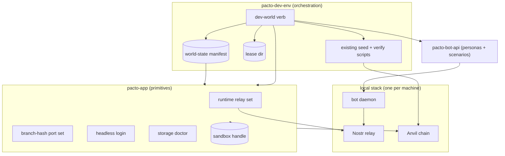
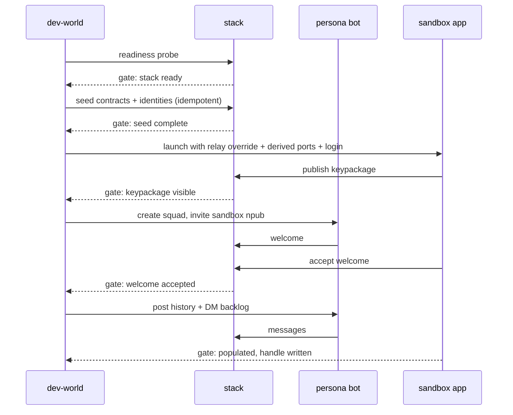
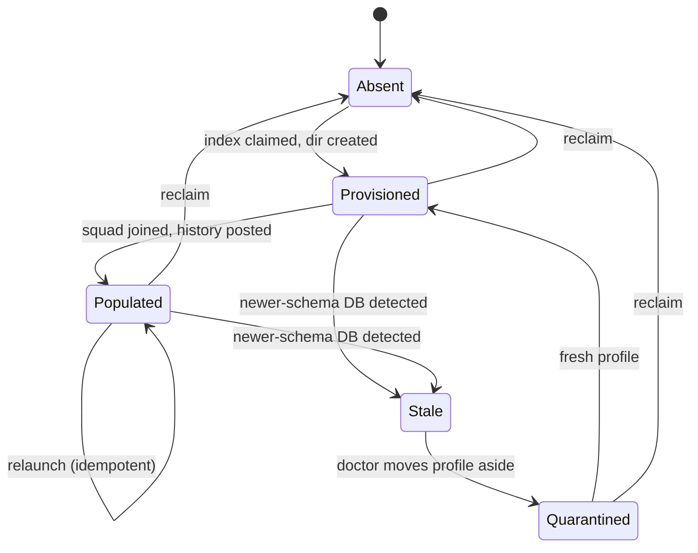
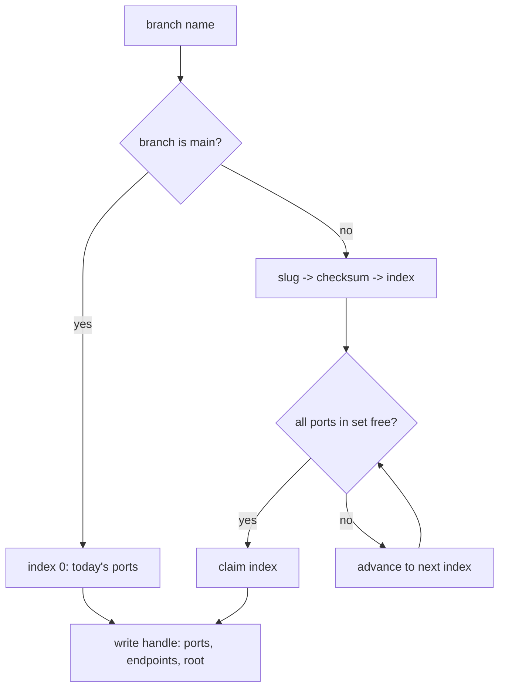

# Parallel-Agent Dev Sandboxes - Plan

## Goal Capsule

- **Objective:** One headless command boots any branch or agent into an authenticated, populated, locally-routed dev sandbox, safely runnable in parallel across worktrees. Done when two agents in two worktrees run it concurrently and each lands in its own populated squad with a replying bot, no port or state collisions, and zero traffic to production relays.
- **Product authority:** This plan owns the whole sandbox grand design as one work unit — the ten surviving ideas of [docs/ideation/2026-08-10-parallel-agent-sandboxes-ideation.html](../ideation/2026-08-10-parallel-agent-sandboxes-ideation.html) — spanning pacto-app primitives, pacto-dev-env orchestration, and pacto-bot-api personas.
- **Repos:** pacto-app (this repo) ships debug-gated primitives. pacto-dev-env owns orchestration; its files are cited as `pacto-dev-env: <repo-relative path>`. pacto-bot-api is consumed as-is except where a unit names it.
- **Execution profile:** Skeleton-first. U1 falsifies the invite-first thesis for zero code, then Wave 1 primitives, Wave 2 world, Wave 3 leverage. Waves are dependency-ordered, not calendar phases.
- **Stop conditions:** Stop and ask if invite-first fails at U1 (the whole design rests on it), if the local relay cannot carry MLS traffic after U2, or if a unit would require a change to release-build network behavior.
- **Open blockers:** None.

---

## Product Contract

**Product Contract preservation:** changed — R4 clarified (no backend auth event exists; the frontend owns session state), R15 rewritten (scope change, user-confirmed: ordering-only timelines replace simulated time, because bots stamp wall-clock at publish). Added R23, R24, AE7, AE8, KD11, KD12. All other requirements, key decisions, actors, flows, and acceptance examples carry forward unchanged.

### Summary

Build a three-repo dev platform: pacto-app ships debug-gated primitives (runtime-resolved relay set, branch-hashed port set, zero-keystroke authenticated boot, sandbox-root refusal), pacto-dev-env orchestrates a one-command populated world built by bots that invite the sandbox identity into throwaway squads, and pacto-bot-api provides the persona cast and scenario driver that doubles as an MLS conformance suite. Every pacto-app primitive extends an existing seam rather than introducing a new mechanism. Rollout is skeleton-first: a zero-code public-relay experiment validates the invite-first thesis, then the thinnest end-to-end command, then dependency waves.

### Problem Frame

PR #239 gave `make dev` per-branch data isolation and exposed the next wall: every fresh branch boots to an empty account-creation screen. Creating an account takes 20-30 seconds of relay round-trips (keypackage publish plus fetch timeouts against public relays — Argon2id itself is ~100ms), and the result is still an empty world: no squad, no DMs, no wallet state, no counterparty.

Parallel agent work multiplies the cost. Fixed Vite ports block concurrent `make dev` across worktrees (issue #237), and the MCP bridge port is hardcoded too, so the second agent's app cannot be driven at all. Every MCP-driven UI verification pays a scripted login choreography of three DOM snapshots and twelve single-digit keypresses, because each PIN box is `maxlength="1"`. A "local" sandbox silently talks to production relays, so agent safety rests on judgment ("don't post in production channels") instead of construction. And when a stale sandbox trips the storage-format gate, recovery is a five-step manual sqlite3 runbook no unattended agent can execute.

The seeding machinery mostly exists in the sibling repos — pacto-dev-env already seeds identities, Safes, and governance contracts; pacto-bot-api bots can create MLS groups and invite members outright. What is missing is one network seam, one identity seam, per-worktree concurrency, and the orchestration glue.

### Key Decisions

- KD1. Agents first, humans benefit. Every surface is headless, flag-driven, deterministic, and machine-checkable; no interactive-only affordances. (session-settled: user-directed — chosen over humans-first and strict-parity: agents are the multiplying consumer.) Governs R22.
- KD2. pacto-dev-env owns orchestration. The world-building verb lives there; pacto-app ships only its own primitives plus a thin delegating `make dev-world` alias. (session-settled: user-directed — chosen over pacto-app-owned orchestration: keeps app repo free of cross-repo choreography.) Governs R6, R9.
- KD3. Acceptance bar is two concurrent agents. The design is judged against the parallel scenario, not a single-developer boot. (session-settled: user-directed — chosen over single-dev-first: parallelism is the point.) Governs AE1.
- KD4. Docker is required for dev-world only. No-Docker machines keep plain `make dev` unchanged, and the relay-free seeding tier is the only no-Docker populated option; dev-world fails fast. (session-settled: user-directed — chosen over graceful degradation: one clear contract per verb.) Governs R10, R17.
- KD5. HKDF-deterministic dev keys now; bunker custody later. All dev identities derive from one committed recipe; NIP-46 bunker custody is recorded as a future hardening step pending an app-side support check. (session-settled: user-directed — chosen over bunker-from-day-one: reproducibility and CI-friendliness win; bunker adds a live signing dependency and an unverified app-support risk.) Governs R12.
- KD6. Shared Anvil is a flagged known limit. Each sandbox gets its own squad, Safe, and contracts on the one chain; cross-sandbox visibility of unrelated on-chain state is tolerated. (session-settled: user-directed — chosen over per-sandbox chain isolation: preserves the one-shared-stack premise.) See Scope Boundaries for the revisit trigger.
- KD7. Skeleton-first rollout converging into dependency waves. Step-zero validation and a thin end-to-end command precede breadth; the manifest schema is pinned early as the cross-repo contract. (session-settled: user-approved — chosen over pure waves or pure parallel tracks: the one make-or-break integration risk is testable for zero code today.)
- KD8. Invite-first, never transfer. Bots build worlds and invite identities in; MLS store copies and bundle transfers are excluded — every export is stamped split-brain-hazardous by pacto-bot-api itself. Governs R7.
- KD9. Dev identities are effectively public keys, and are marked as such. A committed derivation recipe means the cast's keys are public; safety rests on relay gating and throwaway squads, not key secrecy. Because the recipe travels with the repo, an identity derived from it is stamped sandbox-only and the app refuses to use it while any non-local relay is in play, so a dev key cannot quietly become a real account. (session-settled: user-approved.) Governs R2, R20, R25.
- KD10. dev-world never touches the real OS data directory. The PR #239 `main` exception stays human-only. (session-settled: user-approved.) Governs R5.
- KD11. Scenario timelines are ordering constraints, not clock offsets. Declarative timelines express happens-before; the wall-clock gaps they read like are not reproduced. (session-settled: user-approved — chosen over back-dated events: bot publish paths stamp `Timestamp::now()` with no override, so honoring clock offsets would mean changing a third repo's wire path.) Governs R15, R16.
- KD12. Teardown is first-class, not implied. A sandbox declares what it may leave behind and a reclaim verb removes exactly that. (session-settled: user-directed — chosen over leaving cleanup to operator habit: unattended agents accumulate sandboxes faster than anyone prunes them.) Governs R23.

### Actors

- A1. Developer — runs the same commands as agents; gets populated sandboxes for manual work and UI inspection.
- A2. Coding agent — headless consumer; boots sandboxes per worktree, verifies UI changes via the MCP bridge, runs scenarios.
- A3. Persona and seed bots (pacto-bot-api) — create squads, invite sandbox identities, generate history, reply as counterparties.
- A4. Local stack (pacto-dev-env) — Nostr relay, Anvil chain, bot daemon; one shared instance per machine serving all sandboxes.

### Requirements

**Sandbox routing and boot**

- R1. Debug builds resolve the trusted relay set at startup from an environment override so all MLS traffic can route to the local stack; release builds are unaffected and the unset default is today's relay list.
- R2. Once a sandbox is pointed at the local stack, none of its traffic reaches production relays.
- R3. Each worktree derives a distinct, deterministic port set from a hash of its branch name so N concurrent `make dev` instances never collide; `main` keeps today's ports.
- R4. A debug build can boot headlessly into an authenticated UI state from a supplied identity (manifest-referenced mnemonic or nsec) and the dev PIN, with real persisted credentials and the same frontend session state a normal login produces — no DOM input at any step.
- R5. dev-world refuses to operate when the resolved data directory is not a sandbox root; the real OS app-data directory is unreachable by it.

**Populated world**

- R6. One command boots a branch or agent sandbox into a populated world: authenticated account, membership in at least one bot-created squad with message history, a DM backlog, and a persona bot that replies.
- R7. World construction is invite-first: bots create squads and invite the sandbox identity; no MLS store copy or transfer path exists in the design.
- R8. Squad history is generated after the sandbox identity joins, since forward secrecy hides pre-join messages from new members.
- R9. Orchestration stages gate on readiness signals (stack up, seed complete, keypackage published, welcome accepted) and a failed stage names its gate.
- R10. Without Docker, dev-world fails fast with a clear message; plain `make dev` remains functional and unchanged.
- R11. One versioned world-state manifest describes the cast — persona, npub, key reference, ETH address, bot id, squad role — and is the only identity contract consumed across the three repos.
- R12. All dev identities derive deterministically from one committed dev-root recipe; derived state (databases, encrypted keys) is regenerated per machine and never committed.
- R13. Dev builds import the local-chain deployment artifacts to populate local chain and treasury configuration automatically; a version mismatch between artifact and build refuses loudly.

**Personas and scenarios**

- R14. A small named persona cast — capped at three or four, each with an owner — is selectable at world-boot time via a flag.
- R15. Declarative scenario files naming participants and an ordered timeline compile to bot RPC verbs and replay against the local stack; the timeline expresses happens-before ordering, and every step waits on its predecessor's observable signal rather than a clock.
- R16. Scenarios run in CI as a black-box multi-party MLS regression gate, with trace-event output snapshotted as golden files so a silently degraded scenario fails loudly; snapshots compare event order and content, with absolute timestamps normalized away.

**Relay-free CI seeding**

- R17. A relay-free seeding path builds populated per-account storage through the real ingest path with zero network, packaged as a plain library or binary (no Tauri IPC, no window), usable in Docker-less CI.

**Parallel-agent safety**

- R18. A preflight doctor validates each sandbox root's storage format against the current build and auto-quarantines stale sandbox profiles; quarantine can never touch the real OS-data account.
- R19. Destructive shared-stack operations (reseed, chain reset) are lease-guarded so concurrent agents cannot clobber each other mid-scenario.
- R20. Every sandbox's squads are its own throwaway squads; no channel is shared with production.
- R21. An adversarial fixture target seeds hostile state — an unrecognized-format profile beside a valid one, orphaned rows, scan-deadline-scale load — proving the doctor and quarantine rails fire; a logical-state checksum catches silent fixture drift.
- R25. A dev identity is marked sandbox-only at derivation, and the app refuses to use one while any non-local relay is in the resolved relay set.

**Lifecycle and handle**

- R22. Every capability above is drivable headlessly with flags or environment and machine-checkable outcomes; nothing requires an interactive step.
- R23. A reclaim verb removes exactly what one sandbox created — its data directory, its throwaway squad, its bot-side state, and its port-index claim — and is idempotent, safe to run against an already-reclaimed sandbox, and incapable of touching the shared stack or another sandbox.
- R24. Each sandbox writes a machine-readable handle recording its resolved port set, sandbox root, relay endpoint, chain endpoint, manifest path, and identity npub, so an agent discovers where to connect instead of assuming defaults.

### Key Flows

- F1. Step-zero thesis validation (before any code lands)
  - **Trigger:** Rollout start.
  - **Actors:** A3, A1.
  - **Steps:** A bot on the existing roster creates a squad and invites a stock debug build's npub over the already-trusted public relay; persona bots post history after the join; the developer opens the app.
  - **Outcome:** The invite-first thesis is validated or falsified for zero code. Dev traffic briefly crosses a public relay; this is a one-off experiment, not the steady state.
  - **Covers:** R7, R8.

- F2. dev-world boot
  - **Trigger:** `make dev-world` (or agent equivalent) in any worktree.
  - **Actors:** A2 or A1, A3, A4.
  - **Steps:** Stack readiness gate; seed gate (identities, Safes, contracts from the manifest); bot creates the sandbox's squad and invites its identity; history and DM backlog generated post-join; app launches with relay override, derived ports, and headless login; lands authenticated in the populated squad; handle written.
  - **Outcome:** Lived-in sandbox at first paint; every stage failure names its gate.
  - **Covers:** R1, R3, R4, R6, R7, R8, R9, R11, R24.

- F3. Scenario run in CI
  - **Trigger:** CI job on PR.
  - **Actors:** A3, A4.
  - **Steps:** Stack up in the job; scenario file compiles to bot RPC verbs; timeline replays in order, each step gated on its predecessor's observable signal; trace-event output diffs against the golden file with timestamps normalized.
  - **Outcome:** Multi-party MLS regression coverage; drifted scenarios fail loudly.
  - **Covers:** R15, R16.

- F4. Stale sandbox recovery
  - **Trigger:** Sandbox launch after a migration landed on another branch.
  - **Actors:** A2, doctor preflight.
  - **Steps:** Doctor detects a storage-format mismatch in the sandbox root; quarantines the stale sandbox profile; boot proceeds against a fresh or regenerated sandbox.
  - **Outcome:** No manual sqlite3 runbook; the real OS-data account is untouched by construction.
  - **Covers:** R18.

- F5. Sandbox reclaim
  - **Trigger:** `make dev-world-reclaim` in a worktree, or an agent finishing its task.
  - **Actors:** A2 or A1, A4.
  - **Steps:** Read the sandbox handle; release the port-index claim; delete the sandbox data directory; ask the bot daemon to drop the sandbox's squad and per-bot state for that world; leave the shared stack running.
  - **Outcome:** The index is free for the next worktree, the other agent's sandbox is untouched, and re-running reclaim is a no-op.
  - **Covers:** R23.

### Acceptance Examples

- AE1. Two parallel agents, populated. **Covers R2, R3, R6, R20.**
  - **Given** two worktrees on different branches and a running local stack,
  - **When** an agent in each runs the world command concurrently,
  - **Then** each lands authenticated in its own populated squad with a replying bot, ports and data dirs never collide, and the relay-connection audit for each sandbox lists only the local endpoint.
- AE2. No Docker. **Covers R10.**
  - **Given** a machine without Docker, **when** dev-world runs, **then** it fails fast naming the missing dependency, and plain `make dev` still boots an empty sandbox unchanged.
- AE3. Real data dir refusal. **Covers R5.**
  - **Given** a context where the data directory resolves to the real OS app-data path (e.g., `main` without a sandbox root), **when** dev-world runs, **then** it refuses with a clear error and touches nothing.
- AE4. Stale sandbox. **Covers R18.**
  - **Given** a sandbox written by a newer-schema branch, **when** an older branch boots against it, **then** the doctor quarantines that sandbox profile and boot completes; no account on the machine is blocked.
- AE5. Artifact mismatch. **Covers R13.**
  - **Given** deployment artifacts from a wiped or re-deployed chain that no longer match the running build, **when** the dev build imports them, **then** it refuses loudly instead of resolving wrong addresses.
- AE6. Lease contention. **Covers R19.**
  - **Given** agent A mid-scenario, **when** agent B triggers a reseed, **then** the reseed blocks or fails with the lease holder named — it never proceeds silently.
- AE7. Zero-keystroke agent login. **Covers R4, R22, R24.**
  - **Given** a booted sandbox and its handle,
  - **When** an agent connects to the recorded MCP bridge port and takes its first DOM snapshot,
  - **Then** the app is already past the PIN gate showing the main navbar, with no keyboard or click calls issued and no account-creation wait.
- AE8. Reclaim. **Covers R23.**
  - **Given** two sandboxes running against one stack, **when** one is reclaimed, **then** its data directory and squad are gone, its port index is claimable by a new worktree, the other sandbox keeps working, and a second reclaim of the same sandbox exits cleanly without error.

### Scope Boundaries

**Deferred for later**

- Per-sandbox chain isolation (own Anvil instance or fork per sandbox). Revisit trigger: governance scenarios on parallel sandboxes start interfering with each other's on-chain assertions.
- Bunker (NIP-46) custody for dev personas. Revisit trigger: app-side NIP-46 support is verified; then bunker becomes the hardening default per KD5.
- Persona handoff via MLS bundle transfer with re-key and atomic retirement. Contingency only, if invite-first proves insufficient for a case that requires becoming a persona.
- A back-date parameter on bot publish verbs, which would let scenario timelines reproduce clock gaps. Revisit trigger: a scenario needs age-dependent behavior (retention, cutoffs, decay) that ordering alone cannot express.

**Contingencies if the invite-first probe fails**

These are the branches U1 selects between; none is in scope unless the probe forces it.

- The invite arrives late rather than never. The gates widen their windows and the design is unchanged.
- The invite fails because the joiner's keypackage went stale between publish and use. The bot re-invites after a keypackage refresh, adding a retry loop to the orchestrator and nothing else.
- The invite genuinely cannot reach a fresh identity. Only then does MLS bundle transfer come back on the table, against its split-brain hazard, and the design returns to planning rather than proceeding.

**Outside this design**

- Any change to production relay configuration or release-build network behavior; every affordance here is debug-gated.
- Mobile targets.
- Migrating or preserving existing ad-hoc dev fixtures; greenfield posture applies.
- Shared-stack teardown. `make dev-world-reclaim` is per-sandbox; wiping the stack stays the existing pacto-dev-env reset verb.

**Deferred to Follow-Up Work**

- Retiring `test_fixtures/dev-account` and `test_fixtures/dev-buddy` once dev-world covers their use. They stay working through this plan.
- Per-sandbox MCP bridge auth. The bridge stays unauthenticated on a loopback port, as today.

### Dependencies / Assumptions

- Sibling checkout of pacto-dev-env is available at a location U8 must discover, not assume adjacent (verified: on this machine pacto-app and pacto-dev-env are *not* siblings). A pacto-bot-api checkout is optional: `pacto-dev-env`'s `build-pacto-bot-api` Make target only rebuilds from `../pacto-bot-api` when that directory exists, and `docker-compose.yml`'s `pacto-bot-api` service otherwise pulls the pinned `ghcr.io/covenant-gov/pacto-bot-api:main` image (`pull_policy: if_not_present`) — so per-developer path drift for pacto-bot-api is already handled upstream and out of scope here. dev-world requires Docker (KD4).
- The local relay is reachable at `wss://localhost:7001` (Caddy TLS). Port 7000 is squatted by macOS ControlCenter, so the plaintext endpoint is not usable on the primary dev platform; stale `ws://localhost:7000` references get retired in U2.
- The refinery baseline cap this plan's doctor depends on has already landed: `PRE_REFINERY_CEILING` is pinned at 27 and `embedded_ceiling()` is derived at compile time (`src-tauri/src/migrations/mod.rs:19-40`), so a database written by a newer build is already classifiable.
- Verified against source this session: `TRUSTED_RELAYS` static at `src-tauri/src/lib.rs:115-119`, consumed across `commons.rs`, `lib.rs`, `mls.rs`, and `squad_bot.rs`; debug-only repo-root `.env` loader at `src-tauri/src/operator_env.rs`; sandbox path resolution and escape rejection at `src-tauri/src/test_sandbox.rs:44-81`; `test_login_fixture` at `src-tauri/src/lib.rs:6091-6140`; `importAccount` at `src/stores/auth.ts:250`; pre-auth storage scan and verdict types at `src-tauri/src/storage_format.rs:88-145,198-283`; per-network address env overrides at `src-tauri/src/evm/pacto_chain_config.rs:94-258`; `tauri` built with the `test` feature at `src-tauri/Cargo.toml:35`; library crate `pacto_lib` with `rlib` at `src-tauri/Cargo.toml:14-19`; MCP bridge port literal at `scripts/run-e2e-tauri.mjs:27`; MLS RPC surface at pacto-bot-api `schemas/jsonrpc.json:849-1000`; wall-clock publish stamps at pacto-bot-api `src/nostr.rs:352-360,789-790`; `split_brain_warning` at pacto-bot-api `src/admin.rs:1605-1610`; existing seeding, artifact export, and stack verification at pacto-dev-env `scripts/seed-anvil.sh`, `scripts/seed-squad.sh`, `scripts/verify-stack.sh`.
- **Assumption (unverified):** app-side NIP-46 signing support status is unknown; it gates only the deferred bunker item, nothing in scope.
- **Assumption (unverified):** Caddy's local CA is trusted by the host, so `wss://localhost:7001` validates from inside the app. If it is not, U2 needs `caddy trust` in the setup path — see Risks.

### Outstanding Questions

None blocking. Remaining choices are unit-local and settled in Key Technical Decisions.

### Sources / Research

- [docs/ideation/2026-08-10-parallel-agent-sandboxes-ideation.html](../ideation/2026-08-10-parallel-agent-sandboxes-ideation.html) — the merged ten-idea basis with per-idea evidence, confidence, and the rejection record.
- [docs/ideation/2026-08-08-dev-sandbox-seeded-accounts-ideation.html](../ideation/2026-08-08-dev-sandbox-seeded-accounts-ideation.html) — prior round; source of the absorbed ideas and the split-brain/launch-wall findings.
- PR #239 (per-branch dev data dirs) and issue #237 (ports, empty sandboxes) — the problem statement of record.
- `docs/TAURI_MCP_INTEGRATION.md` — MCP verification workflow, the twelve-keypress PIN ritual, and the `test_login_fixture` limitation that U5 removes.
- `docs/solutions/logic-errors/orphaned-relay-health-monitor-command.md` — a registered Tauri command with no frontend caller compiles clean and never runs; every new command in this plan needs a real caller and `pnpm check:tauri-commands`.
- pacto-dev-env: `scripts/seed-squad.sh` and `scripts/seed-anvil.sh` (identity/Safe/governance seeding; artifacts at `data/deployments/31337/`), `scripts/verify-stack.sh` (readiness idiom to reuse), `docker-compose.yml` (relay, Anvil, bot daemon, healthchecks, loopback-only bindings).
- pacto-bot-api: `schemas/jsonrpc.json` (MLS group RPC surface), `docs/python-sdk-squad-bots.md` (persona SDK hooks), `pacto-bot-admin` CLI (`mls-group`, `trace-events`, `new --scaffold`).
- Foundry Anvil `dumpState`/`loadState` and `evm_snapshot`/`evm_revert` — considered for chain-state seeding and rejected for now; foundry-rs/foundry#9570 documents round-trip nondeterminism, and KD6's shared chain makes per-sandbox snapshots moot.
- matrix-org/complement — black-box protocol conformance suites driving real server images through scenario scripts; the shape R16 mirrors.

---

## Planning Contract

### Key Technical Decisions

- KTD1. **One accessor for the trusted relay set, and the static goes private.** Replace the `TRUSTED_RELAYS` static with a `trusted_relays()` accessor over a `OnceLock<Vec<RelayUrl>>`. The accessor has two bodies: under `#[cfg(debug_assertions)]` it resolves once at startup from `PACTO_TRUSTED_RELAYS` (comma-separated), defaulting to today's three URLs; in release it returns the compiled list and contains no environment read at all, so a set variable cannot redirect a release build. The underlying list stops being reachable outside the accessor's module, which turns a missed call site into a compile error rather than a silent production-relay send. Resolution must happen after the repo-root `.env` load so an operator `.env` can carry it. Governs R1, R2.
- KTD2. **The port set derives from a branch-name hash.** One index drives every port a worktree needs, so a worktree's ports are reproducible from its branch alone and an agent can compute them without launching anything. Two branches can still land on the same index, so the launcher advances to the next free index and records the resolved set in the sandbox handle rather than failing. (session-settled: user-directed — chosen over failing loudly on collision with a manual override: derivation should just work.) The MCP bridge is configured, not environment-driven: its plugin takes a base port and scans forward from it, so the app passes the derived base at plugin init and publishes the port it actually bound. Governs R3, R24.
- KTD3. **One dev-login entry point with two depths.** Backend-only depth reproduces today's fixture behavior for UI-less assertions; full depth performs a real login and leaves the frontend in the same session state a human login produces. `test_login_fixture` becomes the shallow depth of the new command rather than a surviving peer, and the e2e harness migrates onto it. Full depth reuses the existing recovery-phrase login path instead of a parallel auth implementation. (session-settled: user-directed — chosen over keeping two peer commands: two commands disagree about whether you are logged in, which is the documented MCP footgun this plan is removing.) Governs R4.
- KTD4. **Refusal is enforced in Rust, not in make.** dev-world sets a marker env var; startup refuses to proceed when the marker is set and no sandbox root resolved, before any account or database work. A Makefile-only guard is bypassed the moment an agent runs the binary directly. This is the mechanism behind KD10. Governs R5.
- KTD5. **The doctor hooks the existing pre-auth scan.** Quarantine runs between profile scanning and the compatibility report, and only when a sandbox root is active — never against the real OS data directory. Classification is already available: the existing verdicts distinguish a database written by a newer build from a divergent one. Quarantine moves the offending profile directory aside inside the sandbox root and records why. Governs R18.
- KTD6. **Local chain addresses ride the existing per-network override.** The address book already resolves `PACTO_*` and `PACTO_*_<NET>` environment variables ahead of the compiled JSON, so importing Anvil artifacts means exporting those variables from the deployment artifacts — no new loader, no new config file. The mismatch guard keys on the artifact's chain id plus a liveness check that the factory address actually holds code on the running chain, the same check the seeding script already uses for idempotence. Governs R13.
- KTD7. **The relay-free harness links the library crate and drives a second group engine.** It is a plain binary with no Tauri IPC and no window, using a mock app handle purely as a path resolver (the `test` feature is already enabled on the main dependency, not just dev-dependencies). The squad slice primes by constructing a second in-process group engine that plays the inviter, producing a real welcome the sandbox identity ingests through the normal inbound path — no committed binary fixtures, which would be both a crypto hazard and a drift source. (session-settled: user-approved — chosen over deferring the squad slice or committing captured wire bytes.) Governs R17.
- KTD8. **Scenario timelines are ordering constraints.** Each step waits on its predecessor's observable signal — event on relay, welcome accepted, message persisted — rather than sleeping. Golden traces compare event order and content with absolute timestamps normalized out, since two runs will never share a clock. (session-settled: user-approved — chosen over back-dated events: publish paths stamp wall-clock with no override parameter.) Governs R15, R16.
- KTD9. **The lease is a portable lock directory, not `flock`.** macOS ships no `flock` binary, so the lease uses atomic directory creation plus a PID and timestamp record, with liveness checking to reclaim a lease whose holder died. Running sandboxes hold shared leases; destructive operations take an exclusive lease and fail immediately by default, naming the holder, with opt-in waiting. Governs R19.
- KTD10. **The manifest is public data with a secret sidecar.** The world-state manifest carries personas, npubs, ETH addresses, bot ids, squad roles, and derivation references — everything a consumer needs and nothing that must stay secret. Materialized secrets land in a gitignored sidecar with restrictive permissions, matching how the sibling repo already handles bot credentials. The manifest is versioned with an integer, and each consumer declares both the minimum version it accepts and the maximum it understands; anything outside that window refuses loudly rather than guessing, in either direction. Its schema lives in pacto-dev-env because that repo owns orchestration. Governs R11, R12.
- KTD11. **The local relay endpoint is the TLS one.** `wss://localhost:7001` through Caddy, because the plaintext port is unusable on the primary dev platform. This makes the host's trust of Caddy's local CA a hard dependency of the relay override; the setup path must establish it rather than assuming it. Governs R1.
- KTD12. **Reclaim is per-sandbox and idempotent.** It reads the handle to learn exactly what to remove, and every step tolerates the thing already being gone. It never touches the shared stack, another sandbox's directory, or the real OS data directory. Governs R23.

### High-Level Technical Design

**Component topology.** The manifest is the only identity contract crossing repo boundaries; everything else is local to one repo.

**Invite-first world build.** The ordering is forced by forward secrecy: history posted before the join is invisible to the joiner.

**Sandbox lifecycle.** Quarantine and reclaim are the two paths out of a bad or finished state; neither can reach the real OS data directory.

**Port index resolution.** Derivation first, probe only on occupancy, and the answer is always written down rather than assumed.

### Sequencing

Waves are dependency groupings, not schedule. A wave starts when its prerequisites land, and units inside a wave are independent unless a unit names a dependency.

- **Wave 0 — falsify the thesis.** U1 only. If invite-first does not produce a visible populated squad in a stock debug build, the rest of the design changes shape.
- **Wave 1 — pacto-app primitives.** U2 through U5. Each is independently useful and independently reviewable; U2 and U5 are the security-sensitive ones and should not be batched with unrelated changes.
- **Wave 2 — the world.** U6 through U10. U6 pins the cross-repo contract and gates the rest of the wave.
- **Wave 3 — leverage and rails.** U11 through U17. Nothing here blocks the acceptance bar; everything here is what keeps the platform honest over time.

The acceptance bar (AE1, AE7) is provable at the end of Wave 2. Wave 3 adds AE4 and AE6 coverage and the CI tier.

### Risks & Dependencies

- **Caddy local-CA trust is a hard dependency of the relay override.** If the host does not trust it, the app cannot open `wss://localhost:7001` and every downstream unit stalls with a confusing TLS error rather than a named gate. Mitigation: U2 verifies the endpoint from the app's own client stack before anything depends on it, and the setup path establishes trust explicitly.
- **The MCP bridge port is a second, easily-missed port.** The e2e harness hardcodes it, so a port scheme that covers only Vite leaves the second agent unable to drive its app at all. Mitigation: U3 treats the bridge port as part of the derived set, not an afterthought.
- **A new Tauri command can ship dead.** Registration satisfies the compiler even with no frontend caller. Mitigation: every unit adding a command also adds its caller and runs the orphaned-command ratchet.
- **Shared Anvil means shared nonces.** Two sandboxes deploying concurrently from the same funded account will collide. Mitigation: the manifest assigns distinct deployer accounts per persona; the lease covers destructive operations, not ordinary deploys.
- **Bot-side MLS against the local relay is not yet exercised end to end.** The bot's MLS paths are proven against test doubles and its relay config is static; the combination is new. Mitigation: U1 and U7 both gate explicitly on welcome acceptance rather than assuming publish implies delivery.
- **Golden trace files rot silently.** A scenario that degrades to a no-op still matches an empty trace. Mitigation: U13 asserts a floor on trace content, not just equality, and U17's checksum catches fixture drift.

### System-Wide Impact

- **Network boundary.** The relay set becomes runtime data in debug builds. Release behavior is unchanged and must be verified as unchanged — this is the single most security-sensitive change in the plan.
- **Startup order.** Relay resolution, sandbox-root refusal, and the doctor all run before authentication, in that order. A unit that moves work earlier in startup must not read the trusted relay set before it is resolved.
- **Agent-facing docs.** The MCP verification workflow in the root agent instructions and the integration doc both prescribe the PIN-typing ritual. Leaving them in place after U5 means agents keep paying a cost that no longer exists.
- **Cross-repo contract.** The manifest is consumed by three repos. A breaking change to it is a three-repo change; the version field exists so the failure is loud rather than subtle.
- **CI surface.** Wave 3 adds a Docker-dependent job. It must not become a required gate for changes that cannot affect it.

---

## Implementation Units

| U-ID | Title | Key files | Depends on |
|---|---|---|---|
| U1 | Invite-first thesis probe (no code) | — | — |
| U2 | Runtime-resolved trusted relay set | `src-tauri/src/lib.rs`, `src-tauri/src/mls.rs`, `src-tauri/src/commons.rs`, `src-tauri/src/squad_bot.rs` | — |
| U3 | Branch-hash port set and sandbox handle | `Makefile`, `vite.config.ts`, `scripts/run-e2e-tauri.mjs`, `src-tauri/src/lib.rs` | — |
| U4 | dev-world data-directory refusal | `src-tauri/src/test_sandbox.rs`, `src-tauri/src/lib.rs` | — |
| U5 | One headless login, two depths | `src-tauri/src/lib.rs`, `src/lib/api/`, `src/stores/auth.ts`, `scripts/run-e2e-tauri.mjs`, `docs/TAURI_MCP_INTEGRATION.md`, `AGENTS.md` | — |
| U6 | World-state manifest and identity derivation | pacto-dev-env: `schemas/`, `scripts/` | — |
| U7 | dev-world orchestrator and gates | pacto-dev-env: `scripts/dev-world.sh`, `Makefile` | U2, U6 |
| U8 | pacto-app delegating alias | `Makefile`, `docs/build/OPERATOR_UPDATES.md` | U7 |
| U9 | Local-chain artifact import and mismatch refusal | `src-tauri/src/evm/pacto_chain_config.rs`, pacto-dev-env: `scripts/dev-world.sh` | U7 |
| U10 | Sandbox reclaim | pacto-dev-env: `scripts/dev-world.sh`, `Makefile`; `Makefile` | U3, U7 |
| U11 | Persona cast | pacto-dev-env: persona definitions, `scripts/dev-world.sh` | U6 |
| U12 | Scenario files to bot verbs | pacto-bot-api: `pacto-bot-admin` subcommand; pacto-dev-env: scenario files | U7, U11 |
| U13 | CI conformance gate with golden traces | pacto-dev-env: `.github/workflows/`, scenario fixtures, golden traces | U12 |
| U14 | Relay-free seeding harness | `src-tauri/src/bin/`, `src-tauri/src/rumor.rs`, `src-tauri/src/mls.rs` | U6 |
| U15 | Storage doctor and quarantine | `src-tauri/src/storage_format.rs`, `src-tauri/src/lib.rs` | U4 |
| U16 | Shared-stack lease | pacto-dev-env: `scripts/lease.sh`, `scripts/seed-*.sh` | U7 |
| U17 | Adversarial fixture target | `src-tauri/src/storage_format.rs` tests, pacto-dev-env fixtures | U15, U16 |

### U1. Invite-first thesis probe (no code)

- **Goal:** Prove or disprove, before any code lands, that a bot-created squad invite reaches a stock debug build and that post-join history renders.
- **Requirements:** R7, R8. Realizes KD8 and the premise under F2.
- **Dependencies:** None.
- **Files:** None. Findings are recorded in this plan's Sources section or a short note under `docs/solutions/` if the outcome is surprising.
- **Approach:**
  1. Boot a throwaway sandbox on the existing timestamped-root dev target so nothing persistent is involved.
  2. Create an account through the normal UI and capture its npub.
  3. From an existing roster bot, create a squad and invite that npub using the existing group-create and invite verbs.
  4. After the app accepts the welcome, have persona bots post several messages and a DM.
  5. Observe the app: squad present, history visible, DM present.
  This runs against the already-trusted public relay because the local relay override does not exist yet. It is a one-off; nothing sensitive is posted, and the identities are throwaway by construction (KD9).
- **Execution note:** This is an experiment, not a change. The output is a yes/no on invite-first plus a list of the observable signals at each step, which become U7's gates.
- **Test scenarios:** Test expectation: none — no code changes. The probe itself is the evidence.
- **Verification:** A populated squad and DM are visible in the app without any store copy or transfer. If the welcome never arrives, stop and escalate: the design's core assumption is wrong.

### U2. Runtime-resolved trusted relay set

- **Goal:** Let a debug build route all Nostr and MLS traffic to the local stack, with release behavior byte-identical to today.
- **Requirements:** R1, R2, R20. Implements KTD1, KTD11.
- **Dependencies:** None.
- **Files:** `src-tauri/src/lib.rs` (the static and its call sites), `src-tauri/src/mls.rs`, `src-tauri/src/commons.rs`, `src-tauri/src/squad_bot.rs`, `src-tauri/src/operator_env.rs`, `.env.example`, `docs/` references to the local relay endpoint.
- **Approach:**
  1. Introduce a `trusted_relays()` accessor backed by a one-time-initialized list; keep the default list identical to the current static, and make the list itself unreachable from outside the accessor's module so no call site can bypass it.
  2. Give the accessor a debug body and a release body. Only the debug body reads the environment; the release body has no environment read to disable.
  3. In the debug body, parse a comma-separated override, validating each entry as a relay URL and rejecting malformed entries loudly rather than silently dropping them.
  4. Ensure resolution happens after the repo-root `.env` load and before the first relay use, so an operator `.env` entry works.
  5. Convert every call site from reading the static to calling the accessor. The call sites span keypackage publish, gift-wrap send, event streaming, and MLS fetches; none of them gain override awareness.
  6. Probe the resolved endpoint once at startup and, on a TLS validation failure, fail with a message naming the certificate problem and the trust step — not a bare connection error three layers down.
  7. Retire stale `ws://localhost:7000` references in docs in favor of the TLS endpoint, and record the Caddy trust prerequisite where an operator will see it.
- **Patterns to follow:** The debug-only gating idiom already used for other dev-only surfaces, and the existing operator-env loader rather than a second config mechanism.
- **Test scenarios:**
  - Unset override resolves to exactly the current three relay URLs, asserted against the literal list.
  - A single-URL override resolves to that one URL and nothing else.
  - A comma-separated override with surrounding whitespace resolves to the trimmed set in order.
  - A malformed URL in the override produces an error naming the offending entry rather than a silently shortened list.
  - An empty-string override is rejected rather than resolving to an empty relay set, which would silently disable all messaging.
  - The accessor returns the same value on repeated calls after initialization.
  - Release-build behavior: the release accessor returns the compiled list even with the override variable set, asserted by a test compiled without debug assertions.
  - A TLS validation failure against the configured endpoint surfaces a message naming the certificate problem and the trust step.
- **Verification:** With the override set to the local endpoint and the stack running, an app-side connection to the local relay succeeds and a keypackage publish is observable on that relay. With the override unset, behavior is unchanged.

### U3. Branch-hash port set and sandbox handle

- **Goal:** Give every worktree a distinct, reproducible port set derived from its branch name, and write down where the sandbox actually landed.
- **Requirements:** R3, R24. Implements KTD2.
- **Dependencies:** None.
- **Files:** `Makefile` (dev targets), `vite.config.ts`, `src-tauri/tauri.conf.json` handling in the dev invocation, `scripts/run-e2e-tauri.mjs`, `src-tauri/src/lib.rs` (MCP bridge plugin init), `docs/TAURI_MCP_INTEGRATION.md`.
- **Approach:**
  1. Derive an index from the branch slug the dev target already computes, using a checksum utility available on both macOS and Linux so no new dependency appears. `main` pins to index zero, preserving today's ports exactly.
  2. Map the index to the full port set: dev server, its hot-reload companion, and the MCP bridge. Keep the mapping arithmetic obvious enough to reproduce by hand from a branch name.
  3. Probe the derived set before launch; if any member is taken by a foreign listener, advance to the next index and re-probe, bounded so a saturated machine fails with a clear message instead of spinning.
  4. Thread the resolved values three different ways, because the three consumers accept configuration differently: `vite.config.ts` changes once to read its port and hot-reload port from the environment; the desktop shell's dev URL is overridden per invocation rather than edited in committed config; and the MCP bridge plugin is initialized with the derived base port instead of its default.
  5. Record the bridge port the plugin actually bound. The plugin scans forward from its base port, so the bound port is not always the base — publishing the real one is what makes the handle trustworthy.
  6. Write the sandbox handle — resolved index, every port including the bound bridge port, sandbox root, relay endpoint, chain endpoint, and manifest path once U6 lands — into the sandbox root as machine-readable JSON.
  7. Point the e2e harness at the handle rather than its hardcoded literal.
  8. State in the agent-facing docs that each bridge port is an unauthenticated full-access control surface bound to loopback, and that multiplying sandboxes multiplies that surface.
- **Patterns to follow:** The existing slug derivation in the dev target; do not invent a second slug scheme.
- **Test scenarios:**
  - The same branch name yields the same index across repeated derivations.
  - Two specific different branch names yield different indexes (pin two real examples so a mapping change is caught).
  - `main` yields today's exact port values.
  - Derivation is stable across the two checksum utilities' platforms — assert against a pinned expected value, not just self-consistency.
  - A branch name containing slashes and dots produces a slug and index without error.
  - When the derived set is occupied, resolution advances and the handle records the advanced index, not the derived one.
  - When every candidate index is occupied, resolution fails with a message naming the exhausted range.
  - The handle round-trips: written values parse back to the values the launcher used.
  - When the bridge plugin binds a port other than the derived base, the handle records the bound port and the e2e harness connects to it.
- **Verification:** Two worktrees on different branches launch concurrently; each app is reachable on its own dev port and its own bridge port, and each handle names the ports actually in use.

### U4. dev-world data-directory refusal

- **Goal:** Make it structurally impossible for the world verb to operate on the real OS app-data directory.
- **Requirements:** R5. Implements KTD4.
- **Dependencies:** None.
- **Files:** `src-tauri/src/test_sandbox.rs`, `src-tauri/src/lib.rs` (startup), `src-tauri/src/account_manager.rs` if a second resolution path exists.
- **Approach:**
  1. Have dev-world set a marker environment variable identifying the run as a world boot.
  2. At startup, before any account or database work, refuse when the marker is present and no sandbox root resolved, with an error naming both the marker and the missing root.
  3. Reuse the existing sandbox path resolution and its escape rejection rather than writing a second validator.
  4. Audit for any remaining path resolution that bypasses the sandbox helpers, and route it through them.
- **Patterns to follow:** The existing canonicalize-and-revalidate approach in the sandbox path resolver.
- **Test scenarios:**
  - Marker set, sandbox root unset: startup refuses with an error naming the missing root.
  - Marker set, sandbox root set to a valid path: startup proceeds and resolves inside that root.
  - Marker set, sandbox root pointing outside its base via a parent traversal: refused by the existing escape check.
  - Marker set, sandbox root is a symlink escaping its base: refused.
  - Marker unset, sandbox root unset: today's behavior, resolving the real OS directory, unchanged.
  - Marker unset, sandbox root set: today's behavior, unchanged — this is the existing per-branch dev target.
- **Verification:** Running the world verb on `main` without a sandbox root refuses and creates nothing; the ordinary dev target on `main` still opens the real account.

### U5. One headless login, two depths

- **Goal:** Land an agent in an authenticated app with zero DOM input, and leave exactly one way to authenticate headlessly.
- **Requirements:** R4, R22, R25. Implements KTD3. Enables AE7.
- **Dependencies:** None.
- **Files:** `src-tauri/src/lib.rs` (the existing fixture command and its registration), `src/lib/api/` (typed wrapper), `src/routes/+layout.svelte` (the debug-only startup hook, which runs before the page mounts and is not one of the three legacy god components), `src/stores/auth.ts`, `scripts/run-e2e-tauri.mjs`, `Makefile` (release symbol check), `docs/TAURI_MCP_INTEGRATION.md`, `AGENTS.md`.
- **Approach:**
  1. Define one debug-gated command that accepts a depth and an identity source. Shallow depth performs today's backend-only setup — pending account, profile database, current account, account salt. Full depth additionally persists real PIN-encrypted credentials and opens the connection, so the session is indistinguishable from a human login.
  2. Full depth reuses the existing recovery-phrase login path rather than reimplementing key handling; the command supplies the phrase and PIN that a human would type. The frontend session store is hydrated through that same path, since session state is frontend-owned and no backend event announces it. Shallow depth deliberately does not hydrate it.
  3. Add a debug-only startup hook in the frontend that asks the backend whether an autologin identity is configured and, if so, drives the existing login store path so the authenticated state and post-login sync run normally. This hook is the frontend caller the orphaned-command ratchet requires.
  4. Source the identity from the environment, and from the manifest once U6 lands, so the mnemonic never enters the frontend bundle.
  5. Delete the superseded fixture entry point and migrate the e2e harness to the shallow depth. Greenfield posture: no alias, no deprecation shim.
  6. Refuse at login when the identity carries the sandbox-only mark and the resolved relay set contains anything but the local endpoint. The refusal names both the identity and the offending relay; it is the enforcement half of the sandbox-only mark U6 stamps.
  7. Replace the twelve-keypress PIN ritual in the agent-facing docs with the new one-call path, and keep the account-creation walkthrough only where a genuinely fresh account is the subject.
- **Execution note:** Prove the end-to-end path first — a failing assertion that a booted debug build reaches the authenticated navbar with no keyboard calls — then make it pass. The current fixture's gap is exactly the kind that looks done at the backend boundary.
- **Patterns to follow:** The existing debug-only command definition and registration idiom; the existing typed API wrapper convention.
- **Test scenarios:**
  - Shallow depth sets current account and initializes the profile database, matching the behavior the e2e harness depends on today.
  - Full depth persists credentials such that a subsequent unlock with the same PIN succeeds.
  - Full depth leaves the frontend session state authenticated, with the current user matching the supplied identity.
  - Without the test-auth allowance flag, both depths refuse.
  - In a release build, the command is absent — asserted by extending the existing release symbol check rather than by a runtime probe, since a runtime check cannot prove absence.
  - An invalid recovery phrase is rejected with a clear error rather than producing a half-initialized account.
  - The autologin hook is a no-op when no identity is configured: the app shows the normal welcome screen.
  - Calling full depth twice is safe — the second call does not corrupt or duplicate the account.
  - A sandbox-only identity is refused when the resolved relay set contains a non-local relay, with both the identity and the relay named; the same identity logs in normally against the local endpoint alone.
  - Covers AE7. A driver session against a booted sandbox observes the main navbar on its first snapshot with zero keyboard or click calls issued.
- **Verification:** An agent boots the sandbox, connects, snapshots once, and sees the authenticated navbar. The e2e harness passes against the shallow depth. No documentation still instructs an agent to type PIN digits.

### U6. World-state manifest and identity derivation

- **Goal:** Pin the one identity contract the three repos share, and make every dev identity reproducible from a committed recipe.
- **Requirements:** R11, R12, R25. Implements KTD10.
- **Dependencies:** None.
- **Files:** pacto-dev-env: `schemas/world-state.schema.json`, `scripts/derive-identity.sh` or an extension of the existing derivation helper, `.gitignore`, `.env.example`, `ARCHITECTURE.md`.
- **Approach:**
  1. Define the manifest as versioned JSON describing the cast: for each persona, its name, role, npub, ETH address, bot id, squad role, and a derivation reference — plus world-level fields for relay endpoint, chain endpoint and id, and deployment artifact paths.
  2. Publish a schema alongside it so all three consumers validate rather than duck-type, and make an unrecognized version a loud refusal.
  3. Derive every identity from a single committed dev-root recipe with a per-persona label, so the same recipe produces the same cast on every machine. Reuse the existing nsec-to-ETH derivation rather than introducing a second address scheme.
  4. Materialize secrets into a gitignored sidecar with restrictive permissions, matching how bot credentials are already handled; keep secrets out of the manifest itself.
  5. Stamp every derived identity sandbox-only in the manifest, and document the recipe as public by construction. The mark is what lets a consumer refuse the identity outside the sandbox; the documentation is what stops a human importing one by hand.
- **Patterns to follow:** The sibling repo's existing config-generation script, its secret-file permissions convention, and its shell style.
- **Test scenarios:**
  - The same recipe and label produce the same npub and ETH address across repeated runs.
  - Two different labels produce different identities.
  - A manifest missing a required field fails schema validation with the field named.
  - A manifest with a future version number is refused rather than partially consumed.
  - The generated secret sidecar has restrictive permissions and is ignored by version control.
  - Regenerating over an existing manifest is idempotent — same inputs, same output, no diff.
  - Every derived identity in the manifest carries the sandbox-only mark; an identity without it fails schema validation.
- **Verification:** Two clean checkouts on two machines generate byte-identical manifests from the same recipe, and no secret material appears in tracked files.

### U7. dev-world orchestrator and gates

- **Goal:** One command that takes a machine from "stack running" to "this worktree has a populated, joined squad," failing at a named gate when it cannot.
- **Requirements:** R6, R7, R8, R9, R10, R20. Implements KTD1, KTD2; realizes KD2 and KD8.
- **Dependencies:** U2, U6.
- **Files:** pacto-dev-env: `scripts/dev-world.sh`, `Makefile`, `ARCHITECTURE.md`.
- **Approach:**
  1. Fail fast when Docker is absent, naming the dependency and pointing at the plain dev path that still works.
  2. Gate on stack readiness by reusing the existing verification script's checks rather than duplicating probes.
  3. Gate on seeding by invoking the existing contract and squad seeding scripts, which are already idempotent via artifact presence plus an on-chain liveness check.
  4. Launch the app with the relay override, the derived port set, the sandbox root, and the world marker.
  5. Gate on the bot being able to retrieve the sandbox identity's keypackage, not merely on the keypackage appearing on the relay. Publication and bot-side indexing are different events, and inviting a member the bot cannot resolve is the predictable failure. Retry with backoff, then fail naming this gate.
  6. Have a bot create this sandbox's own squad and invite the identity; gate on welcome acceptance, not on publish.
  7. Only then generate squad history and the DM backlog, because pre-join messages are invisible to the joiner. Gate on that history being retrievable by the sandbox before declaring the world populated — otherwise "populated" races asynchronous delivery and every downstream assertion inherits the flake.
  8. Emit each gate's name and outcome as it passes, and on failure exit with the gate name and what was observed instead.
  9. Make re-running safe: an already-populated sandbox re-enters at the first unsatisfied gate rather than duplicating squads.
- **Execution note:** Build the gates before the happy path. The failure modes here are the product — a silent hang at keypackage propagation is the outcome this unit exists to prevent.
- **Patterns to follow:** The sibling repo's shell conventions, its pass/warn/fail output helpers, and its idempotence-by-liveness-check pattern.
- **Test scenarios:**
  - Docker absent: exits fast naming Docker; no partial state created.
  - Stack down: fails at the stack-readiness gate, naming it.
  - Stack up but bot daemon down: fails at the bot-availability gate rather than timing out at the invite.
  - Keypackage published but not yet resolvable by the bot: retries, then fails at the keypackage gate with the identity named, not at a generic timeout.
  - History generated but not yet visible to the sandbox: the run waits rather than declaring the world populated.
  - Invite sent but welcome never accepted: fails at the welcome gate.
  - Happy path: all gates pass in order and the sandbox is populated.
  - Re-run against a populated sandbox: no duplicate squad, exits successfully.
  - Re-run after a mid-way failure: resumes at the failed gate rather than starting over or duplicating earlier work.
  - Two concurrent runs on different branches each produce their own squad, and neither sees the other's.
- **Verification:** Covers AE1 and AE2 end to end, plus the F2 flow. Two worktrees run concurrently, each landing in its own populated squad; a Docker-less machine gets a clear refusal and an unchanged plain dev path.

### U8. pacto-app delegating alias

- **Goal:** Let a developer or agent in the app repo invoke the world verb without knowing where the sibling checkout lives.
- **Requirements:** R6. Realizes KD2.
- **Dependencies:** U7.
- **Files:** `Makefile`, `docs/build/OPERATOR_UPDATES.md`, `AGENTS.md` if the agent workflow references it.
- **Approach:** Add a target that locates the sibling checkout, fails with a clear message naming the expected location when it is missing, and delegates with the current branch context. No orchestration logic lives here — the moment this target grows a gate, it belongs upstream.
- **Test scenarios:**
  - Sibling checkout present: delegates and propagates the exit status.
  - Sibling checkout absent: fails with a message naming the expected path.
  - A non-zero exit upstream surfaces as a non-zero exit here rather than being swallowed.
- **Verification:** Running the alias from the app repo produces the same outcome as running the verb upstream.

### U9. Local-chain artifact import and mismatch refusal

- **Goal:** Make a dev build resolve local-chain contract addresses automatically, and refuse loudly when the artifacts no longer describe the running chain.
- **Requirements:** R13. Implements KTD6.
- **Dependencies:** U7.
- **Files:** `src-tauri/src/evm/pacto_chain_config.rs`, `src/lib/evm/pacto-protocol-addresses.json` and `src/lib/wallet/wallet-assets.json` if the local entry needs a chain record, pacto-dev-env: `scripts/dev-world.sh`.
- **Approach:**
  1. Read the deployment artifacts the seeding scripts already write and export the corresponding per-network address overrides, which the address book already consults ahead of the compiled JSON. No new loader.
  2. Add the mismatch guard: compare the artifact's chain id against the chain the build is pointed at, and verify the factory address actually holds code on that chain — the same liveness check `scripts/seed-anvil.sh` already uses for its own idempotence, so the two cannot drift into different definitions of "deployed".
  3. On mismatch, refuse with a message naming the artifact path, the expected chain, and what was found, rather than proceeding with addresses that resolve to nothing.
  4. Replace the hand-copy instructions in the local-chain setup doc with the automatic path.
- **Patterns to follow:** The existing per-network override resolution and its precedence order.
- **Test scenarios:**
  - Artifacts present and matching: addresses resolve to the artifact values, overriding the compiled book.
  - Artifacts absent: falls back to the compiled book without error, preserving today's behavior.
  - Artifact chain id differs from the running chain: refuses, naming both.
  - Factory address holds no code (chain was wiped and not re-seeded): refuses, naming the address.
  - A required address missing from the artifact: refuses naming the field rather than resolving a zero address.
  - Two sandboxes deploy concurrently from their manifest-assigned deployer accounts without colliding.
  - Covers AE5.
- **Verification:** After a chain wipe without re-seeding, the dev build refuses with a named reason instead of failing later inside a contract call.

### U10. Sandbox reclaim

- **Goal:** Remove exactly what one sandbox created, safely, repeatedly, and without touching anything shared.
- **Requirements:** R23. Implements KTD12.
- **Dependencies:** U3, U7.
- **Files:** pacto-dev-env: `scripts/dev-world.sh` or a sibling reclaim script, `Makefile`; `Makefile` in this repo for the alias.
- **Approach:**
  1. Read the sandbox handle to learn the data directory, port index, squad, and identity — never infer them.
  2. Release the port-index claim so a new worktree can take it.
  3. Delete the sandbox data directory, refusing if the resolved path is not inside a sandbox root (the U4 guard applies here too).
  4. Ask the bot side to drop this world's squad and per-bot state, tolerating a squad that is already gone.
  5. Leave the shared stack, other sandboxes, and the real OS data directory untouched.
  6. Make every step tolerate its target already being absent, so a second run is a clean no-op.
- **Test scenarios:**
  - Reclaiming a populated sandbox removes its directory and frees its index.
  - Reclaiming twice succeeds the second time without error.
  - Reclaiming a sandbox whose handle is missing fails with a clear message rather than guessing a path.
  - Reclaim refuses when the handle's data directory resolves outside a sandbox root.
  - A second sandbox running concurrently is unaffected — its directory, squad, and ports survive.
  - The shared stack is still running afterwards.
  - Covers AE8.
- **Verification:** Two sandboxes, one reclaimed; the survivor still boots and messages, and a fresh worktree successfully claims the freed index.

### U11. Persona cast

- **Goal:** Make the world's inhabitants a small, named, selectable set instead of two hardcoded roles.
- **Requirements:** R14. Realizes KD1's flag-driven posture.
- **Dependencies:** U6.
- **Files:** pacto-dev-env: persona definitions and `scripts/dev-world.sh`; pacto-bot-api config generation if per-persona bot entries are needed.
- **Approach:** Define three or four personas declaratively — name, role, owner, squad position, and behavior sketch — and select them at boot with a flag. Each persona maps to a manifest entry and, where it must reply, a bot identity. Keep the cast small enough that every persona has a maintainer; an unowned persona rots.
- **Test scenarios:**
  - Default selection produces the documented default cast.
  - Selecting a named persona set produces exactly those personas in the manifest.
  - An unknown persona name fails listing the available ones.
  - Each persona in the cast has an owner recorded; a persona without one fails validation.
  - The same selection is reproducible across runs.
- **Verification:** Booting with two different persona selections produces visibly different squads with the expected members.

### U12. Scenario files to bot verbs

- **Goal:** Turn a declarative scenario into a replayable multi-party interaction against the local stack.
- **Requirements:** R15. Implements KTD8.
- **Dependencies:** U7, U11.
- **Files:** pacto-bot-api: a `pacto-bot-admin` scenario subcommand beside the existing trace-events command. pacto-dev-env: scenario files, stored next to the persona definitions.
- **Approach:**
  1. Define the scenario file as participants plus an ordered list of steps, where each step names an actor and an action that maps to an existing bot verb.
  2. Execute steps in order, gating each on its predecessor's observable signal — event visible on the relay, welcome accepted, message persisted — rather than sleeping or asserting elapsed time.
  3. Reject a scenario that references an unknown participant or verb at parse time, not mid-run.
  4. Reject a scenario whose assertions depend on elapsed time — message age, retention windows, cutoffs, decay — at parse time, naming the ordering-only contract. A scenario that silently ignores a declared gap is worse than one that refuses.
  5. Emit the trace of what actually happened, using the bot side's existing event-trace output.
- **Patterns to follow:** The existing bot RPC verb surface; do not add wire-protocol capability for this unit.
- **Test scenarios:**
  - A two-participant scenario with three ordered messages replays with the messages arriving in the declared order.
  - A step whose predecessor's signal never arrives fails naming the step and the awaited signal.
  - A scenario naming an unknown participant fails at parse time.
  - A scenario naming an unknown verb fails at parse time.
  - Replaying the same scenario twice produces the same event order.
  - A scenario that declares a wall-clock gap is rejected or normalized explicitly, rather than silently ignored — the ordering-only contract must be visible to the author.
- **Verification:** A scenario describing a squad conversation replays end to end and the trace shows the declared order.

### U13. CI conformance gate with golden traces

- **Goal:** Catch multi-party MLS regressions in CI, and catch a scenario that has silently stopped doing anything.
- **Requirements:** R16. Implements KTD8.
- **Dependencies:** U12.
- **Files:** pacto-dev-env: `.github/workflows/`, scenario fixtures, golden trace files.
- **Approach:**
  1. Add a job that brings the stack up, runs the scenario set, and diffs traces against golden files with absolute timestamps normalized out.
  2. Assert a content floor as well as equality — a minimum number of events of specific kinds — so an empty trace cannot match an empty golden file.
  3. Make golden regeneration an explicit, reviewable command; a regenerated golden that shrinks should be obvious in review.
  4. Keep this job non-blocking for changes that cannot affect it, consistent with how the existing Docker-dependent harness is treated.
- **Test scenarios:**
  - A passing scenario matches its golden file.
  - A deliberately broken scenario (a removed invite step) fails the diff, naming the missing events.
  - A scenario degraded to a no-op fails the content floor even though its trace is self-consistent.
  - Timestamp differences between two runs of the same scenario do not cause a diff.
  - Regenerating goldens produces a diff that is reviewable rather than opaque.
- **Verification:** The job passes on an unmodified tree and fails when the invite step is removed from a scenario.

### U14. Relay-free seeding harness

- **Goal:** Build populated per-account storage with zero network, through the real ingest path, usable where Docker is not.
- **Requirements:** R17. Implements KTD7.
- **Dependencies:** U6.
- **Files:** `src-tauri/src/bin/` (new harness binary), `src-tauri/src/rumor.rs`, `src-tauri/src/mls.rs`, `src-tauri/src/account_manager.rs`, `src-tauri/Cargo.toml`.
- **Approach:**
  1. Add a binary that links the library crate. It has no Tauri IPC and no window; it uses a mock app handle solely as a path resolver, which the sandbox root override already largely bypasses.
  2. Seed DMs, reactions, and edits by constructing rumors and driving the existing protocol-agnostic rumor processor directly — that path makes no relay calls.
  3. Seed the squad slice by constructing a second in-process group engine that plays the inviter: it creates the group against the sandbox identity's locally-stored keypackage, produces a real welcome, and the harness feeds that welcome and subsequent application messages into the normal inbound processing path. No committed wire-byte fixtures.
  4. Seed wallet state through the existing key derivation and storage paths.
  5. Guard the pieces that genuinely need a Tauri app — file-attachment path resolution is the known one — either by skipping attachments in the harness or by making the path resolution injectable.
  6. Keep the harness out of release builds and out of the default feature set; disable the heavyweight optional features so it compiles fast in CI.
- **Execution note:** Start with the DM slice, which the research shows is already relay-free, and prove the harness shape end to end before attempting the squad slice. If the squad slice turns out to need network after all, it is a scoped retreat rather than a redesign.
- **Test scenarios:**
  - The harness produces a database containing the expected DM conversation, readable by a normal app boot against that sandbox root.
  - Reactions and edits applied through the harness are reflected in the materialized messages.
  - The squad slice produces a joined group with the expected message history, visible to a normal app boot.
  - The harness makes no network calls — asserted by running it with no network reachable.
  - Running the harness twice against the same root is idempotent or fails clearly, not silently duplicating history.
  - Attachment content, if unsupported, is skipped with a recorded reason rather than producing a broken row.
  - The harness runs in CI without Docker.
- **Verification:** A CI job with no Docker and no network produces a populated sandbox, and booting the app against it shows the seeded DMs and squad.

### U15. Storage doctor and quarantine

- **Goal:** Turn the five-step manual recovery runbook into an automatic preflight an unattended agent can survive.
- **Requirements:** R18. Implements KTD5.
- **Dependencies:** U4.
- **Files:** `src-tauri/src/storage_format.rs`, `src-tauri/src/lib.rs` (startup ordering), `docs/build/OPERATOR_UPDATES.md`.
- **Approach:**
  1. Hook between the existing profile scan and the compatibility report, using the verdicts the scan already produces to distinguish a newer-schema database from a divergent one.
  2. Quarantine only when a sandbox root is active. Against the real OS data directory the doctor reports the offending profile in the compatibility report and moves nothing, which is exactly today's gate behavior — the user sees the existing update-required screen, not a new failure mode.
  3. Move the offending profile directory aside within the sandbox root under a timestamped name, and record what was moved and why where an agent will find it. Re-check immediately before the move that the path is still a real directory inside the sandbox root and not a symlink — the gap between classification and move is otherwise a way to redirect the move at something that is not a sandbox profile.
  4. Let boot proceed against a fresh profile after quarantine.
- **Patterns to follow:** The existing verdict classification; do not add a parallel notion of staleness.
- **Test scenarios:**
  - A profile whose applied history exceeds the embedded ceiling is quarantined and boot proceeds.
  - A profile with a divergent checksum is quarantined and boot proceeds.
  - A healthy profile is untouched.
  - A healthy profile beside a stale one: only the stale one moves.
  - With no sandbox root active, a stale real-OS profile is reported through the existing compatibility report and not moved.
  - A profile path replaced by a symlink between classification and move is refused rather than followed.
  - The quarantine record names the profile, the verdict, and the offending version.
  - Quarantining twice in one boot does not produce colliding directory names.
  - Covers AE4.
- **Verification:** A sandbox written by a newer-schema branch is quarantined on an older branch's boot, the app opens, and no account elsewhere on the machine is blocked.

### U16. Shared-stack lease

- **Goal:** Stop one agent's reseed from silently destroying another agent's mid-scenario state.
- **Requirements:** R19. Implements KTD9.
- **Dependencies:** U7.
- **Files:** pacto-dev-env: `scripts/lease.sh`, `scripts/seed-anvil.sh`, `scripts/seed-squad.sh`, `scripts/dev-world.sh`, `Makefile`.
- **Approach:**
  1. Implement the lease with atomic directory creation plus a record of holder identity, PID, and timestamp — portable across both dev platforms, unlike the flock binary.
  2. Running sandboxes take a shared lease for their lifetime; destructive operations take an exclusive one.
  3. Default to failing immediately when the exclusive lease cannot be taken, naming every current holder. Waiting is opt-in with a bounded timeout.
  4. Reclaim a lease whose holder process is gone, so a crashed agent does not wedge the machine.
- **Test scenarios:**
  - Exclusive acquisition succeeds when no lease is held.
  - Exclusive acquisition fails immediately when a shared lease is held, naming the holder.
  - Two shared acquisitions coexist.
  - A lease whose recorded PID is dead is reclaimed rather than blocking forever.
  - Opt-in waiting acquires once the holder releases, and times out with a named holder otherwise.
  - Release is idempotent — releasing an unheld lease is not an error.
  - Covers AE6.
- **Verification:** With one sandbox mid-scenario, a reseed from another worktree fails naming the holder; after the first releases, the reseed proceeds.

### U17. Adversarial fixture target

- **Goal:** Prove the safety rails actually fire, instead of trusting that they would.
- **Requirements:** R21.
- **Dependencies:** U15, U16.
- **Files:** `src-tauri/src/storage_format.rs` tests, pacto-dev-env fixture scripts.
- **Approach:** Seed deliberately hostile state — an unrecognized-format profile beside a valid one, orphaned rows, and a profile count large enough to stress the scan — then assert the doctor quarantines the right profile, leaves the valid one alone, and completes within a sane bound. Add a logical-state checksum over the seeded content so a fixture that silently stops seeding what it claims fails rather than passing vacuously.
- **Test scenarios:**
  - The unrecognized profile is quarantined; the valid one is untouched and still opens.
  - Orphaned rows do not crash the scan or the subsequent boot.
  - A scan over the stressed profile set completes within the expected bound.
  - The checksum detects a fixture that seeds fewer records than declared.
  - The adversarial target refuses to run outside a sandbox root.
- **Verification:** The target runs, the rails fire as asserted, and a deliberately weakened fixture fails the checksum.

---

## Verification Contract

| Gate | Command | Applies to | Done signal |
|---|---|---|---|
| Type check | `pnpm check` | Any unit touching `src/` | No new errors |
| Lint | `pnpm lint` | All units in this repo | Clean, zero new raw-text warnings |
| Command wiring | `pnpm check:tauri-commands` | U5, U15 and any unit adding a command | No new orphaned commands |
| Frontend unit tests | `pnpm test` | U3, U5 | Green |
| Backend unit tests | `cd src-tauri && cargo test --lib` | U2, U4, U5, U9, U14, U15, U17 | Green |
| Rust lint and check | `make rust-clippy && make rust-check` | Any unit touching `src-tauri/` | Clean |
| Full local gate | `make validate` | Before opening a PR from any wave | Green |
| Desktop e2e harness | `make e2e-tauri` | U3, U5 | Passes against the migrated login depth |
| Stack readiness | pacto-dev-env `scripts/verify-stack.sh` | U7, U9, U16 | All services pass |
| Host prerequisites | pacto-dev-env `scripts/verify-env.sh` | U7 | All required tools present |
| Sibling repo gate | pacto-dev-env `make check` | U6, U7, U10, U11, U16 | Green |
| Conformance scenarios | The CI scenario job from U13 | U12, U13 | Traces match goldens and clear the content floor |
| Manifest version handshake | Load a manifest one version above and one below each consumer's window in all three repos | U6, U7, U14 | Each consumer refuses loudly; none silently degrades |
| Release symbol check | `make release-symbol-check` extended to the dev-login command | U5 | Debug-only login command absent from the release binary |

Acceptance gates, proven by running them rather than by unit tests alone: AE1 and AE7 at the end of Wave 2; AE2, AE3, AE5, AE8 alongside their units; AE4 and AE6 in Wave 3.

---

## Definition of Done

**Global**

- Two agents in two worktrees run the world verb concurrently; each lands authenticated in its own populated squad with a replying bot, no port or data-directory collision, and each sandbox's relay audit lists only the local endpoint.
- An agent connects to a booted sandbox and sees the authenticated navbar on its first snapshot, with no keyboard or click calls.
- The world verb refuses to run against the real OS app-data directory, and refuses fast on a Docker-less machine while plain `make dev` still works there.
- A sandbox can be reclaimed and its port index reused; reclaiming twice is a clean no-op; the other sandbox and the shared stack survive.
- Release-build network behavior is unchanged: the relay override is compiled out, and the debug-only login command is absent from a release binary.
- A sandbox-only dev identity cannot be used while a non-local relay is in the resolved set.
- Every new Tauri command has a real frontend caller and the orphaned-command ratchet passes.
- Agent-facing docs describe the current path only — no surviving instructions to type PIN digits, and no references to the dead local relay port.
- `make validate` is green in this repo and the sibling repo's check target is green.
- No abandoned scaffolding remains: experimental harnesses, dead fixture commands, and superseded targets from this work are deleted rather than left in the diff.

**Per unit**

Each unit is done when its own test scenarios pass, its named verification holds, and any acceptance example it covers has been exercised against a real stack rather than a mock.
