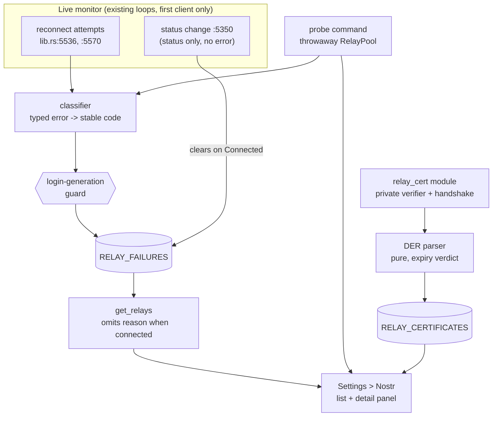
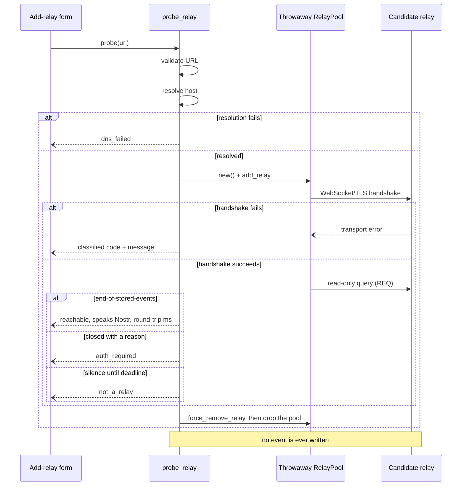
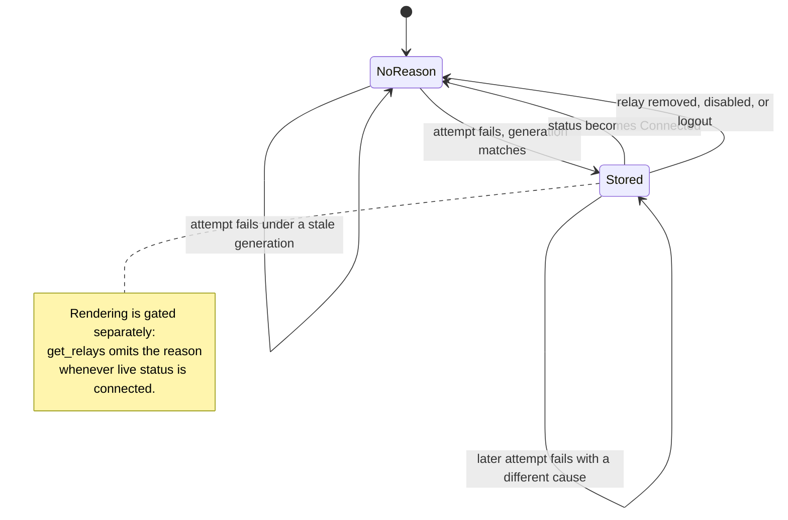

# Relay Diagnostics - Plan

## Goal Capsule

- **Objective:** Give a relay operator three diagnostics in Settings > Nostr — a classified failure reason on relays that failed, a pre-add probe for a candidate URL, and a TLS certificate summary with expiry warnings — mounted on the relay list and detail panel that already exist.
- **Product authority:** This artifact. Consistent with `STRATEGY.md`'s Trust & safety track (operator-controlled diagnostics, no central gatekeeper).
- **Execution profile:** Backend-first. The classifier and certificate parser are pure functions with golden-vector tests; the TLS capture path and UI land last.
- **Stop conditions:** Stop and ask if satisfying a requirement would (a) widen TLS trust for live relay traffic, (b) require a SQLite migration, (c) require the probe to write to a candidate relay, or (d) require re-arming the shared relay monitor loops — see the known limitation in Scope Boundaries.
- **Tail ownership:** Standalone run — this plan owns verification through `pnpm check`, `pnpm lint`, `pnpm test`, `cargo test --lib`, and a sandbox UI pass. It does not own commit, push, or PR.

**Product Contract preservation:** changed — R1 narrowed twice (a reason appears only where a cause was captured, and only for the first account in a process session), R2 tightened to drop relay query strings wholesale, R3 restated as a read-side invariant, R4 and R5 extended with the read-only query round-trip and an `auth_required` outcome, R14 strengthened to require positive disclosure, and R13, R15 added. R6-R12 unchanged. Every change is user-confirmed or forced by verified platform behavior recorded in the Planning Contract.

---

## Product Contract

### Summary

Three diagnostics land on the existing relay list and detail panel: a classified failure reason sourced from connection attempts that currently discard their errors, a manual pre-add probe that connects and runs one read-only query, and a certificate summary whose expiry verdict is computed from the certificate's own dates and which states plainly that trust was not checked.

### Problem Frame

`main` already shows per-relay ping, byte counts, and recent logs in an expandable detail panel. What it does not show is *why* a relay is failing — a disconnected relay looks identical whether the cause is DNS, a bad certificate, or a wrong port — and there is no way to learn any of that before saving a candidate URL. For an operator standing up a relay for their own squad, a misconfiguration is currently discovered only after adding the relay and watching it sit disconnected with no explanation.

Draft PR #105 built this surface but branched before the current detail panel landed, so its frontend is not portable. Its backend is partly portable and partly wrong: it classifies from error message text, returns hardcoded English across the IPC boundary, and inspects certificates behind a standard trust check that aborts on exactly the expired certificate the feature exists to warn about.

### Key Decisions

- Bundle all three capabilities as one feature rather than shipping any slice alone (session-settled: user-directed — chosen over failure-reason-only, probe-only, and certificate-only slices). Governs R1-R15.
- The primary actor is the operator self-hosting a relay for their squad, not general end users on default relays (session-settled: user-directed — chosen over end-user and support-triage framings). Governs R4-R7, R13.
- Diagnostics stay on-demand and ephemeral — no proactive alerting, nothing persists across restarts (session-settled: user-directed — chosen over a passive warning badge and over persisting to SQLite). Governs R12, R15, and Scope Boundaries.
- The probe never writes to the candidate relay (session-settled: user-directed — chosen over sending a signed test event to prove writes are accepted). A relay that accepts reads but rejects writes is therefore not caught pre-add; send rejections already surface per relay after the relay is added. Governs R4, R6.
- The probe confirms the endpoint speaks Nostr with one read-only query round-trip (session-settled: user-directed — chosen over stopping at the handshake, which cannot distinguish a relay from any WebSocket server). A read is not a write, so this holds the no-write decision. Governs R4, R5.
- Connectivity uses the SDK's own connection path rather than a hand-rolled WebSocket connect (session-settled: user-approved — chosen over PR #105's direct `tokio-tungstenite` connect). Governs R5, KTD2.
- Certificate inspection is a separate isolated TLS handshake (session-settled: user-approved — chosen over reaching through the SDK, whose `WebSocket` enum wraps the TLS stream in a private field with no accessor). Governs R8-R10, R14.

### Requirements

**Failure reason display**

- R1. A relay whose connection attempt failed shows a classified, human-readable reason alongside its status, so the status label is not the only signal. Two carve-outs, both forced by the platform and documented in KTD1 and the known limitation: no reason appears where no cause was captured (a relay that is sleeping, banned, or merely initialized), and capture only covers the first account connected in a process session.
- R2. Reason and probe text never carry secrets, auth tokens, credentials, or query parameters from the underlying URL or error. For `ws://` and `wss://` URLs the entire query string is dropped rather than filtered by parameter name.
- R3. A failure reason is never shown for a relay whose live status is connected, and a stored reason clears when the relay reconnects.

**Pre-add relay probe**

- R4. Before saving a candidate relay URL, the operator can run a probe that resolves the host, connects, confirms the endpoint answers a read-only Nostr query, and — for `wss://` — completes a TLS handshake, without writing any event to the candidate relay.
- R5. The probe reports a classified result — reachable and speaking Nostr, DNS failure, connection refused, network unreachable, timeout, TLS failure, protocol error, authentication required, or not a relay — with a short explanatory message, not just pass/fail.
- R6. The probe never joins the operator's live relay pool, writes no data to the candidate relay, and leaves no connection open after it returns.
- R7. The operator can still choose to add a relay that failed the probe.
- R13. The probe is manual: it fires only on an explicit action, its control is disabled while a probe is in flight, and it never retries automatically. The operator can tell why the control is disabled.

**TLS certificate inspection**

- R8. For any `wss://` relay, the detail panel shows certificate metadata: subject, issuer, validity window, SAN list, SHA-256 fingerprint, and key algorithm with size.
- R9. A certificate that is expired or expiring soon is flagged as a warning, with expired treated as more severe than expiring soon.
- R10. A `ws://` relay shows no certificate section.
- R14. The certificate panel states plainly, every time it renders, that the certificate was **not** validated against a trust store — it reports only what the certificate claims about itself. Expiry, which is computed, must be visually distinct from trust, which is not. A self-signed or intercepted certificate must never render as though it were verified.

**Cross-cutting**

- R11. All new user-facing copy ships through the existing `svelte-i18n` `en` and `es` catalogs.
- R12. Diagnostics are on-demand and held in memory only — nothing new persists to SQLite, and nothing survives an app restart.
- R15. Diagnostic state is account-scoped. Stored failure reasons, cached certificates, and the existing relay logs and metrics clear on logout, and a stale monitor loop from a previous account cannot write diagnostics attributed to the current one.

### Key Flows

- F1. Pre-add probe
  - **Trigger:** Operator enters a candidate relay URL and requests a test before saving.
  - **Steps:** Backend validates the URL, resolves the host, connects a throwaway pool, runs one read-only query, tears the pool down, and returns a classified code with a message; the operator sees it inline and either adds the relay or revises the URL.
  - **Covers:** R4, R5, R6, R7, R13
- F2. Failure reason on an existing relay
  - **Trigger:** A reconnect attempt against a non-connected relay fails.
  - **Steps:** The attempt's error is classified and stored per relay; the relay list renders the reason beside the status unless the relay currently reads connected; a later successful connection clears it.
  - **Covers:** R1, R2, R3
- F3. Certificate inspection
  - **Trigger:** Operator expands a `wss://` relay's detail panel.
  - **Steps:** A cached certificate renders immediately if present, otherwise one is fetched over an isolated handshake; metadata renders with the not-validated disclosure, plus an expiry warning when the validity window has passed or is close.
  - **Covers:** R8, R9, R10, R14

### Acceptance Examples

- AE1. Given a candidate hostname that does not resolve, when the operator probes it, then the result is classified "DNS lookup failed". **Covers R4, R5.**
- AE2. Given a candidate URL that accepts TCP but never completes a WebSocket upgrade, when the operator probes it, then the result is classified "not a relay", no event is sent to the endpoint, and the operator can still add it anyway. **Covers R4, R5, R6, R7.**
- AE3. Given a `wss://` relay whose certificate expired yesterday, when the operator expands its detail panel, then the certificate section renders its subject, issuer, and dates with a visible expiry warning. **Covers R8, R9.**
- AE4. Given a `ws://` local relay, when the operator expands its detail panel, then no certificate section renders. **Covers R10.**
- AE5. Given a relay whose status is sleeping, when the operator views the list, then its status renders with no failure-reason line. **Covers R1.**
- AE6. Given a probe already in flight, when the operator activates the probe control again, then nothing is sent and the control stays disabled until the first probe settles. **Covers R13.**
- AE7. Given a `wss://` relay presenting a self-signed certificate well within its validity window, when the operator expands its detail panel, then the metadata renders with no expiry warning **and** with the not-validated disclosure visible, so the panel cannot be read as a trust verdict. **Covers R14.**
- AE8. Given a relay holding a stored failure reason, when the operator logs out and a different account logs in, then no failure reason, relay log, or metric from the previous account is shown. **Covers R15.**
- AE9. Given a relay that requires NIP-42 authentication and answers the probe's query with a close reason rather than an end-of-stored-events response, when the operator probes it, then the result is classified "authentication required" and not "not a relay". **Covers R5.**
- AE10. Given a relay holding a stored failure reason whose live status has since become connected, when the operator views the list, then no failure reason is shown for it. **Covers R3.**

### Scope Boundaries

- Deferred for later: proactive alerting (badge, toast, notification) when a certificate is expiring or a relay has failed for a sustained period.
- Outside this scope: persisting failure reasons or certificates so they survive an app restart.
- Outside this scope: any new capability gating on who may add or probe a relay — the existing account-level relay list model stands.
- Outside this scope: detecting a relay that accepts reads but rejects writes. This follows from the no-write decision; send rejections already surface per relay after the relay is added.
- Accepted limitation: a DNS failure observed inside the monitor loops classifies as `unknown`, because the operating system's resolver error arrives as a non-matchable `io::ErrorKind`. `dns_failed` is reachable only on the probe path, which resolves the host explicitly (KTD2). AE1 is scoped to the probe accordingly.

#### Known limitation: monitor loops do not re-arm

`monitor_relay_connections` (`src-tauri/src/lib.rs:5316`) guards itself with a function-local `MONITOR_STARTED` flag (`:5318-5323`) and captures its `Client` once at `:5325`, holding it for the life of the process. It never re-arms. Consequences, both disclosed in R1 and R15 rather than left implicit:

- Failure-reason capture reflects **only the first account connected in a process session**. For the second and later accounts, the relay list reverts to today's bare-status behavior until the app restarts — no reasons are captured at all.
- The previous account's loops keep running and keep writing. Because default relays are shared across accounts, that would otherwise surface one account's diagnostics under another's. KTD9's generation guard is what actually prevents it; R15's logout clear only handles the snapshot already in memory.

Re-arming the loops touches shared DM and MLS sync infrastructure and its reconnect races, well beyond diagnostics. It is deliberately **not** in this plan. Do not attempt it here — see the Goal Capsule stop conditions.

#### Deferred to Follow-Up Work

- Re-arm the relay monitor loops on account switch, so relay health and diagnostics track the live client.
- Converting `src/components/settings/NostrSettingsSection.svelte` to runes. It is legacy Svelte, and repo convention forbids opportunistic conversion during feature work.
- The three pre-existing baseline orphan commands (`get_custom_relays`, `update_relay_mode`, `validate_relay_url_cmd`) stay grandfathered in `scripts/orphaned-tauri-commands-baseline.txt`.

### Open Questions

- **Deferred to the author, non-blocking.** Should the certificate panel report an actual trust verdict instead of disclosing that trust was unchecked? KTD4's argument rules out verifying *during* capture, but running rustls's `WebPkiServerVerifier` over the already-captured chain afterward is a separate operation that touches no live connection and would yield a typed outcome (trusted, unknown issuer, name mismatch, expired). That is strictly more informative than R14's disclosure and would make an intercepted certificate visibly untrusted rather than merely undisclosed. It costs a `webpki-roots` dependency, changes R14's meaning, and expands this plan's scope, so it is recorded here rather than adopted. The plan is executable as written without it.

### Sources / Research

- PR #105 (`feat/nostra_conn`, draft, branched from `5b55186`): source of `probe_relay`, `get_relay_certificate`, and a message-text classifier. Not mergeable — see Problem Frame for the three defects.
- PR #169 (merged): the current detail panel in `src/components/settings/NostrSettingsSection.svelte` and `get_relay_metrics` / `get_relay_logs`.
- `docs/solutions/logic-errors/orphaned-relay-health-monitor-command.md`: a registered Tauri command with no frontend `invoke` compiles clean and ships dead. Governs the Definition of Done. Its own remediation is already in place — `monitorRelayConnections()` is wired at `src/lib/app/post-login-sync.ts:49` with test coverage — so this plan does not re-wire it.
- Vendored crate source, read directly: `nostr-relay-pool-0.44.3/src/pool/mod.rs:541` (`try_connect_relay`), `:107` (`RelayPool::new`), `:388` (`force_remove_relay`); `relay/mod.rs:358-368` (`try_connect` returns `Ok(())` when the status cannot connect); `relay/status.rs:120-122` (`can_connect` matches only `Initialized | Terminated | Sleeping`); `relay/inner.rs:574-600` (with `reconnect(false)` a failed relay settles at `Terminated`, not `Disconnected`); `transport/error.rs:6-12` (`TransportError::Backend`); `lib.rs:19` (re-exports `ConnectionMode` only); `async-wsocket-0.13.2/src/native/error.rs:13-29` (variants, and an empty `Error` impl so `source()` yields `None`); `src/native/mod.rs:17-18` (re-exports `Message` and `WebSocketStream`, **not** `Error`); …
- Redaction helper `src-tauri/src/evm/wallet_security.rs`: the scheme scan at `:98-135` matches only `https://` and `http://`; `redact_query_string` at `:20-44` filters against a nine-name allowlist (`SENSITIVE_QUERY_KEYS`, `:8-18`) and passes every other parameter through verbatim. No existing test covers a relay scheme.
- `src-tauri/Cargo.lock`: `ring` 0.17.14 and `aws-lc-rs` 1.17.3 both already resolve today via `rustls` 0.23.43. `tungstenite` and `tokio-tungstenite` each resolve at **two** non-unified versions, 0.26.2 and 0.28.0.
- Relay status styling `src/components/settings/NostrSettingsSection.svelte:698-712`: `--ok` is `var(--success)`, `--pending` is `var(--warning)`, and both `--warn` and `--off` are `var(--text-muted)`. The class named "warn" is not a warning color.

---

## Planning Contract

### Key Technical Decisions

- KTD1. **Failure reasons come from the two reconnect attempts that currently discard their errors** — `src-tauri/src/lib.rs:5536` and `:5570`, both `let _ = relay.try_connect(...)`. The status-change notification at `:5350` carries only `{relay_url, status}` with no error value, so no cause is derivable there; this forces R1's first carve-out. The health-check query-failure branch at `:5495` is deliberately **not** a capture site: the whole block is gated on `if status == RelayStatus::Connected` (`:5454`) and that branch intentionally does not force a reconnect, so a reason stored there would sit beside a connected badge — forbidden by R3 — and would mislabel a query failure as a connection failure. Its relays already reach `:5536` through `unhealthy_relays` on the same iteration.
- KTD2. **Connectivity classification downcasts a typed error chain, never message text** (session-settled: user-approved — chosen over classifying from error message text, which depends on OS-specific wording and degrades silently). `async_wsocket::Error`'s `Error` impl is empty, so a `source()` walk never reaches the inner error; the typed downcast is the only reliable route. Three consequences the implementation must honor:
  - The classifier takes `&nostr_relay_pool::relay::Error` and matches `Transport(TransportError::Backend(b))`, downcasting `b` to `async_wsocket::Error`. U3's `try_connect_relay` yields the wrapping `pool::Error`, so it unwraps the `Relay(..)` variant first and maps every other variant to `unknown`.
  - `async_wsocket` re-exports `Message` and `WebSocketStream` but not `Error`, and its `Ws` variant wraps `tungstenite::Error`. Reaching that inner type requires `tungstenite` as a direct dependency pinned to **`"0.26"`** — the lockfile carries a second, non-unified `0.28.0`, and a looser pin would resolve it and silently break every downcast. The optional `tokio-tungstenite` block stays untouched.
  - `dns_failed` is not reachable from the transport error. A resolver failure surfaces as the unstable, non-matchable `io::ErrorKind::Uncategorized`, so the mapping uses `AddrNotAvailable` (the only resolution-related kind `async-wsocket` produces) and the probe resolves the host explicitly before connecting. Governs R1, R2, R5.
- KTD3. **The backend returns a stable machine code plus an optional redacted, length-capped detail string; the frontend owns all wording.** PR #105 returned hardcoded English across the IPC boundary, which cannot satisfy R11. Redaction drops the whole query string for relay schemes rather than filtering by parameter name, because the existing allowlist would pass a token named anything outside its nine entries. Governs R2, R5, R11.
- KTD4. **Certificate inspection uses a capture-only verifier, judges validity from the parsed certificate's own dates, and lives in its own module.** A `ClientConfig` built with `.with_root_certificates(...)` aborts on an expired certificate before `peer_certificates()` is reachable, making AE3 unsatisfiable. Containment is **structural**: the verifier and its `ClientConfig` are private to a new `src-tauri/src/relay_cert.rs`, whose only non-private items are a certificate-fetch function and a cache-clear function. This location is load-bearing — `src-tauri/src/lib.rs` *is* the crate root, so a private item there is reachable from all 40-plus submodules via `crate::` and would provide no containment at all. `supported_verify_schemes` delegates to the process-default provider so no second provider is introduced.
- KTD5. **The probe runs on a throwaway `RelayPool::new()`, never the app's `Client`.** `nostr_sdk::prelude::*` already re-exports `RelayPool`, so no direct `nostr-relay-pool` dependency is needed. The pool is removed *and* dropped on every exit path — `force_remove_relay` alone does not guarantee the connection is torn down, and R6 requires no socket outlives the command. Governs R4, R6.
- KTD6. **`failure_reason` lands on `RelayInfo`, not `RelayMetrics`.** R1 requires the reason in the relay *list*, and metrics are fetched only when a panel is expanded. `RelayInfo` derives plain `serde::Serialize` with no `rename_all`, so the field crosses IPC as `failure_reason` in both languages. This makes `get_relays` join read-side state for the first time — it synthesizes `RelayInfo` purely from client and DB state today. Governs R1.
- KTD7. **Diagnostics live in `RwLock<HashMap<..>>` statics** beside the existing `RELAY_METRICS` and `RELAY_LOGS`, matching the established shape and satisfying R12 with no migration. R15 extends clearing to those two pre-existing statics as well: they render in the same expanded panel, hold ten entries per relay for process life, and have no clear site anywhere in the crate today, so leaving them would defeat R15 one line below the field it protects. Governs R12, R15.
- KTD8. **R3 is enforced read-side, in `get_relays`, not by a write-side race guard.** A write-side status re-check narrows the race but cannot close it: the clear runs in a different task driven by `receiver.recv().await` on the monitor broadcast channel (`:5348`, `:5396`), so it lags the real transition by an unbounded amount, and a failing attempt can read "not connected", then land its write *after* the clear — stranding a permanent reason on a healthy relay. `get_relays` already calls `relay.status()` for every relay (`:4715-4718`, `:4747-4750`), so omitting `failure_reason` whenever the live status resolves to connected costs nothing and makes R3 unconditionally true regardless of writer interleaving. The write-side check is retained only as a cheap optimization.
- KTD9. **A login-generation guard keeps the stale monitor loop from writing under the current account.** A process-global counter increments on every login; the monitor tasks capture its value when they spawn, and every diagnostic write compares the captured value against the live one and skips on mismatch. This is a write-side guard inside the new capture code — it does not re-arm the loops and does not trip the Goal Capsule stop condition. R15's logout clear handles the snapshot already in memory; this handles the ongoing stream. Governs R15.
- KTD10. **The backend owns the expiry verdict; the frontend only maps it to a label.** The verdict function takes both the certificate's `not_after` and a reference time as parameters so boundary cases are testable without the system clock. Computing the verdict again in TypeScript would put the 30-day threshold in two languages with no named authority and let the two disagree silently. Governs R9.

### High-Level Technical Design

Directional guidance for review, not implementation specification.

Where each diagnostic gets its data — the three paths share only the classifier, and none touches the app's relay pool except the live monitor that already owns it:

Probe sequence, showing the no-write boundary and the three outcomes that are easy to conflate:

Failure-reason lifecycle. The read-side gate is what R3 actually rests on:

### Assumptions

- The probe enforces a single 10-second deadline covering resolution, TCP, TLS, WebSocket upgrade, and the query round-trip, matching the bound the existing reconnect at `:5536` already uses. R13 makes that duration user-visible, so it is stated rather than left to the implementer.
- A relay answering the probe's query with an end-of-stored-events response speaks Nostr. A close-with-reason answer means it speaks Nostr but declined the read (`auth_required`). Silence until the deadline means `not_a_relay`.
- "Expiring soon" is 30 days. This is a UI threshold, not a protocol constant, and it lives in one place per KTD10.

### Implementation Constraints

- Do not modify the `local-relay-tls` feature or the `tokio-tungstenite` block at `src-tauri/Cargo.toml:101-107`. That optional dependency exists solely so cargo feature unification widens the relay websocket's root store in debug builds, and it is deliberately excluded from `default`. PR #105 made it a non-optional direct dependency with different features; do not port that change. Adding a direct `tungstenite = "0.26"` is separate and permitted.
- Do not change the existing `rustls = "0.23"` entry. `aws_lc_rs` is installed as the process default at `src-tauri/src/main.rs:9` and must remain the only installed provider.
- `ring` and `aws-lc-rs` both already resolve in `Cargo.lock` today. The bar for this plan is therefore *no new crypto-provider feature and no second `install_default` call site* — not the absence of `ring`, which is neither achievable here nor this plan's concern.
- Because both provider features are enabled, `ClientConfig::builder()` cannot infer a provider from crate features. `main.rs`'s install is not linked into `cargo test --lib`, so any test that builds a `ClientConfig` must install the provider itself.
- New i18n keys are **flat dotted strings including the namespace prefix** (`"lib.relay.status.connected"`), not nested objects. `en` and `es` are at exact key parity today; keep them there.
- Backend command names are `snake_case`; payload keys are `camelCase` over IPC.
- Any read of a diagnostic static must reuse the same URL normalization used at write time — trim, strip trailing slash, lowercase (`:4440`, `:4470`). `get_relays`'s existing pool matching at `:4715-4718` and `:4747-4750` lowercases but does **not** strip a trailing slash, so it cannot be used as the key source without correction.
- Tests that clear a diagnostic static must serialize against each other. `cargo test --lib` runs tests as parallel threads in one process, and the existing `relay_metrics_tests` rely on unique fixture URLs and never clear — an unguarded clear-all would delete another test's entries intermittently.

### Sequencing

U1 unlocks U2 and U3 (all three share the classifier). U4 is independent and unlocks U8. U5 needs the DTO shapes from U2, U3, U4, and U8. U6 may start any time. U7 needs U5 and U6.

---

## Implementation Units

### U1. Failure classifier, shared reason codes, and relay-scheme redaction

- **Goal:** A pure function mapping a typed relay error to a stable code plus an optional redacted, length-capped detail string — with redaction that actually covers relay URLs.
- **Requirements:** R2, R5 (via KTD2, KTD3). **Realizes:** part of F1, F2.
- **Dependencies:** none
- **Files:**
  - `src-tauri/Cargo.toml` — add `async-wsocket = "0.13.2"` and `tungstenite = "0.26"`, each with a comment noting the version must track what `nostr-sdk` pulls, mirroring the existing pin note. The `0.26` pin on `tungstenite` is mandatory: a second, non-unified `0.28.0` is in the lockfile and would break the downcast.
  - `src-tauri/src/evm/wallet_security.rs` — extend the scheme scan in `redact_urls_in_text` (`:98-135`) to `ws://` and `wss://`, and drop the entire query string for those schemes instead of running the `SENSITIVE_QUERY_KEYS` filter
  - `src-tauri/src/lib.rs` — the classifier, the code enum, and its serde DTO, beside the existing relay metrics helpers around `:4400-4510`
- **Approach:**
  1. Define the closed code set, serialized to stable snake_case strings: `dns_failed`, `connection_refused`, `network_unreachable`, `timed_out`, `tls_failed`, `protocol_error`, `auth_required`, `not_a_relay`, `invalid_url`, `unknown`.
  2. Give the classifier the signature `fn classify_relay_error(err: &relay::Error) -> RelayFailure`, matching `Transport(TransportError::Backend(b))` and downcasting `b` to `async_wsocket::Error`.
  3. Map `async_wsocket::Error`: `Io(e)` by `e.kind()` — `ConnectionRefused`, `AddrNotAvailable` (resolution returned no addresses), `TimedOut`, and the unreachable kinds; `Timeout` to `timed_out`; `Url(_)` to `invalid_url`. Do not match `NotFound` — resolver failures never produce it.
  4. Match inside `Ws(e)` on `tungstenite::Error` rather than mapping the whole variant: `Tls(_)` to `tls_failed`; `Io(e)` through the same `io::ErrorKind` mapping as above, because a mid-upgrade reset is not a TLS problem; `Protocol(_) | Capacity(_) | Http(_) | HttpFormat(_)` to `protocol_error`; `Url(_)` to `invalid_url`; anything else to `unknown`.
  5. Truncate the detail string to a fixed cap **before** redaction and storage — a failed upgrade can carry a full relay-controlled rejection body — then pass it through `redact_urls_in_text`.
  6. Do not walk `source()`; `async_wsocket::Error`'s `Error` impl is empty.
- **Patterns to follow:** the pure-function-plus-static shape of `update_relay_metrics` and `add_relay_log` (`:4438-4475`); the existing redaction tests at `wallet_security.rs:137+`.
- **Execution note:** Write the golden vectors first — this is a pure mapping over a fixed input domain, matching how `validate_relay_url_tests` is built.
- **Test scenarios:**
  - Each mapped `io::ErrorKind` produces its expected code: refused, address-not-available, timed-out, unreachable.
  - The `Timeout` variant produces `timed_out`; a `Url` variant produces `invalid_url`.
  - Inside `Ws`: a `Tls` error produces `tls_failed`; an `Io` error produces the kind-mapped code, **not** `tls_failed`; a `Protocol` error produces `protocol_error`.
  - An unmatched variant produces `unknown` rather than panicking.
  - A detail string containing a literal `wss://` URL with a query parameter whose name is **not** in `SENSITIVE_QUERY_KEYS` (for example `?t=SECRET`) comes back with the value gone. An `http://` fixture would pass against the unfixed helper and must not be used here.
  - A `wss://` URL carrying userinfo credentials comes back with them stripped.
  - A detail string longer than the cap is truncated before storage.
  - Existing redaction tests still pass unchanged.
  - **Integration:** a genuine `try_connect` failure against a closed local port, driven through the real relay-pool boundary, classifies to `connection_refused` rather than `unknown`. This is the only test that proves the typed downcast survives the dependency boundary; constructing the error locally cannot prove it.
- **Verification:** `cd src-tauri && cargo test --lib` passes. `auth_required` and `not_a_relay` are produced by U3's query path, not by this classifier, so they are covered there rather than by a golden vector here.

### U2. Capture and clear failure reasons in the live monitor

- **Goal:** Relays that failed to connect carry a classified reason on the relay list, never shown for a connected relay, and cleared on reconnect, removal, disable, and logout.
- **Requirements:** R1, R3, R15 (via KTD1, KTD6, KTD7, KTD8, KTD9). **Realizes:** F2. **Enforces:** AE5, AE8, AE10.
- **Dependencies:** U1
- **Files:**
  - `src-tauri/src/lib.rs` — a `RELAY_FAILURES` static beside `RELAY_METRICS` (`:4431`); a login-generation counter; set/clear helpers; capture at `:5536` and `:5570`; clear in the `RelayStatus::Connected` arm (`:5396`), in `remove_custom_relay` (`:5142-5170`), in the disable branches of `toggle_custom_relay` (`:5219-5226`) and `toggle_default_relay` (`:5046-5056`), and in `logout` (`:6795`); `failure_reason` on `RelayInfo` (`:4674-4682`), populated and gated in `get_relays` (`:4686`)
- **Approach:**
  1. Add `RELAY_FAILURES: Lazy<RwLock<HashMap<String, RelayFailure>>>`, keyed by the same normalized URL the metrics helpers use, plus the process-global login generation counter of KTD9.
  2. Replace the two discarded results at `:5536` and `:5570` with a match that classifies the error on failure. Before `try_connect`, force any relay whose status is not one of `Initialized | Terminated | Sleeping` through `relay.disconnect()` first, mirroring what `:5529-5531` already does for connected relays — otherwise `try_connect` returns `Ok(())` without attempting anything and no cause is ever produced.
  3. Guard every write with the captured login generation, skipping on mismatch. Retain a cheap post-await status check as an optimization, but do not rely on it for R3.
  4. Do **not** instrument `:5495` or the outer-timeout branch. Both run only for connected relays, and the timeout branch already routes its relay to `:5536` on the same iteration. Leave their existing `add_relay_log` calls untouched.
  5. Clear the entry on transition to `Connected`, on removal, on either disable path, and on logout. Extend the logout clear to `RELAY_LOGS` and `RELAY_METRICS` as well, per KTD7.
  6. Add `failure_reason: Option<RelayFailure>` to `RelayInfo`, resolve its key through the shared normalization helper, and **omit it whenever the relay's live status resolves to connected** — the read-side gate R3 depends on.
- **Patterns to follow:** normalized-URL keying and lock discipline in `update_relay_metrics` / `get_relay_metrics` (`:4469-4660`); the pool-removal branch of `remove_custom_relay` as the placement model for the clear calls; unique fixture URLs as in `relay_metrics_tests` (`:4531-4620`).
- **Test scenarios:**
  - Storing a reason then reading it back returns the same code; two relays hold independent reasons.
  - A stored reason is omitted from the `get_relays` projection when the relay's status reads connected, even though it remains in the map.
  - Clearing on `Connected` removes the entry.
  - A URL stored with a trailing slash resolves from a lookup without one, and vice versa.
  - Removing a relay clears its reason; re-adding the same URL shows no stale reason.
  - Disabling a custom relay and disabling a default relay each clear the reason.
  - A write carrying a stale login generation is skipped (KTD9).
  - Logout clears failure reasons, relay logs, and metrics.
  - A relay with no stored reason serializes `failure_reason` as absent rather than an empty object.
  - Every test that clears a static holds the shared diagnostics test lock for its duration.
- **Verification:** `cargo test --lib` passes with tests green under repeated runs, not just once — the clear-all scenarios are the parallelism risk. `get_relays` output for a relay with no captured failure is unchanged apart from the new absent field.

### U3. Pre-add probe command

- **Goal:** A manual probe that resolves, connects, confirms the endpoint answers a read-only Nostr query, and reports a classified result without writing anything or leaving a socket open.
- **Requirements:** R4, R5, R6, R7, R13 (via KTD2, KTD5). **Realizes:** F1. **Enforces:** AE1, AE2, AE9.
- **Dependencies:** U1
- **Files:**
  - `src-tauri/src/lib.rs` — `probe_relay` command, its result DTO, and registration in `generate_handler!` (`:9242+`)
- **Approach:**
  1. Validate the candidate URL with the existing `validate_relay_url` (`:4805`) and return `invalid_url` with no network call when it rejects.
  2. Resolve the host explicitly (`tokio::net::lookup_host`) and return `dns_failed` when that fails. This is the only typed route to `dns_failed`, per KTD2.
  3. Build a throwaway `RelayPool::new()`, add the relay with `reconnect(false)`, and call `try_connect_relay`. Unwrap `pool::Error::Relay(..)` before handing the error to U1's classifier; map any other `pool::Error` variant to `unknown`.
  4. On connection, issue one bounded read-only query. An end-of-stored-events response confirms the relay; a close-with-reason answer yields `auth_required`; silence until the deadline yields `not_a_relay`.
  5. Enforce a single 10-second deadline across every phase above, and record elapsed round-trip milliseconds for the success case.
  6. Remove the relay and drop the pool on every exit path, including errors, so no connection outlives the command.
  7. Never touch `get_nostr_client()`.
- **Patterns to follow:** `RelayOptions::new().reconnect(false)` as used at `:5037` and `:6524`.
- **Test scenarios:**
  - A URL the validator rejects returns `invalid_url` with no connection attempt.
  - A `ws://` URL on a non-local host is rejected by the validator, matching `add_custom_relay`'s rule.
  - An unresolvable hostname returns `dns_failed` (AE1).
  - A closed local port classifies as `connection_refused`, and the pool is torn down.
  - Each code round-trips through the DTO's serde representation; failure DTOs carry no round-trip measurement.
  - The whole probe returns within the deadline for a host that accepts TCP and then stalls.
  - The populated-round-trip success case, the `auth_required` case, and the `not_a_relay` case each need an endpoint that answers; they are **integration-only**, owned by the sandbox pass.
- **Verification:** `cargo test --lib` passes; `pnpm check:tauri-commands` reports no new orphan once U5 lands the caller.

### U4. Certificate parsing and expiry verdict

- **Goal:** Pure parsing of a DER certificate into the reported metadata, plus a clock-injectable expiry verdict.
- **Requirements:** R8, R9 (via KTD4, KTD10). **Realizes:** part of F3.
- **Dependencies:** none
- **Files:**
  - `src-tauri/Cargo.toml` — add `x509-parser` with `default-features = false`; add dev-dependency `rcgen` with `default-features = false` and a non-`ring` crypto feature, since `rcgen`'s defaults enable `ring` explicitly
  - `src-tauri/src/relay_cert.rs` — the certificate DTO, the DER parse function, and the expiry verdict function
- **Approach:**
  1. Parse the leaf DER for subject, issuer, `not_before` and `not_after` as Unix seconds, SAN DNS entries, and public-key algorithm with key size.
  2. Compute the SHA-256 fingerprint by hashing the raw DER with the existing `sha2` dependency — `x509-parser` provides no fingerprint API.
  3. Give the verdict function the shape `expiry_verdict(not_after_unix, now_unix) -> ExpiryVerdict`, with the caller supplying the current time, so boundary cases are testable without the system clock. This is the single authority for the 30-day threshold (KTD10).
  4. Carry a fixed, non-optional marker on the DTO recording that trust was not evaluated, so no consumer can render the panel as verified. R14 depends on this field existing rather than being inferred.
  5. Enable no crypto feature on `x509-parser`: its defaults are empty and `ring` sits behind verification features this plan never uses.
- **Patterns to follow:** the pure-function test style of `validate_relay_url_tests` (`:4838`).
- **Execution note:** Mint fixtures with `rcgen` and drive the parser directly. No socket in this unit.
- **Test scenarios:**
  - A minted certificate valid for a year parses to the expected subject, issuer, SAN list, and key algorithm with size.
  - A minted certificate whose validity ended yesterday parses **and** reports expired with its metadata fields populated.
  - Fixed `(not_after, now)` pairs on either side of the threshold report expiring-soon and valid respectively, and the boundary does not flip on an off-by-one day.
  - The SHA-256 fingerprint matches an independently computed digest of the same DER.
  - A certificate with no SAN extension parses with an empty SAN list rather than failing.
  - Malformed and truncated DER return an error rather than panicking.
  - The trust-not-evaluated marker is present on every successfully parsed result.
- **Verification:** `cargo test --lib` passes; the dependency audit gate below shows no new crypto-provider feature.

### U5. Frontend API layer

- **Goal:** Typed wrappers and code-to-label mapping for the new backend surfaces.
- **Requirements:** R5, R8, R9, R11, R14
- **Dependencies:** U2, U3, U4, U8
- **Files:**
  - `src/lib/api/relays.ts` — `failure_reason` on `RelayInfo`; `RelayFailure`, `ProbeResult`, `RelayCertificate` interfaces including the trust-not-evaluated marker and the backend expiry verdict; `probeRelay` and `getRelayCertificate`; `relayFailureLabel` and an expiry-verdict label mapper
  - `src/lib/api/relays.test.ts` — coverage for the additions
- **Approach:**
  1. Mirror the existing snake_case DTO convention already used by `is_default` and `is_custom`.
  2. Map every backend code through `$t` lookups in the same switch shape as `relayStatusLabel` (`:71-94`), falling back to the raw code for an unknown value rather than rendering blank.
  3. Map the backend expiry verdict to a label. Do **not** recompute the verdict or the 30-day threshold here — U4 owns it (KTD10).
  4. Type the trust marker so it cannot be omitted, keeping R14's disclosure impossible to drop by accident.
- **Patterns to follow:** `relayStatusLabel` for code-to-label mapping; `getRelayMetrics` for command wrappers; the `vi.mock('@tauri-apps/api/core')` setup in `relays.test.ts`.
- **Test scenarios:**
  - `probeRelay` invokes `probe_relay` with the URL and passes the result through.
  - `getRelayCertificate` invokes `get_relay_certificate` with the URL and passes the result through.
  - Every failure code maps to a distinct label; an unrecognized code falls back to the raw string.
  - Each expiry verdict maps to its label.
- **Verification:** `pnpm test` passes; `pnpm check` reports no type errors.

### U6. Translation catalogs

- **Goal:** Every new string is translatable in both maintained locales.
- **Requirements:** R11
- **Dependencies:** none
- **Files:**
  - `src/lib/i18n/locales/en/lib.json`, `src/lib/i18n/locales/es/lib.json` — failure-reason and probe-result labels, including `auth_required`, under the `lib.relay.` prefix
  - `src/lib/i18n/locales/en/settings.json`, `src/lib/i18n/locales/es/settings.json` — probe control and its disabled-reason copy, certificate section labels, expiry verdicts, and the trust-not-evaluated disclosure under the `settings.` prefix
- **Approach:** Add flat dotted keys including the namespace prefix, matching the existing file shape. Add every key to both locales in the same change. The R14 disclosure is a first-class key, not a tooltip afterthought.
- **Patterns to follow:** the 16 existing `lib.relay.*` keys and the 35 existing `settings.relay*` keys.
- **Test scenarios:** `Test expectation: none -- catalog data with no behavior. Locale parity is asserted in the Definition of Done.`
- **Verification:** `en` and `es` hold an identical key set for both files; no raw-text lint warnings from U7.

### U7. Settings UI

- **Goal:** Surface all three diagnostics in the existing relay list and detail panel.
- **Requirements:** R1, R4, R7, R8, R9, R10, R13, R14. **Enforces:** AE2, AE3, AE4, AE5, AE6, AE7.
- **Dependencies:** U5, U6
- **Files:**
  - `src/components/settings/NostrSettingsSection.svelte`
- **Approach:**
  1. Render the failure reason beside the existing status badge in the relay row, only when the relay carries one. Constrain its width and wrapping deliberately: this component has already needed a fix for relay-input overflow, and a classified reason is longer than any existing status label.
  2. Add a probe control to the add-relay form, disabled while a probe is in flight and while the URL is empty or invalid, with the classified result rendered inline and a short reason for the disabled state so the operator can tell waiting from a bad URL. Adding a relay stays possible regardless of probe outcome.
  3. Add a certificate block inside the existing detail panel, rendered only for `wss://` relays, fetched on expand through the existing detail-loading path and refreshable via `RefreshIconButton`. Render the trust-not-evaluated disclosure every time the block appears — never dismissible, never one-time — as a leading line above the certificate fields, using `--text-secondary` with `--border`, and never `--warning` or `--danger`, so warning color stays reserved for the computed expiry verdict.
  4. Introduce a small dedicated class set for expiry state rather than reusing the relay-status classes. `nostr-relay-status--warn` resolves to `var(--text-muted)` — the same muted gray as the manually-disabled state — so reusing it would render an expired certificate in the least alarming color in the palette. Map expired to `--danger`, expiring-soon to `--warning`, and valid to `--success`, using existing tokens only.
  5. Give the warning a non-color signal as well as color, wire the certificate block into the existing panel's `aria` relationships, and make the probe result announceable rather than a silent DOM swap.
  6. Keep the file in legacy Svelte — no runes conversion.
- **Patterns to follow:** the `openUrls` / `detailByUrl` state pair and `loadDetail`; `relaySlug` for element ids; `RefreshIconButton` with a required `ariaLabel`; theme tokens only, per the repo's token contract.
- **Test scenarios:** Driven through the sandbox pass in the Verification Contract — this repo has no component-rendering test setup (`vitest` runs `environment: 'node'` over `src/**/*.test.ts`).
- **Verification:** `pnpm check` and `pnpm lint` clean; the sandbox evidence list below confirms each element.

### U8. Isolated TLS capture, verifier containment, and the certificate command

- **Goal:** Capture a relay's presented certificate over an isolated handshake that succeeds even when the certificate is untrusted or expired, cache it, and expose it — with the permissive verifier structurally unreachable from anything else.
- **Requirements:** R8, R9, R10, R12, R14, R15 (via KTD4, KTD7). **Realizes:** F3. **Enforces:** AE3, AE4.
- **Dependencies:** U4
- **Files:**
  - `src-tauri/Cargo.toml` — promote `tokio-rustls` to a direct dependency with `default-features = false` and the `aws_lc_rs` feature; add `net` to the existing `tokio` feature list (`:47`), which genuinely lacks it today
  - `src-tauri/src/relay_cert.rs` — the private verifier, its private `ClientConfig`, the handshake, and `RELAY_CERTIFICATES`; the module's only non-private items are a certificate-fetch function and a cache-clear function
  - `src-tauri/src/lib.rs` — `mod relay_cert;` beside the existing `mod trusted_relays;` (`:111`); the `get_relay_certificate` command as a thin wrapper plus its `generate_handler!` registration; the logout cache clear
- **Approach:**
  1. Return no certificate for any non-`wss://` scheme before opening a socket.
  2. Implement the capture-only verifier: record the chain and return success; both signature-verification methods return valid; `supported_verify_schemes` delegates to the process-default provider.
  3. Keep the verifier type and its `ClientConfig` private to this module. The containment claim depends on the module boundary — an equivalent private item in `lib.rs` would be crate-visible, since `lib.rs` is the crate root.
  4. Connect a `TcpStream` and complete the handshake under a single bounded deadline covering both, matching the probe's 10-second budget. Read the chain from the stream's common state; the first element is the leaf. Hand it to U4's parser.
  5. Cache by normalized URL, serve the cache when present, and clear on logout per R15.
  6. Provide a test-only helper that installs the `aws_lc_rs` provider inside a `std::sync::Once` and ignores an `Err` return, and call it from every test that builds a `ClientConfig`. Without it those tests abort: `main.rs`'s install is not linked into `cargo test --lib`, and with both provider features enabled rustls cannot infer one from crate features.
- **Patterns to follow:** the in-memory-static-plus-command shape of `get_relay_metrics` (`:4648`); `mod trusted_relays;` as the module-declaration model.
- **Execution note:** This unit owns the crypto-provider gate — it is the only unit that touches TLS configuration.
- **Test scenarios:**
  - **Integration:** a local TLS listener presenting an `rcgen`-minted expired self-signed certificate — the handshake completes and the result reports expired with populated metadata. This is the end-to-end proof of KTD4's core claim, which U4's byte-level tests cannot reach.
  - **Containment regression:** driving a throwaway `RelayPool` at that same listener over `wss://127.0.0.1:<port>` still fails with a TLS error, proving the app's normal relay path did not inherit the permissive verifier.
  - **Containment structure:** a test that walks every `.rs` file under `env!("CARGO_MANIFEST_DIR")/src`, skipping its own file by name, counts occurrences of `.dangerous()` and `with_custom_certificate_verifier`, and asserts each appears exactly once and only in this module. Skipping its own file is required — the assertion contains those literals, and a naive scan would fail on itself and get "fixed" by weakening the pattern until it detects nothing.
  - A `ws://` URL returns no certificate and opens no socket.
  - A host that accepts TCP but never completes the handshake times out within the deadline rather than hanging.
  - A cached certificate is served without a second handshake; logout clears the cache, under the shared diagnostics test lock.
- **Verification:** `cargo test --lib` passes; the dependency audit gate below shows no new crypto-provider feature enabled.

---

## Verification Contract

| Gate | Command | Applies to |
|---|---|---|
| Rust unit and integration tests | `cd src-tauri && cargo test --lib` | U1-U4, U8 |
| Rust formatting | `cd src-tauri && cargo fmt` | U1-U4, U8 |
| Frontend unit tests | `pnpm test` | U5 |
| Typecheck | `pnpm check` | U5, U7 |
| Lint | `pnpm lint` | U5, U6, U7 |
| Command wiring | `pnpm check:tauri-commands` | U3, U5, U8 |
| Dependency audit | `cd src-tauri && cargo tree -e features -i rustls` | U4, U8 |
| UI pass | `make dev-sandbox` plus the Tauri MCP bridge | U7 |

The dependency audit needs `-e features`: bare `cargo tree` prints no feature information and would exit 0 while proving nothing about whether a new crypto-provider feature became enabled.

The UI pass is required because no component-rendering tests exist in this repo. Per `AGENTS.md`, start with `make dev-sandbox` (never a plain `make dev`), read the bound port from `sandbox-handle.json`, and drive the app through the MCP bridge. Capture evidence for each of:

- A relay row showing a classified failure reason, and one showing none.
- A relay whose status reads **sleeping**, showing no reason line — the case KTD1 excludes by design. A connected relay does not prove this.
- A probe result on a reachable URL, including the round-trip measurement no in-memory test can produce, and on an unreachable one.
- The "not a relay" classification rendering, followed by adding that relay anyway — the half of AE2 no backend test can observe.
- The probe control disabled while a probe is in flight, and its disabled-reason copy for an invalid URL.
- A certificate block on a `wss://` relay with the trust-not-evaluated disclosure visible.
- A certificate block for a relay whose certificate is expired or expiring soon, showing the expiry warning in its own visual language rather than the muted status color.
- No certificate block on a `ws://` relay.

`pnpm check:tauri-commands` is a launch-blocking gate, not a formality: a command registered in `generate_handler!` with no frontend `invoke` compiles clean and ships dead. Both `probe_relay` and `get_relay_certificate` must have real callers before this plan is done, and neither may be added to the baseline file.

---

## Risks

| Risk | Mitigation |
|---|---|
| The permissive verifier is reused against live traffic by a later maintainer. | It lives in its own module with a `pub(crate)` surface of two functions (KTD4); a source-scan test fails on a second construction site; a regression test proves the normal relay path still rejects a bad certificate (U8). |
| An operator reads the certificate panel as a trust verdict. | R14 requires a persistent not-validated disclosure on every render, in a visual language distinct from the computed expiry verdict (U7). A stronger alternative is recorded in Open Questions. |
| A dependency pin drifts and silently degrades every classification to `unknown` with no build error. | `async-wsocket` and `tungstenite` both carry pin comments; `tungstenite` is pinned to `0.26` because a non-unified `0.28.0` is in the lockfile; U1's integration test through the real pool boundary fails when unification breaks. |
| `x509-parser` parses attacker-controlled DER from an arbitrary remote host. | Only the leaf is parsed, no signature is verified, no crypto feature is enabled, and malformed and truncated input are explicit test cases (U4). |
| A stale reason is stranded on a healthy relay by writer interleaving. | R3 is enforced read-side in `get_relays` rather than by a write-side race guard (KTD8), with a test asserting the projection omits it. |
| A previous account's monitor loop attributes diagnostics to the current account. | The login-generation guard skips stale writes (KTD9); logout clears the snapshot including the pre-existing log and metric statics (KTD7). |
| A relay-controlled rejection body bloats memory and the UI. | The detail string is truncated before redaction and storage (U1). |
| New tests bind loopback sockets and clear process-global statics, both firsts for this crate. | Clear-all tests serialize on a shared diagnostics test lock; socket tests are confined to U1's and U8's named integration scenarios and must pass under repeated runs, not a single green. |

---

## System-Wide Impact

- **`get_relays` has three consumers, not one.** Beyond the settings panel, `src/lib/app/tauri-subscriptions.ts:122-127` feeds the `relayStatusByUrl` store in `src/stores/dm.ts:419-428,512-522`, which drives the DM-sync-stalled indicator, and `src/lib/dev/local-dev-setup.ts:50-54` uses it for sandbox relay seeding. `failure_reason` is additive and optional, so both keep working untouched, and neither should start rendering it without a deliberate decision.
- **`get_relays` gains its first read-side join, on a polled path.** It synthesizes `RelayInfo` purely from client and DB state today (KTD6). It is now polled by three consumers while the 15-second health loop writes, so the critical section must be a clone and nothing more.
- **The three monitor loops are shared messaging infrastructure.** The capture sites sit inside loops that also drive reconnects and single-relay catch-up fetches. Classification must not change their control flow, timing, or reconnect decisions — with one deliberate exception: step 2 of U2 forces a `disconnect()` before `try_connect` for statuses that cannot connect, which changes reconnect behavior for exactly the relays that previously no-opped.
- **Redaction is shared with the wallet.** U1 changes `redact_urls_in_text`, which unrelated EVM error paths call. The change only ever removes more than before, and no existing test covers a relay scheme, so it is additive in effect — but it is not a relay-local edit.
- **Static growth and staleness.** The diagnostic statics are keyed by URL and bounded in practice by the relay list, but only because R15 and the removal and disable clears keep them pruned.
- **TLS posture is process-wide; the change is not.** `aws_lc_rs` stays the only installed provider and the `local-relay-tls` root-store arrangement is untouched. The new verifier lives on its own private `ClientConfig` in its own module and reaches no other connection.
- **No migration, no schema change.** Nothing in this plan touches SQLite.

---

## Definition of Done

**Global**

- All eight units are complete, and every gate in the Verification Contract passes.
- `probe_relay` and `get_relay_certificate` each have a real frontend `invoke` caller; `scripts/orphaned-tauri-commands-baseline.txt` is unchanged.
- `src/lib/i18n/locales/en/` and `.../es/` hold an identical key set for both `lib.json` and `settings.json`; no new hardcoded user-facing English.
- The permissive verifier and its `ClientConfig` are private to `src-tauri/src/relay_cert.rs`, whose only non-private items are the certificate-fetch and cache-clear functions, and the source-scan test fails if a second construction site appears anywhere in `src-tauri/src`.
- The app's normal relay TLS path still rejects an expired self-signed certificate, proven by test.
- `install_default(` appears exactly once in `src-tauri/src` outside test code, at `src/main.rs:9`, verified by the same source-scan test.
- No new crypto-provider feature is enabled; `x509-parser` and `rcgen` are configured off their `ring` defaults. The pre-existing presence of `ring` in `Cargo.lock` is out of scope.
- The `local-relay-tls` feature, the `tokio-tungstenite` block, and the `rustls = "0.23"` entry are byte-for-byte unchanged.
- No SQLite migration was added, and no diagnostic state persists across restart or account switch.
- No abandoned or experimental code from approaches that did not work out remains in the diff.

**Per unit**

- U1: every code the classifier can produce has a passing golden vector, including the inner `Ws` arms; redaction is proven against a literal `wss://` fixture with a non-allowlisted parameter name; the integration test classifies a real connection failure to something other than `unknown`. `auth_required` and `not_a_relay` are U3's to cover.
- U2: reasons set, read, and clear on reconnect, removal, disable, and logout; the read-side omission for connected relays is covered; the stale-generation skip is covered; trailing-slash normalization is covered.
- U3: the probe never touches the app client, writes nothing, leaves no socket open, and returns within its deadline.
- U4: a certificate that expired yesterday still parses and reports its metadata plus the expired verdict; the boundary tests pass fixed time pairs.
- U5: every backend code and expiry verdict maps to a label, with a fallback for unknown values, and no threshold arithmetic lives here.
- U6: both locales updated in the same change, including the R14 disclosure key.
- U7: every item in the sandbox evidence list is captured, including the sleeping-relay case, the add-after-failed-probe case, and the expired certificate in its own visual language.
- U8: the expired-certificate handshake completes end to end; containment is enforced by the source-scan and regression tests rather than by review; every `ClientConfig`-building test installs the provider first.
