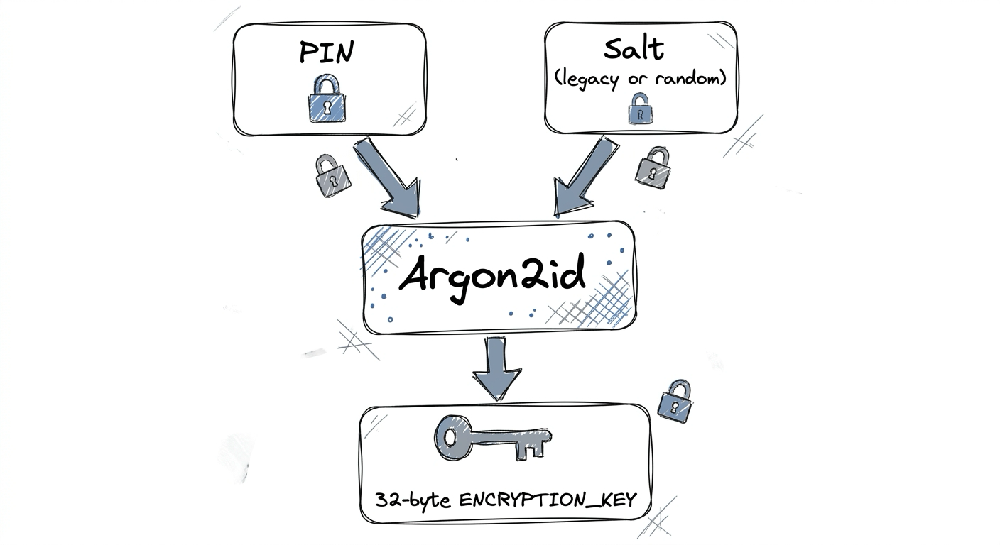
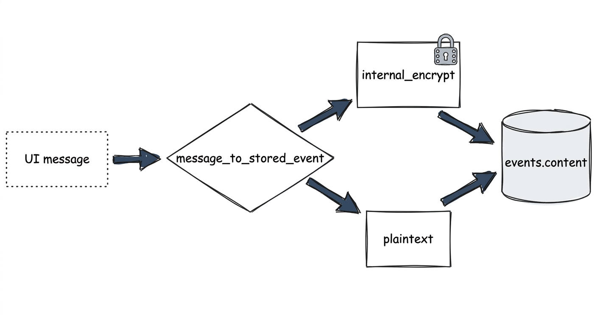
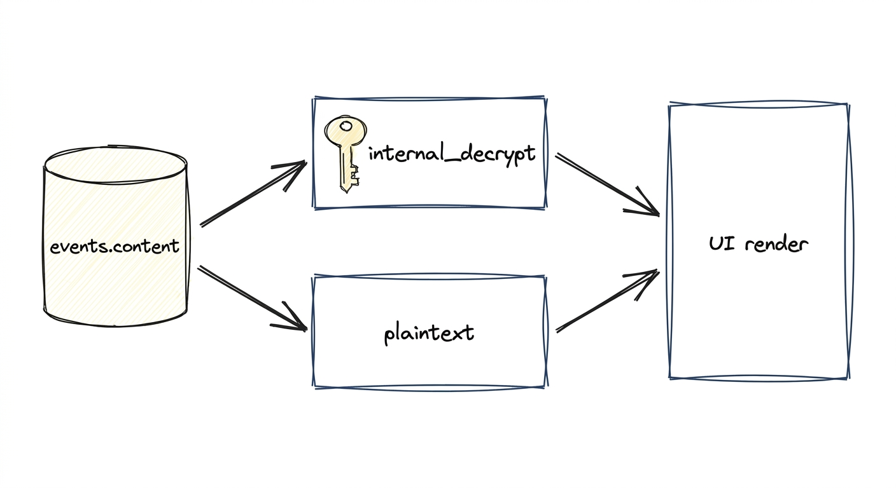
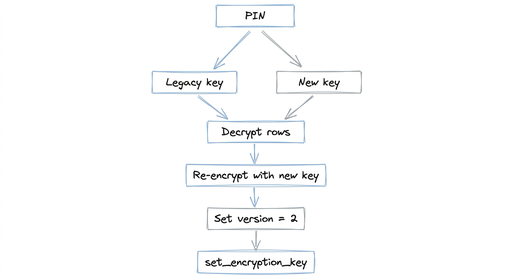
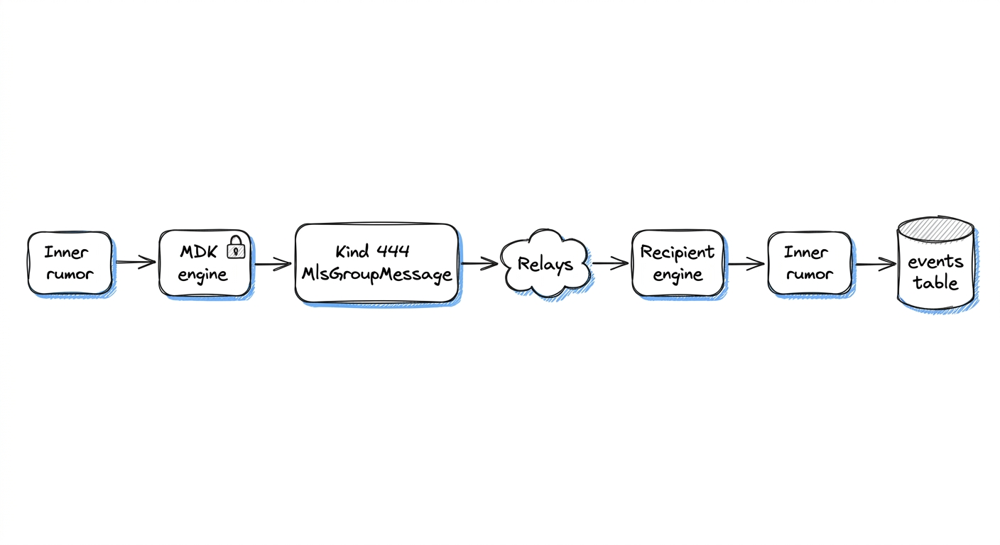

# Cryptography, salt, and MLS encryption

This doc explains the two cryptographic layers in Pacto: the **app-level PIN-derived encryption** that protects data at rest, and the **MLS protocol encryption** that protects group messages in transit. It also covers the per-device salt migration from the legacy hard-coded salt to version 2.

---

## 1. Two layers

| Layer | Scope | Keys live in | Protects |
|---|---|---|---|
| **App-level (PIN)** | At-rest SQLite | Per-account `pacto.db` settings + in-memory `ENCRYPTION_KEY` | Seed phrase, EVM imported keys, DM/MLS text message content, edits, bot secrets |
| **MLS protocol** | Group messaging in transit | `mdk_core` engine inside `pacto-mls.db` | Group messages on the wire (Kind 444) |

The two layers are independent. A failure in the PIN layer cannot make the MLS engine reject a wire message, and a corrupted MLS engine state cannot decrypt the app-level SQLite rows.

---

## 2. App-level PIN encryption

### 2.1 Key derivation

The encryption key is derived from the user’s PIN with **Argon2id**:

```text
key = Argon2id(password=PIN, salt, memory=96*1024 KiB, iterations=6, parallelism=1, output=32 bytes)
```

- **Legacy accounts** (version 1): used a hard-coded salt `b"vectovectvecvevpacto"`, 96000 KiB, 4 iterations.
- **New accounts** (version 2): generate a random 32-byte salt per account, 96 MiB, 6 iterations.
- The salt is stored in `settings.key_derivation_salt` and mirrored to a `salt.bin` file in the profile directory as a redundant cache.



### 2.2 Session key lifecycle

`ENCRYPTION_KEY` in `src-tauri/src/lib.rs` is a session cache:

```rust
static ENCRYPTION_KEY: LazyLock<std::sync::Mutex<Option<SecretBox<[u8; 32]>>>> =
    LazyLock::new(|| std::sync::Mutex::new(None));
```

- `set_encryption_key(key)` — called on successful login or account creation; best-effort `mlock` on Unix.
- `current_encryption_key()` — returns a copy for callers like `db::internal_encrypt`.
- `clear_encryption_key()` — called on logout; zeroizes the key and best-effort `munlock`.

If the key is missing or wrong, `internal_decrypt` fails and callers typically render `[Decryption failed]`.

### 2.3 Encryption algorithm

At-rest message content and secrets use **ChaCha20-Poly1305**:

- 12-byte random nonce generated per encryption.
- Ciphertext + tag appended after the nonce.
- Stored as hex: `hex(nonce || ciphertext || tag)`.
- Low-level helpers: `crypto::encrypt_with_key` / `crypto::decrypt_with_key`.
- High-level helpers: `crypto::internal_encrypt` / `crypto::internal_decrypt` (use the in-memory session key).

Attachment file data is different: it uses **AES-256-GCM** with parameters generated per file (`crypto::generate_encryption_params` / `encrypt_data` / `decrypt_data`).

### 2.4 What is encrypted vs plaintext

The `events` table encrypts `content` only for these kinds:

- `PRIVATE_DIRECT_MESSAGE` (14) — DM and MLS text messages after MLS decryption.
- `MESSAGE_EDIT` (16) — edits to either DMs or MLS messages.

Other stored event kinds are plaintext in the `content` column:

- `REACTION` (7) — emoji.
- `FILE_ATTACHMENT` (15) — the `content` is a JSON reference; the actual file bytes are encrypted separately.
- `APPLICATION_SPECIFIC` (30078) — typing indicators, polls, announcements.

Other encrypted SQLite rows:

- `settings` — `pkey` (encrypted BIP-39 seed), `evm_pkey`, `seed` (recovery seed).
- `evm_accounts` — `imported_enc` (imported private keys).
- `squad_bot_secret` — `encrypted_nsec`.
- `key_derivation_sentinel` — a canary value used to verify the PIN.

Plaintext metadata that must stay searchable:

- `profiles`, `chats`, `mls_groups`, `mls_keypackages`, `mls_event_cursors`, event tags.

### 2.5 Write and read paths





---

## 3. Salt migration (v1 → v2)

### 3.1 Why migrate

Older accounts derived the same key from the same PIN on every device because the salt was hard-coded. Version 2 uses a per-account random salt so that two devices with the same PIN do not share the same encryption key.

### 3.2 Migration flow

`migration::decrypt_with_password` triggers the migration automatically when it sees `key_derivation_version != 2` or the `key_derivation_migration_in_progress` flag:

1. Derive the **legacy key** from `PIN + LEGACY_SALT`.
2. Derive the **new key** from `PIN + stored salt` (generate one if missing).
3. Validate the PIN by decrypting the sentinel with either key.
4. For each encrypted row in the migrated tables, try the new key first; if that fails, decrypt with the legacy key and re-encrypt with the new key.
5. After all rows succeed, set `key_derivation_version = 2` and re-encrypt the sentinel with the new key.
6. Set the in-memory `ENCRYPTION_KEY` to the new key.



### 3.3 Tables migrated

Only these rows are migrated; MLS engine state is **not** in this list:

- `settings` — `pkey`, `evm_pkey`, `seed`.
- `evm_accounts` — `imported_enc`.
- `squad_bot_secret` — `encrypted_nsec`.
- `events` — `content` only for kinds `PRIVATE_DIRECT_MESSAGE` and `MESSAGE_EDIT`.
- `messages` — `content_encrypted` (legacy/parallel table).

### 3.4 Safety properties

- **Idempotent**: rows already decryptable with the new key are skipped.
- **Crash-safe**: `version` is only bumped to 2 after every row succeeds. A crash mid-migration leaves the account at version 1 and the next unlock retries.
- **PIN fallback**: if the pkey cannot be decrypted, the routine tries to decrypt the recovery `seed` and derive the Nostr nsec from it.

### 3.5 New-account path

`migration::encrypt_with_password` creates a fresh random salt for a brand-new account, sets `version = 2`, stores the sentinel, and sets the session key.

---

## 4. MLS group encryption

MLS is handled by the `mdk_core` / `mdk_sqlite_storage` engine behind `MlsService` in `src-tauri/src/mls.rs`. The engine keeps its own cryptographic state in a separate SQLite database:

```text
<app_data_dir>/<npub>/mls/pacto-mls.db
```

### 4.1 What the engine manages

- Group secrets and ratchet epochs.
- Key packages for the local device and other members.
- Processed message state (deduplication, failure reasons).

This state is **not** encrypted with the app-level PIN-derived key. It is protected by the OS filesystem permissions of the app data directory.

### 4.2 Wire format

- Outgoing: the app builds an inner Nostr rumor (e.g., kind 14 text), the engine produces a **Kind 444 `MlsGroupMessage`** ciphertext, and the app publishes it with an `h` tag equal to the wire group id.
- Incoming: a **Kind 444** event with an `h` tag matching a known group is passed to the engine; the engine decrypts it and returns the inner rumor.



### 4.3 App-level storage of MLS messages

After the engine decrypts a group message, the inner rumor is stored just like a DM message:

- Text and edits become `PRIVATE_DIRECT_MESSAGE` (14) or `MESSAGE_EDIT` (16) and are encrypted with the PIN-derived key.
- Reactions and polls remain plaintext.

This means historical MLS text messages can be read only with the correct PIN, just like DMs.

### 4.4 Why “Unprocessable event” is not a salt issue

When the sync log prints `[MLS] Unprocessable event: id=..., created_at=...`, the MDK engine has rejected an incoming Kind 444 envelope. Common causes:

- The message is for an older or newer group epoch than the local engine has.
- The message arrived before the corresponding Welcome/Commit was processed.
- The message is a duplicate or targeted a different group identity.
- The sender is no longer in the group or was evicted.

These are **MLS protocol-level** failures, not app-level PIN/salt decryption failures. A wrong PIN would surface later as `[Decryption failed]` when rendering stored messages, not as `Unprocessable` during sync.

---

## 5. Encryption key lifecycle by flow

### 5.1 Create or import account

1. User chooses a PIN.
2. Frontend calls `encrypt(seed_phrase, password=PIN)`.
3. `migration::encrypt_with_password` creates a new salt, derives the key, sets `ENCRYPTION_KEY`, encrypts the seed as `pkey`, and stores the sentinel.
4. The command also spawns the MLS device KeyPackage bootstrap.

### 5.2 Login existing account

1. User enters PIN.
2. Frontend calls `decrypt(encrypted_pkey, password=PIN)`.
3. `migration::decrypt_with_password` migrates the account if still on version 1, derives the new key, sets `ENCRYPTION_KEY`, and returns the decrypted seed.
4. Frontend derives Nostr keys and calls `complete_login_from_keys`, which sets up the Nostr client and loads the account state.
5. The command also spawns the MLS device KeyPackage bootstrap.

### 5.3 Logout

`logout` clears `ENCRYPTION_KEY`, clears the in-memory mnemonic seed, and drops runtime state.

---

## 6. Code index

| Topic | Location |
|---|---|
| Key derivation, ChaCha20-Poly1305 | `src-tauri/src/crypto.rs` — `derive_key_from_salt`, `derive_legacy_key`, `encrypt_with_key`, `decrypt_with_key`, `internal_encrypt`, `internal_decrypt` |
| Salt, migration, password encrypt/decrypt | `src-tauri/src/migration.rs` — `encrypt_with_password`, `decrypt_with_password`, `migrate_account_encryption`, `migrate_key_derivation_on_conn` |
| Session key cache | `src-tauri/src/lib.rs` — `ENCRYPTION_KEY`, `set_encryption_key`, `current_encryption_key`, `clear_encryption_key` |
| Tauri encrypt/decrypt commands | `src-tauri/src/lib.rs` — `encrypt`, `decrypt` |
| At-rest event encryption | `src-tauri/src/db.rs` — `save_event`, `get_events_for_chat`, `message_to_stored_event` |
| MLS engine and storage | `src-tauri/src/mls.rs` — `MlsService`, `MdkSqliteStorage`, `sync_group_since_cursor` |
| Database schema, migrations, and paths | `src-tauri/src/migrations/` (refinery migrations), `src-tauri/src/account_manager.rs` (`init_profile_database`, `get_db_connection`, `get_mls_directory`) |

## 7. See also

- [`../storage-layout/SQLITE_AND_FILES.md`](../storage-layout/SQLITE_AND_FILES.md) — per-account file layout.
- [`../storage-layout/MESSAGE_ENCRYPTION.md`](../storage-layout/MESSAGE_ENCRYPTION.md) — older, narrower notes on DM encryption.
- [`../mls/ARCHITECTURE.md`](../mls/ARCHITECTURE.md) — MDK engine, storage split, invites, eviction.
- [`../messaging/OVERVIEW.md`](../messaging/OVERVIEW.md) — DM vs MLS wire kinds and event flow.
- [`../audits/README.md`](../audits/README.md) — security posture and audit status.
