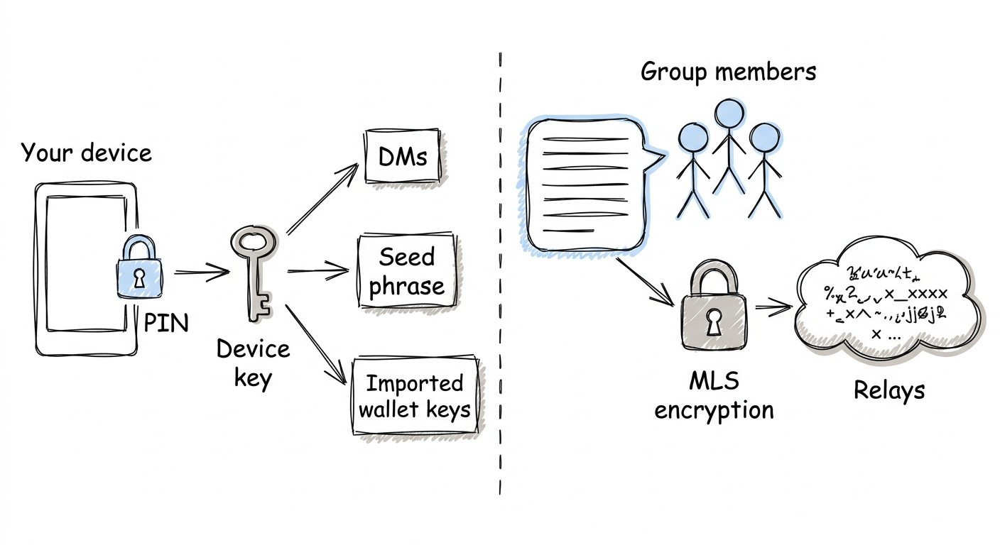
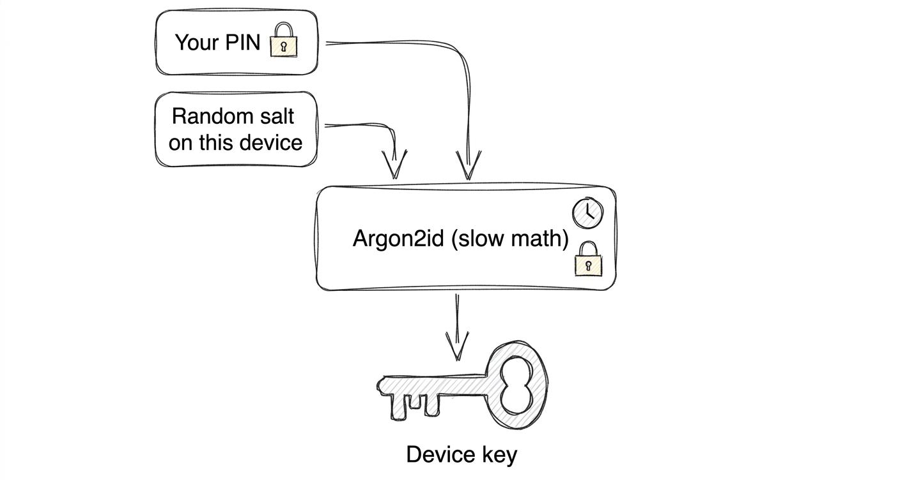
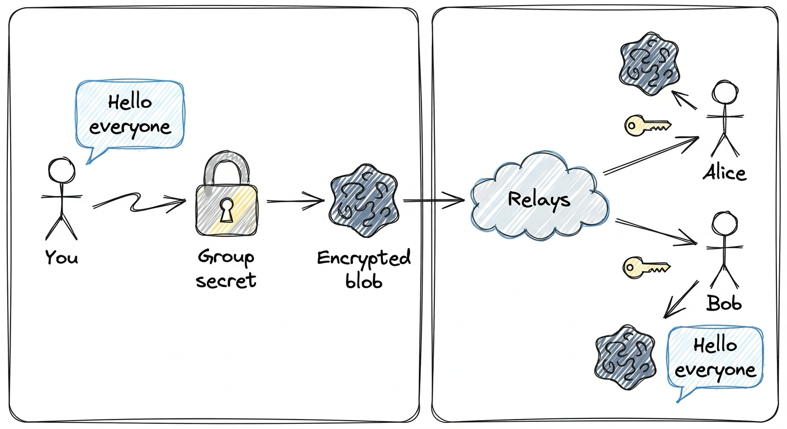

# Understanding encryption in Pacto

Pacto is built so that **your data is readable by you and the people you choose**, not by us, the relays, or anyone else who might intercept traffic. This page explains how that works without getting into code.

---

## 1. What Pacto protects

Pacto uses two complementary kinds of encryption:

| What | Protected by | What it means in plain English |
|---|---|---|
| Your **seed phrase** (the secret that controls your account) | Your PIN | Even if someone copies your device data, they cannot recover your keys without your PIN. |
| Your **direct messages** | Your PIN | The text of your one-to-one chats is encrypted on your device before it is saved. |
| Your **group messages** | MLS (Message Layer Security) | Messages in a group are encrypted separately for each member. Only group members can read them. |
| **Imported wallet keys** | Your PIN | Any Ethereum private keys you import are encrypted with your PIN. |

---

## 2. Your PIN and the device key

When you create or unlock Pacto, you enter a **PIN**. Pacto does not store the PIN. Instead, it runs the PIN through a one-way mathematical function called **Argon2id** to derive a **device key**. Argon2id is deliberately slow, which makes brute-force guessing expensive.

- **Legacy accounts** used the same starting salt for every account.
- **New accounts** use a **random salt** generated on this device. That means two devices with the same PIN do not end up with the same key.

The device key lives only in your computer’s memory while Pacto is unlocked. When you log out, the key is erased.

---

## 3. What is encrypted on your device

Pacto stores some things encrypted and some things plain. The plain items are mostly metadata needed to show you a usable contact list and chat list.

**Encrypted with your PIN:**
- The text of direct messages and message edits.
- Your BIP-39 seed phrase.
- Imported Ethereum private keys.
- Squad bot secrets.

**Stored plain (metadata):**
- Contact names and profile pictures.
- Group names and membership lists.
- Timestamps and read-status.
- Reactions and poll options (emoji, vote choices).
- File references (the actual file contents are encrypted separately).

---

## 4. Group messages and MLS

Group messages are protected by **MLS** (Message Layer Security), the same family of protocol used by modern secure messengers.

How it works in simple terms:

1. Each group has a **group secret** that is shared only among current members.
2. When you send a group message, Pacto encrypts it with that secret.
3. The encrypted message is published to relays as a normal-looking blob.
4. Relays can see that a message was sent, but cannot read the contents.
5. Only current group members can decrypt it.

### Forward secrecy and removing members

MLS is designed so that:

- If someone is **removed** from a group, they can no longer read new messages.
- If a device is **compromised**, the group can update its secret so old keys no longer work.

When you see a log message like `[MLS] Unprocessable event`, it usually means an old or out-of-order group message arrived and the app could not match it to the current group state. It does **not** mean your PIN is wrong.

---

## 5. The salt migration (version 1 → version 2)

If you created your account before the per-device salt feature, Pacto will automatically migrate your data the next time you unlock it.

What happens:

1. You enter your PIN.
2. Pacto derives both the old key and the new key.
3. It verifies the PIN by decrypting a small test value.
4. It re-encrypts every encrypted row with the new device-specific key.
5. It updates the account version marker to 2.

If the migration is interrupted (for example, the app is closed), the next unlock will resume safely. Pacto only marks the migration complete after every row has been re-encrypted.

You do not need to do anything. The migration is automatic.

---

## 6. What happens if you forget your PIN

Your PIN is not stored anywhere. It is the only thing that can unlock your device key. If you forget it:

- Pacto **cannot** recover your messages from this device.
- Pacto **cannot** recover your imported wallet keys.
- If you still have your **seed phrase** written down, you can restore your account on a new device or re-import it. Restoring from the seed phrase creates a new device key, so old messages stored on the lost device remain unreadable unless you have another backup.

This is the trade-off of true end-to-end encryption: the service cannot reset your password because the service never has it.

---

## 7. Security limits to know about

- **Metadata is visible to relays.** Relays can see who is talking to whom, when messages are sent, and group ids. They cannot read the message contents.
- **Your screen is not encrypted.** If someone has access to your unlocked computer, they can read messages while the app is open.
- **Backups are only as safe as where you put them.** If you back up Pacto’s data to a cloud folder, the cloud provider can see the files. The files are encrypted with your PIN, but the provider still holds the encrypted blob.

---

## 8. Quick glossary

| Term | Meaning |
|---|---|
| **PIN** | The short password you enter to unlock Pacto. |
| **Salt** | Random data mixed with your PIN before key derivation. It makes sure two devices with the same PIN do not get the same key. |
| **Device key** | The secret key kept in memory while Pacto is unlocked. It encrypts your stored messages and secrets. |
| **Seed phrase** | The 12- or 24-word backup that controls your Nostr identity and wallet. |
| **MLS** | Message Layer Security — the protocol that encrypts group messages between members. |
| **Forward secrecy** | The property that past messages stay safe even if a future key is stolen. |

---

## 9. Where to learn more

- For the technical details behind this doc, see [`../security/CRYPTOGRAPHY.md`](../security/CRYPTOGRAPHY.md) in the contributor docs.
- For how Pacto stores data on disk, see [`../storage-layout/SQLITE_AND_FILES.md`](../storage-layout/SQLITE_AND_FILES.md).
- For the current security posture and audit status, see [`../audits/README.md`](../audits/README.md).
