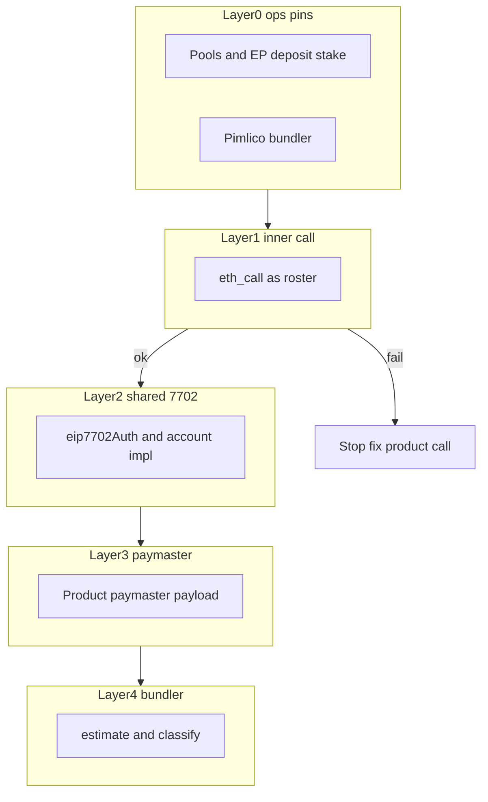

# Sponsored UserOp + EIP-7702 (Layer 0–4)

Reusable debug playbook for **roster-EOA → EIP-7702 account → EntryPoint v0.7 → Pimlico** sponsored writes. Squad gov and username claim share this transport; they differ only in paymaster / eligibility.

Incident staging notes: [`docs/solutions/wallet/sponsored-userop-7702-debug-method.md`](../solutions/wallet/sponsored-userop-7702-debug-method.md).

## Shared transport contract

| Piece | Pin / rule |
|-------|------------|
| Account | `PactoSimple7702Account` (`erc4337.accountImplementation` / global `allowed7702Implementation`) |
| EntryPoint | v0.7 `0x0000000071727De22E5E9d8BAf0edAc6f37da032` |
| Bundler | Pimlico (Settings Sponsored gas / `PIMLICO_API_KEY` / `BUNDLER_RPC_URL`) — **not** Alchemy AA |
| Auth | `sign_eip7702_authorization` (yParity 0/1); skip when sender already has correct `0xef0100` stub |
| Signature | Bare ECDSA `sign_hash(userOpHash)` (65 bytes) — not `personal_sign`, not MAv2 |
| Nonce | EntryPoint nonce **key 0** |
| Gas | Two-pass `eth_estimateUserOperationGas`, then margins (see [PACTO_SQUAD_SPONSOR.md](./PACTO_SQUAD_SPONSOR.md)) |
| Helpers | `user_op_json`, `sign_eip7702_authorization`, estimate/send in `sponsor_userop.rs` |

**Forbidden:** eth-infinitism Simple7702Account (EP v0.8), Alchemy SemiModularAccount7702, hand-rolled relay lists for MLS, mega-merging `send_sponsored_*` unless Layer 2 proves transport drift.

## Two sponsors, one transport

| | Squad (working golden path) | Username |
|--|--|--|
| Entry | `gov_module_write` → `send_sponsored_gov_userop` | `username_claim` / member writes → `send_sponsored_username_userop` |
| Paymaster | `PactoSponsorPaymaster` (per-squad clone) | `PactoGlobalPaymaster` |
| Pool | Squad sponsor pool | BootstrapMintPool (first claim) / GlobalSponsorPool (post-mint) |
| Paymaster payload | Squad encoder | Global encoder; **`policy = address(0)` always** (do not put bootstrap policy in `paymasterData`) |

## Mandatory layer order

Do **not** re-debug 7702 while Layer 1 fails.

1. **L0 Ops** — Address book pin, Tauri full restart after pin, Pimlico, EP deposit + stake, product pool funded.
2. **L1 Inner call** — `eth_call`/`cast` with `from=roster` for the inner target calldata. Require success **or** a named 4-byte selector. Username: claim preflight in `global_sponsor_userop` before estimate.
3. **L2 7702** — Only after L1 OK. `code_len`, `eip7702_auth=some|none`, allowlist match; field-diff shared UserOp keys vs squad golden path.
4. **L3 Paymaster** — Product encoder + pool headroom; username keeps `policy=0`.
5. **L4 Bundler** — Classify stderr (`[pacto_wallet] bundler …`). Empty `reason: 0x` **after** L1 OK ⇒ transport; **before** L1 OK ⇒ ignore 7702.



## Sepolia fund matrix (bootstrap username claim)

Address book: [`pacto-protocol-addresses.json`](../../src/lib/evm/pacto-protocol-addresses.json). Audit snapshot (ops): bootstrap claim infra was funded — **do not** re-fund squad PM or bootstrap pool to fix a Layer-1 claim revert.

| Contract | Need for bootstrap claim | Notes |
|----------|--------------------------|--------|
| BootstrapMintPool | spendable > 0 (+ later ~115% headroom) | First-claim gas |
| PactoGlobalPaymaster | EP deposit + stake; `ALLOWED_7702` = book impl | Required |
| NFT `mintFee` | known (often 0) | Client sends `value=0` on sponsored claim |
| GlobalSponsorPool | post-mint rotation only | Empty does **not** block first claim |
| Squad paymaster | squad gov only | Irrelevant to username claim |

### Re-check with `cast` (Sepolia RPC)

```bash
# BootstrapMintPool.spendablePoolWei()
cast call 0x8187d8209307b73731A767B58487D302dB61f13f 'spendablePoolWei()(uint256)' --rpc-url $SEPOLIA_RPC

# GlobalSponsorPool.spendablePoolWei() — rotation only
cast call 0x6713Cb2a0aaEFA0F53d55669D6CEF7D2dD570054 'spendablePoolWei()(uint256)' --rpc-url $SEPOLIA_RPC

# EntryPoint depositOf(paymaster)
cast call 0x0000000071727De22E5E9d8BAf0edAc6f37da032 \
  'balanceOf(address)(uint256)' 0x1C2eb4Ac1cD57aF67ad8B20838A28FB23d39d5b8 --rpc-url $SEPOLIA_RPC

# ALLOWED_7702 on global PM
cast call 0x1C2eb4Ac1cD57aF67ad8B20838A28FB23d39d5b8 \
  'ALLOWED_7702_IMPLEMENTATION()(address)' --rpc-url $SEPOLIA_RPC
```

## Next-sponsor plug-in surface

Reuse shared 7702 helpers. New product only adds:

- Paymaster + `paymasterAndData` encoder
- Eligibility / pool preflight
- Optional inner `eth_call` preflight (typed selector before estimate)

Do not fork authorization, UserOp JSON shape, or estimate/sign loop unless L2 field-diff shows drift.

## Layer 2 smoke (after Layer 1 OK)

Unit baseline: `user_op_json_shared_keys_stable_for_username_and_squad` in `sponsor_userop.rs` (same key set for both sponsors).

Operator Sepolia checklist (empty-code roster):

1. Restart Tauri after address-book pin; Pimlico configured.
2. Claim username via Commons / Profile (bootstrap path).
3. Logs (`make logs LOG_CLIENT=<n>`): `claim eth_call` succeeds (no `USERNAME_CLAIM_REVERTED`); then `username UserOp … eip7702_auth=some code_len=0`.
4. Bundler accept → receipt success; badge shows claimed name.
5. If estimate fails after L1 OK: classify via L2–L4 against squad golden path — do not re-fund bootstrap pool.

## Isolated claim harness (Tauri-free)

Local-only Sepolia probe that walks L0 → build `claim("test")` → L1 `eth_call` → sponsored 7702 UserOp **without** Commons/UI or roster ETH. Not in CI.

```bash
cd src-tauri && cargo run --bin username_claim_harness --features username-claim-harness
# optional replay: -- --mnemonic 'twelve words…'
```

Requires `ALCHEMY_RPC_KEY` + `PIMLICO_API_KEY` in repo-root `.env`. Stdout stages:

- **L1 fail** → named NFT selector / stop (fix claim fields before UserOp).
- **L1 OK + estimate fail** → L2–L4 transport (`reason: 0x` after L1 is the current Sepolia finding); field-diff vs squad UserOp.
- **Mint OK** → `recordOf` / tx hash; next compare `global_sponsor_userop` → Tauri `username_claim` → Commons CTA.

## Related

- [PACTO_SQUAD_SPONSOR.md](./PACTO_SQUAD_SPONSOR.md) — squad path + gas margins
- [USERNAME_NFT.md](./USERNAME_NFT.md) — claim dual attestation
- [OPERATOR_SMOKE.md](./OPERATOR_SMOKE.md) §1 (squad) and §10 (username)
- [PROTOCOL_ADDRESS_BOOK.md](./PROTOCOL_ADDRESS_BOOK.md)
- Incident staging: [`docs/solutions/wallet/sponsored-userop-7702-debug-method.md`](../solutions/wallet/sponsored-userop-7702-debug-method.md)
